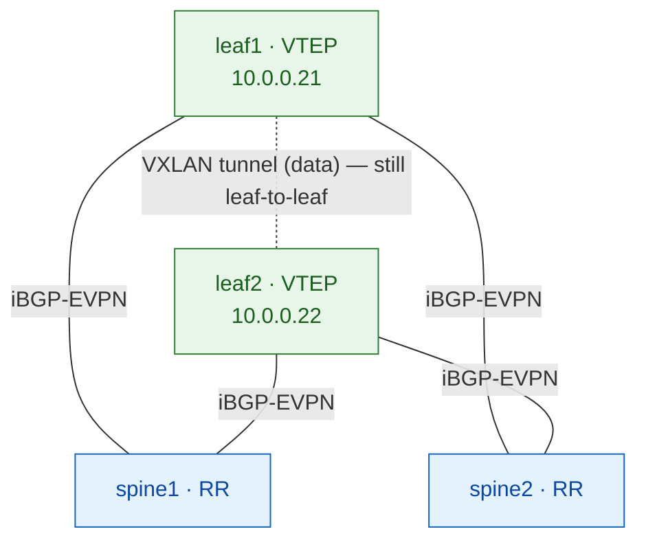

# Lab 02 — OSPF underlay + iBGP-EVPN with spine route-reflectors ⭐

> **Complete, self-contained guide.** The **production** VXLAN-EVPN design. Same
> 2×2 fabric as [lab 01](lab-01-fullmesh.md), but the overlay scales: leaves peer
> only to the spines, and the spines reflect EVPN routes between them.
>
> ⚠️ **DRAFT — not yet validated on live vJunos.** The config is written but
> unproven; this guide is built for your **first validation run**. Expect possible
> fix-spots (flagged inline). It flips to ✅ once it passes end-to-end.

**Why this is the production design:** full-mesh iBGP (lab 01) needs N×(N-1)/2
sessions — fine for 2 leaves, unmanageable at 20. Real fabrics make the **spines
route reflectors**, so every leaf has just **2 overlay sessions** (to the two
spines), no matter how big the fabric grows.

---

## What you'll build

| Layer    | Choice |
|----------|--------|
| Underlay | OSPF, single area 0 |
| Overlay  | iBGP-EVPN, AS 65000, **spines = route reflectors, leaves = clients** |
| Spines   | run BGP-EVPN as **RR** (`cluster`) — control-plane only, **NOT VTEPs** |
| Services | one L2VNI: VLAN 100 → VNI 10100, two hosts in one subnet |



**⭐ The key idea:** the spine reflects EVPN routes but keeps the **next-hop
unchanged** (the originating leaf's loopback). So the **control plane** goes
leaf → spine → leaf, but the **data plane** (the VXLAN tunnel) is still **leaf →
leaf directly**. The spine never encapsulates a data packet.

**Addresses** (full plan in [common/ipplan.md](../../../reference/ipplan.md)):

| Device | lo0 | to spine1 | to spine2 |
|--------|-----|-----------|-----------|
| spine1 | 10.0.0.11 | — | — |
| spine2 | 10.0.0.12 | — | — |
| leaf1  | 10.0.0.21 | 10.10.1.1/31 | 10.10.3.1/31 |
| leaf2  | 10.0.0.22 | 10.10.2.1/31 | 10.10.4.1/31 |

> **Interfaces:** `ge-0/0/N` (clab `ethN` → `ge-0/0/(N-1)`). **Login:** `admin` / `admin@123`.

---

## Before you start

- Host set up — see [Host Setup](../../../getting-started/cloud-vm.md).
- This lab runs on its own fabric (`clab-evpn-lab-*`).

**⚠️ Pre-flight.** Labs 01–04 share **one fabric** (`clab-evpn-lab-*`) — same topology,
same container name. If it's already booted (from lab 01 or any of 01–04), **don't
redeploy — reuse it** (see the Faster path below). Only deploy fresh if nothing's up:
```bash
docker ps --filter name=clab-evpn-lab --format '{{.Names}}' || echo "nothing running"
```
A 2×2 vJunos fabric needs ~16 GB RAM, so keep one fabric running at a time.

> 💡 **Faster path — don't redeploy at all.** Because labs 01–04 share the fabric,
> if it's already up you just apply this lab's config on it — no reboot, no override:
> ```bash
> ./scripts/clean.sh 02-ospf-ibgp-rr        # wipe config (~30s)
> ./scripts/apply.sh 02-ospf-ibgp-rr all    # apply the RR design in place
> ```
> Verify with `jrun` (targets `clab-evpn-lab-*`). The full deploy below is only for a
> *cold* start (no fabric running).

---

## 📋 Command cheat-sheet (copy-paste)

Everything runs from the **clab host** (`~/netforge-labs`) unless marked *Junos CLI*.
The helper and every command target the shared fabric **`clab-evpn-lab-*`** (labs 01–04).

**Reusable helper** — paste once, then check any node without logging in:
```bash
jrun() { sshpass -p 'admin@123' ssh -o StrictHostKeyChecking=no \
         -o UserKnownHostsFile=/dev/null -o LogLevel=ERROR \
         admin@clab-evpn-lab-"$1" "${@:2}"; }
# usage:  jrun spine1 "show bgp summary"
```

**Deploy & check the fabric**
```bash
./scripts/deploy.sh 02-ospf-ibgp-rr                          # boot the fabric (~5-8 min/node)
docker ps --filter name=clab-evpn-lab \
  --format "table {{.Names}}\t{{.Status}}"                   # all 4 switches must read (healthy)
```

**Build the config**
```bash
./scripts/apply.sh 02-ospf-ibgp-rr all       # ⭐ build every step 01→05 in order (recommended)
./scripts/apply.sh 02-ospf-ibgp-rr 01        # a single step (only if 01..N-1 are already applied)
./scripts/apply.sh 02-ospf-ibgp-rr 01-03     # a range of steps, in order
```

**Iterate without a reboot** — wipe config to baseline and rebuild (seconds, not minutes):
```bash
./scripts/clean.sh 02-ospf-ibgp-rr           # wipe lab config, keep mgmt/SSH — NO reboot
./scripts/apply.sh 02-ospf-ibgp-rr all       # then rebuild from scratch
```

**Verify from the host** (the RR-specific checks are the point of this lab):
```bash
jrun leaf1  "show bgp summary"            # leaf → TWO spine peers (10.0.0.11, 10.0.0.12) Establ
jrun spine1 "show bgp summary"            # spine (RR) → TWO leaf peers (10.0.0.21, 10.0.0.22) Establ
jrun spine1 "show route table bgp.evpn.0" # ⭐ RR HOLDS/reflects the routes (after Step 5)
jrun leaf1  "show route table bgp.evpn.0 extensive | match \"Protocol next hop\""  # ⭐ next-hop = far LEAF, not spine
```

**Hosts + final proof** (host commands run on the clab host, not Junos):
```bash
docker exec clab-evpn-lab-host1 sh -c "ip addr add 10.100.10.10/24 dev eth1; ip link set eth1 up"
docker exec clab-evpn-lab-host2 sh -c "ip addr add 10.100.10.11/24 dev eth1; ip link set eth1 up"
docker exec clab-evpn-lab-host1 ping -c3 10.100.10.11           # 🎉 0% loss = done
```

**Tear down**
```bash
./scripts/destroy.sh 02-ospf-ibgp-rr         # wipe containers (no redeploy)
./scripts/reset.sh   02-ospf-ibgp-rr         # destroy + redeploy clean (slow — last resort)
```

> **⚠️ Steps are cumulative — build bottom-up.** Each step depends on the one below
> it (`01 fabric → 02 OSPF → 03 iBGP-RR → 04 L2VNI → 05 access`). On a freshly-cleaned
> fabric you must apply **01 through N in order** — jumping straight to a later step
> commits config onto an empty box that silently can't work. When unsure, run
> **`apply.sh 02-ospf-ibgp-rr all`**.

---

# The build

Do the steps in order. Each one follows the same rhythm — **Apply → Verify → ✅ DONE**
— and you must pass the check before moving to the next.

## Step 1 — Fabric: interfaces & loopbacks

**Why:** fabric-link `/31`s + a `/32` loopback per switch. On a leaf, `lo0` is the
router-id, BGP peer address, and VXLAN tunnel source.

**spine1**
```
set interfaces ge-0/0/0 unit 0 family inet address 10.10.1.0/31
set interfaces ge-0/0/1 unit 0 family inet address 10.10.2.0/31
set interfaces lo0 unit 0 family inet address 10.0.0.11/32
set routing-options router-id 10.0.0.11
```
**spine2**
```
set interfaces ge-0/0/0 unit 0 family inet address 10.10.3.0/31
set interfaces ge-0/0/1 unit 0 family inet address 10.10.4.0/31
set interfaces lo0 unit 0 family inet address 10.0.0.12/32
set routing-options router-id 10.0.0.12
```
**leaf1**
```
set interfaces ge-0/0/0 unit 0 family inet address 10.10.1.1/31
set interfaces ge-0/0/1 unit 0 family inet address 10.10.3.1/31
set interfaces lo0 unit 0 family inet address 10.0.0.21/32
set routing-options router-id 10.0.0.21
```
**leaf2**
```
set interfaces ge-0/0/0 unit 0 family inet address 10.10.2.1/31
set interfaces ge-0/0/1 unit 0 family inet address 10.10.4.1/31
set interfaces lo0 unit 0 family inet address 10.0.0.22/32
set routing-options router-id 10.0.0.22
```
**Apply:** `./scripts/apply.sh 02-ospf-ibgp-rr 01`  ·  or paste the four blocks above by hand.

**Verify** (from the host):
```bash
jrun leaf1 "show interfaces terse | match ge-"   # fabric links admin/link up
jrun leaf1 "ping 10.10.1.0 count 3"              # directly-connected /31 replies
```

!!! success "Step 1 — DONE ✅"
    Fabric links up, loopbacks present, `/31` ping replies. **→ Step 2**

## Step 2 — Underlay: OSPF

**Why:** make every loopback reachable from every other, over both spines.

**Identical on all four switches:**
```
set protocols ospf area 0 interface lo0.0 passive
set protocols ospf area 0 interface ge-0/0/0.0 interface-type p2p
set protocols ospf area 0 interface ge-0/0/1.0 interface-type p2p
```
**Apply:** `./scripts/apply.sh 02-ospf-ibgp-rr 02`  ·  the same three lines on all four switches.

**Verify** (from the host):
```bash
jrun leaf1 "show ospf neighbor"                         # both spines in state Full
jrun leaf1 "ping 10.0.0.22 source 10.0.0.21 count 3"    # leaf-to-leaf loopback, ttl=63
```

!!! success "Step 2 — DONE ✅"
    Loopback-to-loopback ping works. **→ Step 3.** *If it fails, stop — nothing above works without the underlay.*

## Step 3 — Overlay: iBGP-EVPN with route-reflectors ⭐

**Why:** the production overlay. **Spines** run BGP-EVPN with a `cluster` id →
that makes them route reflectors. **Leaves** peer only to the two spines (2
sessions each, forever). The spines reflect routes but keep the next-hop = the
originating leaf, so the VXLAN tunnel stays leaf-to-leaf. Plain iBGP would *not*
re-advertise a route from one peer to another — reflection is exactly what fixes that.

**spine1 (RR)** — spine2 mirrors with `local-address`/`cluster` = 10.0.0.12
```
set routing-options autonomous-system 65000
set protocols bgp group overlay type internal
set protocols bgp group overlay local-address 10.0.0.11
set protocols bgp group overlay family evpn signaling
set protocols bgp group overlay cluster 10.0.0.11
set protocols bgp group overlay neighbor 10.0.0.21
set protocols bgp group overlay neighbor 10.0.0.22
```
**leaf1 (RR client)** — leaf2 mirrors with `local-address 10.0.0.22`
```
set routing-options autonomous-system 65000
set protocols bgp group overlay type internal
set protocols bgp group overlay local-address 10.0.0.21
set protocols bgp group overlay family evpn signaling
set protocols bgp group overlay neighbor 10.0.0.11
set protocols bgp group overlay neighbor 10.0.0.12
```
**Apply:** `./scripts/apply.sh 02-ospf-ibgp-rr 03`  ·  spines get the RR `cluster`; leaves peer both spines.

**Verify** (from the host — check **both** roles):
```bash
jrun leaf1  "show bgp summary"    # leaf  → TWO spine peers (10.0.0.11, 10.0.0.12) = Establ
jrun spine1 "show bgp summary"    # spine → TWO leaf peers  (10.0.0.21, 10.0.0.22) = Establ
```
> 0 routes until Step 5 is expected. The `License key missing; requires 'bgp'`
> warning is a benign vJunos-eval message.

!!! success "Step 3 — DONE ✅"
    Every leaf is **Establ** to **both spines**, and each spine (RR) is **Establ** to
    **both leaves**. **→ Step 4**

## Step 4 — EVPN + VXLAN glue

**Why:** turn on the VTEP on the **leaves** (spines get none — they're RRs, not
VTEPs). RD is unique per leaf; RT is shared per VNI.

**leaf1** (leaf2 mirrors, RD `10.0.0.22:1`)
```
set protocols evpn encapsulation vxlan
set protocols evpn extended-vni-list all
set switch-options vtep-source-interface lo0.0
set switch-options route-distinguisher 10.0.0.21:1
set switch-options vrf-target target:65000:1
set vlans v100 vlan-id 100
set vlans v100 vxlan vni 10100
```
**Apply:** `./scripts/apply.sh 02-ospf-ibgp-rr 04`  ·  leaves only — spines stay RR-only.

**Verify by CONFIG PRESENCE** — the EVPN route table does *not* appear yet:
```bash
jrun leaf1 "show configuration protocols evpn"   # encapsulation vxlan + extended-vni-list
jrun leaf1 "show configuration vlans"            # v100 → vni 10100
```
> **⚠️ No `bgp.evpn.0` / `default-switch.evpn.0` table yet — this is correct.**
> Junos only advertises a VNI once its VLAN has an *up* member (Step 5). Verify
> Step 4 by **config**, not routes.

!!! success "Step 4 — DONE ✅"
    `protocols evpn` + `switch-options` + VLAN 100 → VNI 10100 committed on both leaves.
    (No EVPN route table yet — expected; it appears in Step 5.) **→ Step 5**

## Step 5 — Services: attach hosts & prove it

**Why:** put the host ports in VLAN 100. The port coming up triggers the Type-3
(IMET) route; via the RR the far leaf learns it, the tunnel forms, and once hosts
talk, Type-2 (MAC/IP) routes teach both leaves where each host is.

**5a — access ports, leaf1 and leaf2 (same):**
```
set interfaces ge-0/0/2 unit 0 family ethernet-switching interface-mode access
set interfaces ge-0/0/2 unit 0 family ethernet-switching vlan members v100
```
**Apply 5a:** `./scripts/apply.sh 02-ospf-ibgp-rr 05`  ·  or paste the two lines above on both leaves.

**Verify 5a** — now the RR-specific ⭐ checks light up (from the host):
```bash
jrun leaf1  "show route table bgp.evpn.0"    # Type-3 (3:) routes appear on the leaf
jrun spine1 "show route table bgp.evpn.0"    # ⭐ the RR HOLDS/reflects the routes too
jrun leaf1  "show route table bgp.evpn.0 extensive | match \"Protocol next hop\""
#                                         ⭐ next-hop = far LEAF (10.0.0.22), NOT a spine
```

**5b — give the hosts their IPs** (clab host shell, **not** Junos):
```bash
docker exec clab-evpn-lab-host1 sh -c "ip addr add 10.100.10.10/24 dev eth1; ip link set eth1 up"
docker exec clab-evpn-lab-host2 sh -c "ip addr add 10.100.10.11/24 dev eth1; ip link set eth1 up"
docker exec clab-evpn-lab-host1 ping -c3 10.100.10.11
```

!!! success "Step 5 — DONE ✅ · the finish line 🎉"
    `host1 → host2` ping returns **0% packet loss**, **and** the ⭐ next-hop check shows
    the far **leaf** (10.0.0.22) — proving the spine reflects control-plane routes but
    never sits in the data path. That's production RR.

---

## ✅ Full checklist — deploy to ping

Work top to bottom. Each item lists the command that proves it. (`jrun` targets
`clab-evpn-lab-*` — see the cheat-sheet.)

**Fabric up**
- [ ] All 4 switches `(healthy)` — `docker ps --filter name=clab-evpn-lab --format "table {{.Names}}\t{{.Status}}"`

**Step 1 · interfaces & loopbacks**
- [ ] Fabric links up/up — `jrun leaf1 "show interfaces terse | match ge-"`
- [ ] Directly-connected /31 replies — `jrun leaf1 "ping 10.10.1.0 count 3"`

**Step 2 · OSPF underlay**
- [ ] Both spines `Full` — `jrun leaf1 "show ospf neighbor"`
- [ ] Leaf-to-leaf loopback ping, ttl=63 — `jrun leaf1 "ping 10.0.0.22 source 10.0.0.21 count 3"`

**Step 3 · iBGP-EVPN route-reflectors** ⭐
- [ ] Leaf → **both spines** `Establ` — `jrun leaf1 "show bgp summary"`
- [ ] Spine (RR) → **both leaves** `Establ` — `jrun spine1 "show bgp summary"` *(0 routes here is correct)*

**Step 4 · EVPN + VXLAN glue** *(verify by config — no EVPN route table until Step 5)*
- [ ] `protocols evpn` present — `jrun leaf1 "show configuration protocols evpn"`
- [ ] VLAN → VNI present — `jrun leaf1 "show configuration vlans"`

**Step 5 · services + proof**
- [ ] Type-3 (`3:`) routes on the leaf — `jrun leaf1 "show route table bgp.evpn.0"`
- [ ] ⭐ **RR holds the routes** — `jrun spine1 "show route table bgp.evpn.0"` *(routes present)*
- [ ] ⭐ **next-hop = far leaf, not spine** — `jrun leaf1 "show route table bgp.evpn.0 extensive | match \"Protocol next hop\""`
- [ ] **host1 → host2 ping, 0% loss** — `docker exec clab-evpn-lab-host1 ping -c3 10.100.10.11` 🎉

Those two ⭐ checks are what make this *production RR*: the spine holds and reflects
routes, but never sits in the data path.

## Break-it exercises

1. **Kill one spine:** `deactivate protocols bgp` + `commit` on spine1 → hosts
   **still ping** (leaf still has the session to spine2). This is why you run two
   RRs. Reactivate.
2. **Remove the `cluster`:** `delete protocols bgp group overlay cluster ...` on a
   spine → it stops reflecting (plain iBGP won't relay peer-to-peer), so the far
   leaf loses routes. **This teaches *why* RR exists.** Restore.
3. **VNI mismatch / VTEP source** — same as lab 01 (breaks the tunnel).

## Troubleshooting

| Symptom | Cause | Fix |
|---------|-------|-----|
| `apply.sh` says **`container not found`** on every node | Wrong lab folder — lab 02's fabric is `clab-evpn-lab-*` | Use `02-ospf-ibgp-rr`; confirm with `docker ps --filter name=clab-evpn-lab` |
| Leaf BGP stuck **Active/Connect** | Underlay not up — spine loopback unreachable | Re-check Step 2: `jrun leaf1 "show ospf neighbor"` + `ping 10.0.0.11 source 10.0.0.21` |
| Leaf peers up but **far leaf gets no routes** after Step 5 | Spine `cluster` (RR) missing → no reflection | Confirm the RR `cluster` is set — `jrun spine1 "show configuration protocols bgp group overlay"` |
| ⭐ Spine's `bgp.evpn.0` is **empty** after Step 5 | RR isn't retaining reflected routes | See **Open validation item** below |
| A step **`committed`** but nothing works | Steps applied out of order | Rebuild bottom-up: `apply.sh 02-ospf-ibgp-rr all` |
| Commits take **30–90 s** / `apply` reports `FAILED` | Contention while all 4 nodes boot at once | Wait until idle (`top` → low load, `0.0 st`), then re-run; iterate with `clean.sh`, not `reset.sh` |
| `show bgp summary` warns `License key missing` | Benign vJunos-eval message | Ignore |
| A node exits with `FileNotFoundError: init.conf` | It was `docker restart`ed — clab nodes lose `init.conf` on restart | **Never `docker restart` a clab node.** Recover with `sudo containerlab deploy --reconfigure -t <topo>` (clab 0.77 can't recreate a single node) |

**Golden rule for iterating:** boot the fabric **once** with `deploy.sh`, then loop
`clean.sh` → `apply.sh`. **Never `docker restart` a node** (it wipes `init.conf`), and
you don't need a fresh fabric per lab — labs 01–04 share this topology, so run any
design on the *same* nodes with `FABRIC=<prefix>`. Reach for `reset.sh` /
`--reconfigure` only when a node is truly dead.

## Open validation item

⭐ On this first live run, confirm the checklist's **RR ⭐ checks**:

1. The **spine's `bgp.evpn.0` holds routes** (`jrun spine1 "show route table bgp.evpn.0"`).
   On Junos it should, since the spine has no VRF to filter into — but Cisco needs a
   `retain route-target all` knob, so this is worth confirming.
2. The **leaf's next-hop is the far leaf**, not the spine.

If both pass and host1↔host2 pings, **update this guide**: change the DRAFT banner at
the top to ✅ validated, and record the result here (and flip lab 02 to validated in
`CLAUDE.md`'s status list).
