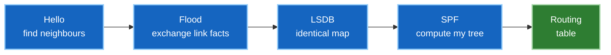

# 1 · How link-state routing works

Both OSPF and IS-IS are **link-state** protocols. Understanding what that means
once saves you learning two protocols twice — the differences between them are
mostly packaging.

---

## The mental model

Imagine every road junction in a city keeping its own street map. Not directions
from someone else — an actual map.

Each junction knows only its *own* streets: which roads leave it, where they go,
and how long each takes. It shouts that small fact to every other junction. In
return it hears the same from everyone else.

Once all those fragments are collected, every junction holds an **identical map of
the whole city**. Then each one independently works out its own shortest route to
everywhere.

That's link-state routing: **share facts about your links, not conclusions about
your routes.**

---

## Why not just share routes?

The older approach — distance-vector — has each router tell its neighbours *"I can
reach network X, and it costs 5."* Neighbours add their own cost and pass it on.

This works, but each router is trusting a summary it can't verify. It never sees
the topology, only hearsay. That produces two classic problems:

- **Slow convergence.** Bad news propagates hop by hop, each router re-advertising
  in turn.
- **Routing loops.** A router can believe a path that no longer exists because the
  news hasn't reached it yet. Split horizon, poison reverse, and hold-down timers
  all exist to patch this.

Link-state sidesteps it. Because every router holds the full map, each one can
compute paths itself and *see* that a link is gone rather than waiting to be told
what it means.

---

## The three moving parts

### 1. Adjacency — meeting the neighbours

Routers send **hello** messages on their interfaces. When two agree on the
parameters that matter (timers, area, MTU, authentication), they form an
**adjacency** and become willing to exchange topology.

Disagreement is the usual cause of the classic symptom: *the interface is up, but
no neighbour appears.* The link is fine — the routers simply won't talk.

### 2. Flooding — building the map

Each router describes its own links in a small advertisement — OSPF calls it an
**LSA**, IS-IS calls it an **LSP** — and floods it to every other router in the
area.

Flooding is reliable and sequenced. Each advertisement carries a **sequence
number** so newer information replaces older, and an **age** so stale entries
eventually expire if the originator disappears.

The result is the **link-state database (LSDB)**: every router's copy of the same
map.

!!! note "Identical databases are the whole point"
    Inside an area, every router's LSDB must be identical. If two routers disagree
    about the topology, they compute different paths — and that's how you get a
    loop in a protocol that's supposed to be loop-free. When troubleshooting, a
    database mismatch is a genuine red flag.

### 3. SPF — computing the routes

Each router runs **Dijkstra's shortest-path-first algorithm** over the LSDB, with
itself as the root. Out comes a shortest-path tree: the cheapest route to every
destination.

Crucially, this is a **local** computation on **shared** data. Everyone works from
the same map, so everyone's answers agree — no negotiation needed.

---

## Cost: the only thing that decides a path

Link-state protocols pick paths by **total cost** — the sum of the outbound
interface costs along a route. Lowest total wins.

Cost is usually derived from bandwidth, so faster links are preferred, but it's
just a number you can set. Two things follow that surprise people:

- **Cost is directional.** A router only counts costs on links it sends *out* of.
  Traffic can legitimately take a different path back than it took out.
- **Cost is not latency, distance, or load.** A congested 10G link still looks
  better than an idle 1G one unless you say otherwise.

---

## Why areas exist

Flooding and SPF both scale with the size of the topology. Every router holding
every detail of a large network means big databases, heavy SPF runs, and a
re-computation every time any link anywhere flaps.

So both protocols divide the network into **areas** (OSPF) or **levels** (IS-IS).
Full topology detail stays *inside* an area; between areas, routers exchange
summarised reachability instead.

The trade is deliberate: **you lose visibility and gain stability.** A link
flapping in one area no longer forces every router in the network to re-run SPF.

This one idea drives most IGP design discussions, and both protocols implement it —
just differently enough to be worth understanding separately.

---

## What actually breaks

| Symptom | Usual cause |
|---|---|
| Interface up, no neighbour | mismatched hello/dead timers, area, MTU, or authentication |
| Neighbour stuck short of full adjacency | MTU mismatch — databases can't finish exchanging |
| Route missing entirely | the interface was never put *into* the IGP |
| Traffic takes a surprising path | cost, not a bug — check the metric |
| Everything reconverges constantly | a flapping link; consider dampening or fixing the link |

!!! warning "The most common mistake in this whole curriculum"
    Giving an interface an IP address is **not** the same as putting it into the
    IGP. A loopback with an address but no IGP membership is reachable only by the
    router that owns it — nobody else learns it.

    The symptom is brutal because it doesn't look like a routing problem: MPLS shows
    no labels, BGP peers won't establish, VXLAN tunnels never form. All three are
    just "there's no route" wearing a costume.

---

## Interview questions

??? question "Why is link-state better than distance-vector for large networks?"
    Distance-vector routers learn *conclusions* (e.g. "network X costs 5") from
    neighbours and relay them onward. Bad news propagates hop by hop, and a router
    can believe a path that no longer exists while waiting to be told. Link-state
    routers flood the *facts* they know directly (my links and their costs) to
    everyone, so every router builds an identical map and computes independently.
    That's fast convergence and loop-free operation without special tricks.

??? question "What does SPF actually compute?"
    Dijkstra's shortest-path-first algorithm takes a directed, weighted graph (the
    LSDB) and a root node (the running router) and computes the lowest-cost path to
    every reachable destination. The result is a shortest-path tree anchored at the
    running router — every other router appears in it, ranked by cost.

??? question "Why do routers in the same area have identical LSDBs?"
    Flooding ensures every router in the area receives every LSA. Each LSA has a
    sequence number (so newer replaces older) and an age (so stale entries
    eventually timeout). Because flooding is reliable and sequenced, and every
    router in the area runs SPF on the same data, their databases end up identical.

??? question "What happens if two routers disagree about the topology?"
    **That's a bug.** If two routers in the same area have different LSDBs, they
    compute different shortest-path trees and can legitimately send traffic on
    different paths between the same pair of nodes. In a loop-free protocol like
    OSPF, a topology disagreement is how you get a loop. It's checked by comparing
    LSDB checksums in `show` output — a mismatch is a genuine alarm.

??? question "Why are areas necessary if link-state already handles large networks?"
    Link-state doesn't magically scale. Larger LSDB = more memory + heavier SPF
    computation. Areas divide the problem: full topology detail stays *inside* an
    area, and routers exchange *summaries* between areas. The cost is loss of
    visibility — you can't see the full topology across areas, only learned
    reachability. But that buys stability: a link flapping in one area no longer
    forces every router in the network to re-run SPF.

---

**Next:** [OSPF →](02-ospf.md) — the same ideas, with areas, LSA types and
adjacency states made concrete.
