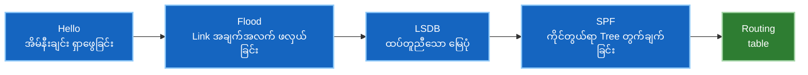

# ၁ · Link-State Routing အလုပ်လုပ်ပုံ

OSPF နှင့် IS-IS နှစ်မျိုးစလုံးသည် **link-state** protocol များ ဖြစ်ကြသည်။ ဤ protocol များ၏ အခြေခံ သဘောတရားကို တစ်ကြိမ် သေချာနားလည်သဘောပေါက်ထားခြင်းဖြင့် protocol နှစ်ခုလုံးကို အစမှ နှစ်ခါပြန်လည်လေ့လာရသည့် အချိန်ကုန်သက်သာစေပါသည် — ၎င်းတို့ကြားရှိ ကွာခြားချက်အများစုမှာ ဖွဲ့စည်းထုပ်ပိုးပုံ (packaging) သာ ကွဲပြားခြင်း ဖြစ်သည်။

---

## တွေးခေါ်ပုံ အခြေခံနမူနာ (The mental model)

မြို့တစ်မြို့ရှိ လမ်းဆုံတိုင်းသည် အခြားသူများ၏ ညွှန်ကြားချက်ကို အားမကိုးဘဲ မိမိကိုယ်ပိုင် မြို့ပြလမ်းပြမြေပုံအစစ်အမှန် (street map) တစ်ခုစီ ကိုင်ဆောင်ထားသည်ဟု မြင်ယောင်ကြည့်ပါ။

လမ်းဆုံတစ်ခုစီသည် မိမိနှင့် တိုက်ရိုက်ဆက်စပ်နေသော *ကိုယ်ပိုင်* လမ်းများကိုသာ သိရှိသည် — မည်သည့်လမ်းများ ထွက်ခွာသွားသည်၊ မည်သည့်နေရာသို့ ရောက်သည်၊ လမ်းတစ်ခုစီ ဖြတ်သန်းရန် အချိန် မည်မျှကြာသည် စသည်တို့ဖြစ်သည်။ ထိုအချက်အလက် အသေးစိတ်လေးများကို အခြားသော လမ်းဆုံအားလုံးထံ အသိပေး ကြေညာ (shout) လိုက်သည်။ အပြန်အလှန်အားဖြင့် အခြားလမ်းဆုံများထံမှလည်း အလားတူ အချက်အလက်များကို လက်ခံရရှိသည်။

ထိုအချက်အလက်အပိုင်းအစအားလုံးကို စုစည်းမိသောအခါ လမ်းဆုံတိုင်းတွင် **မြို့တစ်မြို့လုံး၏ တူညီသော မြေပုံအပြည့်အစုံ (identical map)** ရှိလာမည် ဖြစ်သည်။ ထို့နောက် လမ်းဆုံတစ်ခုစီသည် နေရာတိုင်းသို့ သွားရောက်နိုင်မည့် အတိုဆုံးလမ်းကြောင်း (shortest route) ကို မိမိဘာသာ သီးခြား တွက်ချက်ဖော်ထုတ်ကြသည်။

၎င်းသည် link-state routing ၏ သဘောတရားဖြစ်သည် — **မိမိ links များ၏ အချက်အလက်အစစ်အမှန် (facts) များကို မျှဝေပါ၊ ကောက်ချက်ချထားသော လမ်းကြောင်းများ (conclusions) ကို မမျှဝေပါနှင့်။**

---

## လမ်းကြောင်းများ (Routes) ကို တိုက်ရိုက်အဘယ်ကြောင့် မမျှဝေသင့်သနည်း။

ယခင် အသုံးပြုခဲ့သော နည်းလမ်းဟောင်း — distance-vector — တွင် router တစ်ခုစီသည် ၎င်း၏ အိမ်နီးချင်း router များထံ *"ငါ့ဆီကနေ Network X ဆီ ရောက်နိုင်တယ်၊ ကုန်ကျစရိတ် (cost) ကတော့ ၅ ဖြစ်တယ်"* ဟု ပြောပြသည်။ အိမ်နီးချင်းများက မိမိတို့၏ cost ကို ထပ်ပေါင်းကာ ဆက်လက် လက်ဆင့်ကမ်းကြသည်။

ဤနည်းလမ်းသည် အလုပ်ဖြစ်သော်လည်း router တစ်ခုစီသည် မိမိကိုယ်တိုင် စစ်ဆေးအတည်မပြုနိုင်သော အကျဉ်းချုပ်အချက်အလက် (summary) ကို ယုံကြည်နေရခြင်း ဖြစ်သည်။ ကွန်ရက်တစ်ခုလုံး၏ topology အခင်းအကျင်း အပြည့်အစုံကို မမြင်တွေ့ရဘဲ တစ်ဆင့်စကား (hearsay) ကိုသာ အားကိုးရသည်။ ယင်းကြောင့် ဂန္ထဝင်ပြဿနာကြီး နှစ်ခု ပေါ်ပေါက်လာရသည် -

- **Convergence နှေးကွေးခြင်း (Slow convergence)။** မကောင်းသော သတင်းများ (Bad news / link down ဖြစ်မှုများ) သည် hop တစ်ခုပြီးတစ်ခု အဆင့်ဆင့် ပြန်လည် re-advertise လုပ်နေရသဖြင့် ပျံ့နှံ့ရန် အချိန်ကြာမြင့်သည်။
- **Routing loops ဖြစ်ပေါ်ခြင်း။** သတင်းအချက်အလက်သည် မိမိထံသို့ အချိန်မီ မရောက်သေးသောကြောင့် မရှိတော့သည့် လမ်းကြောင်းတစ်ခုကို router က ဆက်လက် ယုံကြည်နေနိုင်သည်။ ဤပြဿနာကို ယာယီဖြေရှင်းရန်အတွက် Split horizon, poison reverse နှင့် hold-down timers များကို ဖန်တီးအသုံးပြုခဲ့ကြရသည်။

Link-state သည် ဤအားနည်းချက်များကို ကျော်လွှားနိုင်ခဲ့သည်။ Router တိုင်းသည် ကွန်ရက်မြေပုံ အပြည့်အစုံကို လက်ဝယ်ပိုင်ဆိုင်ထားသောကြောင့် link တစ်ခု ပြတ်တောက်သွားပါက အခြားသူ လာရောက်ရှင်းပြသည်အထိ စောင့်မနေဘဲ လမ်းကြောင်းများကို ကိုယ်တိုင်တွက်ချက်ပြီး တိုက်ရိုက် *သိမြင် (see)* နိုင်သည်။

---

## အဓိက အလုပ်လုပ်သော အစိတ်အပိုင်း ၃ ခု (The three moving parts)

### ၁။ Adjacency — အိမ်နီးချင်းများနှင့် ချိတ်ဆက်တည်ဆောက်ခြင်း

Router များသည် ၎င်းတို့၏ interface များပေါ်မှ **hello** packet မက်ဆေ့ဂျ်များကို စဉ်ဆက်မပြတ် ပေးပို့ကြသည်။ မရှိမဖြစ် လိုအပ်သော parameters များ (timers, area, MTU, authentication စသည်) ကိုက်ညီသည့်အခါ **adjacency** တည်ဆောက်ပြီး topology အချက်အလက်များ အပြန်အလှန် ဖလှယ်ရန် အဆင်သင့် ဖြစ်လာကြသည်။

Parameters များ မကိုက်ညီခြင်းသည် အတွေ့ရအများဆုံး ပြဿနာလက္ခဏာ၏ အကြောင်းရင်းဖြစ်သည် — *Interface က up ဖြစ်နေသော်လည်း neighbour မပေါ်လာခြင်း*။ ကြိုးလိုင်း (link) မှာ ကောင်းမွန်နေသော်လည်း router များ အချင်းချင်း စကားမပြောနိုင်ကြခြင်း ဖြစ်သည်။

### ၂။ Flooding — ကွန်ရက်မြေပုံ တည်ဆောက်ခြင်း

Router တစ်ခုစီသည် မိမိ၏ တိုက်ရိုက်ချိတ်ဆက်ထားသော link များအကြောင်းကို သတင်းလွှာအသေးစားတစ်ခုအဖြစ် ဖော်ပြသည် — OSPF တွင် ယင်းကို **LSA** ဟုခေါ်ပြီး IS-IS တွင် **LSP** ဟု ခေါ်သည် — ပြီးနောက် area အတွင်းရှိ အခြား router တိုင်းထံသို့ flood လုပ်၍ ဖြန့်ဝေသည်။

Flooding လုပ်ငန်းစဉ်သည် စိတ်ချရပြီး အစီအစဉ်တကျဖြစ်သည် (reliable and sequenced)။ သတင်းလွှာတစ်ခုစီတွင် **sequence number** ပါဝင်သောကြောင့် အချက်အလက် အသစ်က အဟောင်းကို အစားထိုးနိုင်ပြီး၊ သတင်းထုတ်ပြန်သော router ပျောက်ကွယ်သွားပါက မမှန်ကန်တော့သော data များ အလိုအလျောက် သက်တမ်းကုန်ဆုံးစေရန် **age** ပါဝင်သည်။

ရလဒ်အနေဖြင့် **link-state database (LSDB)** ထွက်ပေါ်လာသည် — ယင်းမှာ router တိုင်းတွင် ရှိနေသော တူညီသည့် ကွန်ရက်မြေပုံမိတ္တူ ဖြစ်သည်။

!!! note "တူညီသော Database များဖြစ်ရေးသည် အဓိကအချက်ဖြစ်သည်"
    Area တစ်ခုအတွင်းရှိ router တိုင်း၏ LSDB သည် ထပ်တူညီရပါမည်။ အကယ်၍ router နှစ်ခုသည် topology အခင်းအကျင်းနှင့် ပတ်သက်၍ အချက်အလက် ကွဲလွဲနေပါက လမ်းကြောင်းမတူညီဘဲ တွက်ချက်မိကြလိမ့်မည် — ထိုအခါ loop-free ဖြစ်ရမည့် protocol တစ်ခုတွင် routing loop များ စတင်ဖြစ်ပေါ်လာတော့သည်။ Troubleshooting ပြုလုပ်ရာတွင် database အချက်အလက် မကိုက်ညီခြင်း (database mismatch) သည် ကြီးမားသောအချက်ပြသတိပေးချက် (red flag) ဖြစ်သည်။

### ၃။ SPF — လမ်းကြောင်းများကို တွက်ချက်ဖော်ထုတ်ခြင်း

Router တစ်ခုစီသည် LSDB ပေါ်တွင် မိမိကိုယ်ကို အမြစ် (root) အဖြစ်ထားရှိကာ **Dijkstra ၏ shortest-path-first (SPF) algorithm** ကို run သည်။ ထိုအခါ shortest-path tree တစ်ခု ထွက်ပေါ်လာပြီး ဦးတည်ရာ destination တိုင်းအတွက် cost အနည်းဆုံး လမ်းကြောင်းကို ရရှိစေသည်။

အရေးကြီးသောအချက်မှာ ဤတွက်ချက်မှုသည် **တူညီစွာမျှဝေထားသော data** ပေါ်တွင် **မိမိ local router ကိုယ်တိုင်** သီးခြားတွက်ချက်ခြင်း ဖြစ်သည်။ လူတိုင်းသည် တူညီသော မြေပုံတစ်ခုတည်းမှ တွက်ချက်ကြသဖြင့် အချင်းချင်း ညှိနှိုင်းစရာမလိုဘဲ အားလုံး၏ အဖြေများ ကိုက်ညီနေမည် ဖြစ်သည်။

---

## Cost: လမ်းကြောင်းကို ဆုံးဖြတ်ပေးသည့် တစ်ခုတည်းသော အချက်

Link-state protocol များသည် လမ်းကြောင်းများကို **စုစုပေါင်းကုန်ကျစရိတ် (total cost)** ဖြင့် ရွေးချယ်သည် — ယင်းမှာ လမ်းကြောင်းတစ်လျှောက်ရှိ outbound interface cost များကို ပေါင်းစပ်ထားခြင်း ဖြစ်သည်။ ကုန်ကျစရိတ် အနည်းဆုံး လမ်းကြောင်းက အနိုင်ရသည်။

Cost ကို များသောအားဖြင့် bandwidth ပေါ်အခြေခံ၍ သတ်မှတ်တွက်ချက်ထားသဖြင့် ပိုမိုမြန်ဆန်သော link များကို ဦးစားပေးရွေးချယ်သော်လည်း၊ ၎င်းသည် သင်ကိုယ်တိုင် စိတ်ကြိုက်ပြောင်းလဲသတ်မှတ်နိုင်သော ကိန်းဂဏန်းတစ်ခုသာ ဖြစ်သည်။ ယင်းကြောင့် အင်ဂျင်နီယာများ မကြာခဏ အံ့အားသင့်ရသည့် အချက် ၂ ချက် ရှိသည် -

- **Cost သည် လားရာလမ်းကြောင်းအလိုက် ဖြစ်သည် (Cost is directional)။** Router တစ်ခုသည် မိမိထံမှ အပြင်သို့ ထွက်ခွာသည့် (*outbound*) links များ၏ cost ကိုသာ ထည့်သွင်းတွက်ချက်သည်။ ထို့ကြောင့် အသွားလမ်းကြောင်းနှင့် အပြန်လမ်းကြောင်း မတူညီဘဲ သီးခြားစီ သွားလာခြင်း (asymmetric routing) မှာ ဖြစ်ရိုးဖြစ်စဉ် ဖြစ်သည်။
- **Cost သည် latency၊ အကွာအဝေး (distance) သို့မဟုတ် load ပမာဏ မဟုတ်ပါ။** သင်က သီးခြား မသတ်မှတ်ထားပါက ဒေတာများပြည့်ကျပ်နေသော (congested) 10G link သည် ဘာမှအသုံးမပြုဘဲ အားလပ်နေသော 1G link ထက် ပိုမိုကောင်းမွန်သော လမ်းကြောင်းအဖြစ် ဆက်လက်သတ်မှတ်ခံနေရမည် ဖြစ်သည်။

---

## Area များကို အဘယ်ကြောင့် ခွဲခြားသတ်မှတ်ရသနည်း

Flooding နှင့် SPF လုပ်ငန်းစဉ် နှစ်ခုစလုံးသည် topology ၏ အရွယ်အစားအပေါ် မူတည်၍ ဝန်ပိလာတတ်သည်။ ကြီးမားသော network ကြီးတစ်ခုတွင် router တိုင်းက အသေးစိတ်အချက်အလက်အားလုံးကို ထိန်းသိမ်းထားရမည်ဆိုပါက database များ ကြီးမားလာမည်၊ SPF computation တွက်ချက်မှုများ ပိုမိုလေးလံလာမည် ဖြစ်ပြီး၊ မည်သည့်နေရာတွင်မဆို link တစ်ခု flap ဖြစ် (ပြတ်တောက်/ပြန်တက်) တိုင်း router အားလုံး SPF ကို ပြန်လည် run နေရမည် ဖြစ်သည်။

ထို့ကြောင့် protocol နှစ်မျိုးစလုံးသည် ကွန်ရက်ကို **areas** (OSPF) သို့မဟုတ် **levels** (IS-IS) အဖြစ် ခွဲခြမ်းစိတ်ဖြာထားသည်။ အသေးစိတ် topology အချက်အလက်များသည် area တစ်ခု *အတွင်းတွင်သာ* တည်ရှိပြီး၊ area များအကြားတွင်မူ အကျဉ်းချုပ် ချိတ်ဆက်နိုင်စွမ်း (summarised reachability) ကိုသာ အပြန်အလှန် ဖလှယ်ကြသည်။

ဤရွေးချယ်မှုမှာ ရည်ရွယ်ချက်ရှိရှိ အပေးအယူပြုလုပ်ထားခြင်း ဖြစ်သည် — **အသေးစိတ်မြင်ကွင်း (visibility) အချို့ကို စွန့်လွှတ်ပြီး တည်ငြိမ်မှု (stability) ကို ရယူခြင်း ဖြစ်သည်။** Area တစ်ခုအတွင်း link တစ်ခု flap ဖြစ်ရုံဖြင့် network ထဲရှိ router တိုင်း SPF ကို ပြန်လည်တွက်ချက်ရန် မလိုအပ်တော့ပေ။

ဤအခြေခံသဘောတရားသည် IGP ဒီဇိုင်းဆွေးနွေးမှုအများစု၏ အဓိကမောင်းနှင်အားဖြစ်ပြီး၊ protocol နှစ်မျိုးစလုံးက အကောင်အထည်ဖော်ထားပုံမှာ သီးခြားစီ လေ့လာမှတ်သားထိုက်အောင် အနည်းငယ် ကွဲပြားမှုများ ရှိကြသည်။

---

## အမှန်တကယ် ဖြစ်ပွားတတ်သော ချို့ယွင်းချက်များ (What actually breaks)

| ရောဂါလက္ခဏာ (Symptom) | ဖြစ်လေ့ရှိသော အကြောင်းရင်း (Usual cause) |
|---|---|
| Interface up ဖြစ်သော်လည်း neighbour မတွေ့ရခြင်း | hello/dead timers၊ area၊ MTU သို့မဟုတ် authentication မကိုက်ညီခြင်း |
| Neighbour အဆင့်သည် full adjacency သို့ မရောက်ဘဲ ရပ်တန့်နေခြင်း | MTU mismatch ကြောင့် database များ အပြန်အလှန် ဖလှယ်၍ မပြီးပြတ်နိုင်ခြင်း |
| Route လုံးဝ ပျောက်ဆုံးနေခြင်း | Interface ကို IGP ထဲသို့ ထည့်သွင်းသတ်မှတ်ရန် ကျန်ခဲ့ခြင်း |
| Traffic သည် မထင်မှတ်ထားသော လမ်းကြောင်းမှ သွားနေခြင်း | bug မဟုတ်ဘဲ cost သတ်မှတ်ချက်ကြောင့် ဖြစ်သည် — metric တန်ဖိုးများကို စစ်ဆေးပါ |
| Network တစ်ခုလုံး ခဏခဏ ပြန်လည် reconverge ဖြစ်နေခြင်း | Link တစ်ခု flap ဖြစ်နေခြင်း — dampening သုံးရန် သို့မဟုတ် physical link ကို ပြင်ဆင်ရန် လိုအပ်သည် |

!!! warning "ဤသင်ရိုးတစ်ခုလုံးတွင် အဖြစ်အများဆုံး အမှား"
    Interface တစ်ခုတွင် IP address သတ်မှတ်ပေးရုံမျှဖြင့် IGP ထဲသို့ ထည့်သွင်းပြီးသား **မဖြစ်ပါ**။ IP address ရှိသော်လည်း IGP ထဲ မထည့်ထားသော Loopback interface ကို ၎င်းပိုင်ဆိုင်သည့် router ကိုယ်တိုင်သာ ရောက်ရှိနိုင်ပြီး အခြားမည်သည့် router ကမျှ သိရှိမည် မဟုတ်ပါ။

    ဤပြဿနာသည် အလွန်ခေါင်းခဲဖွယ်ကောင်းသည်၊ အကြောင်းမှာ ပုံမှန် routing ပြဿနာတစ်ခုအသွင် မပေါ်ဘဲ အခြားပုံစံများဖြင့် ပြသနေတတ်သောကြောင့်ဖြစ်သည် — MPLS တွင် labels များ မပေါ်လာခြင်း၊ BGP peers များ establish မဖြစ်နိုင်ခြင်း၊ VXLAN tunnels များ မတည်ဆောက်နိုင်ခြင်း စသည်တို့ ဖြစ်သည်။ ဤသုံးခုစလုံးသည် အမှန်စင်စစ် "route မရှိခြင်း" ပြဿနာက မျက်နှာဖုံးစွပ်ထားခြင်းသာ ဖြစ်သည်။

---

## အင်တာဗျူး မေးခွန်းများ (Interview questions)

??? question "ကြီးမားသော ကွန်ရက်များအတွက် link-state သည် distance-vector ထက် အဘယ်ကြောင့် ပိုမိုကောင်းမွန်သနည်း။"
    Distance-vector router များသည် အိမ်နီးချင်းများထံမှ *ကောက်ချက်ချထားသော အဖြေများ* (ဥပမာ- "network X သို့ ကုန်ကျစရိတ် ၅ ဖြစ်သည်") ကို သင်ယူပြီး ဆက်လက်လက်ဆင့်ကမ်းကြသည်။ သတင်းဆိုးများသည် hop တစ်ခုပြီးတစ်ခုသာ ပျံ့နှံ့သဖြင့် သတင်းမရောက်မချင်း မရှိတော့သော လမ်းကြောင်းကို router က ဆက်လက်ယုံကြည်နေနိုင်သည်။ Link-state router များမှာမူ မိမိတို့တိုက်ရိုက်သိရှိသော *အချက်အလက်အစစ်အမှန်များ* (မိမိ link များနှင့် cost များ) ကို လူတိုင်းထံ flood ပြုလုပ်သဖြင့် router တိုင်းသည် ထပ်တူညီသော မြေပုံတစ်ခုကို ကိုယ်တိုင်တည်ဆောက်ပြီး သီးခြားစီ တွက်ချက်ကြသည်။ ထို့ကြောင့် convergence မြန်ဆန်ပြီး loop ကာကွယ်ရန် လှည့်ကွက်များစွာ မလိုဘဲ loop-free စနစ်ကို ရရှိစေသည်။

??? question "SPF သည် အမှန်တကယ် ဘာကို တွက်ချက်ပေးသနည်း။"
    Dijkstra ၏ shortest-path-first algorithm သည် directional, weighted graph (LSDB) နှင့် root node (တွက်ချက်နေသော router) ကို အခြေခံကာ ရောက်ရှိနိုင်သော destination တိုင်းဆီသို့ cost အနည်းဆုံးလမ်းကြောင်းကို တွက်ချက်သည်။ ရလဒ်အနေဖြင့် တွက်ချက်သည့် router ကို မူလအခြေပြုထားသော shortest-path tree တစ်ခု ထွက်ပေါ်လာပြီး အခြား router တိုင်းကို cost အလိုက် အဆင့်ခွဲခြားပြသပေးသည်။

??? question "တူညီသော area အတွင်းရှိ router များတွင် အဘယ်ကြောင့် identical LSDBs ရှိကြသနည်း။"
    Flooding လုပ်ငန်းစဉ်ကြောင့် area အတွင်းရှိ router တိုင်းသည် LSA တိုင်းကို ရရှိကြသည်။ LSA တစ်ခုစီတွင် sequence number (အသစ်က အဟောင်းကို အစားထိုးနိုင်ရန်) နှင့် age (သက်တမ်းကုန်ဆုံးသည့် data များ ဖျက်ထုတ်နိုင်ရန်) ပါဝင်သည်။ Flooding သည် စိတ်ချရပြီး အစီအစဉ်တကျဖြစ်ကာ area တစ်ခုတည်းရှိ router အားလုံးသည် တူညီသော data ပေါ်တွင် SPF run ကြသောကြောင့် ၎င်းတို့၏ database များသည် ထပ်တူညီကြခြင်း ဖြစ်သည်။

??? question "Router နှစ်ခုသည် topology နှင့် ပတ်သက်၍ အချက်အလက်ကွဲလွဲပါက မည်သို့ဖြစ်မည်နည်း။"
    **ယင်းသည် ချို့ယွင်းချက် (bug) တစ်ခု ဖြစ်သည်။** အကယ်၍ area တစ်ခုတည်းရှိ router နှစ်ခုတွင် မတူညီသော LSDB များ ရှိနေပါက ၎င်းတို့သည် မတူညီသော shortest-path trees များကို တွက်ချက်မိကြမည်ဖြစ်ပြီး node နှစ်ခုကြား တူညီသော traffic ကို လမ်းကြောင်းလွဲမှားစွာ ပေးပို့မိနိုင်သည်။ OSPF ကဲ့သို့သော loop-free protocol တွင် topology အချက်အလက် ကွဲလွဲခြင်းသည် routing loop များ ဖြစ်ပေါ်စေသည့် အဓိကအကြောင်းရင်း ဖြစ်သည်။ ယင်းကို `show` command ထုတ်ပြန်ချက်များရှိ LSDB checksums များကို နှိုင်းယှဉ်စစ်ဆေးနိုင်ပြီး mismatch ဖြစ်နေပါက အလေးအနက် ဖြေရှင်းရမည့် ပြဿနာဖြစ်သည်။

??? question "Link-state သည် ကြီးမားသော ကွန်ရက်များကို ကိုင်တွယ်နိုင်ပါက Area များကို အဘယ်ကြောင့် ခွဲခြမ်းသတ်မှတ်ရန် လိုအပ်သေးသနည်း။"
    Link-state သည် အကန့်အသတ်မရှိ အလိုအလျောက် scale မလုပ်နိုင်ပါ။ ကြီးမားသော LSDB သည် memory ပိုမိုသုံးစွဲစေပြီး SPF တွက်ချက်မှု ပိုမိုလေးလံစေသည်။ Area များသည် ပြဿနာကို ခွဲခြမ်းဖြေရှင်းပေးသည် — အသေးစိတ် topology အချက်အလက်များကို area *အတွင်း၌သာ* ကန့်သတ်ထားပြီး area များအကြားတွင် *summary* များကိုသာ ဖလှယ်စေသည်။ ယင်းကြောင့် ကွန်ရက်တစ်ခုလုံး၏ အသေးစိတ် topology ကို မမြင်ရတော့သော်လည်း တည်ငြိမ်မှုကို ရရှိစေသည် — area တစ်ခုအတွင်း link flap ဖြစ်ရုံဖြင့် network အတွင်းရှိ router အားလုံး SPF ကို ပြန်လည် run ရန် မလိုအပ်တော့ပေ။

---

**နောက်တစ်ခု:** [OSPF →](02-ospf.md) — ဤသဘောတရားများကို အခြေခံ၍ areas၊ LSA အမျိုးအစားများနှင့် adjacency states များကို လက်တွေ့ကျကျ လေ့လာပါမည်။
