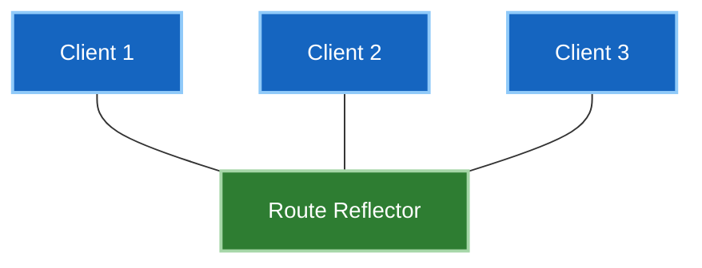

# 5 · Scaling iBGP

iBGP has a rule: **a route learned from an iBGP peer is never re-advertised to
another iBGP peer.**

That's the loop prevention — iBGP doesn't prepend the AS path, so it can't detect
loops the way eBGP does. The cost is that every iBGP speaker must hear every route
directly.

---

## The full-mesh problem

Every router peering with every other router: **n(n−1)/2** sessions.

| Routers | Sessions |
|---|---|
| 5 | 10 |
| 10 | 45 |
| 20 | 190 |
| 50 | **1,225** |
| 100 | **4,950** |

It's not only the count. Adding one router means touching **every existing router** —
a change window that grows with the network, on a protocol where a config error takes
down sessions.

Two solutions exist. One is used everywhere; the other is mostly historical.

---

## Route reflectors

A **route reflector** is allowed to break the rule: it re-advertises iBGP routes to
its clients.



Clients peer only with the reflector. Sessions drop from n(n−1)/2 to roughly **n**.

```
! on the reflector
router bgp 65001
 neighbor 2.2.2.2 remote-as 65001
 neighbor 2.2.2.2 route-reflector-client
```

Only the reflector needs configuring — a client is an ordinary iBGP speaker and
doesn't know it's a client. That's what makes route reflection deployable
incrementally.

### The reflection rules

What the reflector does depends on where the route came from:

| Learned from | Reflected to |
|---|---|
| **Client** | other clients **and** non-clients |
| **Non-client** | clients only |
| **eBGP** | everyone |

The middle row matters: routes from a non-client are **not** passed to other
non-clients. Non-clients must still be fully meshed among themselves.

### Loop prevention without AS path

Reflection reintroduces the loop risk the full-mesh rule prevented, so two
attributes replace it:

| Attribute | Job |
|---|---|
| **ORIGINATOR_ID** | router ID of the router that first advertised it. A router receiving its own ID discards the route. |
| **CLUSTER_LIST** | list of cluster IDs the route has passed through. A reflector seeing its own cluster ID discards it. |

Both are **optional non-transitive** — they exist only inside the AS and never leak
out.

!!! warning "Redundancy needs care with cluster IDs"
    One reflector is a single point of failure, so deploy two. Then decide:

    **Same cluster ID on both** — they ignore each other's reflected routes (that's
    the cluster-list check working). Clients still get everything via both, and
    memory is lower. But if a client loses one session it may lose paths.

    **Different cluster IDs** — each reflector treats the other's routes as new, so
    clients hold more paths and redundancy is more robust, at the cost of memory and
    duplicate advertisements.

    Different cluster IDs is the more common modern choice; memory is cheaper than
    an outage.

### What reflection costs you

**Path diversity.** A reflector advertises only its **own best path** to clients.
Where a full mesh gave every router every path to choose from, clients now see one
— chosen by a router whose IGP position may differ from theirs.

That can produce genuinely sub-optimal routing, because step 8 (IGP metric to next
hop) is evaluated from the *reflector's* perspective rather than the client's.

`add-path` mitigates it by letting a reflector advertise multiple paths per prefix,
at the cost of memory and update volume.

---

## Confederations

Split one AS into several sub-ASes. Inside each, full mesh; between them, eBGP-like
peering that keeps iBGP attributes.

```
router bgp 65100
 bgp confederation identifier 65001
 bgp confederation peers 65101 65102
```

The outside world sees only `65001`; internally there are sub-ASes with AS-path
based loop prevention between them.

**It works, and almost nobody chooses it now.** Confederations require redesigning
your AS numbering and are disruptive to introduce, while route reflection is
incremental — configure a reflector, point clients at it, done. Confederations
survive mainly in networks that adopted them early.

Worth knowing for interviews as the alternative, and for the reasoning: **the
solution you can deploy gradually beats the one that needs a redesign**, even when
both are technically sound.

---

## Comparison

| | Route reflectors | Confederations |
|---|---|---|
| Sessions | ~n | full mesh per sub-AS |
| Loop prevention | ORIGINATOR_ID + CLUSTER_LIST | AS path between sub-ASes |
| Deployment | **incremental** | needs AS redesign |
| Config burden | reflector only | every router |
| Common today | **yes, dominant** | rare, legacy |

---

## Where you'll meet this next

Route reflection isn't a niche technique — it's how nearly every fabric is built:

- **[Phase 4 · EVPN](../../04-evpn/index.md)** uses spines as route reflectors for
  the iBGP-EVPN overlay. Leaves peer only with spines, exactly the pattern above.
- **[Phase 3 · MPLS L3VPN](../../03-mpls-l3vpn/index.md)** reflects VPNv4 routes
  between PEs the same way.

The Phase 4 lab already does this — it's worth re-reading its overlay config now
that the rules make sense.

---

**Next:** [Interview questions →](interview-questions.md).
