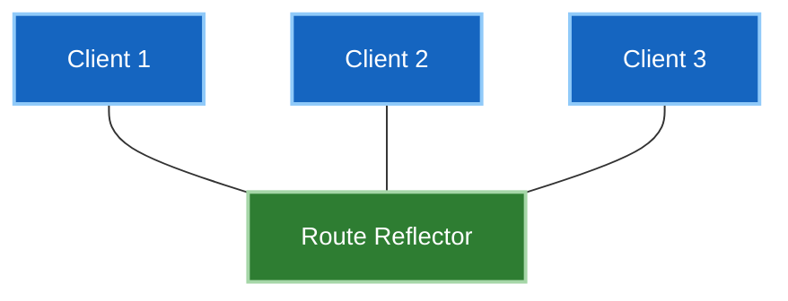

# ၅ · iBGP ကို ချဲ့ထွင်ခြင်း (Scaling iBGP)

iBGP တွင် စည်းမျဉ်းတစ်ခု ရှိသည်- **iBGP peer တစ်ခုထံမှ သင်ယူရရှိသော route ကို အခြား iBGP peer တစ်ခုထံ ဘယ်တော့မှ ထပ်မံကြေညာခွင့် မရှိပါ (never re-advertised)။**

၎င်းသည် Loop ကာကွယ်ရေး ယန္တရားဖြစ်သည် — iBGP သည် AS path ကို prepend မလုပ်သောကြောင့် eBGP ကဲ့သို့ loops များကို ရှာဖွေဖော်ထုတ်နိုင်စွမ်း မရှိပေ။ ဤစည်းမျဉ်း၏ အပေးအယူပေးဆပ်မှုမှာ iBGP router တိုင်းသည် route တိုင်းကို တိုက်ရိုက် ကြားသိနေရမည် ဖြစ်သည်။

---

## Full-Mesh ပြဿနာ

Router တိုင်းသည် အခြား router တိုင်းနှင့် အပြန်အလှန် peer ဖွဲ့စည်းရသည်: **n(n−1)/2** sessions လိုအပ်သည်။

| Routers အရေအတွက် | Sessions အရေအတွက် |
|---|---|
| ၅ | ၁၀ |
| ၁၀ | ၄၅ |
| ၂၀ | ၁၉၀ |
| ၅၀ | **၁,၂၂၅** |
| ၁၀၀ | **၄,၉၅၀** |

Session အရေအတွက် များပြားခြင်းတစ်ခုတည်း မဟုတ်ပါ။ Router အသစ်တစ်ခု ထပ်မံထည့်သွင်းတိုင်း **ရှိပြီးသား router တိုင်းကို** ဝင်ရောက် configure လုပ်ရသည် — ကွန်ရက် ကြီးထွားလာသည်နှင့်အမျှ change window ကာလ ပိုမိုရှည်လျားလာပြီး config အမှားတစ်ခုတည်းဖြင့် sessions များ ပြုတ်ကျနိုင်သော protocol တစ်ခုအတွက် အလွန်အန္တရာယ်များသည်။

ဖြေရှင်းနည်း ၂ သွယ် ရှိသည်။ တစ်ခုကို နေရာတိုင်းတွင် အသုံးပြုကြပြီး အခြားတစ်ခုမှာမူ သမိုင်းဝင်အဖြစ်သာ ကျန်ရစ်တော့သည်။

---

## Route Reflectors

**Route Reflector (RR)** သည် စည်းမျဉ်းကို ချိုးဖောက်ခွင့်ရှိသည်- ၎င်းသည် iBGP routes များကို မိမိ၏ clients များထံ ပြန်လည်ကြေညာပေးခွင့် ရှိသည်။



Clients များသည် reflector နှင့်သာ peer ဖွဲ့ကြသည်။ Sessions အရေအတွက်သည် n(n−1)/2 မှသည် ခန့်မှန်းခြေ **n** ခုအထိ ကျဆင်းသွားသည်။

```
! on the reflector
router bgp 65001
 neighbor 2.2.2.2 remote-as 65001
 neighbor 2.2.2.2 route-reflector-client
```

Reflector ပေါ်တွင်သာ configure လုပ်ရန် လိုအပ်သည် — Client သည် သာမန် iBGP speaker တစ်ခုသာဖြစ်ပြီး မိမိကိုယ်ကို client ဖြစ်မှန်းပင် မသိရှိပေ။ ဤအချက်က route reflection ကို ကွန်ရက်မပြတ်တောက်စေဘဲ အဆင့်ဆင့် တပ်ဆင်အသုံးပြုနိုင်စေခြင်း (deployable incrementally) ဖြစ်သည်။

### Reflection စည်းမျဉ်းများ

Reflector က မည်သို့ဆောင်ရွက်မည်ဆိုသည်မှာ route မည်သည့်နေရာမှ လာသည်အပေါ် မူတည်သည် -

| သင်ယူရရှိသော နေရာ | မည်သူ့ထံ ပြန်လည် ထင်ဟပ်ကြေညာပေးသနည်း (Reflected to) |
|---|---|
| **Client** | အခြား clients များ **နှင့်** Non-clients များထံသို့ |
| **Non-client** | Clients များထံသို့သာလျှင် |
| **eBGP** | လူတိုင်းထံသို့ |

အလယ်အဆင့်သည် အရေးကြီးပါသည်- Non-client ထံမှ ရရှိသော routes များကို အခြား non-clients များထံ **ပြန်လည်မပေးပို့ပါ**။ ထို့ကြောင့် Non-clients အချင်းချင်းကြားတွင်မူ full mesh ဆက်လက် လိုအပ်နေဆဲ ဖြစ်သည်။

### AS Path မပါဘဲ Loop ကာကွယ်ခြင်း

Reflection ပြုလုပ်ခြင်းသည် full-mesh စည်းမျဉ်းက ကာကွယ်ပေးထားသော loop ဖြစ်နိုင်ခြေကို ပြန်လည်ခေါ်ဆောင်လာသဖြင့် ၎င်းအစား attributes နှစ်ခုဖြင့် အစားထိုးကာကွယ်သည် -

| Attribute | လုပ်ဆောင်ချက် (Job) |
|---|---|
| **ORIGINATOR_ID** | ဤ route ကို စတင်ကြေညာခဲ့သော router ၏ router ID ဖြစ်သည်။ မိမိကိုယ်ပိုင် ID ပါဝင်နေသော route ကို လက်ခံရရှိသည့်အခါ router က ထို route ကို ပယ်ဖျက်သည်။ |
| **CLUSTER_LIST** | Route ဖြတ်သန်းခဲ့သော cluster IDs များ စာရင်းဖြစ်သည်။ မိမိကိုယ်ပိုင် cluster ID ကို တွေ့ရှိသော reflector သည် ထို route ကို ပယ်ဖျက်သည်။ |

နှစ်ခုစလုံးသည် **Optional non-transitive** ဖြစ်ကြသည် — မိမိ AS အတွင်း၌သာ တည်ရှိပြီး ပြင်ပသို့ ဘယ်တော့မှ မပေါက်ကြားပါ။

!!! warning "Cluster IDs ဖြင့် Redundancy တည်ဆောက်ရာတွင် သတိထားရန်"
    Reflector တစ်လုံးတည်း ထားရှိခြင်းသည် single point of failure ဖြစ်စေသောကြောင့် နှစ်လုံး ထားရှိလေ့ရှိသည်။ ထို့နောက် အောက်ပါတို့ကို ဆုံးဖြတ်ရမည် -

    **နှစ်လုံးစလုံးတွင် တူညီသော Cluster ID သတ်မှတ်ခြင်း** — Reflector များသည် တစ်ခု၏ reflected routes များကို အခြားတစ်ခုက လျစ်လျူရှုကြသည် (Cluster-list စစ်ဆေးမှု အလုပ်လုပ်ခြင်း ဖြစ်သည်)။ Clients များသည် လမ်းကြောင်းအားလုံးကို reflectors နှစ်ခုစလုံးမှတစ်ဆင့် ရရှိနေဆဲဖြစ်ပြီး memory သုံးစွဲမှု သက်သာသည်။ သို့သော် client တစ်ခုသည် reflector တစ်ခုနှင့် session ပြတ်တောက်သွားပါက paths အချို့ ဆုံးရှုံးသွားနိုင်သည်။

    **မတူညီသော Cluster IDs များ သတ်မှတ်ခြင်း** — Reflector တစ်ခုစီသည် အခြားတစ်ခု၏ routes များကို အသစ်အဖြစ် မှတ်ယူသဖြင့် clients များထံတွင် paths ပိုမိုများပြားစွာ ရှိနေပြီး redundancy ပိုမိုခိုင်မာသည်၊ သို့သော် memory ပိုမိုသုံးစွဲပြီး ကြေညာချက်များ နှစ်ဆဖြစ်စေသည်။

    ခေတ်သစ်ကွန်ရက်များတွင် မတူညီသော Cluster IDs ကို ပိုမိုရွေးချယ်ကြသည်; ကွန်ရက်ပြတ်တောက်ခြင်းထက် memory ကုန်ကျမှုက ပိုမိုသက်သာသောကြောင့် ဖြစ်သည်။

### Reflection ၏ ကုန်ကျစရိတ်

**လမ်းကြောင်း ကွဲပြားစုံလင်မှု လျော့နည်းခြင်း (Path diversity)။** Reflector သည် clients များထံသို့ ၎င်း၏ **ကိုယ်ပိုင် best path တစ်ခုတည်းကိုသာ** ကြေညာပေးသည်။ Full mesh တွင် router တိုင်းသည် ရွေးချယ်စရာ paths အားလုံးကို မြင်တွေ့ရသော်လည်း၊ Route reflection တွင်မူ clients များသည် reflector က ရွေးချယ်ပေးလိုက်သော လမ်းကြောင်းတစ်ခုတည်းကိုသာ မြင်တွေ့ရသည် — ထို reflector ၏ IGP တည်နေရာသည် client နှင့် မတူညီနိုင်ပေ။

၎င်းသည် အကောင်းဆုံးမဟုတ်သော လမ်းကြောင်းရွေးချယ်မှု (sub-optimal routing) ကို ဖြစ်ပေါ်စေနိုင်သည်၊ အကြောင်းမှာ အဆင့် ၈ (Next hop ဆီသို့ IGP metric) ကို client ၏ အမြင်မှ မဟုတ်ဘဲ *reflector* ၏ အမြင်မှ တွက်ချက်ထားသောကြောင့် ဖြစ်သည်။

`add-path` သည် reflector အား prefix တစ်ခုအတွက် paths များစွာ ကြေညာခွင့်ပေးခြင်းဖြင့် ဤပြဿနာကို သက်သာစေသော်လည်း memory နှင့် update volume ကို ပိုမိုတိုးပွားစေသည်။

---

## Confederations

AS ကြီးတစ်ခုတည်းကို sub-ASes အသေးစားများစွာအဖြစ် ခွဲခြမ်းလိုက်ခြင်း ဖြစ်သည်။ Sub-AS တစ်ခုချင်းစီအတွင်း full mesh ပြုလုပ်ပြီး; Sub-ASes အချင်းချင်းကြားတွင်မူ iBGP attributes များကို ထိန်းသိမ်းထားသော eBGP ပုံစံ peering ဖြင့် ချိတ်ဆက်သည်။

```
router bgp 65100
 bgp confederation identifier 65001
 bgp confederation peers 65101 65102
```

ပြင်ပကမ္ဘာသည် `65001` ကိုသာ မြင်တွေ့ရသည်; အတွင်းပိုင်းတွင်မူ AS-path အခြေခံ loop prevention ပါရှိသော sub-ASes များ ရှိနေသည်။

**၎င်းသည် အလုပ်ဖြစ်သော်လည်း ယခုအခါ မည်သူမျှ မရွေးချယ်ကြတော့ပေ။** Confederations သည် မိမိ၏ AS numbering စနစ်တစ်ခုလုံးကို အသစ်ပြန်လည်ဒီဇိုင်းဆွဲရန် လိုအပ်ပြီး စတင်ပြောင်းလဲချိန်တွင် အလွန်အနှောင့်အယှက်များစေသည်; Route reflection မှာမူ အဆင့်ဆင့် တိုးချဲ့နိုင်သည် — Reflector တစ်လုံး configure လုပ်ပါ၊ clients များကို ၎င်းဆီ ညွှန်ပြပါ၊ ပြီးစီးသွားပြီ။ Confederations သည် စောစီးစွာကတည်းက စတင်တပ်ဆင်ခဲ့သော ကွန်ရက်အဟောင်းကြီးများတွင်သာ အဓိက ကျန်ရစ်တော့သည်။

အင်တာဗျူးများအတွက် အခြားရွေးချယ်စရာတစ်ခုအဖြစ် သိထားသင့်ပြီး တွေးခေါ်ပုံ အကြောင်းပြချက်မှာ — **နည်းပညာအရ နှစ်မျိုးစလုံး ခိုင်မာနေလျှင်ပင် တစ်ဆင့်ပြီးတစ်ဆင့် အနှောင့်အယှက်မရှိ ဖြန့်ကျက်နိုင်သော နည်းလမ်းသည် အစမှ ပြန်လည်ဒီဇိုင်းဆွဲရသော နည်းလမ်းထက် အမြဲတမ်း သာလွန်ပါသည်**။

---

## နှိုင်းယှဉ်ချက် (Comparison)

| | Route Reflectors | Confederations |
|---|---|---|
| Sessions အရေအတွက် | ~n | Sub-AS တစ်ခုစီအလိုက် full mesh |
| Loop ကာကွယ်ရေး ယန္တရား | ORIGINATOR_ID + CLUSTER_LIST | Sub-ASes များအကြား AS path |
| ဖြန့်ကျက်တပ်ဆင်မှု | **တစ်ဆင့်ချင်း ပြုလုပ်နိုင်သည် (incremental)** | AS တစ်ခုလုံး အသစ်ပြန်ဆွဲရသည် |
| Config ပြုလုပ်ရမှု ဝန်ထုပ်ဝန်ပိုး | Reflector ပေါ်တွင်သာ | Router တိုင်းပေါ်တွင် |
| ယနေ့ခေတ် အသုံးများမှု | **ဟုတ်ကဲ့၊ အဓိက လွှမ်းမိုးထားသည်** | ရှားပါးသည်၊ အမွေအနှစ်ဟောင်းဖြစ်သည် |

---

## ဤအရာကို နောက်ထပ် မည်သည့်နေရာတွင် တွေ့ရမည်နည်း

Route reflection သည် သီးခြားနည်းပညာတစ်ခု မဟုတ်ပါ — ခေတ်သစ် fabric တိုင်းနီးပါးကို ဤနည်းလမ်းဖြင့်သာ တည်ဆောက်ထားကြသည် -

- **[Phase 4 · EVPN](../../04-evpn/index.md)** တွင် spines များကို iBGP-EVPN overlay အတွက် route reflectors များအဖြစ် အသုံးပြုသည်။ Leaves များသည် spines များနှင့်သာ peer ဖွဲ့ကြပြီး အထက်ပါ စံပုံစံအတိုင်း အတိအကျ ဖြစ်သည်။
- **[Phase 3 · MPLS L3VPN](../../03-mpls-l3vpn/index.md)** တွင် PEs များအကြား VPNv4 routes များကို ဤနည်းလမ်းဖြင့်ပင် reflect ပြုလုပ်ပေးသည်။

Phase 4 lab တွင် ၎င်းကို လက်တွေ့ အသုံးပြုထားပြီးဖြစ်သည် — ယခုအခါ စည်းမျဉ်းများကို သဘောပေါက်နားလည်သွားပြီဖြစ်ရာ ၎င်း၏ overlay configuration ကို ပြန်လည်ဖတ်ရှုသင့်ပါသည်။

---

**နောက်တစ်ခု:** [အင်တာဗျူး မေးခွန်းများ →](interview-questions.md)
