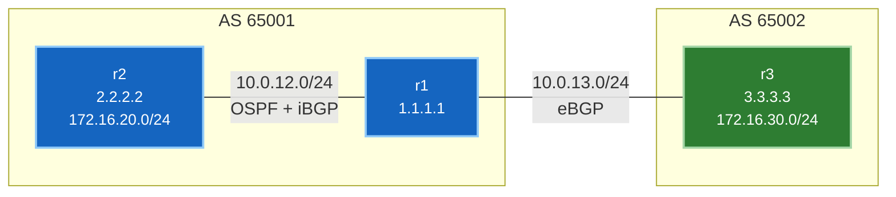

# 🧪 Lab 01 · eBGP, iBGP and next-hop-self

> ✅ **Validated** on Arista cEOS 4.32.0F, 2026-08-03. Every output below was
> captured from this fabric — nothing is written from memory.

**Time:** ~45 minutes · **Nodes:** 3

!!! tip "Run it instead of typing it"
    Every config block below is read from a file in the repo — the page and the
    script show the same bytes, so they cannot drift apart.

    ```bash
    git clone https://github.com/etherhtun/netforge-labs
    cd netforge-labs/labs/bgp-lab
    sudo containerlab deploy -t topology.clab.yml --max-workers 1
    ./run.sh --all          # or ./run.sh 02 to take one step at a time
    ```

    `run.sh` applies each step, runs its verification gate, and **stops at the
    first failure** rather than building on something that silently didn't work.
    Reading along and pasting by hand works exactly as before.

Build two autonomous systems, peer them, and hit the single most common iBGP
mistake on purpose — then fix it and prove traffic flows.

---

## What you'll learn

- Why **eBGP** and **iBGP** are the same protocol with different rules
- Why iBGP peers over **loopbacks** and eBGP doesn't
- The **next-hop** problem that breaks almost every first iBGP deployment
- How to read `show ip bgp` and tell a *valid* route from a *usable* one

---

## Topology



| Device | AS | Loopback0 | Advertises |
|---|---|---|---|
| **r1** | 65001 | 1.1.1.1/32 | — (border router) |
| **r2** | 65001 | 2.2.2.2/32 | 172.16.20.0/24 |
| **r3** | 65002 | 3.3.3.3/32 | 172.16.30.0/24 |

---

## Step 1 · Deploy

```yaml title="topology.clab.yml"
name: bgp-lab

topology:
  nodes:
    r1: { kind: arista_ceos, image: ceos:4.32.0F }
    r2: { kind: arista_ceos, image: ceos:4.32.0F }
    r3: { kind: arista_ceos, image: ceos:4.32.0F }

  # endpoints MUST be lowercase ethN — cEOS entrypoint counts eth* interfaces
  links:
    - endpoints: ["r1:eth1", "r2:eth1"]   # 10.0.12.0/24  internal AS 65001
    - endpoints: ["r1:eth2", "r3:eth1"]   # 10.0.13.0/24  eBGP to AS 65002
```

```bash
sudo containerlab deploy -t topology.clab.yml --max-workers 1
```

`--max-workers 1` serialises startup. Booting concurrently under Rosetta can race
the wiring and leave interfaces as type `Unknown`.

**Verify** — every data-plane port must show a real type:

```bash
for n in r1 r2 r3; do docker exec clab-bgp-lab-$n Cli -p 15 -c "show interfaces status" | grep -E "^Et[12]"; done
```

```
Et1               connected    1        full   1G     EbraTestPhyPort
Et2               connected    1        full   1G     EbraTestPhyPort
Et1               connected    1        full   1G     EbraTestPhyPort
Et1               connected    1        full   1G     EbraTestPhyPort
```

✅ **DONE when** every interface reads `EbraTestPhyPort`. If any says `Unknown`,
destroy and redeploy — do **not** `docker restart`, which destroys the veth pairs.

---

## Step 2 · Underlay inside AS 65001

iBGP peers over loopbacks, so the IGP must make those loopbacks reachable **first**.
This is the dependency that catches people: BGP looks broken when the real fault is
underneath it.

=== "r1"

    ```
    --8<-- "labs/bgp-lab/steps/02-r1-underlay.cfg"
    ```

=== "r2"

    ```
    --8<-- "labs/bgp-lab/steps/02-r2-underlay.cfg"
    ```

Apply with a heredoc — **`-i` is mandatory**:

```bash
docker exec -i clab-bgp-lab-r1 Cli -p 15 <<'EOF'
configure
...
end
EOF
```

!!! warning "Two things you'll see, only one is a problem"
    **Benign:** while applying, EOS may print
    `IP configuration will be ignored while interface Ethernet1 is not a routed port`.
    That's emitted mid-parse before `no switchport` takes effect. Check the result
    with `show running-config interfaces Ethernet1` — if the address is there, it
    applied.

    **Not benign:** a heredoc that returns **instantly with no output at all**.
    That means `-i` was missing, stdin was never attached, and **nothing was
    configured**. `Cli` exits 0, so it looks like success.

**Notice `Ethernet2` has no `ip ospf area`.** That's deliberate — it faces another
AS and must not be in your IGP. It matters in step 4.

**Verify:**

```bash
docker exec clab-bgp-lab-r1 Cli -p 15 -c "show ip ospf neighbor"
```

```
Neighbor ID     Instance VRF      Pri State                  Dead Time   Address         Interface
2.2.2.2         1        default  0   FULL                   00:00:33    10.0.12.2       Ethernet1
```

✅ **DONE when** the neighbour is `FULL`. Anything else — stop and fix it here.

---

## Step 3 · The BGP sessions

Two sessions, configured differently for reasons worth understanding.

=== "r1 — both session types"

    ```
    --8<-- "labs/bgp-lab/steps/03-r1-bgp.cfg"
    ```

=== "r2 — iBGP only"

    ```
    --8<-- "labs/bgp-lab/steps/03-r2-bgp.cfg"
    ```

=== "r3 — eBGP only"

    ```
    --8<-- "labs/bgp-lab/steps/03-r3-bgp.cfg"
    ```

**Why iBGP uses loopbacks and eBGP uses interface addresses:**

iBGP peers are usually multiple hops apart with several possible paths between them.
Peering from a loopback means the session survives any single link failing — the IGP
just reroutes. That only works if the IGP advertises the loopbacks, which is step 2.

eBGP peers are typically directly connected on a link with no IGP between them. There
is no alternate path, so the interface address is the natural choice — and eBGP
defaults to TTL 1, which assumes exactly that.

!!! tip "`no bgp default ipv4-unicast`"
    Without it, every neighbour is auto-activated for IPv4 the moment you define it.
    Being explicit is the modern habit and essential once you add address families
    like EVPN — you rarely want every peer in every family.

**Verify:**

```bash
docker exec clab-bgp-lab-r1 Cli -p 15 -c "show ip bgp summary"
```

```
BGP summary information for VRF default
Router identifier 1.1.1.1, local AS number 65001
  Neighbor  V AS           MsgRcvd   MsgSent  InQ OutQ  Up/Down State   PfxRcd PfxAcc
  2.2.2.2   4 65001              5         7    0    0 00:00:07 Estab   1      1
  10.0.13.3 4 65002              5         5    0    0 00:00:26 Estab   1      1
```

✅ **DONE when** both peers show `Estab` and `PfxRcd 1`.

If a session sits in `Active` or `Idle`, BGP can't reach the peer. For the iBGP one
that almost always means the loopback isn't in OSPF.

---

## Step 4 · Break it — the next-hop problem

Everything says Established. Look at r2's table:

```bash
docker exec clab-bgp-lab-r2 Cli -p 15 -c "show ip bgp"
```

```
          Network                Next Hop              Metric  AIGP       LocPref Weight  Path
 * >      172.16.20.0/24         -                     -       -          -       0       i
 * >      172.16.30.0/24         10.0.13.3             0       -          100     0       65002 i
```

`* >` — valid and best. Looks perfect.

**It isn't.** The next hop is `10.0.13.3`, an address on the eBGP link. Ask whether
r2 can actually reach it:

```bash
docker exec clab-bgp-lab-r2 Cli -p 15 -c "show ip route 10.0.13.3"
```

```
Gateway of last resort:
 S        0.0.0.0/0 [1/0]
           via 172.20.20.1, Management0
```

**No specific route.** Only the default. Because `Ethernet2` was deliberately left
out of OSPF in step 2, nothing inside AS 65001 knows how to reach `10.0.13.0/24`.

Now the part that makes this genuinely nasty:

```bash
docker exec clab-bgp-lab-r2 Cli -p 15 -c "show ip route 172.16.30.0/24"
```

```
 B I      172.16.30.0/24 [200/0]
           via 172.20.20.1, Management0
```

**The route installed — pointing out the management interface.** BGP resolved the
unreachable next hop against the default route, and the default route is management.

!!! danger "This is worse than a visible failure"
    Every check says healthy. The session is Established, the prefix is received,
    the route is `* >` valid, and it's installed in the FIB. Nothing is red.

    But data traffic is being handed to the **out-of-band management network**. In
    production that's either a black hole or, worse, a path that works just well
    enough to hide the fault for months.

    **In a lab, `show ip bgp` showing a valid route is not proof of anything.**
    Always confirm the next hop is reachable via a *data-plane* route.

**Why does this happen at all?** When an eBGP router advertises a prefix, the next
hop is its own interface address. When r1 passes that to r2 over iBGP, it keeps the
next hop **unchanged** — that's the rule. r2 receives a next hop belonging to a link
in a different AS, which it has no route to.

---

## Step 5 · Fix it

Tell r1 to overwrite the next hop with its own address when advertising to iBGP
peers:

```
--8<-- "labs/bgp-lab/steps/05-r1-next-hop-self.cfg"
```

Or run the step: `./run.sh 05`

**Verify:**

```bash
docker exec clab-bgp-lab-r2 Cli -p 15 -c "show ip bgp"
```

```
          Network                Next Hop              Metric  AIGP       LocPref Weight  Path
 * >      172.16.20.0/24         -                     -       -          -       0       i
 * >      172.16.30.0/24         1.1.1.1               0       -          100     0       65002 i
```

Next hop is now `1.1.1.1` — r1's loopback, which OSPF advertises.

```bash
docker exec clab-bgp-lab-r2 Cli -p 15 -c "show ip route 172.16.30.0/24"
```

```
 B I      172.16.30.0/24 [200/0]
           via 10.0.12.1, Ethernet1
```

**`via 10.0.12.1, Ethernet1`** — the real data path, not management.

✅ **DONE when** the route resolves via `Ethernet1`. Compare against step 4: the BGP
table looked almost identical, but the FIB entry changed completely.

---

## Step 6 · Prove it forwards

Control plane agreement is not forwarding. Test it:

```bash
docker exec clab-bgp-lab-r2 Cli -p 15 -c "ping 172.16.30.1 source 172.16.20.1 repeat 3"
```

```
PING 172.16.30.1 (172.16.30.1) from 172.16.20.1 : 72(100) bytes of data.
80 bytes from 172.16.30.1: icmp_seq=1 ttl=63 time=22.3 ms
80 bytes from 172.16.30.1: icmp_seq=2 ttl=63 time=13.2 ms
80 bytes from 172.16.30.1: icmp_seq=3 ttl=63 time=2.42 ms

--- 172.16.30.1 ping statistics ---
3 packets transmitted, 3 received, 0% packet loss, time 22ms
```

```bash
docker exec clab-bgp-lab-r2 Cli -p 15 -c "traceroute 172.16.30.1 source 172.16.20.1"
```

```
traceroute to 172.16.30.1 (172.16.30.1), 30 hops max, 60 byte packets
 1  10.0.12.1 (10.0.12.1)  0.247 ms  0.054 ms  0.020 ms
 2  172.16.30.1 (172.16.30.1)  4.247 ms  4.636 ms  4.752 ms
```

r2 → r1 → r3, across an AS boundary. ✅ **DONE.**

---

## Step 7 · Read the AS path

The same prefixes look different depending on where you stand:

=== "From r3 (AS 65002)"

    ```
              Network                Next Hop        LocPref Weight  Path
     * >      172.16.20.0/24         10.0.13.1       100     0       65001 i
     * >      172.16.30.0/24         -               -       0       i
    ```

    `65001` in the path — learned across one AS boundary. Its own prefix has an
    empty path.

=== "From r1 (AS 65001)"

    ```
              Network                Next Hop        LocPref Weight  Path
     * >      172.16.20.0/24         2.2.2.2         100     0       i
     * >      172.16.30.0/24         10.0.13.3       100     0       65002 i
    ```

    `172.16.20.0/24` has an **empty path** — learned via iBGP, and iBGP doesn't
    prepend. The AS path only grows crossing an AS boundary.

That's also the loop-prevention mechanism: a router rejects any route whose AS path
already contains its own AS number.

!!! note "Why iBGP needs a full mesh"
    iBGP doesn't prepend the AS path, so it can't detect loops the way eBGP does.
    The protocol compensates with a hard rule: **a route learned via iBGP is never
    re-advertised to another iBGP peer.**

    Loop-free, but it means every iBGP speaker must peer with every other — a full
    mesh, growing as n(n−1)/2. Route reflectors exist to break that, and they're
    Lab 02.

---

## Platform note: administrative distance

Textbooks give eBGP an AD of 20 and iBGP 200. On this platform, measured:

```
r1:  B E  172.16.30.0/24 [200/0]      ← eBGP-learned
r2:  B I  172.16.30.0/24 [200/0]      ← iBGP-learned
```

**Both 200**, with no distance configured. The 20/200 split is Cisco IOS behaviour,
not a BGP standard — Arista EOS defaults both to 200.

In an interview the expected answer is usually 20/200, but knowing it's
vendor-specific is the better answer. Verify on the platform in front of you rather
than assuming.

---

## Troubleshooting

| Symptom | Cause | Fix |
|---|---|---|
| Session stuck `Idle`/`Active` | peer address unreachable | iBGP: loopback missing from OSPF. eBGP: check the interface address |
| iBGP up, no prefixes | peer not activated in the address family | `neighbor X activate` |
| Prefix received, route unusable | next hop unreachable | `next-hop-self` on the border router |
| Route resolves via `Management0` | next hop matched the default route | same fix — check the FIB, not just `show ip bgp` |
| `network` statement ignored | no matching route in the RIB | the prefix must exist locally first |
| Heredoc silently does nothing | missing `-i` | `docker exec -i` |
| Interface type `Unknown` | boot race | destroy + redeploy with `--max-workers 1` |

---

## Interview questions

??? question "Why does iBGP peer over loopbacks while eBGP uses interface addresses?"
    iBGP peers are usually several hops apart with redundant paths between them; a
    loopback session survives any single link failure because the IGP reroutes
    around it. eBGP peers are typically directly connected with no alternate path
    and no IGP between the ASes, so the interface address is natural — and eBGP's
    default TTL of 1 assumes exactly that.

??? question "What is next-hop-self and why is it needed?"
    When a router advertises an eBGP-learned prefix to an iBGP peer, it leaves the
    next hop unchanged — pointing at an address in the neighbouring AS that internal
    routers have no route to. `next-hop-self` rewrites it to the advertising
    router's own address, which the IGP does advertise.

??? question "BGP shows a route as valid and best, but traffic doesn't reach it. What do you check?"
    Whether the **next hop is reachable by a data-plane route**. BGP marks a route
    valid if the next hop resolves *at all* — including via a default route. In a
    lab that default is often the management interface, so the route installs and
    silently sends traffic out-of-band. Check `show ip route <next-hop>` and confirm
    the FIB entry points at a real data interface.

??? question "Why must iBGP be fully meshed?"
    iBGP doesn't prepend the AS path, so it can't use path-based loop detection. The
    protocol compensates with the rule that a route learned from an iBGP peer is
    never re-advertised to another iBGP peer — which means every speaker must hear
    it directly. Route reflectors relax this.

??? question "A prefix in the routing table isn't advertised despite a network statement. Why?"
    The `network` statement only advertises a prefix that already exists in the RIB
    with an exact match. If nothing local generates that exact prefix — no
    interface, no static, no IGP route — BGP has nothing to advertise. Mask
    mismatches are the usual culprit.

??? question "What's the administrative distance of eBGP and iBGP?"
    Traditionally 20 and 200 — but that's Cisco IOS, not a standard. Arista EOS
    defaults both to **200**, verified on this lab. The better answer names the
    conventional values and notes they're vendor-specific.

---

## Clean up

```bash
sudo containerlab destroy -t topology.clab.yml
```

---

**Next:** Lab 02 — route reflectors, breaking the iBGP full-mesh requirement.
*(In progress.)*
