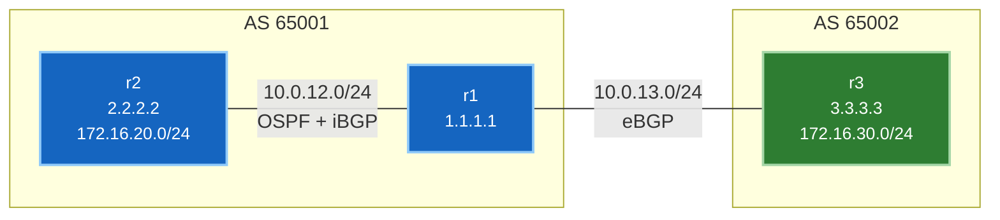

# 🧪 Lab 01 · eBGP၊ iBGP နှင့် next-hop-self

> ✅ **Validated** on Arista cEOS 4.32.0F, 2026-08-03. အောက်ဖော်ပြပါ output တိုင်းကို ဤ fabric ပေါ်မှ တိုက်ရိုက်ဖမ်းယူထားခြင်းဖြစ်ပြီး — မှတ်ဉာဏ်ထဲမှ ရေးသားထားခြင်း မဟုတ်ပါ။

**ကြာမြင့်ချိန်:** ~၄၅ မိနစ် · **Nodes အရေအတွက်:** ၃ ခု

> [!NOTE]
> **Lab 02 သို့ ဆက်လက်ချိတ်ဆက်မှု**: [Lab 02 (IS-IS Underlay Migration)](lab-02-isis-underlay.md) သည် ဤ lab တွင် သင်တည်ဆောက်လိုက်သော fabric ပေါ်တွင် တိုက်ရိုက် ဆက်လက်တည်ဆောက်သွားမည် ဖြစ်သည်။ Lab 01 ပြီးဆုံးပြီးနောက် Lab 02 သို့ အဆင်ပြေချောမွေ့စွာ ဆက်လက်ကူးပြောင်းနိုင်ရန် fabric ကို ဆက်လက် run ထားပါ။

!!! tip "အမြန်စတင်ရန် လမ်းညွှန် (တည်နေရာ: `labs/bgp-lab/`)"
    **အဆင့် ၁ · Lab Fabric ကို စတင်လည်ပတ်ပါ (မ run ရသေးပါက)**
    ```bash
    cd labs/bgp-lab
    sudo containerlab deploy -t topology.clab.yml --max-workers 1
    ```

    **အဆင့် ၂ · အပြန်အလှန် လမ်းညွှန်မှုပါရှိသော Interactive Walkthrough ကို စတင်ပါ**
    ```bash
    ./run.sh --guided
    ```

    ??? note "အခြား ရွေးချယ်နိုင်သော နည်းလမ်းများ (Automated Script သို့မဟုတ် Manual CLI)"
        - **အလိုအလျောက် Script ဖြင့် အမြန်ထည့်သွင်းခြင်း**:
          ```bash
          ./run.sh 02          # step 02 ကို apply နှင့် verify အလိုအလျောက် ပြုလုပ်ရန်
          ./run.sh --all       # အဆင့်အားလုံးကို အစဉ်လိုက် run ရန်
          ```
        - **Manual Line-by-Line CLI ဖြင့် လုပ်ဆောင်ခြင်း**:
          Container node ပေါ်တွင် တိုက်ရိုက် interactive CLI shell ဖွင့်ရန်:
          ```bash
          docker exec -it clab-bgp-lab-r1 Cli
          ```
          သို့မဟုတ် အဆင့်တစ်ခုချင်းစီ၏ config snippet များကို stdin မှတစ်ဆင့် ပေးပို့ရန်:
          `docker exec -i clab-bgp-lab-r1 Cli -p 15 < steps/02-r1-underlay.cfg`

Autonomous systems နှစ်ခုကို တည်ဆောက်ပါမည်၊ ၎င်းတို့ကို peer ချိတ်ဆက်ပါမည်၊ အတွေ့ရအများဆုံး iBGP အမှားကို ရည်ရွယ်ချက်ရှိရှိ ကြုံတွေ့စေပါမည် — ပြီးနောက် ၎င်းကို ပြင်ဆင်ပြီး data traffic များ အမှန်တကယ် စီးဆင်းသွားလာနိုင်ကြောင်း သက်သေပြပါမည်။

---

## သင်ယူလေ့လာရမည့် အချက်များ

- **eBGP** နှင့် **iBGP** သည် တူညီသော protocol ဖြစ်သော်လည်း အဘယ်ကြောင့် စည်းမျဉ်းများ ကွဲပြားရသနည်း
- iBGP peers များသည် **loopbacks** များကို အဘယ်ကြောင့် အသုံးပြုပြီး eBGP က အသုံးမပြုရသနည်း
- ပထမဆုံး iBGP deployment တိုင်းနီးပါးကို ပျက်စီးစေသည့် **next-hop** ပြဿနာ
- `show ip bgp` ကို မည်သို့ ဖတ်ရှုရမည်နှင့် *valid* ဖြစ်သော route နှင့် *usable* (အမှန်တကယ် အသုံးပြုနိုင်သော) route အကြား မည်သို့ ခွဲခြားရမည်နည်း

---

## Topology အခင်းအကျင်း



| Device | AS | Loopback0 | Advertises |
|---|---|---|---|
| **r1** | 65001 | 1.1.1.1/32 | — (border router) |
| **r2** | 65001 | 2.2.2.2/32 | 172.16.20.0/24 |
| **r3** | 65002 | 3.3.3.3/32 | 172.16.30.0/24 |

---

## အဆင့် ၁ · Deploy ပြုလုပ်ခြင်း

```yaml title="topology.clab.yml"
name: bgp-lab

topology:
  nodes:
    r1: { kind: arista_ceos, image: ceos:4.32.0F }
    r2: { kind: arista_ceos, image: ceos:4.32.0F }
    r3: { kind: arista_ceos, image: ceos:4.32.0F }

  # endpoints MUST be lowercase ethN — cEOS entrypoint counts eth* interfaces
  links:
    - endpoints: ["r1:eth1", "r2:eth1"]   # 10.0.12.0/24  internal AS 65001
    - endpoints: ["r1:eth2", "r3:eth1"]   # 10.0.13.0/24  eBGP to AS 65002
```

```bash
sudo containerlab deploy -t topology.clab.yml --max-workers 1
```

`--max-workers 1` သည် nodes များကို တစ်ခုပြီးမှတစ်ခု အစဉ်လိုက် စတင်တက်စေသည်။ Rosetta အောက်တွင် ပြိုင်တူ boot တက်ပါက wiring ပြဿနာများဖြစ်ပြီး interfaces များသည် `Unknown` type အဖြစ် ကျန်ရစ်တတ်သည်။

**စစ်ဆေးအတည်ပြုခြင်း** — Data-plane port တိုင်းသည် အစစ်အမှန် interface type ပြသရမည် -

```bash
for n in r1 r2 r3; do docker exec clab-bgp-lab-$n Cli -p 15 -c "show interfaces status" | grep -E "^Et[12]"; done
```

```
Et1               connected    1        full   1G     EbraTestPhyPort
Et2               connected    1        full   1G     EbraTestPhyPort
Et1               connected    1        full   1G     EbraTestPhyPort
Et1               connected    1        full   1G     EbraTestPhyPort
```

✅ Interface တိုင်း `EbraTestPhyPort` ဟု ပြသနေပါက **ပြီးမြောက်ပါပြီ**။ အကယ်၍ တစ်ခုခုက `Unknown` ဟု ပြသပါက destroy လုပ်ပြီး `--max-workers 1` ဖြင့် ပြန်လည် deploy ပြုလုပ်ပါ — veth pairs များကို ပျက်စီးစေသော `docker restart` ကို **လုံးဝ မပြုလုပ်ပါနှင့်**။

---

## အဆင့် ၂ · AS 65001 အတွင်း Underlay တည်ဆောက်ခြင်း

iBGP သည် loopbacks များပေါ်တွင် peer ဖွဲ့သောကြောင့် IGP အနေဖြင့် ထို loopbacks များကို **ဦးစွာ** ရောက်ရှိနိုင်အောင် ပြုလုပ်ပေးရပါမည်။ ၎င်းသည် လူအများ သတိမမူမိသော မှီခိုမှုဖြစ်သည်- တကယ့်ပြဿနာက အောက်ခြေ underlay တွင် ဖြစ်နေချိန်၌ BGP ပျက်စီးနေသည်ဟု ထင်မြင်တတ်ကြသည်။

=== "r1"

    ```
    --8<-- "labs/bgp-lab/steps/02-r1-underlay.cfg"
    ```

=== "r2"

    ```
    --8<-- "labs/bgp-lab/steps/02-r2-underlay.cfg"
    ```

Heredoc ဖြင့် ထည့်သွင်းပါ — **`-i` ပါဝင်ရန် မဖြစ်မနေ လိုအပ်ပါသည်**:

```bash
docker exec -i clab-bgp-lab-r1 Cli -p 15 <<'EOF'
configure
...
end
EOF
```

!!! warning "သင်မြင်တွေ့ရမည့် အခြေအနေ ၂ ခု၊ တစ်ခုတည်းကသာ ပြဿနာဖြစ်သည်"
    **အန္တရာယ်မရှိသောအရာ:** Apply လုပ်နေစဉ် EOS က
    `IP configuration will be ignored while interface Ethernet1 is not a routed port` ဟု ရိုက်နှိပ်ပြပေမည်။
    ၎င်းသည် `no switchport` အသက်မဝင်မီ parse လုပ်နေစဉ် ခေတ္တပြသခြင်း ဖြစ်သည်။ ရလဒ်ကို `show running-config interfaces Ethernet1` ဖြင့် စစ်ဆေးပါ — IP address ပေါ်နေပါက အောင်မြင်စွာ ထည့်သွင်းပြီး ဖြစ်သည်။

    **အမှန်တကယ် ပြဿနာဖြစ်သောအရာ:** မည်သည့် output မျှ မထွက်ဘဲ **ချက်ချင်း ပြီးဆုံးသွားသော** heredoc ဖြစ်သည်။
    ယင်းမှာ `-i` ထည့်သွင်းရန် ကျန်ခဲ့သဖြင့် stdin မတွဲမိဘဲ **မည်သည့်အရာမျှ configure မလုပ်လိုက်ရခြင်း** ဖြစ်သည်။ `Cli` က exit code 0 ပေးသဖြင့် အောင်မြင်သွားသယောင် ထင်ရတတ်သည်။

**`Ethernet2` တွင် `ip ospf area` မပါရှိသည်ကို သတိပြုပါ။** ၎င်းသည် ရည်ရွယ်ချက်ရှိရှိ ချန်လှပ်ထားခြင်းဖြစ်သည် — ၎င်းသည် အခြား AS ဆီသို့ မျက်နှာမူထားပြီး မိမိ၏ IGP အတွင်း မပါဝင်သင့်ပေ။ ၎င်းအချက်သည် အဆင့် ၄ တွင် အရေးပါလာပါမည်။

**စစ်ဆေးအတည်ပြုခြင်း:**

```bash
docker exec clab-bgp-lab-r1 Cli -p 15 -c "show ip ospf neighbor"
```

```
Neighbor ID     Instance VRF      Pri State                  Dead Time   Address         Interface
2.2.2.2         1        default  0   FULL                   00:00:33    10.0.12.2       Ethernet1
```

✅ Neighbour အဆင့်သည် `FULL` ဖြစ်နေပါက **ပြီးမြောက်ပါပြီ**။ အခြားအခြေအနေဖြစ်နေပါက ဤနေရာတွင် ရပ်တန့်၍ အရင်ဆုံး ပြင်ဆင်ပါ။

---

## အဆင့် ၃ · BGP Sessions များ စတင်တည်ဆောက်ခြင်း

နားလည်သဘောပေါက်ထိုက်သော အကြောင်းပြချက်များကြောင့် ကွဲပြားစွာ configure လုပ်ထားသည့် sessions နှစ်ခု ဖြစ်သည်။

=== "r1 — Session အမျိုးအစား နှစ်ခုလုံး"

    ```
    --8<-- "labs/bgp-lab/steps/03-r1-bgp.cfg"
    ```

=== "r2 — iBGP သာလျှင်"

    ```
    --8<-- "labs/bgp-lab/steps/03-r2-bgp.cfg"
    ```

=== "r3 — eBGP သာလျှင်"

    ```
    --8<-- "labs/bgp-lab/steps/03-r3-bgp.cfg"
    ```

**iBGP သည် Loopbacks ကို အဘယ်ကြောင့် သုံးပြီး eBGP က Interface Addresses ကို အဘယ်ကြောင့် သုံးသနည်း:**

iBGP peers များသည် ပုံမှန်အားဖြင့် hop များစွာ ခြားထားပြီး ၎င်းတို့ကြား လမ်းကြောင်းများစွာ ရှိနေတတ်သည်။ Loopback မှတစ်ဆင့် peer ဖွဲ့ခြင်းဖြင့် physical link တစ်ခု ပြတ်တောက်သွားသော်လည်း IGP က အခြားလမ်းကြောင်းမှ ပြန်လည်ရှာဖွေပေးနိုင်သဖြင့် session သည် ဆက်လက်ရှင်သန်နိုင်သည်။ IGP က loopbacks များကို ကြေညာပေးထားမှသာ ၎င်းသည် အလုပ်ဖြစ်မည်ဖြစ်ပြီး ၎င်းကို အဆင့် ၂ တွင် ပြုလုပ်ခဲ့ခြင်း ဖြစ်သည်။

eBGP peers များမှာမူ ကြားတွင် IGP မပါရှိဘဲ တိုက်ရိုက် ကြိုးချင်းချိတ်ဆက်ထားလေ့ရှိသည်။ အခြားလမ်းကြောင်း မရှိသောကြောင့် interface address သည် အသင့်လျော်ဆုံး ရွေးချယ်မှုဖြစ်သည် — ထို့ပြင် eBGP သည် default TTL 1 ကို အသုံးပြုပြီး ၎င်းသည် ထိုအခြေအနေကို အတိအကျ ယူဆထားခြင်း ဖြစ်သည်။

!!! tip "`no bgp default ipv4-unicast` ၏ အရေးပါပုံ"
    ဤ command မပါရှိပါက neighbour တစ်ခု သတ်မှတ်လိုက်သည်နှင့် IPv4 အတွက် auto-activate အလိုအလျောက် ဖြစ်သွားပါလိမ့်မည်။ အတိအလင်း သီးခြားသတ်မှတ်ပေးခြင်းသည် ခေတ်သစ်အလေ့အကျင့်ဖြစ်ပြီး EVPN ကဲ့သို့ address families များစွာ ထည့်သွင်းလာသည့်အခါ မရှိမဖြစ် လိုအပ်သည် — Peer တိုင်းကို family တိုင်းတွင် ပါဝင်စေလိုခဲသောကြောင့် ဖြစ်သည်။

**စစ်ဆေးအတည်ပြုခြင်း:**

```bash
docker exec clab-bgp-lab-r1 Cli -p 15 -c "show ip bgp summary"
```

```
BGP summary information for VRF default
Router identifier 1.1.1.1, local AS number 65001
  Neighbor  V AS           MsgRcvd   MsgSent  InQ OutQ  Up/Down State   PfxRcd PfxAcc
  2.2.2.2   4 65001              5         7    0    0 00:00:07 Estab   1      1
  10.0.13.3 4 65002              5         5    0    0 00:00:26 Estab   1      1
```

✅ Peers နှစ်ခုစလုံးတွင် `Estab` နှင့် `PfxRcd 1` ဟု ပြသနေပါက **ပြီးမြောက်ပါပြီ**။

အကယ်၍ session တစ်ခုသည် `Active` သို့မဟုတ် `Idle` တွင် ရပ်တန့်နေပါက BGP သည် peer ဆီသို့ မရောက်ရှိနိုင်ခြင်း ဖြစ်သည်။ iBGP session အတွက်မူ အများအားဖြင့် loopback သည် OSPF ထဲတွင် မပါရှိသောကြောင့် ဖြစ်သည်။

---

## အဆင့် ၄ · ပြဿနာ ကြုံတွေ့စေခြင်း — Next-Hop ပြဿနာ

အားလုံးက Established ဟု ပြသနေသည်။ r2 ၏ table ကို ကြည့်ရှုပါ -

```bash
docker exec clab-bgp-lab-r2 Cli -p 15 -c "show ip bgp"
```

```
          Network                Next Hop              Metric  AIGP       LocPref Weight  Path
 * >      172.16.20.0/24         -                     -       -          -       0       i
 * >      172.16.30.0/24         10.0.13.3             0       -          100     0       65002 i
```

`* >` — Valid ဖြစ်ပြီး Best ဖြစ်သည်။ ကြည့်ရသည်မှာ အလွန်ပြီးပြည့်စုံနေပုံရသည်။

**သို့သော် မပြီးပြည့်စုံပါ။** Next hop သည် eBGP link ပေါ်ရှိ address ဖြစ်သော `10.0.13.3` ဖြစ်နေသည်။ r2 အနေဖြင့် ထို IP ဆီသို့ အမှန်တကယ် ရောက်ရှိနိုင်ခြင်း ရှိမရှိ စစ်ဆေးကြည့်ပါ -

```bash
docker exec clab-bgp-lab-r2 Cli -p 15 -c "show ip route 10.0.13.3"
```

```
Gateway of last resort:
 S        0.0.0.0/0 [1/0]
           via 172.20.20.1, Management0
```

**တိကျသော Route မရှိပါ။** Default route တစ်ခုတည်းသာ ရှိသည်။ အဆင့် ၂ တွင် `Ethernet2` ကို OSPF ထဲမှ တမင်ချန်လှပ်ထားခဲ့သောကြောင့် AS 65001 အတွင်း မည်သူကမျှ `10.0.13.0/24` ဆီသို့ မည်သို့သွားရမည်ကို မသိရှိကြပေ။

ယခု အလွန်ဆိုးရွားသောအချက်ကို တွေ့ရပါလိမ့်မည် -

```bash
docker exec clab-bgp-lab-r2 Cli -p 15 -c "show ip route 172.16.30.0/24"
```

```
 B I      172.16.30.0/24 [200/0]
           via 172.20.20.1, Management0
```

**Route သည် FIB ထဲသို့ Install ဖြစ်သွားသည် — သို့သော် Management Interface ကို ညွှန်ပြနေသည်။** BGP သည် မရောက်ရှိနိုင်သော next hop ကို default route ပေါ်တွင် resolve လုပ်ပစ်လိုက်ပြီး ထို default route မှာ management ဖြစ်နေခြင်း ဖြစ်သည်။

!!! danger "၎င်းသည် သိသာထင်ရှားသော ချို့ယွင်းချက်ထက် များစွာ ပိုမိုဆိုးရွားသည်"
    စစ်ဆေးမှုတိုင်းက ကောင်းမွန်နေသည်ဟု ပြသနေသည်။ Session က Established ဖြစ်နေသည်၊ Prefix ကို လက်ခံရရှိထားသည်၊ Route က `* >` valid ဖြစ်နေသည်၊ FIB ထဲတွင်လည်း install ဖြစ်နေသည်။ အနီရောင်ပြသနေသည့် error ဘာမှမရှိပေ။

    သို့သော် User data traffic များသည် **Out-of-band management network** ဆီသို့ ပေးပို့ခံနေရသည်။ Production တွင် ၎င်းသည် traffic များ ပျောက်ဆုံးသွားမည့် black hole ဖြစ်စေနိုင်သည် သို့မဟုတ် ပိုဆိုးသည်မှာ ပြဿနာကို လပေါင်းများစွာ သတိမပြုမိအောင် ဖုံးကွယ်ထားမည့် မရေမရာ လမ်းကြောင်းတစ်ခု ဖြစ်နေနိုင်သည်။

    **Lab တစ်ခုတွင် `show ip bgp` ၌ valid route ဟု ပြသနေရုံမျှဖြင့် ဘာမှ အာမမခံနိုင်ပါ။** Next hop သည် *data-plane* route ဖြင့် ရောက်ရှိနိုင်ခြင်း ရှိမရှိ အမြဲတမ်း စစ်ဆေးအတည်ပြုပါ။

**ဤသို့ အဘယ်ကြောင့် ဖြစ်ရသနည်း။** eBGP router တစ်ခုက prefix တစ်ခုကို ကြေညာသည့်အခါ next hop သည် ၎င်း၏ ကိုယ်ပိုင် interface address ဖြစ်သည်။ r1 က ထို route ကို iBGP မှတစ်ဆင့် r2 ထံ လက်ဆင့်ကမ်းသည့်အခါ next hop ကို **မပြောင်းလဲဘဲ မူလအတိုင်း** ဆက်လက်ထားရှိသည် — ၎င်းသည် iBGP ၏ စည်းမျဉ်း ဖြစ်သည်။ ထို့ကြောင့် r2 သည် အခြား AS အတွင်းရှိ link IP တစ်ခုကို next hop အဖြစ် ရရှိပြီး ၎င်းဆီသို့ route မရှိတော့ဘဲ ဖြစ်ရခြင်း ဖြစ်သည်။

---

## အဆင့် ၅ · ပြဿနာကို ဖြေရှင်းခြင်း

r1 အား iBGP peers များထံ ကြေညာသည့်အခါ next hop ကို ၎င်း၏ ကိုယ်ပိုင် address ဖြင့် ပြောင်းလဲ overwrite လုပ်ရန် ညွှန်ကြားပါ -

```
--8<-- "labs/bgp-lab/steps/05-r1-next-hop-self.cfg"
```

သို့မဟုတ် Script ဖြင့် run ပါ: `./run.sh 05`

**စစ်ဆေးအတည်ပြုခြင်း:**

```bash
docker exec clab-bgp-lab-r2 Cli -p 15 -c "show ip bgp"
```

```
          Network                Next Hop              Metric  AIGP       LocPref Weight  Path
 * >      172.16.20.0/24         -                     -       -          -       0       i
 * >      172.16.30.0/24         1.1.1.1               0       -          100     0       65002 i
```

Next hop သည် OSPF မှ ကြေညာပေးထားသော r1 ၏ loopback ဖြစ်သည့် `1.1.1.1` သို့ ပြောင်းလဲသွားပြီ ဖြစ်သည်။

```bash
docker exec clab-bgp-lab-r2 Cli -p 15 -c "show ip route 172.16.30.0/24"
```

```
 B I      172.16.30.0/24 [200/0]
           via 10.0.12.1, Ethernet1
```

**`via 10.0.12.1, Ethernet1`** — Management မဟုတ်ဘဲ အစစ်အမှန် data path ကို ညွှန်ပြနေပြီ ဖြစ်သည်။

✅ Route သည် `Ethernet1` မှတစ်ဆင့် resolve ဖြစ်နေပါက **ပြီးမြောက်ပါပြီ**။ အဆင့် ၄ နှင့် နှိုင်းယှဉ်ကြည့်ပါ- BGP table သည် တူညီလုနီးပါး ဖြစ်နေသော်လည်း FIB entry မှာ လုံးဝ ပြောင်းလဲသွားခဲ့သည်။

---

## အဆင့် ၆ · Forwarding အမှန်တကယ် အလုပ်လုပ်ကြောင်း သက်သေပြခြင်း

Control plane သဘောတူညီမှု ရရှိရုံမျှဖြင့် forwarding အလုပ်လုပ်ပြီဟု မဆိုနိုင်ပါ။ လက်တွေ့ စမ်းသပ်ကြည့်ပါ -

```bash
docker exec clab-bgp-lab-r2 Cli -p 15 -c "ping 172.16.30.1 source 172.16.20.1 repeat 3"
```

```
PING 172.16.30.1 (172.16.30.1) from 172.16.20.1 : 72(100) bytes of data.
80 bytes from 172.16.30.1: icmp_seq=1 ttl=63 time=22.3 ms
80 bytes from 172.16.30.1: icmp_seq=2 ttl=63 time=13.2 ms
80 bytes from 172.16.30.1: icmp_seq=3 ttl=63 time=2.42 ms

--- 172.16.30.1 ping statistics ---
3 packets transmitted, 3 received, 0% packet loss, time 22ms
```

```bash
docker exec clab-bgp-lab-r2 Cli -p 15 -c "traceroute 172.16.30.1 source 172.16.20.1"
```

```
traceroute to 172.16.30.1 (172.16.30.1), 30 hops max, 60 byte packets
 1  10.0.12.1 (10.0.12.1)  0.247 ms  0.054 ms  0.020 ms
 2  172.16.30.1 (172.16.30.1)  4.247 ms  4.636 ms  4.752 ms
```

r2 → r1 → r3၊ AS boundary ကို ဖြတ်သန်းသွားလာနိုင်ပြီ ဖြစ်သည်။ ✅ **ပြီးမြောက်ပါပြီ။**

---

## အဆင့် ၇ · AS Path ကို ဖတ်ရှုလေ့လာခြင်း

သင်ရပ်တည်နေသော နေရာပေါ်မူတည်၍ တူညီသော prefixes များသည် မတူညီစွာ မြင်တွေ့ရသည် -

=== "r3 မှ ကြည့်လျှင် (AS 65002)"

    ```
              Network                Next Hop        LocPref Weight  Path
     * >      172.16.20.0/24         10.0.13.1       100     0       65001 i
     * >      172.16.30.0/24         -               -       0       i
    ```

    Path ထဲတွင် `65001` ပါဝင်နေသည် — AS boundary တစ်ခုကို ဖြတ်သန်းသင်ယူခဲ့သည်။ မိမိကိုယ်ပိုင် prefix တွင်မူ path သည် အလွတ်ဖြစ်နေသည်။

=== "r1 မှ ကြည့်လျှင် (AS 65001)"

    ```
              Network                Next Hop        LocPref Weight  Path
     * >      172.16.20.0/24         2.2.2.2         100     0       i
     * >      172.16.30.0/24         10.0.13.3       100     0       65002 i
    ```

    `172.16.20.0/24` တွင် **အလွတ်ဖြစ်နေသော path** ရှိသည် — iBGP မှတစ်ဆင့် သင်ယူခဲ့ပြီး iBGP သည် prepend မလုပ်သောကြောင့် ဖြစ်သည်။ AS path သည် AS boundary ကို ဖြတ်သန်းချိန်တွင်သာ တိုးပွားလာသည်။

၎င်းသည် Loop-prevention ယန္တရားလည်း ဖြစ်သည်- Router တစ်ခုသည် ၎င်း၏ AS path ထဲတွင် မိမိကိုယ်ပိုင် AS number ပါဝင်နေပြီးသား route မည်သည့်အရာကိုမဆို ပယ်ချသည်။

!!! note "iBGP သည် Full Mesh အဘယ်ကြောင့် လိုအပ်သနည်း"
    iBGP သည် AS path ကို prepend မလုပ်သောကြောင့် eBGP ကဲ့သို့ path အခြေခံ loop detection ကို မသုံးနိုင်ပါ။ Protocol သည် တင်းကျပ်သော စည်းမျဉ်းဖြင့် အစားထိုးကာကွယ်သည်- **iBGP မှတစ်ဆင့် သင်ယူရရှိသော route ကို အခြား iBGP peer တစ်ခုထံ ဘယ်တော့မှ ထပ်မံ မကြေညာရ။**

    ၎င်းသည် Loop ကင်းဝေးစေသော်လည်း iBGP speaker တိုင်းသည် အခြားသူတိုင်းနှင့် peer ဖွဲ့ရမည်ဟု ဆိုလိုသည် — n(n−1)/2 အတိုင်း ကြီးထွားသော full mesh ဖြစ်သည်။ Route reflectors များသည် ထိုစည်းမျဉ်းကို ဖြေလျှော့ရန် တီထွင်ထားခြင်းဖြစ်ပြီး ၎င်းကို Lab 02 တွင် လေ့လာပါမည်။

---

## Platform ဆိုင်ရာ မှတ်ချက်- Administrative Distance

စာအုပ်များတွင် eBGP ၏ AD ကို 20 နှင့် iBGP ကို 200 ဟု ဖော်ပြလေ့ရှိသည်။ ဤ lab platform ပေါ်တွင် လက်တွေ့တိုင်းတာချက်အရ -

```
r1:  B E  172.16.30.0/24 [200/0]      ← eBGP မှ သင်ယူရရှိသည်
r2:  B I  172.16.30.0/24 [200/0]      ← iBGP မှ သင်ယူရရှိသည်
```

သီးခြား distance မသတ်မှတ်ထားဘဲ **နှစ်မျိုးစလုံး 200** ဖြစ်နေသည်။ 20/200 ခွဲခြားမှုသည် Cisco IOS ၏ အပြုအမူသာဖြစ်ပြီး BGP standard မဟုတ်ပါ — Arista EOS သည် နှစ်မျိုးစလုံးအတွက် Default 200 ကို သတ်မှတ်ထားသည်။

အင်တာဗျူးများတွင် မျှော်လင့်ထားသောအဖြေမှာ 20/200 ဖြစ်လေ့ရှိသော်လည်း vendor အလိုက် ကွဲပြားနိုင်ကြောင်း သိရှိထားခြင်းက ပိုမိုကောင်းမွန်သော အဖြေဖြစ်သည်။ စိတ်ကူးဖြင့် မမှန်းဆဘဲ မိမိရှေ့ရှိ platform ပေါ်တွင် အမြဲတမ်း စစ်ဆေးပါ။

---

## ပြဿနာဖြေရှင်းခြင်း လမ်းညွှန် (Troubleshooting)

| ရောဂါလက္ခဏာ | ဖြစ်ပွားရသည့် အကြောင်းရင်း | ပြင်ဆင်နည်း |
|---|---|---|
| Session သည် `Idle`/`Active` တွင် ရပ်တန့်နေခြင်း | Peer address ဆီသို့ မရောက်ရှိနိုင်ခြင်း | iBGP: Loopback သည် OSPF တွင် ကျန်ခဲ့ခြင်း။ eBGP: Interface address မှန်မမှန် စစ်ဆေးပါ |
| iBGP up ဖြစ်သော်လည်း prefixes မရှိခြင်း | Address family ထဲတွင် peer ကို activate မလုပ်ရသေးခြင်း | `neighbor X activate` |
| Prefix ရရှိသော်လည်း route ကို အသုံးမပြုနိုင်ခြင်း | Next hop ဆီသို့ မရောက်ရှိနိုင်ခြင်း | Border router ပေါ်တွင် `next-hop-self` ပေးပါ |
| Route သည် `Management0` မှတစ်ဆင့် resolve ဖြစ်နေခြင်း | Next hop က default route နှင့် သွားကိုက်ညီနေခြင်း | အထက်ပါအတိုင်း ပြင်ဆင်ပါ — `show ip bgp` သာမက FIB ကိုပါ စစ်ဆေးပါ |
| `network` statement ကို လျစ်လျူရှုထားခြင်း | RIB ထဲတွင် တိုက်ဆိုင်သော route မရှိခြင်း | Prefix သည် local တွင် အရင်ဆုံး ရှိနေရမည် |
| Heredoc က ဘာသံမှမမြည်ဘဲ ပြီးဆုံးသွားခြင်း | `-i` ထည့်သွင်းရန် ကျန်ခဲ့ခြင်း | `docker exec -i` သုံးပါ |
| Interface type က `Unknown` ဖြစ်နေခြင်း | Boot တက်ချိန် ပြိုင်ဆိုင်မှုပြဿနာ | `--max-workers 1` ဖြင့် destroy + redeploy ပြုလုပ်ပါ |

---

## အင်တာဗျူး မေးခွန်းများ (Interview questions)

??? question "iBGP သည် Loopbacks ပေါ်တွင် အဘယ်ကြောင့် Peer ဖွဲ့ပြီး eBGP က Interface Addresses ကို သုံးသနည်း။"
    iBGP peers များသည် ပုံမှန်အားဖြင့် redundant paths များစွာရှိသော hop ပေါင်းများစွာ ခြားထားလေ့ရှိသည်; Loopback session သည် physical link တစ်ခုတည်း ပျက်စီးသွားသော်လည်း IGP က အခြားလမ်းကြောင်းမှ ပြန်လည်ရှာဖွေပေးနိုင်သဖြင့် ဆက်လက်အသက်ရှင်နိုင်သည်။ eBGP peers များမှာမူ ကြားတွင် IGP မရှိဘဲ တိုက်ရိုက် ကြိုးချင်းချိတ်ဆက်ထားလေ့ရှိသဖြင့် interface address သည် သဘာဝကျသည် — ထို့ပြင် eBGP ၏ default TTL 1 သည်လည်း ၎င်းကို အတိအကျ ယူဆထားခြင်း ဖြစ်သည်။

??? question "Next-hop-self ဆိုသည်မှာ အဘယ်နည်း၊ အဘယ်ကြောင့် လိုအပ်သနည်း။"
    Router တစ်ခုသည် eBGP မှ သင်ယူရရှိသော prefix ကို iBGP peer ထံ ကြေညာသည့်အခါ next hop ကို မူလအတိုင်း ထားရှိခဲ့သည် — ထိုအခါ internal routers များ မရောက်ရှိနိုင်သော အိမ်နီးချင်း AS အတွင်းရှိ address ကို ညွှန်ပြနေတတ်သည်။ `next-hop-self` သည် ထို next hop အား internal IGP က ကြေညာထားသော advertising router ၏ ကိုယ်ပိုင် address သို့ ပြန်လည် rewrite လုပ်ပေးသည်။

??? question "BGP တွင် route တစ်ခုသည် valid and best ဟု ပြသနေသော်လည်း traffic မရောက်ရှိပါ။ မည်သည့်အရာကို စစ်ဆေးမည်နည်း။"
    **Next hop သည် data-plane route ဖြင့် ရောက်ရှိနိုင်ခြင်း ရှိမရှိ** စစ်ဆေးပါမည်။ BGP သည် default route အပါအဝင် မည်သည့်နည်းဖြင့်မဆို next hop ကို resolve လုပ်နိုင်ပါက route ကို valid အဖြစ် သတ်မှတ်သည်။ Lab များတွင် ထို default route သည် management interface ဖြစ်နေတတ်သဖြင့် route install ဖြစ်သွားသော်လည်း traffic များကို out-of-band သို့ တိတ်တဆိတ် ပို့နေတတ်သည်။ `show ip route <next-hop>` ဖြင့် စစ်ဆေးပြီး FIB entry က အစစ်အမှန် data interface ကို ညွှန်ပြနေကြောင်း အတည်ပြုပါ။

??? question "iBGP သည် အဘယ်ကြောင့် Fully Meshed ဖြစ်ရသနည်း။"
    iBGP သည် AS path ကို prepend မလုပ်သောကြောင့် path-based loop detection ကို မသုံးနိုင်ပါ။ Protocol သည် iBGP peer မှ ရရှိသော route ကို အခြား iBGP peer ထံ ဘယ်တော့မှ ထပ်မံမကြေညာရဟူသော စည်းမျဉ်းဖြင့် အစားထိုးကာကွယ်ထားသည် — ထို့ကြောင့် router တိုင်းသည် တိုက်ရိုက် ကြားသိနေရမည် ဖြစ်သည်။ Route reflectors များက ဤစည်းမျဉ်းကို ဖြေလျှော့ပေးသည်။

??? question "Routing table ထဲတွင် prefix ရှိနေသော်လည်း network statement ထည့်ထားလျက်နှင့် အဘယ်ကြောင့် မကြေညာသနည်း။"
    `network` statement သည် RIB ထဲတွင် တိတိကျကျ match ဖြစ်သော prefix ရှိနေမှသာ ကြေညာပေးသည်။ အကယ်၍ local တွင် ထို prefix အတိအကျ မရှိပါက (interface မရှိခြင်း၊ static route မရှိခြင်း၊ IGP route မရှိခြင်း) BGP တွင် ကြေညာစရာ ဘာမှမရှိပါ။ Subnet mask မကိုက်ညီခြင်းသည် အဖြစ်အများဆုံး အကြောင်းရင်း ဖြစ်သည်။

??? question "eBGP နှင့် iBGP ၏ Administrative Distance မှာ မည်မျှနည်း။"
    အစဉ်အလာအရ 20 နှင့် 200 ဖြစ်သည် — သို့သော် ၎င်းသည် Cisco IOS ၏ သတ်မှတ်ချက်သာဖြစ်ပြီး စံစနစ်မဟုတ်ပါ။ Arista EOS သည် ဤ lab တွင် လက်တွေ့စစ်ဆေးခဲ့သည့်အတိုင်း နှစ်မျိုးစလုံးကို **200** သတ်မှတ်ထားသည်။ သမားရိုးကျ အဖြေကို ပြောပြပြီး vendor အလိုက် ကွဲပြားနိုင်ကြောင်း ထည့်သွင်းဖြေဆိုခြင်းက ပိုမိုကောင်းမွန်ပါသည်။

---

## 🧠 Google Network Infra ဗဟုသုတ မျှဝေခြင်း

> [!NOTE]
> ### Production Deep Dive & Hyperscale Architecture
>
> 1. **BGP Recursive Next-Hop Lookup Mechanics**:
>    - Hyperscale ကွန်ရက်များတွင် (Google B4/Jupiter) BGP routes များကို physical interface topology နှင့် သီးခြားခွဲထုတ်ထားသည်။ Border router တစ်ခုသည် eBGP prefix ကို လက်ခံရရှိသည့်အခါ peer ၏ next-hop IP ကို ထိန်းသိမ်းထားသည်။
>    - Internal router များသည် **recursive table lookup** ကို လုပ်ဆောင်ကြသည်: RIB က BGP Next-Hop ကို စစ်ဆေးသည် → RIB က ထို Next-Hop ကို ရောက်ရှိနိုင်စေရန် IGP table ကို စစ်ဆေးသည် → FIB က hardware forwarding ASIC ကို program လုပ်ပေးသည်။
>    - `next-hop-self` (သို့မဟုတ် IGP ထဲတွင် အတိအလင်း ထည့်သွင်းခြင်း) မပါရှိပါက recursive lookup သည် 0.0.0.0/0 (management/out-of-band interface) ဆီသို့ သွားရောက်ခြင်း သို့မဟုတ် လုံးဝ fail ဖြစ်သွားကာ packets များ အသံတိတ် ပျောက်ဆုံးသွားခြင်းကို ဖြစ်ပေါ်စေသည်။
>
> 2. **Loopback Peering & Path Resilience**:
>    - Hyperscale fabrics များသည် iBGP peering အတွက် `Loopback0` interfaces များကို အသုံးပြုကြသည်၊ အကြောင်းမှာ loopbacks များသည် physical link status အပေါ် မမှီခိုသောကြောင့် ဖြစ်သည်။
>    - အကယ်၍ link `eth1` ပျက်စီးသွားပါက IGP (OSPF/IS-IS) သည် alternate ECMP link မှတစ်ဆင့် `Loopback0` ဆီသို့ သွားရာလမ်းကြောင်းကို ချက်ချင်း အပ်ဒိတ်လုပ်ပေးသည်။ iBGP TCP session သည် BGP prefix တစ်ခုမျှ မဆုံးရှုံးဘဲ **Established** အတိုင်း ဆက်လက်တည်ရှိနေမည် ဖြစ်သည်။
>
> 3. **`no bgp default ipv4-unicast` ၏ Production အလေ့အထ**:
>    - Google production fabrics များသည် multi-family BGP (IPv4 Unicast, IPv6 Unicast, EVPN, VPNv4) များကို run ထားကြသည်။ IPv4 unicast ကို default အနေဖြင့် auto-activate လုပ်ခွင့်ပေးထားပါက BGP neighbours အသစ်များ ထည့်သွင်းသည့်အခါ မမျှော်လင့်ဘဲ route များ ယိုစိမ့်ထွက်သွားစေနိုင်သည်။ Default activation ကို ပိတ်ထားခြင်းဖြင့် address family တစ်ခုချင်းစီအလိုက် policy ကို အတိအလင်း ကြေညာရန် ဖိအားပေးစေသည်။

---

## စမ်းသပ်ခန်း အပြီးသတ် သိမ်းဆည်းခြင်း (Clean up)

```bash
sudo containerlab destroy -t topology.clab.yml
```

---

**နောက်တစ်ခု:** Lab 02 — Route reflectors များ၊ iBGP full-mesh လိုအပ်ချက်ကို ကျော်လွှားခြင်း။
