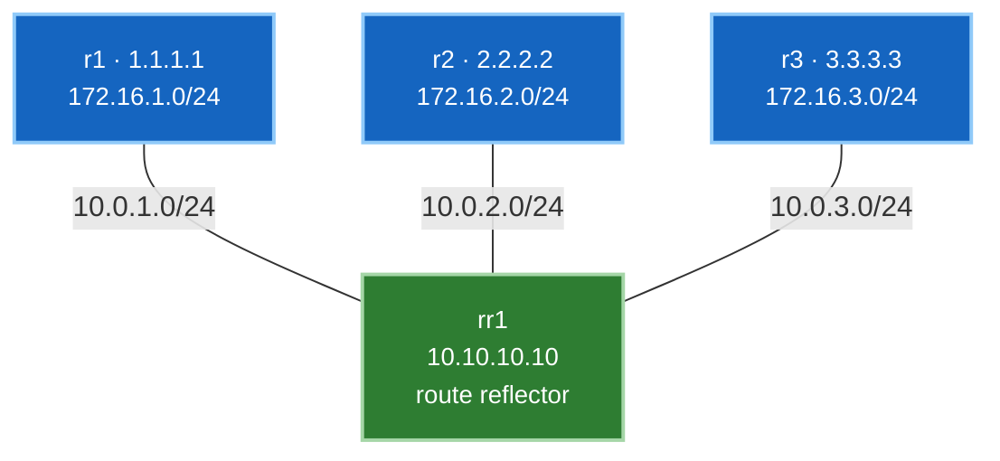

# 🧪 Lab 03 · Route reflectors

> ✅ **Validated** on Arista cEOS 4.32.0F, 2026-08-03. All output captured live.

**Time:** ~45 minutes · **Nodes:** 4

Build an iBGP network that **silently fails to distribute routes**, understand
exactly why, then fix it with one command per neighbour.

---

## What you'll learn

- Why iBGP never re-advertises to another iBGP peer, and what that costs
- How a route reflector breaks that rule safely
- **ORIGINATOR_ID** and **CLUSTER_LIST** — loop prevention without the AS path
- Why route reflection is how every modern fabric is built

---

## Topology



All four routers are in **AS 65001**. Each client advertises one prefix. Every client
peers **only with rr1** — no client-to-client sessions.

---

## Step 1 · Deploy

```yaml title="topology.clab.yml"
name: rr-lab

topology:
  nodes:
    rr1: { kind: arista_ceos, image: ceos:4.32.0F }
    r1:  { kind: arista_ceos, image: ceos:4.32.0F }
    r2:  { kind: arista_ceos, image: ceos:4.32.0F }
    r3:  { kind: arista_ceos, image: ceos:4.32.0F }

  # endpoints MUST be lowercase ethN — cEOS entrypoint counts eth* interfaces
  links:
    - endpoints: ["rr1:eth1", "r1:eth1"]   # 10.0.1.0/24
    - endpoints: ["rr1:eth2", "r2:eth1"]   # 10.0.2.0/24
    - endpoints: ["rr1:eth3", "r3:eth1"]   # 10.0.3.0/24
```

```bash
sudo containerlab deploy -t topology.clab.yml --max-workers 1
```

**Verify:**

```bash
for n in rr1 r1 r2 r3; do
  printf "%-4s " "$n"
  docker exec clab-rr-lab-$n Cli -p 15 -c "show interfaces status" \
    | grep -cE "^Et[0-9].*EbraTestPhyPort"
done
```

```
rr1  3
r1   1
r2   1
r3   1
```

✅ **DONE when** rr1 shows 3 ports and each client shows 1.

---

## Step 2 · OSPF underlay

iBGP peers over loopbacks, so those must be reachable first.

=== "rr1"

    ```
    configure
    ip routing
    service routing protocols model multi-agent
    !
    interface Loopback0
     ip address 10.10.10.10/32
     ip ospf area 0.0.0.0
    !
    interface Ethernet1
     no switchport
     ip address 10.0.1.1/24
     ip ospf area 0.0.0.0
     ip ospf network point-to-point
    !
    interface Ethernet2
     no switchport
     ip address 10.0.2.1/24
     ip ospf area 0.0.0.0
     ip ospf network point-to-point
    !
    interface Ethernet3
     no switchport
     ip address 10.0.3.1/24
     ip ospf area 0.0.0.0
     ip ospf network point-to-point
    !
    router ospf 1
     router-id 10.10.10.10
    ```

=== "r1 (r2, r3 by analogy)"

    ```
    configure
    ip routing
    service routing protocols model multi-agent
    !
    interface Loopback0
     ip address 1.1.1.1/32
     ip ospf area 0.0.0.0
    !
    interface Loopback100
     ip address 172.16.1.1/24
    !
    interface Ethernet1
     no switchport
     ip address 10.0.1.2/24
     ip ospf area 0.0.0.0
     ip ospf network point-to-point
    !
    router ospf 1
     router-id 1.1.1.1
    ```

    For **r2**: loopback `2.2.2.2`, prefix `172.16.2.0/24`, link `10.0.2.2/24`.
    For **r3**: loopback `3.3.3.3`, prefix `172.16.3.0/24`, link `10.0.3.2/24`.

**Verify:**

```bash
docker exec clab-rr-lab-rr1 Cli -p 15 -c "show ip ospf neighbor"
```

```
Neighbor ID     Instance VRF      Pri State   Dead Time   Address     Interface
2.2.2.2         1        default  0   FULL    00:00:37    10.0.2.2    Ethernet2
1.1.1.1         1        default  0   FULL    00:00:32    10.0.1.2    Ethernet1
3.3.3.3         1        default  0   FULL    00:00:30    10.0.3.2    Ethernet3
```

✅ **DONE when** all three neighbours are `FULL`.

---

## Step 3 · Plain iBGP — no reflection yet

Configure this **exactly as written**. It's deliberately incomplete.

=== "rr1"

    ```
    router bgp 65001
     router-id 10.10.10.10
     no bgp default ipv4-unicast
     neighbor 1.1.1.1 remote-as 65001
     neighbor 1.1.1.1 update-source Loopback0
     neighbor 2.2.2.2 remote-as 65001
     neighbor 2.2.2.2 update-source Loopback0
     neighbor 3.3.3.3 remote-as 65001
     neighbor 3.3.3.3 update-source Loopback0
     address-family ipv4
      neighbor 1.1.1.1 activate
      neighbor 2.2.2.2 activate
      neighbor 3.3.3.3 activate
    ```

=== "r1 (r2, r3 by analogy)"

    ```
    router bgp 65001
     router-id 1.1.1.1
     no bgp default ipv4-unicast
     neighbor 10.10.10.10 remote-as 65001
     neighbor 10.10.10.10 update-source Loopback0
     address-family ipv4
      neighbor 10.10.10.10 activate
      network 172.16.1.0/24
    ```

**Verify the sessions:**

```bash
docker exec clab-rr-lab-rr1 Cli -p 15 -c "show ip bgp summary" | tail -4
```

```
  Neighbor V AS           MsgRcvd   MsgSent  InQ OutQ  Up/Down State   PfxRcd PfxAcc
  1.1.1.1  4 65001              5         4    0    0 00:00:24 Estab   1      1
  2.2.2.2  4 65001              5         4    0    0 00:00:20 Estab   1      1
  3.3.3.3  4 65001              5         4    0    0 00:00:20 Estab   1      1
```

Three sessions, all `Estab`, one prefix received from each. Everything looks correct.

✅ **DONE when** all three are `Estab`.

---

## Step 4 · Find the silent failure

The reflector has everything:

```bash
docker exec clab-rr-lab-rr1 Cli -p 15 -c "show ip bgp" | tail -4
```

```
          Network                Next Hop              Metric  LocPref Weight  Path
 * >      172.16.1.0/24          1.1.1.1               0       100     0       i
 * >      172.16.2.0/24          2.2.2.2               0       100     0       i
 * >      172.16.3.0/24          3.3.3.3               0       100     0       i
```

All three prefixes, all valid and best. Now ask a **client**:

```bash
docker exec clab-rr-lab-r1 Cli -p 15 -c "show ip bgp" | tail -2
```

```
          Network                Next Hop              Metric  LocPref Weight  Path
 * >      172.16.1.0/24          -                     -       -       0       i
```

**One prefix — its own.** r1 has no idea r2 and r3 exist.

!!! danger "Nothing is broken, and nothing works"
    Every session is Established. Every prefix was received. No errors, no logs, no
    failed check anywhere. And the network does not distribute routes.

    This is the iBGP rule doing exactly what it's specified to do: **a route learned
    from an iBGP peer is never re-advertised to another iBGP peer.** rr1 learned all
    three prefixes from iBGP peers, so it passes none of them on.

    The rule exists because iBGP doesn't prepend the AS path and therefore can't
    detect loops that way. Without the rule, a route could circulate forever.

The textbook fix is a **full mesh** — every router peering with every other. That's
6 sessions for 4 routers, and 1,225 for 50. It doesn't scale, and every new router
means touching every existing one.

---

## Step 5 · Reflect

One line per neighbour, **on the reflector only**:

```bash
docker exec -i clab-rr-lab-rr1 Cli -p 15 <<'EOF'
configure
router bgp 65001
 address-family ipv4
  neighbor 1.1.1.1 route-reflector-client
  neighbor 2.2.2.2 route-reflector-client
  neighbor 3.3.3.3 route-reflector-client
end
EOF
```

**The clients are not reconfigured.** They don't know they're clients — they're
ordinary iBGP speakers. That's what makes route reflection deployable on a live
network.

**Verify:**

```bash
docker exec clab-rr-lab-r1 Cli -p 15 -c "show ip bgp" | tail -4
```

```
          Network            Next Hop      Metric  LocPref Weight  Path
 * >      172.16.1.0/24      -             -       -       0       i
 * >      172.16.2.0/24      2.2.2.2       0       100     0       i Or-ID: 2.2.2.2 C-LST: 10.10.10.10
 * >      172.16.3.0/24      3.3.3.3       0       100     0       i Or-ID: 3.3.3.3 C-LST: 10.10.10.10
```

All three prefixes. And two new attributes are visible: **`Or-ID`** and **`C-LST`**.

✅ **DONE when** each client sees all three prefixes.

---

## Step 6 · The loop-prevention attributes

```bash
docker exec clab-rr-lab-r1 Cli -p 15 -c "show ip bgp 172.16.2.0/24"
```

```
BGP routing table entry for 172.16.2.0/24
 Paths: 1 available
  Local
    2.2.2.2 from 10.10.10.10 (10.10.10.10)
      Origin IGP, metric 0, localpref 100, IGP metric 30, weight 0, tag 0
      Received 00:00:15 ago, valid, internal, best
      Originator: 2.2.2.2, Cluster list: 10.10.10.10
```

Read the key line carefully:

**`2.2.2.2 from 10.10.10.10 (10.10.10.10)`** — the next hop is **r2**, but the route
was received **from rr1**. The reflector passed it on without inserting itself into
the data path. Traffic goes to r2's address; only the *advertisement* went via the
reflector.

| Attribute | Value | Job |
|---|---|---|
| **Originator** | `2.2.2.2` | router ID of the original advertiser. **A router seeing its own ID here discards the route** — that's how r2 won't re-accept its own prefix. |
| **Cluster list** | `10.10.10.10` | reflectors traversed. **A reflector seeing its own cluster ID discards it** — preventing loops between reflectors. |

Together these replace the AS-path loop detection iBGP doesn't have. Both are
**optional non-transitive**, so they exist only inside the AS and never leak out via
eBGP.

---

## Step 7 · Prove it forwards

```bash
docker exec clab-rr-lab-r1 Cli -p 15 -c "ping 172.16.3.1 source 172.16.1.1 repeat 3"
```

```
--- 172.16.3.1 ping statistics ---
3 packets transmitted, 3 received, 0% packet loss, time 34ms
```

```bash
docker exec clab-rr-lab-r1 Cli -p 15 -c "traceroute 172.16.3.1 source 172.16.1.1"
```

```
traceroute to 172.16.3.1 (172.16.3.1), 30 hops max, 60 byte packets
 1  10.0.1.1 (10.0.1.1)  0.297 ms  0.051 ms  0.032 ms
 2  172.16.3.1 (172.16.3.1)  3.743 ms  3.929 ms  4.097 ms
```

r1 → rr1 → r3. ✅ **DONE.**

!!! note "Control plane and data plane are separate concerns"
    Here the reflector also happens to sit in the data path, because the physical
    topology is a hub and spoke. **That's incidental.**

    A route reflector does *not* have to carry traffic. It's a control-plane
    function, and in large networks reflectors are often dedicated devices — or
    virtual machines — off the forwarding path entirely.

    The `from 10.10.10.10` versus next-hop `2.2.2.2` distinction in step 6 is what
    makes that possible: the advertisement and the traffic take different routes.

---

## Step 8 · Count the saving

Each client has exactly one session:

```bash
docker exec clab-rr-lab-r1 Cli -p 15 -c "show ip bgp summary" | grep -c Estab
```

```
1
```

| Routers | Full mesh | With one RR |
|---|---|---|
| 4 | 6 | **3** |
| 10 | 45 | **9** |
| 50 | 1,225 | **49** |
| 100 | 4,950 | **99** |

Adding a router to a full mesh means configuring it **and every existing router**.
With a reflector it's one session on the new router and one line on the reflector.

---

## Break & observe

Remove client status from r2 and watch reflection stop for that peer:

```bash
docker exec -i clab-rr-lab-rr1 Cli -p 15 <<'EOF'
configure
router bgp 65001
 address-family ipv4
  no neighbor 2.2.2.2 route-reflector-client
end
EOF
```

r2 loses `172.16.1.0/24` and `172.16.3.0/24` — it's now an ordinary iBGP peer, so
rr1 won't reflect to it. r1 and r3 also lose `172.16.2.0/24`, because a route from a
**non-client** is only reflected to clients.

That's the reflection rule table made concrete:

| Learned from | Reflected to |
|---|---|
| **Client** | other clients **and** non-clients |
| **Non-client** | clients only |
| **eBGP** | everyone |

Restore it:

```bash
docker exec -i clab-rr-lab-rr1 Cli -p 15 <<'EOF'
configure
router bgp 65001
 address-family ipv4
  neighbor 2.2.2.2 route-reflector-client
end
EOF
```

---

## Production considerations

**One reflector is a single point of failure** — for the control plane. Existing
routes keep forwarding if it dies, but no new information propagates. Deploy two.

With two, choose cluster IDs deliberately:

- **Same cluster ID** — reflectors ignore each other's reflected routes. Lower
  memory, but clients may lose paths if one session drops.
- **Different cluster IDs** — each treats the other's routes as new. Better
  redundancy and path diversity, more memory and duplicate updates. **The more
  common modern choice.**

**Reflection costs path diversity.** The reflector advertises only *its own* best
path, so clients see one path chosen from the reflector's IGP position rather than
their own — which can be sub-optimal. `add-path` lets it advertise several.

---

## Troubleshooting

| Symptom | Cause |
|---|---|
| Clients see only their own prefix | `route-reflector-client` missing — this lab's step 4 |
| Some clients see routes, others don't | client configured on only some neighbours |
| Route present but unusable | next hop unreachable — check the IGP |
| Routes loop or churn | cluster IDs misconfigured between multiple reflectors |
| Client sees fewer paths than expected | expected — reflectors advertise only best path; consider `add-path` |

---

## Interview questions

??? question "Every iBGP session is Established but clients only see their own routes. Why?"
    A route learned from an iBGP peer is never re-advertised to another iBGP peer.
    The reflector received all prefixes from iBGP peers, so it passes none on. The
    fix is either a full mesh or marking the neighbours as route-reflector clients.

??? question "How does route reflection prevent loops without the AS path?"
    Two optional non-transitive attributes. **ORIGINATOR_ID** carries the original
    advertiser's router ID — a router seeing its own discards the route.
    **CLUSTER_LIST** records reflectors traversed — a reflector seeing its own
    cluster ID discards it. Both stay inside the AS.

??? question "Which routers need reconfiguring to deploy a route reflector?"
    Only the reflector. Clients are ordinary iBGP speakers and don't know they're
    clients — which is precisely why reflection can be introduced incrementally on
    a live network, and why it won out over confederations.

??? question "Does a route reflector have to be in the data path?"
    No. It's a control-plane function. Route reflection changes which routes are
    advertised, not where traffic goes — the next hop still points at the
    originating router. Reflectors are often dedicated devices or VMs off the
    forwarding path.

??? question "Two reflectors — same or different cluster ID?"
    Same means they ignore each other's reflected routes: less memory, fewer paths
    per client. Different means each treats the other's as new: better redundancy
    and diversity, more memory. Different is the more common modern choice, since
    memory is cheaper than an outage.

??? question "What do you lose by using route reflection?"
    Path diversity. A reflector advertises only its own best path, chosen from its
    own IGP position, so clients see fewer options than a full mesh would give and
    may route sub-optimally. `add-path` mitigates it at the cost of memory and
    update volume.

---

## Where you've seen this before

This is not a niche technique — it's how modern fabrics are built:

- **[Phase 4 · EVPN](../04-evpn/lab-01-vxlan-evpn.md)** uses spines as route
  reflectors for the iBGP-EVPN overlay. Leaves peer only with spines. Re-read that
  overlay config now — it's this lab with a different address family.
- **[Phase 3 · MPLS L3VPN](../03-mpls-l3vpn/index.md)** reflects VPNv4 routes
  between PEs identically.

---

## Clean up

```bash
sudo containerlab destroy -t topology.clab.yml
```
