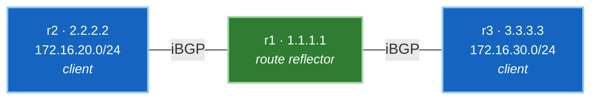

# 🧪 Lab 03 · Route reflectors

> ✅ **Validated** on Arista cEOS 4.32.0F, 2026-08-03. All output captured live.

**Time:** ~45 minutes · **Nodes:** 3 (the same topology as Labs 01 and 02)

Build an iBGP network that **silently fails to distribute routes**, understand
exactly why, then fix it with one command per neighbour.

---

## What you'll learn

- Why iBGP never re-advertises to another iBGP peer, and what that costs
- How a route reflector breaks that rule safely
- **ORIGINATOR_ID** and **CLUSTER_LIST** — loop prevention without the AS path
- Why route reflection is how every modern fabric is built

---

## Topology

The **same three nodes as [Lab 01](lab-01-ebgp-ibgp.md)**, wired identically — but
this time all three are in one AS, and `r1`'s position in the middle makes it the
natural hub.



!!! tip "Hybrid Approach — Script Push or Manual Typing"
    Every lab supports both automated execution and manual line-by-line configuration:

    - **Option A · Automated Script Push (Fast & Error-Free)**:
      ```bash
      ./run.sh 02          # apply + verify step 02 automatically
      ./run.sh --all       # run all steps in order
      ```
    - **Option B · Manual Typing / Copy-Paste (Hands-on Deep Learning)**:
      Interactive CLI shell on any container node:
      ```bash
      docker exec -it clab-bgp-lab-r1 Cli
      r1> enable
      r1# configure
      ```
      Or push individual step snippets using stdin:
      `docker exec -i clab-bgp-lab-r1 Cli -p 15 < steps/lab03-r1-reflector.cfg`

| Device | Role | Loopback | Advertises |
|---|---|---|---|
| **r1** | route reflector | 1.1.1.1 | — |
| **r2** | client | 2.2.2.2 | 172.16.20.0/24 |
| **r3** | client | 3.3.3.3 | 172.16.30.0/24 |

Everything is **AS 65001**. Each client peers only with r1 — there is no
client-to-client session, which is the whole point.

!!! note "Same fabric, different design"
    Labs 01, 02 and 03 all run on `labs/bgp-lab`. Lab 01 splits it across two ASes
    to teach eBGP and iBGP; Lab 02 swaps its IGP; this lab puts everything in one AS
    to teach reflection.

    Redeploy for a clean start rather than un-picking Lab 01's config:

    ```bash
    cd netforge-labs/labs/bgp-lab
    sudo containerlab destroy -t topology.clab.yml
    sudo containerlab deploy -t topology.clab.yml --max-workers 1
    ```

    Note `Ethernet2` **is** in OSPF here. In Lab 01 it faced another AS and was
    deliberately excluded; now it's an internal link like any other.

---

## Step 1 · Deploy

```yaml title="topology.clab.yml"
--8<-- "labs/bgp-lab/topology.clab.yml"
```

```bash
sudo containerlab deploy -t topology.clab.yml --max-workers 1
```

**Verify:**

```bash
./run.sh 01
```

```
  r1   2 ready, 0 unknown
  r2   1 ready, 0 unknown
  r3   1 ready, 0 unknown
  ✅ DONE
```

✅ **DONE when** every port reports a real type, not `Unknown`.

---

## Step 2 · Underlay and plain iBGP

Everything is one AS, so both links go in OSPF and every router peers with r1.
Configure this **exactly as written** — it is deliberately incomplete.

=== "r1 — the hub"

    ```
    --8<-- "labs/bgp-lab/steps/lab03-r1-hub.cfg"
    ```

=== "r2 — client"

    ```
    --8<-- "labs/bgp-lab/steps/lab03-r2-client.cfg"
    ```

=== "r3 — client"

    ```
    --8<-- "labs/bgp-lab/steps/lab03-r3-client.cfg"
    ```

**Verify the underlay:**

```bash
docker exec clab-bgp-lab-r1 Cli -p 15 -c "show ip ospf neighbor"
```

```
Neighbor ID     Instance VRF      Pri State    Dead Time   Address      Interface
3.3.3.3         1        default  0   FULL     00:00:35    10.0.13.3    Ethernet2
2.2.2.2         1        default  0   FULL     00:00:35    10.0.12.2    Ethernet1
```

**Verify the sessions:**

```bash
docker exec clab-bgp-lab-r1 Cli -p 15 -c "show ip bgp summary" | tail -3
```

```
  Neighbor V AS           MsgRcvd   MsgSent  InQ OutQ  Up/Down State   PfxRcd PfxAcc
  2.2.2.2  4 65001              5         4    0    0 00:00:13 Estab   1      1
  3.3.3.3  4 65001              5         4    0    0 00:00:12 Estab   1      1
```

Both `Estab`, one prefix received from each. Everything looks correct.

✅ **DONE when** OSPF is `FULL` on both links and both BGP peers are `Estab`.

---

## Step 3 · Find the silent failure

The hub has everything:

```bash
docker exec clab-bgp-lab-r1 Cli -p 15 -c "show ip bgp" | tail -3
```

```
          Network                Next Hop        Metric  LocPref Weight  Path
 * >      172.16.20.0/24         2.2.2.2         0       100     0       i
 * >      172.16.30.0/24         3.3.3.3         0       100     0       i
```

Both prefixes, both valid and best. Now ask a **client**:

```bash
docker exec clab-bgp-lab-r2 Cli -p 15 -c "show ip bgp" | tail -2
```

```
          Network                Next Hop        Metric  LocPref Weight  Path
 * >      172.16.20.0/24         -               -       -       0       i
```

**One prefix — its own.** r2 has no idea r3 exists.

!!! danger "Nothing is broken, and nothing works"
    Every session is Established. Every prefix was received. No errors, no logs, no
    failed check anywhere. And the network does not distribute routes.

    This is the iBGP rule working exactly as specified: **a route learned from an
    iBGP peer is never re-advertised to another iBGP peer.** r1 learned both
    prefixes from iBGP peers, so it passes neither on.

    The rule exists because iBGP doesn't prepend the AS path and so can't detect
    loops that way. Without it, a route could circulate indefinitely.

The textbook fix is a **full mesh** — every router peering with every other. Three
routers is 3 sessions; fifty is 1,225, and every new router means touching every
existing one. It doesn't scale.

---

## Step 4 · Reflect

One line per neighbour, **on the hub only**:

```
--8<-- "labs/bgp-lab/steps/lab03-r1-reflector.cfg"
```

**The clients are never reconfigured.** They don't know they're clients — they're
ordinary iBGP speakers. That's what makes route reflection deployable on a live
network, and why it beat confederations.

**Verify:**

```bash
docker exec clab-bgp-lab-r2 Cli -p 15 -c "show ip bgp" | tail -3
```

```
          Network            Next Hop    Metric  LocPref Weight  Path
 * >      172.16.20.0/24     -           -       -       0       i
 * >      172.16.30.0/24     3.3.3.3     0       100     0       i Or-ID: 3.3.3.3 C-LST: 1.1.1.1
```

r3's prefix has arrived, carrying two new attributes. The view from r3 is the
mirror image:

```
 * >      172.16.20.0/24     2.2.2.2     0       100     0       i Or-ID: 2.2.2.2 C-LST: 1.1.1.1
 * >      172.16.30.0/24     -           -       -       0       i
```

✅ **DONE when** each client sees both prefixes.

---

## Step 5 · The loop-prevention attributes

```bash
docker exec clab-bgp-lab-r2 Cli -p 15 -c "show ip bgp 172.16.30.0/24"
```

```
BGP routing table entry for 172.16.30.0/24
 Paths: 1 available
  Local
    3.3.3.3 from 1.1.1.1 (1.1.1.1)
      Origin IGP, metric 0, localpref 100, IGP metric 30, weight 0, tag 0
      Received 00:00:17 ago, valid, internal, best
      Originator: 3.3.3.3, Cluster list: 1.1.1.1
```

Read the key line carefully:

**`3.3.3.3 from 1.1.1.1 (1.1.1.1)`** — the next hop is **r3**, but the route was
received **from r1**. The reflector passed it on without inserting itself into the
data path. Traffic goes to r3's address; only the *advertisement* went via r1.

| Attribute | Value | Job |
|---|---|---|
| **Originator** | `3.3.3.3` | router ID of the original advertiser. **A router seeing its own ID here discards the route** — so r3 won't re-accept its own prefix. |
| **Cluster list** | `1.1.1.1` | reflectors traversed. **A reflector seeing its own cluster ID discards it** — preventing loops between reflectors. |

Together these replace the AS-path loop detection iBGP doesn't have. Both are
**optional non-transitive**, so they exist only inside the AS and never leak out
via eBGP.

---

## Step 6 · Prove it forwards

```bash
docker exec clab-bgp-lab-r2 Cli -p 15 -c "ping 172.16.30.1 source 172.16.20.1 repeat 3"
```

```
3 packets transmitted, 3 received, 0% packet loss
```

Each client still has exactly **one** BGP session:

```bash
docker exec clab-bgp-lab-r2 Cli -p 15 -c "show ip bgp summary" | grep -c Estab
```

```
1
```

| Routers | Full mesh | With one RR |
|---|---|---|
| 3 | 3 | **2** |
| 10 | 45 | **9** |
| 50 | 1,225 | **49** |
| 100 | 4,950 | **99** |

✅ **DONE.**

!!! note "Control plane and data plane are separate concerns"
    Here the reflector also sits in the data path, because the topology is a chain
    with r1 in the middle. **That's incidental.**

    A route reflector does *not* have to carry traffic. It's a control-plane
    function, and in large networks reflectors are often dedicated devices — or
    virtual machines — off the forwarding path entirely. The `from 1.1.1.1` versus
    next-hop `3.3.3.3` distinction above is what makes that possible.

---

## Break & observe

Remove client status from r2 and watch reflection stop:

```bash
docker exec -i clab-bgp-lab-r1 Cli -p 15 <<'EOF'
configure
router bgp 65001
 address-family ipv4
  no neighbor 2.2.2.2 route-reflector-client
end
EOF
```

r2 loses `172.16.30.0/24` — it's an ordinary iBGP peer again, so r1 won't reflect to
it. **r3 also loses `172.16.20.0/24`**, because a route from a **non-client** is
only reflected to clients.

That second effect is the reflection rule table made concrete:

| Learned from | Reflected to |
|---|---|
| **Client** | other clients **and** non-clients |
| **Non-client** | clients only |
| **eBGP** | everyone |

Restore:

```bash
docker exec -i clab-bgp-lab-r1 Cli -p 15 <<'EOF'
configure
router bgp 65001
 address-family ipv4
  neighbor 2.2.2.2 route-reflector-client
end
EOF
```

---

## Production considerations

**One reflector is a single point of failure** — for the control plane. Existing
routes keep forwarding if it dies, but no new information propagates. Deploy two.

With two, choose cluster IDs deliberately:

- **Same cluster ID** — reflectors ignore each other's reflected routes. Lower
  memory, but clients may lose paths if one session drops.
- **Different cluster IDs** — each treats the other's routes as new. Better
  redundancy and path diversity, more memory and duplicate updates. **The more
  common modern choice.**

**Reflection costs path diversity.** The reflector advertises only *its own* best
path, so clients see one path chosen from the reflector's IGP position rather than
their own — which can be sub-optimal. `add-path` lets it advertise several.

---

## Troubleshooting

| Symptom | Cause |
|---|---|
| Clients see only their own prefix | `route-reflector-client` missing — this lab's step 3 |
| Some clients see routes, others don't | client configured on only some neighbours |
| Route present but unusable | next hop unreachable — check the IGP |
| Routes loop or churn | cluster IDs misconfigured between multiple reflectors |
| Client sees fewer paths than expected | expected — reflectors advertise only best path |

---

## Interview questions

??? question "Every iBGP session is Established but clients only see their own routes. Why?"
    A route learned from an iBGP peer is never re-advertised to another iBGP peer.
    The reflector received all prefixes from iBGP peers, so it passes none on. The
    fix is either a full mesh or marking the neighbours as route-reflector clients.

??? question "How does route reflection prevent loops without the AS path?"
    Two optional non-transitive attributes. **ORIGINATOR_ID** carries the original
    advertiser's router ID — a router seeing its own discards the route.
    **CLUSTER_LIST** records reflectors traversed — a reflector seeing its own
    cluster ID discards it. Both stay inside the AS.

??? question "Which routers need reconfiguring to deploy a route reflector?"
    Only the reflector. Clients are ordinary iBGP speakers and don't know they're
    clients — which is precisely why reflection can be introduced incrementally on
    a live network, and why it won out over confederations.

??? question "Does a route reflector have to be in the data path?"
    No. It's a control-plane function. Route reflection changes which routes are
    advertised, not where traffic goes — the next hop still points at the
    originating router. Reflectors are often dedicated devices or VMs off the
    forwarding path.

??? question "Two reflectors — same or different cluster ID?"
    Same means they ignore each other's reflected routes: less memory, fewer paths
    per client. Different means each treats the other's as new: better redundancy
    and diversity, more memory. Different is the more common modern choice, since
    memory is cheaper than an outage.

??? question "What do you lose by using route reflection?"
    Path diversity. A reflector advertises only its own best path, chosen from its
    own IGP position, so clients see fewer options than a full mesh would give and
    may route sub-optimally. `add-path` mitigates it at the cost of memory and
    update volume.

---

## Where you've seen this before

This is not a niche technique — it's how modern fabrics are built:

- **[Phase 4 · EVPN](../04-evpn/lab-01-vxlan-evpn.md)** uses spines as route
  reflectors for the iBGP-EVPN overlay. Leaves peer only with spines. Re-read that
  overlay config now — it's this lab with a different address family.
- **[Phase 3 · MPLS L3VPN](../03-mpls-l3vpn/index.md)** reflects VPNv4 routes
  between PEs identically.

---

## 🧠 Google Network Infra Knowledge Sharing

> [!NOTE]
> ### Production Deep Dive & Hyperscale Architecture
>
> 1. **iBGP Scaling Math & Full-Mesh Limits**:
>    - A full mesh requires \(\frac{N(N-1)}{2}\) TCP sessions. At Google scale (1,000+ switches in a single cluster fabric), a full mesh requires ~500,000 BGP sessions, which would exhaust memory and CPU resources.
>    - Route Reflectors reduce session count to \(2 \times N\) (dual redundant RRs per cluster), reducing BGP control plane overhead by 99%+.
>
> 2. **Loop Prevention: `ORIGINATOR_ID` & `CLUSTER_LIST`**:
>    - Since `AS_PATH` is not modified across iBGP sessions, Route Reflectors introduce two optional non-transitive attributes:
>      - **`ORIGINATOR_ID`**: Set to the Router ID of the originating iBGP speaker. If a router receives a route with its own `ORIGINATOR_ID`, it drops the update.
>      - **`CLUSTER_LIST`**: Sequence of Cluster IDs traversed. If an RR receives a route containing its own Cluster ID, it drops the update.
>
> 3. **Leaf-Spine Fabrics (cEOS EVPN / IP Core)**:
>    - Spines act as Control-Plane Route Reflectors for all Leaf VTEPs.
>    - Leaf switches only peer with the Spine RRs, eliminating the need for Leaf-to-Leaf iBGP sessions. The Spines remain out of tenant VRF data-plane encapsulation while reflecting EVPN Type-2/Type-3/Type-5 routes.

---

## Clean up

```bash
sudo containerlab destroy -t topology.clab.yml
```
