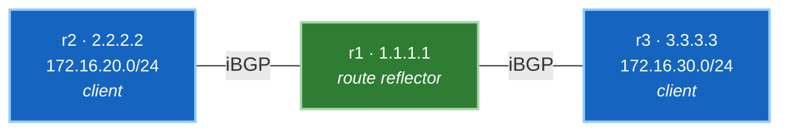

# 🧪 Lab 03 · Route Reflectors များ

> ✅ **Validated** on Arista cEOS 4.32.0F, 2026-08-03. ဖော်ပြထားသော output အားလုံးကို live fabric မှ တိုက်ရိုက်ဖမ်းယူထားပါသည်။

**ကြာမြင့်ချိန်:** ~၄၅ မိနစ် · **Nodes အရေအတွက်:** ၃ ခု (Lab 01 နှင့် 02 နှင့် တူညီသော topology)

Routes များကို **အသံတိတ် မဖြန့်ဝေနိုင်ဘဲ ချို့ယွင်းနေသော** iBGP ကွန်ရက်တစ်ခုကို တည်ဆောက်ပါမည်၊ အဘယ်ကြောင့် ဤသို့ဖြစ်ရသည်ကို တိကျစွာ နားလည်သဘောပေါက်စေပါမည်၊ ထို့နောက် Neighbour တစ်ခုစီအတွက် command တစ်ကြောင်းတည်းဖြင့် အောင်မြင်စွာ ပြင်ဆင်သွားပါမည်။

---

## သင်ယူလေ့လာရမည့် အချက်များ

- iBGP သည် အခြား iBGP peer တစ်ခုထံသို့ routes များကို အဘယ်ကြောင့် ဘယ်တော့မှ ပြန်လည်မကြေညာသနည်း၊ ၎င်းကြောင့် မည်သည့်အရာများ ပေးဆပ်ရသနည်း
- Route reflector တစ်ခုသည် ထိုစည်းမျဉ်းကို ဘေးကင်းလုံခြုံစွာ မည်သို့ ချိုးဖောက်ကျော်လွှားသနည်း
- **ORIGINATOR_ID** နှင့် **CLUSTER_LIST** — AS path မပါရှိဘဲ loop ကာကွယ်ရေး ယန္တရား
- ခေတ်သစ် fabric တိုင်းကို Route reflection ဖြင့် အဘယ်ကြောင့် တည်ဆောက်ထားကြသနည်း

---

## Topology အခင်းအကျင်း

**[Lab 01](lab-01-ebgp-ibgp.md) နှင့် တူညီသော nodes ၃ ခု** ဖြစ်ပြီး ချိတ်ဆက်ထားပုံ ထပ်တူညီပါသည် — သို့သော် ယခုတစ်ကြိမ်တွင် nodes ၃ ခုစလုံးသည် AS တစ်ခုတည်းအတွင်း၌ ရှိနေကြပြီး အလယ်တွင်ရှိသော `r1` သည် သဘာဝကျသော ဗဟို hub အဖြစ် တည်ရှိသည်။



!!! tip "အမြန်စတင်ရန် လမ်းညွှန် (တည်နေရာ: `labs/bgp-lab/`)"
    **အဆင့် ၁ · Lab Fabric ကို စတင်လည်ပတ်ပါ (မ run ရသေးပါက)**
    ```bash
    cd labs/bgp-lab
    sudo containerlab deploy -t topology.clab.yml --max-workers 1
    ```

    **အဆင့် ၂ · သီးသန့် Lab 03 Walkthrough ကို စတင်ပါ**
    ```bash
    ./run.sh --lab03
    ```

    ??? note "အခြား ရွေးချယ်နိုင်သော နည်းလမ်းများ (Manual CLI)"
        - **Manual Line-by-Line CLI ဖြင့် လုပ်ဆောင်ခြင်း**:
          Container node ပေါ်တွင် တိုက်ရိုက် interactive CLI shell ဖွင့်ရန်:
          ```bash
          docker exec -it clab-bgp-lab-r1 Cli
          ```
          သို့မဟုတ် အဆင့်တစ်ခုချင်းစီ၏ config snippet များကို stdin မှတစ်ဆင့် ပေးပို့ရန်:
          `docker exec -i clab-bgp-lab-r1 Cli -p 15 < steps/lab03-r1-reflector.cfg`

| Device | အခန်းကဏ္ဍ (Role) | Loopback | ကြေညာမည့် Prefixes (Advertises) |
|---|---|---|---|
| **r1** | Route reflector | 1.1.1.1 | — |
| **r2** | Client | 2.2.2.2 | 172.16.20.0/24 |
| **r3** | Client | 3.3.3.3 | 172.16.30.0/24 |

အားလုံးသည် **AS 65001** အတွင်း၌ ရှိသည်။ Client တစ်ခုစီသည် r1 နှင့်သာ peer ဖွဲ့ကြသည် — Client အချင်းချင်းကြား session မရှိပါ၊ ၎င်းမှာ အဓိက အချက်ဖြစ်ပါသည်။

!!! note "တူညီသော Fabric၊ မတူညီသော ဒီဇိုင်း"
    Labs 01, 02 နှင့် 03 အားလုံးသည် `labs/bgp-lab` ပေါ်တွင် run ကြသည်။ Lab 01 သည် eBGP နှင့် iBGP ကို သင်ကြားရန် ASes နှစ်ခု ခွဲခြားထားသည်; Lab 02 သည် IGP ကို လဲလှယ်သည်; ဤ lab ကမူ Reflection ကို သင်ကြားရန် အရာအားလုံးကို AS တစ်ခုတည်းတွင် ထည့်သွင်းထားသည်။

    Lab 01 ၏ config များကို တစ်ခုချင်း လိုက်ဖြုတ်နေမည့်အစား အစမှ သန့်ရှင်းစွာ ပြန်လည် deploy လုပ်ပါ -

    ```bash
    cd labs/bgp-lab
    sudo containerlab destroy -t topology.clab.yml
    sudo containerlab deploy -t topology.clab.yml --max-workers 1
    ```

    ဤနေရာတွင် `Ethernet2` သည် OSPF ထဲတွင် **ပါဝင်နေသည်** ကို သတိပြုပါ။ Lab 01 တွင် ၎င်းသည် အခြား AS ဘက်သို့ မျက်နှာမူထားသဖြင့် တမင် ချန်လှပ်ထားခဲ့သော်လည်း; ယခုအခါ အခြား links များကဲ့သို့ internal link တစ်ခုသာ ဖြစ်သည်။

---

## အဆင့် ၁ · Deploy ပြုလုပ်ခြင်း

```yaml title="topology.clab.yml"
--8<-- "labs/bgp-lab/topology.clab.yml"
```

```bash
sudo containerlab deploy -t topology.clab.yml --max-workers 1
```

**စစ်ဆေးအတည်ပြုခြင်း:**

```bash
./run.sh 01
```

```
  r1   2 ready, 0 unknown
  r2   1 ready, 0 unknown
  r3   1 ready, 0 unknown
  ✅ DONE
```

✅ Port တိုင်းသည် `Unknown` မဟုတ်ဘဲ အစစ်အမှန် type ပြသနေပါက **ပြီးမြောက်ပါပြီ**။

---

## အဆင့် ၂ · Underlay နှင့် သာမန် iBGP တည်ဆောက်ခြင်း

အရာအားလုံးသည် AS တစ်ခုတည်းဖြစ်သောကြောင့် links နှစ်ခုစလုံးသည် OSPF ထဲသို့ ရောက်ရှိပြီး router တိုင်းသည် r1 နှင့် peer ဖွဲ့ကြသည်။
ဤအဆင့်ကို **ရေးသားထားသည့်အတိုင်း အတိအကျ** configure လုပ်ပါ — ၎င်းသည် ရည်ရွယ်ချက်ရှိရှိ မပြည့်စုံသေးဘဲ ချန်ထားခြင်း ဖြစ်သည်။

=== "r1 — the hub"

    ```
    --8<-- "labs/bgp-lab/steps/lab03-r1-hub.cfg"
    ```

=== "r2 — client"

    ```
    --8<-- "labs/bgp-lab/steps/lab03-r2-client.cfg"
    ```

=== "r3 — client"

    ```
    --8<-- "labs/bgp-lab/steps/lab03-r3-client.cfg"
    ```

**Underlay ကို စစ်ဆေးခြင်း:**

```bash
docker exec clab-bgp-lab-r1 Cli -p 15 -c "show ip ospf neighbor"
```

```
Neighbor ID     Instance VRF      Pri State    Dead Time   Address      Interface
3.3.3.3         1        default  0   FULL     00:00:35    10.0.13.3    Ethernet2
2.2.2.2         1        default  0   FULL     00:00:35    10.0.12.2    Ethernet1
```

**Sessions များကို စစ်ဆေးခြင်း:**

```bash
docker exec clab-bgp-lab-r1 Cli -p 15 -c "show ip bgp summary" | tail -3
```

```
  Neighbor V AS           MsgRcvd   MsgSent  InQ OutQ  Up/Down State   PfxRcd PfxAcc
  2.2.2.2  4 65001              5         4    0    0 00:00:13 Estab   1      1
  3.3.3.3  4 65001              5         4    0    0 00:00:12 Estab   1      1
```

နှစ်ခုစလုံး `Estab` ဖြစ်ပြီး တစ်ခုစီထံမှ prefix တစ်ခုစီ ရရှိထားသည်။ အရာအားလုံး မှန်ကန်နေပုံရသည်။

✅ Links နှစ်ခုစလုံးတွင် OSPF သည် `FULL` ဖြစ်ပြီး BGP peers နှစ်ခုစလုံး `Estab` ဖြစ်နေပါက **ပြီးမြောက်ပါပြီ**။

---

## အဆင့် ၃ · အသံတိတ် ချို့ယွင်းချက်ကို ရှာဖွေဖော်ထုတ်ခြင်း

ဗဟို Hub ဖြစ်သော r1 တွင် အရာအားလုံး ရှိနေသည် -

```bash
docker exec clab-bgp-lab-r1 Cli -p 15 -c "show ip bgp" | tail -3
```

```
          Network                Next Hop        Metric  LocPref Weight  Path
 * >      172.16.20.0/24         2.2.2.2         0       100     0       i
 * >      172.16.30.0/24         3.3.3.3         0       100     0       i
```

Prefix နှစ်ခုစလုံး ရှိနေပြီး နှစ်ခုစလုံး valid and best ဖြစ်သည်။ ယခု **Client တစ်ခုဖြစ်သော r2** ထံ မေးမြန်းကြည့်ပါ -

```bash
docker exec clab-bgp-lab-r2 Cli -p 15 -c "show ip bgp" | tail -2
```

```
          Network                Next Hop        Metric  LocPref Weight  Path
 * >      172.16.20.0/24         -               -       -       0       i
```

**Prefix တစ်ခုတည်းသာ ရှိသည် — ၎င်း၏ ကိုယ်ပိုင် prefix သာလျှင်။** r2 သည် r3 ရှိနေသည်ကို လုံးဝ မသိရှိပေ။

!!! danger "ဘာမှ ပျက်စီးမနေပါ၊ သို့သော် ဘာမှ အလုပ်မလုပ်ပါ"
    Session တိုင်းသည် Established ဖြစ်နေသည်။ Prefix တိုင်းကို လက်ခံရရှိထားသည်။ မည်သည့်နေရာတွင်မျှ errors မရှိ၊ logs မရှိ၊ ကျရှုံးနေသော စစ်ဆေးမှု မရှိပါ။ သို့သော် ကွန်ရက်သည် routes များကို အချင်းချင်းကြား ဖြန့်ဝေပေးခြင်း မရှိပေ။

    ၎င်းသည် iBGP စည်းမျဉ်းအတိုင်း တိကျစွာ အလုပ်လုပ်နေခြင်း ဖြစ်သည်- **iBGP peer တစ်ခုထံမှ သင်ယူရရှိသော route ကို အခြား iBGP peer တစ်ခုထံ ဘယ်တော့မှ ထပ်မံ မကြေညာရ။** r1 သည် prefixes နှစ်ခုစလုံးကို iBGP peers များထံမှ သင်ယူခဲ့သဖြင့် မည်သည့် prefix ကိုမျှ အခြားသူထံ လက်ဆင့်ကမ်းခြင်း မပြုခဲ့ခြင်း ဖြစ်သည်။

    iBGP သည် AS path ကို prepend မလုပ်သောကြောင့် path-based loop detection မသုံးနိုင်သဖြင့် ဤစည်းမျဉ်း တည်ရှိနေရခြင်း ဖြစ်သည်။ ဤစည်းမျဉ်း မရှိပါက route သည် အဆုံးမရှိ လှည့်ပတ်နေပေလိမ့်မည်။

စာအုပ်များထဲမှ ဖြေရှင်းနည်းမှာ **Full Mesh** ဖြစ်သည် — Router တိုင်းသည် အခြား router တိုင်းနှင့် peer ဖွဲ့ရမည်။ Router ၃ ခုတွင် ၃ sessions ဖြစ်သော်လည်း; Router ၅၀ တွင် ၁,၂၂၅ sessions ဖြစ်လာပြီး router အသစ်တစ်ခု တိုးတိုင်း ရှိပြီးသား router တိုင်းကို ပြင်ဆင်ရမည် ဖြစ်သည်။ ၎င်းသည် scale မလုပ်နိုင်ပါ။

---

## အဆင့် ၄ · Route Reflection ကို အသုံးပြုခြင်း

Neighbour တစ်ခုစီအတွက် တစ်ကြောင်းတည်းသာ သတ်မှတ်ရမည်ဖြစ်ပြီး **Hub ဖြစ်သော r1 ပေါ်တွင်သာ သတ်မှတ်ရမည်**:

```
--8<-- "labs/bgp-lab/steps/lab03-r1-reflector.cfg"
```

**Clients များကို လုံးဝ ပြန်လည်ပြင်ဆင်ရန် မလိုပါ။** ၎င်းတို့သည် မိမိတို့ကိုယ်ကို clients ဖြစ်မှန်းပင် မသိကြပါ — သာမန် iBGP speakers များသာ ဖြစ်ကြသည်။ ဤအချက်ကြောင့်ပင် Route reflection ကို လက်တွေ့လည်ပတ်နေသော ကွန်ရက်ပေါ်တွင် အဆင့်ဆင့် ဖြန့်ကျက်နိုင်ပြီး Confederations ထက် သာလွန်အနိုင်ရခဲ့ခြင်း ဖြစ်သည်။

**စစ်ဆေးအတည်ပြုခြင်း:**

```bash
docker exec clab-bgp-lab-r2 Cli -p 15 -c "show ip bgp" | tail -3
```

```
          Network            Next Hop    Metric  LocPref Weight  Path
 * >      172.16.20.0/24     -           -       -       0       i
 * >      172.16.30.0/24     3.3.3.3     0       100     0       i Or-ID: 3.3.3.3 C-LST: 1.1.1.1
```

r3 ၏ prefix ရောက်ရှိလာပြီး attributes အသစ် ၂ ခု ပါဝင်လာသည်ကို တွေ့ရသည်။ r3 ဘက်မှ ကြည့်လျှင်လည်း အပြန်အလှန် အလားတူ မြင်တွေ့ရသည် -

```
 * >      172.16.20.0/24     2.2.2.2     0       100     0       i Or-ID: 2.2.2.2 C-LST: 1.1.1.1
 * >      172.16.30.0/24     -           -       -       0       i
```

✅ Client တစ်ခုစီတွင် prefixes နှစ်ခုစလုံး မြင်တွေ့ရပါက **ပြီးမြောက်ပါပြီ**။

---

## အဆင့် ၅ · Loop-Prevention Attributes များကို လေ့လာခြင်း

```bash
docker exec clab-bgp-lab-r2 Cli -p 15 -c "show ip bgp 172.16.30.0/24"
```

```
BGP routing table entry for 172.16.30.0/24
 Paths: 1 available
  Local
    3.3.3.3 from 1.1.1.1 (1.1.1.1)
      Origin IGP, metric 0, localpref 100, IGP metric 30, weight 0, tag 0
      Received 00:00:17 ago, valid, internal, best
      Originator: 3.3.3.3, Cluster list: 1.1.1.1
```

အဓိက စာကြောင်းကို သေချာစွာ ဖတ်ရှုပါ -

**`3.3.3.3 from 1.1.1.1 (1.1.1.1)`** — Next hop သည် **r3** ဖြစ်သည်၊ သို့သော် route ကို **r1 ထံမှ** လက်ခံရရှိခဲ့သည်။ Reflector သည် မိမိကိုယ်ကို data path ထဲသို့ ထည့်သွင်းခြင်းမပြုဘဲ route ကို ဆက်လက်လက်ဆင့်ကမ်းပေးခဲ့သည်။ Traffic သည် r3 ၏ address ဆီသို့ တိုက်ရိုက်သွားမည် ဖြစ်ပြီး; *Route ကြေညာချက်* သာလျှင် r1 မှတစ်ဆင့် သွားခဲ့ခြင်း ဖြစ်သည်။

| Attribute | တန်ဖိုး | တာဝန် |
|---|---|---|
| **Originator** | `3.3.3.3` | မူလ စတင်ကြေညာခဲ့သော router ၏ router ID ဖြစ်သည်။ **Router တစ်ခုသည် ဤနေရာတွင် မိမိကိုယ်ပိုင် ID ကို တွေ့ပါက route ကို ပယ်ဖျက်သည်** — ထို့ကြောင့် r3 သည် မိမိကိုယ်ပိုင် prefix ကို အခြားသူထံမှ ပြန်လည်လက်မခံတော့ပေ။ |
| **Cluster list** | `1.1.1.1` | ဖြတ်သန်းခဲ့သော reflectors စာရင်းဖြစ်သည်။ **Reflector တစ်ခုသည် ဤနေရာတွင် မိမိကိုယ်ပိုင် cluster ID ကို တွေ့ပါက ပယ်ဖျက်သည်** — Reflectors အချင်းချင်းကြား loops မဖြစ်အောင် ကာကွယ်ပေးသည်။ |

ဤ attributes နှစ်ခု ပေါင်းစပ်၍ iBGP တွင် မရှိသော AS-path loop detection ကို အစားထိုးပေးသည်။ နှစ်ခုစလုံးသည် **Optional non-transitive** ဖြစ်သောကြောင့် AS အတွင်း၌သာ တည်ရှိပြီး eBGP မှတစ်ဆင့် ပြင်ပသို့ ဘယ်တော့မှ မထွက်ခွာပါ။

---

## အဆင့် ၆ · Forwarding အမှန်တကယ် အလုပ်လုပ်ကြောင်း သက်သေပြခြင်း

```bash
docker exec clab-bgp-lab-r2 Cli -p 15 -c "ping 172.16.30.1 source 172.16.20.1 repeat 3"
```

```
3 packets transmitted, 3 received, 0% packet loss
```

Client တစ်ခုစီတွင် BGP session တိတိကျကျ **တစ်ခုတည်းသာ** ရှိနေဆဲ ဖြစ်သည် -

```bash
docker exec clab-bgp-lab-r2 Cli -p 15 -c "show ip bgp summary" | grep -c Estab
```

```
1
```

| Routers အရေအတွက် | Full Mesh တွင် လိုအပ်သော Sessions | Route Reflector ၁ ခုဖြင့် လိုအပ်သော Sessions |
|---|---|---|
| ၃ | ၃ | **၂** |
| ၁၀ | ၄၅ | **၉** |
| ၅၀ | ၁,၂၂၅ | **၄၉** |
| ၁၀၀ | ၄,၉၅၀ | **၉၉** |

✅ **ပြီးမြောက်ပါပြီ။**

!!! note "Control Plane နှင့် Data Plane သည် သီးခြားစီ ဖြစ်သည်"
    ဤ lab တွင် topology သည် r1 အလယ်တွင်ရှိသော ကွင်းဆက်ဖြစ်နေသဖြင့် reflector သည် data path ထဲတွင်လည်း မတော်တဆ ပါဝင်နေခြင်း ဖြစ်သည်။ **၎င်းသည် မတော်တဆ တိုက်ဆိုင်မှုသာ ဖြစ်သည်။**

    Route reflector သည် data traffic များကို သယ်ဆောင်ပေးရန် *မလိုအပ်ပါ*။ ၎င်းသည် Control-plane လုပ်ဆောင်ချက်သက်သက်သာဖြစ်ပြီး ကြီးမားသော ကွန်ရက်ကြီးများတွင် reflectors များသည် forwarding path ပြင်ပရှိ သီးသန့် servers များ သို့မဟုတ် virtual machines များ ဖြစ်လေ့ရှိသည်။ အထက်ပါ output ရှိ `from 1.1.1.1` နှင့် next-hop `3.3.3.3` ခွဲခြားထားမှုက ၎င်းကို ဖြစ်နိုင်စေခြင်း ဖြစ်သည်။

---

## ချို့ယွင်းချက် ဖန်တီး၍ စောင့်ကြည့်လေ့လာခြင်း (Break & observe)

r1 ပေါ်တွင် r2 အား client အဆင့်အတန်းမှ ဖယ်ရှားလိုက်ပြီး reflection ရပ်တန့်သွားပုံကို စောင့်ကြည့်ပါ -

```bash
docker exec -i clab-bgp-lab-r1 Cli -p 15 <<'EOF'
configure
router bgp 65001
 address-family ipv4
  no neighbor 2.2.2.2 route-reflector-client
end
EOF
```

r2 သည် `172.16.30.0/24` ကို ဆုံးရှုံးသွားသည် — ၎င်းသည် သာမန် iBGP peer အဖြစ် ပြန်ရောက်သွားသဖြင့် r1 က ၎င်းထံ မပို့တော့ပေ။ **r3 သည်လည်း `172.16.20.0/24` ကို ဆုံးရှုံးသွားသည်**၊ အကြောင်းမှာ **Non-client** ထံမှ ရရှိသော route ကို clients များထံသို့သာ ပြန်လည်ပို့ပေးသောကြောင့် ဖြစ်သည်။

ထိုဒုတိယအကျိုးဆက်သည် reflection စည်းမျဉ်းဇယားကို လက်တွေ့ကျကျ သက်သေပြနေခြင်း ဖြစ်သည် -

| သင်ယူရရှိသော နေရာ | မည်သူ့ထံ ပြန်လည် ထင်ဟပ်ကြေညာပေးသနည်း (Reflected to) |
|---|---|
| **Client** | အခြား clients များ **နှင့်** Non-clients များထံသို့ |
| **Non-client** | Clients များထံသို့သာလျှင် |
| **eBGP** | လူတိုင်းထံသို့ |

ပြန်လည် ပြင်ဆင်ပါ -

```bash
docker exec -i clab-bgp-lab-r1 Cli -p 15 <<'EOF'
configure
router bgp 65001
 address-family ipv4
  neighbor 2.2.2.2 route-reflector-client
end
EOF
```

---

## Production ကွန်ရက်များအတွက် စဉ်းစားစရာများ

**Reflector တစ်လုံးတည်း ထားရှိခြင်းသည် Single point of failure ဖြစ်သည်** — Control plane အတွက် ဖြစ်သည်။ ၎င်းပျက်စီးသွားသော်လည်း ရှိပြီးသား routes များသည် forward လုပ်နေဆဲဖြစ်သော်လည်း အချက်အလက်အသစ်များ မပျံ့နှံ့နိုင်တော့ပေ။ ထို့ကြောင့် အနည်းဆုံး နှစ်လုံး ထားရှိပါ။

နှစ်လုံးထားရှိသည့်အခါ Cluster IDs ကို စဉ်းစားရွေးချယ်ပါ -

- **တူညီသော Cluster ID** — Reflectors များသည် တစ်ခု၏ routes ကို အခြားတစ်ခုက လျစ်လျူရှုသည်။ Memory သက်သာသော်လည်း session တစ်ခုပြုတ်ကျပါက clients များ paths ဆုံးရှုံးနိုင်သည်။
- **မတူညီသော Cluster IDs** — တစ်ခု၏ routes ကို အခြားတစ်ခုက အသစ်အဖြစ် မှတ်ယူသည်။ ပိုမိုကောင်းမွန်သော redundancy နှင့် path diversity ကို ရရှိစေသည်။ **ခေတ်သစ်တွင် ပိုမိုရွေးချယ်ကြသည်။**

**Reflection ကြောင့် Path diversity ဆုံးရှုံးရသည်။** Reflector သည် ၎င်း၏ *ကိုယ်ပိုင်* best path တစ်ခုတည်းကိုသာ ကြေညာသဖြင့် clients များသည် reflector ၏ IGP အနေအထားမှ ရွေးချယ်ထားသော လမ်းကြောင်းတစ်ခုတည်းကိုသာ မြင်ရသည် — ယင်းသည် အကောင်းဆုံး မဟုတ်သော sub-optimal routing ဖြစ်စေနိုင်သည်။ `add-path` က paths များစွာ ကြေညာခွင့်ပေးနိုင်သည်။

---

## ပြဿနာဖြေရှင်းခြင်း လမ်းညွှန် (Troubleshooting)

| ရောဂါလက္ခဏာ | ဖြစ်ပွားရသည့် အကြောင်းရင်း |
|---|---|
| Clients များသည် မိမိကိုယ်ပိုင် prefix ကိုသာ မြင်ရခြင်း | `route-reflector-client` ကျန်ခဲ့ခြင်း — ဤ lab ၏ အဆင့် ၃ |
| အချို့ clients များ route တွေ့ပြီး အချို့ မတွေ့ရခြင်း | Neighbours အချို့တွင် client သတ်မှတ်ရန် ကျန်ခဲ့ခြင်း |
| Route ရှိသော်လည်း အသုံးမပြုနိုင်ခြင်း | Next hop မရောက်ရှိနိုင်ခြင်း — IGP ကို စစ်ဆေးပါ |
| Routes များ loop ဖြစ်ခြင်း သို့မဟုတ် churn ဖြစ်ခြင်း | Reflectors များကြား Cluster IDs မှားယွင်းစွာ သတ်မှတ်မိခြင်း |
| Client တွင် မျှော်လင့်ထားသည်ထက် paths နည်းပါးနေခြင်း | ပုံမှန်ဖြစ်သည် — Reflectors သည် best path တစ်ခုတည်းကိုသာ ကြေညာသောကြောင့် ဖြစ်သည် |

---

## အင်တာဗျူး မေးခွန်းများ (Interview questions)

??? question "iBGP session တိုင်း Established ဖြစ်သော်လည်း clients များသည် မိမိကိုယ်ပိုင် routes များကိုသာ တွေ့နေရသည်။ အဘယ်ကြောင့်နည်း။"
    iBGP peer ထံမှ သင်ယူရရှိသော route ကို အခြား iBGP peer ထံ ဘယ်တော့မှ ထပ်မံ မကြေညာသောကြောင့် ဖြစ်သည်။ Reflector သည် prefixes အားလုံးကို iBGP peers များထံမှ ရရှိခဲ့သဖြင့် မည်သည့်အရာကိုမျှ ဆက်လက်မပို့ခြင်း ဖြစ်သည်။ ပြင်ဆင်ရန်နည်းလမ်းမှာ full mesh ပြုလုပ်ခြင်း သို့မဟုတ် neighbours များကို route-reflector clients များအဖြစ် သတ်မှတ်ပေးခြင်း ဖြစ်သည်။

??? question "Route reflection သည် AS path မပါရှိဘဲ Loops မဖြစ်အောင် မည်သို့ ကာကွယ်သနည်း။"
    Optional non-transitive attributes နှစ်ခုဖြင့် ကာကွယ်သည်။ **ORIGINATOR_ID** သည် မူလ စတင်ကြေညာသူ၏ router ID ဖြစ်ပြီး — Router တစ်ခုသည် မိမိကိုယ်ပိုင် ID ကို တွေ့ပါက route ကို ပယ်ဖျက်သည်။ **CLUSTER_LIST** သည် ဖြတ်သန်းခဲ့သော reflectors စာရင်းဖြစ်ပြီး — Reflector သည် မိမိကိုယ်ပိုင် cluster ID ကို တွေ့ပါက ပယ်ဖျက်သည်။ နှစ်ခုစလုံးသည် AS အတွင်း၌သာ ရှိနေသည်။

??? question "Route reflector တစ်ခု ဖြန့်ကျက်ရန် မည်သည့် routers များကို ပြန်လည် configure လုပ်ရမည်နည်း။"
    Reflector ကိုယ်တိုင်ကိုသာ ပြင်ဆင်ရန် လိုအပ်သည်။ Clients များသည် သာမန် iBGP speakers များသာဖြစ်ပြီး မိမိတို့ကိုယ်ကို clients ဖြစ်မှန်းပင် မသိကြပါ — ယင်းကြောင့်ပင် Reflection ကို live network တွင် အဆင့်ဆင့် အနှောင့်အယှက်မရှိ ထည့်သွင်းနိုင်ပြီး Confederations ထက် သာလွန်အနိုင်ရခဲ့ခြင်း ဖြစ်သည်။

??? question "Route reflector သည် Data path ထဲတွင် မဖြစ်မနေ ပါဝင်နေရမည်လား။"
    မလိုအပ်ပါ။ ၎င်းသည် Control-plane လုပ်ဆောင်ချက်သက်သက်သာ ဖြစ်သည်။ Route reflection သည် မည်သည့် route ကို ကြေညာမည်ကိုသာ ပြောင်းလဲပေးခြင်းဖြစ်ပြီး traffic သွားရာ လမ်းကြောင်းကို မပြောင်းလဲပါ — Next hop သည် မူလ router ကို ဆက်လက်ညွှန်ပြနေသည်။ Reflectors များသည် forwarding path ပြင်ပရှိ သီးသန့် devices များ သို့မဟုတ် VMs များ ဖြစ်လေ့ရှိသည်။

??? question "Reflectors နှစ်လုံး ထားရှိသည့်အခါ Cluster ID တူညီသင့်သလား သို့မဟုတ် မတူညီသင့်သလား။"
    တူညီပါက တစ်ခုနှင့်တစ်ခု လျစ်လျူရှုသဖြင့် memory သက်သာပြီး client တစ်ခုလျှင် paths နည်းသည်။ မတူညီပါက အချင်းချင်း အသစ်အဖြစ် မှတ်ယူသဖြင့် redundancy ပိုကောင်းပြီး diversity ရရှိကာ memory ပိုမိုသုံးစွဲသည်။ ခေတ်သစ်တွင် မတူညီသော Cluster IDs ကို ပိုမိုရွေးချယ်ကြသည်၊ အကြောင်းမှာ outage ဖြစ်ခြင်းထက် memory ကုန်ကျမှုက ပိုမိုသက်သာသောကြောင့် ဖြစ်သည်။

??? question "Route reflection ကို အသုံးပြုခြင်းဖြင့် မည်သည့်အရာ ဆုံးရှုံးရသနည်း။"
    Path diversity (လမ်းကြောင်း ကွဲပြားစုံလင်မှု) ဆုံးရှုံးရသည်။ Reflector သည် ၎င်း၏ ကိုယ်ပိုင် IGP အနေအထားမှ ရွေးချယ်ထားသော best path တစ်ခုတည်းကိုသာ ကြေညာသောကြောင့် clients များသည် full mesh ထက် ရွေးချယ်စရာ နည်းပါးသွားပြီး sub-optimal routing ဖြစ်စေနိုင်သည်။ `add-path` က paths များစွာ ကြေညာခွင့်ပေးခြင်းဖြင့် ဖြေရှင်းနိုင်သည်။

---

## ဤနည်းပညာကို ယခင်က မည်သည့်နေရာတွင် တွေ့ခဲ့ဖူးသနည်း

၎င်းသည် သီးခြားနည်းပညာတစ်ခု မဟုတ်ပါ — ခေတ်သစ် fabric တိုင်းကို ဤနည်းလမ်းဖြင့် တည်ဆောက်ထားခြင်း ဖြစ်သည် -

- **[Phase 4 · EVPN](../04-evpn/lab-01-pure-l2vni.md)** တွင် spines များကို iBGP-EVPN overlay အတွက် route reflectors များအဖြစ် အသုံးပြုသည်။ Leaves များသည် spines များနှင့်သာ peer ဖွဲ့သည်။ ၎င်း၏ overlay configuration ကို ယခု ပြန်လည်ဖတ်ရှုပါ — Address family သာ ကွဲပြားပြီး ဤ lab နှင့် အတူတူပင် ဖြစ်သည်။
- **[Phase 3 · MPLS L3VPN](../03-mpls-l3vpn/index.md)** တွင် PEs များအကြား VPNv4 routes များကို ဤနည်းလမ်းဖြင့်ပင် reflect ပြုလုပ်ပေးသည်။

---

## 🧠 Google Network Infra ဗဟုသုတ မျှဝေခြင်း

> [!NOTE]
> ### Production Deep Dive & Hyperscale Architecture
>
> 1. **iBGP Scaling Math နှင့် Full-Mesh ကန့်သတ်ချက်များ**:
>    - Full mesh တစ်ခုသည် \(\frac{N(N-1)}{2}\) TCP sessions လိုအပ်သည်။ Google scale အတိုင်းအတာအရ (Single cluster fabric တစ်ခုတွင် switches ပေါင်း ၁,၀၀၀ ကျော်) full mesh သည် BGP sessions ပေါင်း ~၅၀၀,၀၀၀ လိုအပ်မည်ဖြစ်ရာ memory နှင့် CPU အရင်းအမြစ်များကို ကုန်ခမ်းစေပါလိမ့်မည်။
>    - Route Reflectors များသည် session အရေအတွက်ကို \(2 \times N\) (Cluster တစ်ခုလျှင် dual redundant RRs) အထိ လျှော့ချပေးပြီး BGP control plane ဝန်ပိမှုကို 99%+ အထိ လျှော့ချပေးနိုင်သည်။
>
> 2. **Loop Prevention: `ORIGINATOR_ID` နှင့် `CLUSTER_LIST`**:
>    - `AS_PATH` ကို iBGP sessions များတစ်လျှောက် ပြင်ဆင်ခြင်း မပြုသောကြောင့် Route Reflectors များသည် optional non-transitive attributes နှစ်ခုကို မိတ်ဆက်ခဲ့သည်:
>      - **`ORIGINATOR_ID`**: မူလ iBGP speaker ၏ Router ID ကို သတ်မှတ်သည်။ Router တစ်ခုသည် မိမိကိုယ်ပိုင် `ORIGINATOR_ID` ပါဝင်သော route ကို လက်ခံရရှိပါက update ကို drop ပစ်သည်။
>      - **`CLUSTER_LIST`**: ဖြတ်သန်းခဲ့သော Cluster IDs အစဉ်လိုက် ဖြစ်သည်။ RR တစ်ခုသည် မိမိကိုယ်ပိုင် Cluster ID ပါဝင်နေသော route ကို လက်ခံရရှိပါက update ကို drop ပစ်သည်။
>
> 3. **Leaf-Spine Fabrics (cEOS EVPN / IP Core)**:
>    - Spines များသည် Leaf VTEPs အားလုံးအတွက် Control-Plane Route Reflectors အဖြစ် ဆောင်ရွက်သည်။
>    - Leaf switches များသည် Spine RRs များနှင့်သာ peer ဖွဲ့သဖြင့် Leaf-to-Leaf iBGP sessions များ လိုအပ်မှုကို ဖယ်ရှားပေးသည်။ Spines များသည် EVPN Type-2/Type-3/Type-5 routes များကို reflect ပြုလုပ်ပေးနေစဉ် tenant VRF data-plane encapsulation ၏ ပြင်ပတွင်သာ သီးသန့် ရပ်တည်နေနိုင်သည်။

---

## စမ်းသပ်ခန်း အပြီးသတ် သိမ်းဆည်းခြင်း (Clean up)

```bash
sudo containerlab destroy -t topology.clab.yml
```
