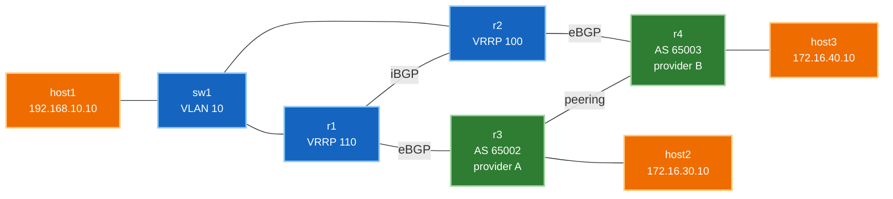

# 🧪 Lab 04 · Multihomed edge, end to end

> ✅ **Validated** on Arista cEOS 4.32.0F, 2026-08-03. All output captured live.

**Time:** ~75 minutes · **Nodes:** 8 (5 switches/routers + 3 hosts)

!!! warning "Needs a 16 GB lab VM"
    Five cEOS containers saturate a 16 GB host — the first build attempt killed
    the VM outright. Deploy with `--max-workers 1`, and if your VM is smaller,
    drop `sw1` and connect `host1` straight to `r1`. You lose the VRRP
    demonstration but the multihoming still works.

The first three labs used loopbacks as stand-ins for networks. This one is the real
shape of a small site: **real hosts, an access switch, a redundant default gateway,
and two separate upstream providers** — then we break each layer and watch it hold.

**Multihoming means two different providers, not two links to one.** Two links to a
single provider protects against a cable fault. Two providers protects against that
provider having a bad day — and it's the case that actually forces you to think
about path selection and policy.

!!! tip "Run it instead of typing it"
    ```bash
    git clone https://github.com/etherhtun/netforge-labs
    cd netforge-labs/labs/edge-lab
    sudo containerlab deploy -t topology.clab.yml --max-workers 1
    ./run.sh --all          # or ./run.sh 03 for one step
    ./run.sh --reset        # destroy, redeploy, run everything fresh
    ```

---

## What you'll learn

- **Dual-homing** to a provider, and what actually happens when one uplink dies
- **VRRP** — why dual uplinks are useless if the host has one gateway
- Where the **L2 access layer** ends and routing begins
- Reading a failure from the host's point of view, not the router's

---

## Topology



Your network is **AS 65001**. It buys transit from two unrelated providers, and
those providers also peer with each other — which is what gives every destination
two possible paths of different lengths.

Reads left to right in traffic order: **user → access switch → edge routers →
provider → remote host**. Link addressing is in the table below rather than on the
diagram, which keeps it legible.

| Device | Role | Key addresses |
|---|---|---|
| **host1** | user endpoint | `192.168.10.10/24`, gateway `192.168.10.1` |
| **sw1** | L2 access | VLAN 10, no IP |
| **r1** | edge, VRRP **master** | `192.168.10.2`, uplink `10.0.13.1` → provider A |
| **r2** | edge, VRRP **backup** | `192.168.10.3`, uplink `10.0.24.2` → provider B |
| **r3** | **provider A**, AS 65002 | advertises `172.16.30.0/24` |
| **r4** | **provider B**, AS 65003 | advertises `172.16.40.0/24` |
| **host2 / host3** | remote endpoints | behind provider A / provider B |

**Three independent layers of redundancy**, which is the point of the lab:

1. Two **separate upstream providers** (r1 → AS 65002, r2 → AS 65003)
2. A redundant default gateway for the host (VRRP)
3. An internal path between the edge routers (OSPF + iBGP), so either can reach the
   other's provider

---

## Step 1 · Deploy

```yaml title="topology.clab.yml"
--8<-- "labs/edge-lab/topology.clab.yml"
```

```bash
sudo containerlab deploy -t topology.clab.yml --max-workers 1
```

!!! warning "Host config goes in `exec`, not `cmd`"
    Two things bit me building this, both worth knowing:

    **`cmd` runs before containerlab has wired `eth1`.** Configuring the interface
    there fails, the container exits, and it crash-loops with
    `namespace path not available`. Put addressing in **`exec`**, which runs after
    wiring.

    **containerlab already owns the default route** for management. `ip route add
    default ...` silently fails because one exists. Add a *specific* route to the
    far-side network instead — which is what the topology above does.

**Verify:**

```bash
./run.sh 01
```

```
  r1   3 ready, 0 unknown
  r2   3 ready, 0 unknown
  r3   3 ready, 0 unknown
  sw1  3 ready, 0 unknown
  host1  192.168.10.10
  host2  172.16.30.10
  ✅ DONE
```

✅ **DONE when** all four network devices show ready ports and both hosts have
addresses.

---

## Step 2 · The access layer

`sw1` is a pure layer-2 device. It has no IP address and no routing — its whole job
is putting three ports in the same broadcast domain.

```
--8<-- "labs/edge-lab/steps/02-sw1-l2.cfg"
```

**Verify:**

```bash
docker exec clab-edge-lab-sw1 Cli -p 15 -c "show vlan 10"
```

```
VLAN  Name                             Status    Ports
----- -------------------------------- --------- -------------------------------
10    USERS                            active    Et1, Et2, Et3
```

✅ **DONE when** all three ports are in VLAN 10.

!!! note "Why a separate switch at all"
    You could plug the host straight into a router. Real sites don't, because one
    router port doesn't serve fifty desks — and because it puts a clean boundary
    between the L2 access layer and the L3 edge.

    It also makes the VRRP step work properly: **both routers must sit in the same
    broadcast domain** as the host to share a virtual gateway address. `sw1` is what
    provides that.

---

## Step 3 · The edge — routing and a redundant gateway

Both edge routers get an SVI in VLAN 10 and share a **virtual IP** the host uses as
its gateway.

=== "r1 (VRRP master)"

    ```
    --8<-- "labs/edge-lab/steps/03-r1-edge.cfg"
    ```

=== "r2 (VRRP backup)"

    ```
    --8<-- "labs/edge-lab/steps/03-r2-edge.cfg"
    ```

Three details worth pausing on:

**`vrrp 10 ipv4 192.168.10.1`** — neither router owns `.1`. It's a virtual address
the current master answers for, and the host points at it. Priority decides who is
master: 110 beats the default 100.

**`passive-interface Vlan10`** — the subnet is advertised into OSPF, but no
adjacency forms over it. r1 and r2 are already adjacent on their direct link; a
second adjacency across the access VLAN would add nothing and put OSPF traffic on a
user segment.

**`Ethernet2` has no `ip ospf area`.** It faces another AS. Provider links never
belong in your IGP.

**Verify:**

```bash
./run.sh 03
```

```
2.2.2.2   1  default  0   FULL   00:00:35   10.0.12.2   Ethernet1
  VRRP: r1=Master r2=Backup
  ✅ DONE
```

✅ **DONE when** OSPF is `FULL` and VRRP shows exactly one Master and one Backup.

```bash
docker exec clab-edge-lab-r1 Cli -p 15 -c "show vrrp"
```

```
  State is Master
  Virtual IPv4 address is 192.168.10.1
  Priority is 110
  Master Router is 192.168.10.2 (local), priority is 110
```

---

## Step 4 · Two upstream providers

Two unrelated networks, each with its own AS number and its own customer. They also
**peer with each other**, which is what creates a second path to every destination.

=== "Provider A — AS 65002"

    ```
    --8<-- "labs/edge-lab/steps/04-r3-provider-a.cfg"
    ```

=== "Provider B — AS 65003"

    ```
    --8<-- "labs/edge-lab/steps/04-r4-provider-b.cfg"
    ```

**Verify:**

```bash
./run.sh 04
```

```
  provider A (r3): peering=1  host=0% packet loss
  provider B (r4): peering=1  host=0% packet loss
  ✅ DONE
```

✅ **DONE when** both providers are peered with each other and reach their own host.

---

## Step 5 · Multihomed BGP — and not becoming transit

Each edge router peers eBGP with **its own** provider, and iBGP with its partner.

=== "r1 → provider A"

    ```
    --8<-- "labs/edge-lab/steps/05-r1-bgp.cfg"
    ```

=== "r2 → provider B"

    ```
    --8<-- "labs/edge-lab/steps/05-r2-bgp.cfg"
    ```

!!! danger "The outbound filter is not optional"
    ```
    ip as-path access-list OWN-ROUTES permit ^$ any
    route-map TO-UPSTREAM permit 10
     match as-path OWN-ROUTES
    ```

    `^$` matches an **empty AS path** — routes you originated yourself.

    Without it, AS 65001 happily re-advertises provider A's routes to provider B
    and vice versa. You have just told the internet you will carry traffic between
    two large networks, over your small links, for free. Your circuits saturate and
    the outage is self-inflicted.

    This is not hypothetical: accidental transit from a missing outbound filter is
    behind a good number of internet-scale incidents. **Every eBGP session needs an
    outbound policy**, and for a multihomed customer that policy is "my prefixes
    only".

**Verify:**

```bash
./run.sh 05
```

```
  r1  2 BGP sessions
  r2  2 BGP sessions
  r1 -> 172.16.40.0/24 (behind provider B): Paths: 2
  transit filter: provider A receives only our own prefix ✓
  host1 -> provider A   0% packet loss
  host1 -> provider B   0% packet loss
  ✅ DONE
```

**Two paths to the same destination, via different upstreams:**

```bash
docker exec clab-edge-lab-r1 Cli -p 15 -c "show ip bgp"
```

```
 * >      172.16.30.0/24    10.0.13.3    100   0   65002 i
 * >      172.16.40.0/24    2.2.2.2      100   0   65003 i
 *        172.16.40.0/24    10.0.13.3    100   0   65002 65003 i
```

Read the last two lines. To reach `172.16.40.0/24` (behind provider B) r1 has:

- **`65003`** — via r2, straight to provider B. One AS hop. **Best.**
- `65002 65003` — via its own provider A, who transits to provider B. Two hops.

**Shortest AS path wins** — best-path step 4. That's multihoming choosing a route
with no policy applied at all.

And the filter holding:

```bash
docker exec clab-edge-lab-r3 Cli -p 15 -c "show ip bgp neighbors 10.0.13.1 received-routes"
```

```
 * >      192.168.10.0/24    10.0.13.1    65001 i
```

Provider A receives **only our own prefix** — not provider B's. We are a customer,
not transit.

---

## Step 6 · Lose an entire provider

Not a cable — a whole upstream.

```bash
docker exec -i clab-edge-lab-r2 Cli -p 15 <<'EOF'
configure
interface Ethernet2
 shutdown
end
EOF
```

Provider B is now unreachable. Before, r1 had two paths to `172.16.40.0/24` and
preferred the direct one. After:

```bash
docker exec clab-edge-lab-r1 Cli -p 15 -c "show ip bgp 172.16.40.0/24"
```

```
 Paths: 1 available
  65002 65003
      Received 00:01:43 ago, valid, external, best
```

One path left — **`65002 65003`**. Traffic to provider B's customer now goes out
through provider A, who transits it across the peering link.

```bash
docker exec clab-edge-lab-host1 ping -c3 172.16.40.10
```

```
3 packets transmitted, 3 packets received, 0% packet loss
```

**Zero loss while losing an entire transit provider.** That is what multihoming
buys, and it's a materially stronger guarantee than two links to one provider —
which protects you from a fibre cut but not from that provider's outage,
maintenance, or bankruptcy.

Restore:

```bash
docker exec -i clab-edge-lab-r2 Cli -p 15 <<'EOF'
configure
interface Ethernet2
 no shutdown
end
EOF
```

---

## Step 7 · Override the path with policy

AS path chose provider B for `172.16.40.0/24`. Suppose provider A is cheaper, or
faster, or you're draining B for maintenance — you want that traffic on A anyway.

```bash
docker exec -i clab-edge-lab-r1 Cli -p 15 <<'EOF'
configure
route-map FROM-PROV-A permit 10
 set local-preference 200
router bgp 65001
 address-family ipv4
  neighbor 10.0.13.3 route-map FROM-PROV-A in
end
EOF
```

**Before** — the one-hop path wins:

```
  65003
      Origin IGP, metric 0, localpref 100, IGP metric 20, weight 0
      Received 00:00:40 ago, valid, internal, best
  65002 65003
      Origin IGP, metric 0, localpref 100, IGP metric 0, weight 0
```

**After:**

```
  65002 65003
      Origin IGP, metric 0, localpref 200, IGP metric 0, weight 0
      Received 00:02:53 ago, valid, external, best
```

The **two-hop** path is now best. Local preference is compared at step 2 and AS path
at step 4, so **policy beats topology** — nothing below step 2 was even evaluated.

```bash
docker exec clab-edge-lab-host1 ping -c3 172.16.40.10
```

```
3 packets transmitted, 3 packets received, 0% packet loss
```

Traffic follows the new choice, still working.

!!! tip "Local-pref controls outbound only"
    You have just changed which provider **you** send traffic through. You have not
    changed how the internet reaches **you** — that still follows whatever your
    providers advertise.

    Influencing inbound traffic means AS-path prepending or provider communities,
    and both are requests rather than instructions. See
    [attributes](concepts/02-attributes.md).

---

## Step 7 · Break the gateway

The uplink test proved BGP redundancy. But the host still points at a single
gateway address — so what happens when the router *owning* it fails?

```bash
docker exec -i clab-edge-lab-r1 Cli -p 15 <<'EOF'
configure
interface Vlan10
 shutdown
end
EOF
```

```bash
docker exec clab-edge-lab-r2 Cli -p 15 -c "show vrrp" | grep -E "State|Master Router"
```

```
  State is Master
  Master Router is 192.168.10.3 (local), priority is 100
```

r2 promoted itself. It now answers for `192.168.10.1`.

```bash
docker exec clab-edge-lab-host1 ping -c3 172.16.30.10
```

```
3 packets transmitted, 3 packets received, 0% packet loss
```

**The host's configuration never changed.** It still points at `192.168.10.1` —
a different router is simply answering for it now.

Restore:

```bash
docker exec -i clab-edge-lab-r1 Cli -p 15 <<'EOF'
configure
interface Vlan10
 no shutdown
end
EOF
```

!!! tip "Why both mechanisms are needed"
    They protect different things and neither substitutes for the other.

    **Without VRRP**, two providers are close to useless for the host: lose r1 and
    the host is pointing at a dead gateway, no matter how healthy r2's BGP is.

    **Without two upstreams**, VRRP just fails over to a router whose provider is
    also down.

    Redundancy has to be continuous end to end. A chain with one unprotected link is
    protected exactly as well as that link — which is why "we have two routers"
    deserves the follow-up question *"redundant at which layer?"*

---

## Troubleshooting

| Symptom | Cause |
|---|---|
| Host has no address | config was in `cmd` not `exec` — container crash-looped |
| Host pings gateway, not the far side | missing specific route; check `ip route` on the host |
| Both routers VRRP Master | they can't see each other — check the switch VLAN |
| VRRP fine, no connectivity | routing problem, not first-hop; check BGP |
| `Paths: 1` on the provider | one eBGP session down — only single-homed |
| Traceroute hop 1 is `*` | normal; the VRRP virtual address doesn't send ICMP errors |
| Route via `Management0` | next-hop unreachable — see [Lab 01](lab-01-ebgp-ibgp.md) |

---

## Interview questions

??? question "You have two uplinks to one provider. Is that multihoming?"
    Not really — that is dual-attachment. It protects against a cable or card
    fault, but not against that provider having an outage, a maintenance window,
    or a routing mistake. **Multihoming means two independent upstream ASes.**
    Separately, dual uplinks protect the *routing* path, but if hosts point at
    a single gateway address on one router, losing that router isolates them
    regardless. You need first-hop redundancy — VRRP, HSRP or an anycast gateway —
    as well. Redundancy has to be continuous end to end.

??? question "What does VRRP actually do?"
    Two or more routers share a virtual IP that hosts use as their gateway. One is
    master and answers for it; the others stand by and take over if it fails.
    Priority decides who is master. The host's configuration never changes — the
    address stays the same and a different router answers for it.

??? question "One upstream provider goes down entirely. What happens?"
    Its routes are withdrawn and the surviving provider's paths take over — in this
    lab the best path to provider B's customer changes from `65003` to
    `65002 65003`, transiting the peering link between them. Traffic keeps flowing
    with zero loss, provided the edge routers exchange routes internally over iBGP.

??? question "Why must a multihomed customer filter its outbound advertisements?"
    Without a filter you re-advertise each provider's routes to the other and become
    unpaid transit between two large networks, over links sized for your own
    traffic. The standard filter is an AS-path regex `^$`, matching only locally
    originated routes. Missing outbound filters are behind a good number of
    internet-scale incidents.

??? question "Your provider's path is two AS hops and the other is one. How do you prefer the longer one?"
    Set **local preference** higher on routes from the provider you want, applied
    inbound. Local-pref is best-path step 2 and AS-path length is step 4, so it wins
    outright — nothing below step 2 is evaluated. Note this only controls traffic
    *leaving* your network.

??? question "Why is the access switch layer 2 with no IP?"
    Its job is a broadcast domain, not routing. Keeping it L2 preserves a clean
    boundary and — importantly here — puts both edge routers in the same segment as
    the hosts, which is what VRRP needs to work.

??? question "Why isn't the provider-facing interface in OSPF?"
    It faces a different administrative domain. Putting it in your IGP would leak
    internal topology toward the provider and risk importing theirs. The boundary
    between IGP and eBGP is exactly the boundary of trust.

??? question "Both routers report VRRP Master. What's wrong?"
    They can't see each other's advertisements, so each assumes the other is gone
    and both claim the virtual address. Almost always a layer-2 problem — wrong
    VLAN, a broken trunk, or the two routers not actually in the same broadcast
    domain.

---

## Clean up

```bash
sudo containerlab destroy -t topology.clab.yml
```
