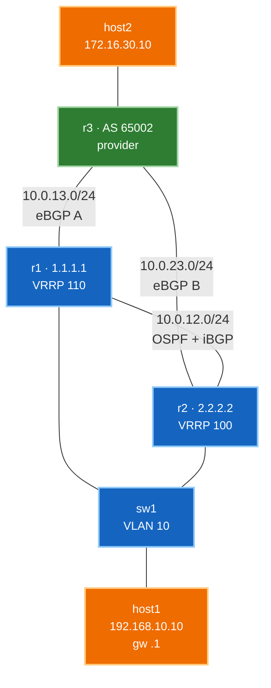

# 🧪 Lab 04 · Dual-homed edge, end to end

> ✅ **Validated** on Arista cEOS 4.32.0F, 2026-08-03. All output captured live.

**Time:** ~60 minutes · **Nodes:** 6 (4 switches/routers + 2 hosts)

The first three labs used loopbacks as stand-ins for networks. This one is the real
shape of a small site: **real hosts, an access switch, a redundant default gateway,
and two uplinks to a provider** — then we break each layer of redundancy and watch
it hold.

!!! tip "Run it instead of typing it"
    ```bash
    git clone https://github.com/etherhtun/netforge-labs
    cd netforge-labs/labs/edge-lab
    sudo containerlab deploy -t topology.clab.yml --max-workers 1
    ./run.sh --all          # or ./run.sh 03 for one step
    ./run.sh --reset        # destroy, redeploy, run everything fresh
    ```

---

## What you'll learn

- **Dual-homing** to a provider, and what actually happens when one uplink dies
- **VRRP** — why dual uplinks are useless if the host has one gateway
- Where the **L2 access layer** ends and routing begins
- Reading a failure from the host's point of view, not the router's

---

## Topology



| Device | Role | Key addresses |
|---|---|---|
| **host1** | user endpoint | `192.168.10.10/24`, gateway `192.168.10.1` |
| **sw1** | L2 access | VLAN 10, no IP |
| **r1** | edge, VRRP **master** | `192.168.10.2`, uplink `10.0.13.1` |
| **r2** | edge, VRRP **backup** | `192.168.10.3`, uplink `10.0.23.2` |
| **r3** | provider, AS 65002 | advertises `172.16.30.0/24` |
| **host2** | remote endpoint | `172.16.30.10/24` |

**Three independent layers of redundancy**, which is the point of the lab:

1. Two eBGP uplinks to the provider (r1 and r2 both peer with r3)
2. A redundant default gateway for the host (VRRP)
3. An internal path between the edge routers (OSPF + iBGP), so either can borrow the
   other's uplink

---

## Step 1 · Deploy

```yaml title="topology.clab.yml"
--8<-- "labs/edge-lab/topology.clab.yml"
```

```bash
sudo containerlab deploy -t topology.clab.yml --max-workers 1
```

!!! warning "Host config goes in `exec`, not `cmd`"
    Two things bit me building this, both worth knowing:

    **`cmd` runs before containerlab has wired `eth1`.** Configuring the interface
    there fails, the container exits, and it crash-loops with
    `namespace path not available`. Put addressing in **`exec`**, which runs after
    wiring.

    **containerlab already owns the default route** for management. `ip route add
    default ...` silently fails because one exists. Add a *specific* route to the
    far-side network instead — which is what the topology above does.

**Verify:**

```bash
./run.sh 01
```

```
  r1   3 ready, 0 unknown
  r2   3 ready, 0 unknown
  r3   3 ready, 0 unknown
  sw1  3 ready, 0 unknown
  host1  192.168.10.10
  host2  172.16.30.10
  ✅ DONE
```

✅ **DONE when** all four network devices show ready ports and both hosts have
addresses.

---

## Step 2 · The access layer

`sw1` is a pure layer-2 device. It has no IP address and no routing — its whole job
is putting three ports in the same broadcast domain.

```
--8<-- "labs/edge-lab/steps/02-sw1-l2.cfg"
```

**Verify:**

```bash
docker exec clab-edge-lab-sw1 Cli -p 15 -c "show vlan 10"
```

```
VLAN  Name                             Status    Ports
----- -------------------------------- --------- -------------------------------
10    USERS                            active    Et1, Et2, Et3
```

✅ **DONE when** all three ports are in VLAN 10.

!!! note "Why a separate switch at all"
    You could plug the host straight into a router. Real sites don't, because one
    router port doesn't serve fifty desks — and because it puts a clean boundary
    between the L2 access layer and the L3 edge.

    It also makes the VRRP step work properly: **both routers must sit in the same
    broadcast domain** as the host to share a virtual gateway address. `sw1` is what
    provides that.

---

## Step 3 · The edge — routing and a redundant gateway

Both edge routers get an SVI in VLAN 10 and share a **virtual IP** the host uses as
its gateway.

=== "r1 (VRRP master)"

    ```
    --8<-- "labs/edge-lab/steps/03-r1-underlay.cfg"
    ```

=== "r2 (VRRP backup)"

    ```
    --8<-- "labs/edge-lab/steps/03-r2-underlay.cfg"
    ```

Three details worth pausing on:

**`vrrp 10 ipv4 192.168.10.1`** — neither router owns `.1`. It's a virtual address
the current master answers for, and the host points at it. Priority decides who is
master: 110 beats the default 100.

**`passive-interface Vlan10`** — the subnet is advertised into OSPF, but no
adjacency forms over it. r1 and r2 are already adjacent on their direct link; a
second adjacency across the access VLAN would add nothing and put OSPF traffic on a
user segment.

**`Ethernet2` has no `ip ospf area`.** It faces another AS. Provider links never
belong in your IGP.

**Verify:**

```bash
./run.sh 03
```

```
2.2.2.2   1  default  0   FULL   00:00:35   10.0.12.2   Ethernet1
  VRRP: r1=Master r2=Backup
  ✅ DONE
```

✅ **DONE when** OSPF is `FULL` and VRRP shows exactly one Master and one Backup.

```bash
docker exec clab-edge-lab-r1 Cli -p 15 -c "show vrrp"
```

```
  State is Master
  Virtual IPv4 address is 192.168.10.1
  Priority is 110
  Master Router is 192.168.10.2 (local), priority is 110
```

---

## Step 4 · The provider

`r3` represents everything outside your control. It has a link to *each* of your
edge routers and a network behind it.

```
--8<-- "labs/edge-lab/steps/04-r3-provider.cfg"
```

**Verify:**

```bash
./run.sh 04
```

✅ **DONE when** r3 advertises `172.16.30.0/24` and can reach `host2`.

---

## Step 5 · Dual-homed BGP

Each edge router peers eBGP with the provider **and** iBGP with its partner.

=== "r1"

    ```
    --8<-- "labs/edge-lab/steps/05-r1-bgp.cfg"
    ```

=== "r2"

    ```
    --8<-- "labs/edge-lab/steps/05-r2-bgp.cfg"
    ```

`next-hop-self` is applied from the start here — [Lab 01](lab-01-ebgp-ibgp.md)
covers why in detail.

**Verify:**

```bash
./run.sh 05
```

```
  r1  2 BGP sessions established
  r2  2 BGP sessions established
  r3 -> 192.168.10.0/24: Paths: 2
  host1 -> host2:
    3 packets transmitted, 3 packets received, 0% packet loss
  ✅ DONE
```

**`Paths: 2`** is the whole point — the provider has two independent ways to reach
your network:

```bash
docker exec clab-edge-lab-r3 Cli -p 15 -c "show ip bgp 192.168.10.0/24"
```

```
 Paths: 2 available
    10.0.13.1 from 10.0.13.1 (1.1.1.1)
      Received 00:00:56 ago, valid, external, best
    10.0.23.2 from 10.0.23.2 (2.2.2.2)
```

And real traffic, host to host across two autonomous systems:

```bash
docker exec clab-edge-lab-host1 traceroute -n 172.16.30.10
```

```
traceroute to 172.16.30.10 (172.16.30.10), 30 hops max, 46 byte packets
 1  *  *  *
 2  10.0.13.3  5.438 ms  2.791 ms  1.760 ms
 3  172.16.30.10  2.409 ms  1.924 ms  1.988 ms
```

✅ **DONE.** (Hop 1 shows `*` because the VRRP virtual address doesn't originate
ICMP time-exceeded — normal, not a fault.)

---

## Step 6 · Break the uplink

Everything above is just setup. This is the lab.

```bash
docker exec -i clab-edge-lab-r1 Cli -p 15 <<'EOF'
configure
interface Ethernet2
 shutdown
end
EOF
```

r1 has just lost its provider link. **Before**, r1 reached the provider network
directly:

```
 B E      172.16.30.0/24 [200/0]
           via 10.0.13.3, Ethernet2
```

**After**, roughly 20 seconds later:

```bash
docker exec clab-edge-lab-r1 Cli -p 15 -c "show ip route 172.16.30.0/24"
```

```
 B I      172.16.30.0/24 [200/0]
           via 10.0.12.2, Ethernet1
```

`B E` became `B I` — r1 lost its own eBGP path and is now using the one r2 learned,
via the internal link. **This is what iBGP is for.**

```bash
docker exec clab-edge-lab-host1 ping -c3 172.16.30.10
docker exec clab-edge-lab-host1 traceroute -n 172.16.30.10
```

```
3 packets transmitted, 3 packets received, 0% packet loss

 1  *  *  *
 2  10.0.12.2   12.599 ms  5.044 ms  2.530 ms
 3  10.0.23.3   3.850 ms  2.502 ms  2.310 ms
 4  172.16.30.10  4.020 ms  2.882 ms  1.705 ms
```

**Zero packet loss**, and the path is now four hops instead of three — traffic
detours through r2. The host noticed nothing.

Restore it:

```bash
docker exec -i clab-edge-lab-r1 Cli -p 15 <<'EOF'
configure
interface Ethernet2
 no shutdown
end
EOF
```

---

## Step 7 · Break the gateway

The uplink test proved BGP redundancy. But the host still points at a single
gateway address — so what happens when the router *owning* it fails?

```bash
docker exec -i clab-edge-lab-r1 Cli -p 15 <<'EOF'
configure
interface Vlan10
 shutdown
end
EOF
```

```bash
docker exec clab-edge-lab-r2 Cli -p 15 -c "show vrrp" | grep -E "State|Master Router"
```

```
  State is Master
  Master Router is 192.168.10.3 (local), priority is 100
```

r2 promoted itself. It now answers for `192.168.10.1`.

```bash
docker exec clab-edge-lab-host1 ping -c3 172.16.30.10
```

```
3 packets transmitted, 3 packets received, 0% packet loss
```

**The host's configuration never changed.** It still points at `192.168.10.1` —
a different router is simply answering for it now.

Restore:

```bash
docker exec -i clab-edge-lab-r1 Cli -p 15 <<'EOF'
configure
interface Vlan10
 no shutdown
end
EOF
```

!!! tip "Why both mechanisms are needed"
    They protect different things and neither substitutes for the other.

    **Without VRRP**, dual uplinks are close to useless for the host: lose r1 and
    the host is pointing at a dead gateway, no matter how healthy r2's BGP is.

    **Without dual eBGP**, VRRP just fails over to a router with no path out.

    Redundancy has to be continuous end to end. A chain with one unprotected link is
    protected exactly as well as that link — which is why "we have two routers"
    deserves the follow-up question *"redundant at which layer?"*

---

## Troubleshooting

| Symptom | Cause |
|---|---|
| Host has no address | config was in `cmd` not `exec` — container crash-looped |
| Host pings gateway, not the far side | missing specific route; check `ip route` on the host |
| Both routers VRRP Master | they can't see each other — check the switch VLAN |
| VRRP fine, no connectivity | routing problem, not first-hop; check BGP |
| `Paths: 1` on the provider | one eBGP session down — only single-homed |
| Traceroute hop 1 is `*` | normal; the VRRP virtual address doesn't send ICMP errors |
| Route via `Management0` | next-hop unreachable — see [Lab 01](lab-01-ebgp-ibgp.md) |

---

## Interview questions

??? question "You have two uplinks to a provider. Is the site redundant?"
    Not necessarily. Dual uplinks protect the *routing* path, but if hosts point at
    a single gateway address on one router, losing that router isolates them
    regardless. You need first-hop redundancy — VRRP, HSRP or an anycast gateway —
    as well. Redundancy has to be continuous end to end.

??? question "What does VRRP actually do?"
    Two or more routers share a virtual IP that hosts use as their gateway. One is
    master and answers for it; the others stand by and take over if it fails.
    Priority decides who is master. The host's configuration never changes — the
    address stays the same and a different router answers for it.

??? question "One edge router loses its provider link. What happens?"
    It loses its eBGP path and starts using the one its partner learned via iBGP —
    the route changes from `B E` to `B I` and points at the internal link. Traffic
    takes an extra hop but keeps flowing, provided the two edge routers have an
    internal path and are exchanging routes.

??? question "Why is the access switch layer 2 with no IP?"
    Its job is a broadcast domain, not routing. Keeping it L2 preserves a clean
    boundary and — importantly here — puts both edge routers in the same segment as
    the hosts, which is what VRRP needs to work.

??? question "Why isn't the provider-facing interface in OSPF?"
    It faces a different administrative domain. Putting it in your IGP would leak
    internal topology toward the provider and risk importing theirs. The boundary
    between IGP and eBGP is exactly the boundary of trust.

??? question "Both routers report VRRP Master. What's wrong?"
    They can't see each other's advertisements, so each assumes the other is gone
    and both claim the virtual address. Almost always a layer-2 problem — wrong
    VLAN, a broken trunk, or the two routers not actually in the same broadcast
    domain.

---

## Clean up

```bash
sudo containerlab destroy -t topology.clab.yml
```
