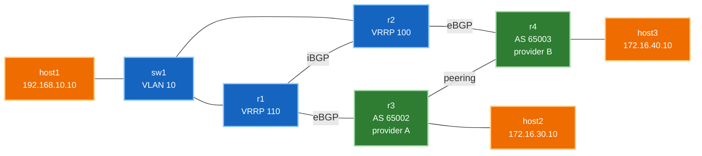

# 🧪 Lab 04 · Multihomed Edge စနစ်ကို အစအဆုံး တည်ဆောက်ခြင်း

> ✅ **Validated** on Arista cEOS 4.32.0F, 2026-08-03. ဖော်ပြထားသော output အားလုံးကို live fabric မှ တိုက်ရိုက်ဖမ်းယူထားပါသည်။

**ကြာမြင့်ချိန်:** ~၇၅ မိနစ် · **Nodes အရေအတွက်:** ၈ ခု (Switches/Routers ၅ ခု + Hosts ၃ ခု)

!!! warning "16 GB Lab VM လိုအပ်ပါသည်"
    cEOS containers ၅ ခုသည် 16 GB host တစ်ခုကို ပြည့်ကျပ်စေနိုင်ပါသည် — ပထမဆုံး စမ်းသပ်မှုတွင် VM တစ်ခုလုံး crash ဖြစ်သွားခဲ့ဖူးသည်။ `--max-workers 1` ဖြင့် deploy ပြုလုပ်ပါ၊ အကယ်၍ သင်၏ VM သည် ပိုမိုသေးငယ်ပါက `sw1` ကို ချန်လှပ်၍ `host1` ကို `r1` နှင့် တိုက်ရိုက် ချိတ်ဆက်နိုင်ပါသည်။ VRRP စမ်းသပ်မှုကို လက်လွတ်ရမည်ဖြစ်သော်လည်း multihoming စနစ်ကို ဆက်လက်စမ်းသပ်နိုင်မည် ဖြစ်သည်။

ပထမ lab သုံးခုတွင် loopbacks များကို network များအဖြစ် အစားထိုး အသုံးပြုခဲ့သည်။ ဤ lab သည် ရုံးခွဲ သို့မဟုတ် site အသေးစားတစ်ခု၏ အစစ်အမှန် ဖွဲ့စည်းပုံ ဖြစ်သည်- **အစစ်အမှန် hosts များ၊ Access switch တစ်ခု၊ Redundant default gateway တစ်ခု၊ နှင့် သီးခြား upstream providers နှစ်ခု** — ထို့နောက် Layer တစ်ခုချင်းစီကို ဖြတ်တောက်ပြီး ကွန်ရက် မပြတ်တောက်ဘဲ ခံနိုင်ရည်ရှိပုံကို စောင့်ကြည့်လေ့လာပါမည်။

**Multihoming ဆိုသည်မှာ Provider တစ်ခုတည်းဆီ links နှစ်ခု မဟုတ်ဘဲ မတူညီသော Provider နှစ်ခုဆီ ချိတ်ဆက်ခြင်း ဖြစ်သည်။** Provider တစ်ခုတည်းဆီ links နှစ်ခု ချိတ်ခြင်းသည် ကြိုးလိုင်းပြတ်တောက်မှု (cable fault) ကိုသာ ကာကွယ်ပေးနိုင်သည်။ မတူညီသော Provider နှစ်ခု ချိတ်ဆက်ခြင်းသည် ထို provider တစ်ခုလုံး outage ဖြစ်သွားသည့် အခြေအနေကို ကာကွယ်ပေးနိုင်သည် — ၎င်းသည် path selection နှင့် policy များကို အမှန်တကယ် စဉ်းစားတွေးခေါ်စေမည့် လက်တွေ့အခြေအနေ ဖြစ်သည်။

!!! tip "အမြန်စတင်ရန် လမ်းညွှန် (တည်နေရာ: `labs/edge-lab/`)"
    **အဆင့် ၁ · Lab Fabric ကို စတင်လည်ပတ်ပါ (မ run ရသေးပါက)**
    ```bash
    cd labs/edge-lab
    sudo containerlab deploy -t topology.clab.yml --max-workers 1
    ```

    **အဆင့် ၂ · အပြန်အလှန် လမ်းညွှန်မှုပါရှိသော Interactive Walkthrough ကို စတင်ပါ**
    ```bash
    ./run.sh --guided
    ```

    ??? note "အခြား ရွေးချယ်နိုင်သော နည်းလမ်းများ (Automated Script သို့မဟုတ် Manual CLI)"
        - **အလိုအလျောက် Script ဖြင့် အမြန်ထည့်သွင်းခြင်း**:
          ```bash
          ./run.sh 02          # step 02 ကို apply နှင့် verify အလိုအလျောက် ပြုလုပ်ရန်
          ./run.sh --all       # အဆင့်အားလုံးကို အစဉ်လိုက် run ရန်
          ```
        - **Manual Line-by-Line CLI ဖြင့် လုပ်ဆောင်ခြင်း**:
          Container node ပေါ်တွင် တိုက်ရိုက် interactive CLI shell ဖွင့်ရန်:
          ```bash
          docker exec -it clab-edge-lab-r1 Cli
          ```
          သို့မဟုတ် အဆင့်တစ်ခုချင်းစီ၏ config snippet များကို stdin မှတစ်ဆင့် ပေးပို့ရန်:
          `docker exec -i clab-edge-lab-r1 Cli -p 15 < steps/02-r1-underlay.cfg`

---

## သင်ယူလေ့လာရမည့် အချက်များ

- Provider ဆီသို့ **Dual-homing** ချိတ်ဆက်ခြင်းနှင့် uplink တစ်ခု ပြတ်တောက်သွားသည့်အခါ လက်တွေ့ မည်သို့ဖြစ်သွားသနည်း
- **VRRP** — Host တွင် gateway တစ်ခုတည်းသာ ရှိနေပါက dual uplinks ရှိနေရုံဖြင့် အဘယ်ကြောင့် အသုံးမဝင်ရသနည်း
- **L2 access layer** သည် မည်သည့်နေရာတွင် ရပ်တန့်ပြီး routing မည်သည့်နေရာတွင် စတင်သနည်း
- ချို့ယွင်းချက်ကို router ၏ အမြင်မှ မဟုတ်ဘဲ host ၏ အမြင်မှ ဖတ်ရှုစစ်ဆေးခြင်း

---

## Topology အခင်းအကျင်း



သင်၏ ကွန်ရက်သည် **AS 65001** ဖြစ်သည်။ မသက်ဆိုင်သော သီးခြား providers နှစ်ခုထံမှ transit ဝယ်ယူထားပြီး ထို providers အချင်းချင်းသည်လည်း peering ချိတ်ဆက်ထားကြသည် — ယင်းကြောင့် destination တိုင်းဆီသို့ မတူညီသော အလျားရှိသည့် လမ်းကြောင်းနှစ်ခု ဖြစ်ပေါ်စေသည်။

Traffic စီးဆင်းရာ လမ်းကြောင်းအတိုင်း ဘယ်မှ ညာသို့ ဖတ်ရှုပါ: **User → Access switch → Edge routers → Provider → Remote host**။ Link address များကို ဖတ်ရှုရ လွယ်ကူစေရန် အောက်ပါဇယားတွင် ဖော်ပြထားပါသည် -

| Device | အခန်းကဏ္ဍ (Role) | အဓိက Addresses များ |
|---|---|---|
| **host1** | User endpoint | `192.168.10.10/24`, Gateway `192.168.10.1` |
| **sw1** | L2 access switch | VLAN 10, IP မရှိပါ |
| **r1** | Edge, VRRP **Master** | `192.168.10.2`, Uplink `10.0.13.1` → Provider A |
| **r2** | Edge, VRRP **Backup** | `192.168.10.3`, Uplink `10.0.24.2` → Provider B |
| **r3** | **Provider A**, AS 65002 | `172.16.30.0/24` ကို ကြေညာသည် |
| **r4** | **Provider B**, AS 65003 | `172.16.40.0/24` ကို ကြေညာသည် |
| **host2 / host3** | Remote endpoints | Provider A / Provider B နောက်ကွယ်တွင် ရှိသည် |

**သီးခြားလွတ်လပ်သော Redundancy အလွှာ ၃ ခု** (ဤ lab ၏ အဓိက အနှစ်သာရ ဖြစ်သည်) -

၁။ **သီးခြား Upstream Providers နှစ်ခု** (r1 → AS 65002, r2 → AS 65003)
၂။ Host အတွက် Redundant default gateway (VRRP)
၃။ Edge routers အချင်းချင်းကြား Internal path (OSPF + iBGP) ရှိသဖြင့် တစ်ဖက်စီက အခြားတစ်ဖက်၏ provider ဆီသို့ သွားရောက်နိုင်ခြင်း

---

## အဆင့် ၁ · Deploy ပြုလုပ်ခြင်း

```yaml title="topology.clab.yml"
--8<-- "labs/edge-lab/topology.clab.yml"
```

```bash
sudo containerlab deploy -t topology.clab.yml --max-workers 1
```

!!! warning "Host configuration သည် `cmd` တွင် မဟုတ်ဘဲ `exec` တွင် ရှိရမည်"
    ဤ lab တည်ဆောက်စဉ် အတွေ့အကြုံအရ သိထားသင့်သည့် အချက် ၂ ချက် -

    **Containerlab က `eth1` ကို မချိတ်ဆက်မီ `cmd` က အရင် run သွားတတ်သည်။** ထိုနေရာတွင် interface configure လုပ်ပါက fail ဖြစ်သွားပြီး container ပိတ်သွားကာ `namespace path not available` ဖြင့် crash-loop ဖြစ်စေသည်။ ကြိုးလိုင်းများ ချိတ်ဆက်ပြီးမှ run သည့် **`exec`** အောက်တွင်သာ addressing ကို ထည့်သွင်းပါ။

    **Containerlab သည် management အတွက် default route ကို ပိုင်ဆိုင်ပြီးသား ဖြစ်သည်။** ထို့ကြောင့် `ip route add default ...` ပေးပါက route ရှိပြီးသားဖြစ်သဖြင့် အသံတိတ် fail ဖြစ်သွားမည်။ အဝေးကွန်ရက်ဆီသို့ *Specific* route တစ်ခုကို ထည့်သွင်းပေးပါ — အထက်ပါ topology တွင် ထိုအတိုင်း ပြုလုပ်ထားပါသည်။

**စစ်ဆေးအတည်ပြုခြင်း:**

```bash
./run.sh 01
```

```
  r1   3 ready, 0 unknown
  r2   3 ready, 0 unknown
  r3   3 ready, 0 unknown
  r4   3 ready, 0 unknown
  sw1  3 ready, 0 unknown
  host1  192.168.10.10
  host2  172.16.30.10
  host3  172.16.40.10
  ✅ DONE
```

✅ Network devices ၅ ခုစလုံးတွင် ports များ ready ဖြစ်ပြီး hosts ၃ ခုစလုံး IP addresses ရရှိထားပါက **ပြီးမြောက်ပါပြီ**။

---

## အဆင့် ၂ · Access Layer တည်ဆောက်ခြင်း

`sw1` သည် Pure Layer-2 device ဖြစ်သည်။ ၎င်းတွင် IP address မရှိသလို routing လည်း မရှိပါ — ၎င်း၏ တာဝန်တစ်ခုတည်းမှာ ports ၃ ခုကို တူညီသော broadcast domain အတွင်း ထည့်သွင်းပေးရန် ဖြစ်သည်။

```
--8<-- "labs/edge-lab/steps/02-sw1-l2.cfg"
```

**စစ်ဆေးအတည်ပြုခြင်း:**

```bash
docker exec clab-edge-lab-sw1 Cli -p 15 -c "show vlan 10"
```

```
VLAN  Name                             Status    Ports
----- -------------------------------- --------- -------------------------------
10    USERS                            active    Et1, Et2, Et3
```

✅ Ports သုံးခုစလုံး VLAN 10 တွင် ပါဝင်နေပါက **ပြီးမြောက်ပါပြီ**။

!!! note "သီးခြား Switch တစ်ခု အဘယ်ကြောင့် ထားရှိရသနည်း"
    Host ကို router တွင် တိုက်ရိုက် ထိုးစိုက်နိုင်ပါသည်။ လက်တွေ့လောကတွင် ထိုသို့ မပြုလုပ်ပါ၊ အကြောင်းမှာ router port တစ်ခုတည်းက စားပွဲခုံပေါင်း ၅၀ ကို ဝန်မဆောင်နိုင်သောကြောင့်နှင့် — L2 access layer နှင့် L3 edge အကြား သန့်ရှင်းသော နယ်နိမိတ် ခွဲခြားထားလိုသောကြောင့် ဖြစ်သည်။

    ထို့ပြင် VRRP အလုပ်လုပ်စေရန်အတွက်လည်း ဖြစ်သည်: **Router နှစ်ခုစလုံးသည် host နှင့် တူညီသော broadcast domain တစ်ခုတည်းတွင် ရှိနေမှသာ** virtual gateway address ကို မျှဝေနိုင်မည် ဖြစ်သည်။ `sw1` က ၎င်းကို ဆောင်ရွက်ပေးခြင်း ဖြစ်သည်။

---

## အဆင့် ၃ · Edge — Routing နှင့် Redundant Gateway တည်ဆောက်ခြင်း

Edge routers နှစ်ခုစလုံးသည် VLAN 10 တွင် SVI တစ်ခုစီ ရရှိကြပြီး host က gateway အဖြစ် အသုံးပြုမည့် **Virtual IP** တစ်ခုကို အတူတကွ မျှဝေကိုင်တွယ်ကြသည်။

=== "r1 (VRRP Master)"

    ```
    --8<-- "labs/edge-lab/steps/03-r1-edge.cfg"
    ```

=== "r2 (VRRP Backup)"

    ```
    --8<-- "labs/edge-lab/steps/03-r2-edge.cfg"
    ```

သတိပြုရမည့် အချက် ၃ ချက် -

**`vrrp 10 ipv4 192.168.10.1`** — မည်သည့် router ကမျှ `.1` ကို အပိုင်မယူပါ။ ၎င်းသည် လက်ရှိ master router က အဖြေပေးမည့် Virtual IP ဖြစ်ပြီး host က ၎င်းကို ညွှန်ပြထားသည်။ Priority က master မည်သူဖြစ်မည်ကို ဆုံးဖြတ်သည်: 110 က default 100 ကို အနိုင်ရသည်။

**`passive-interface Vlan10`** — Subnet ကို OSPF ထဲသို့ ကြေညာပေးသော်လည်း ၎င်းပေါ်တွင် adjacency မဖွဲ့ပါ။ r1 နှင့် r2 သည် direct link ပေါ်တွင် adjacent ဖြစ်ပြီးသားဖြစ်သည်; Access VLAN ကို ဖြတ်သန်း၍ ဒုတိယ adjacency ဖွဲ့ခြင်းသည် ဘာမှ အကျိုးမရှိဘဲ user segment ပေါ်သို့ OSPF traffic များကို ရောက်ရှိစေသည်။

**`Ethernet2` တွင် `ip ospf area` မပါရှိပါ။** ၎င်းသည် အခြား AS သို့ မျက်နှာမူထားသည်။ Provider links များသည် မိမိ၏ IGP အတွင်း ဘယ်တော့မှ မပါဝင်သင့်ပေ။

**စစ်ဆေးအတည်ပြုခြင်း:**

```bash
./run.sh 03
```

```
2.2.2.2   1  default  0   FULL   00:00:35   10.0.12.2   Ethernet1
  VRRP: r1=Master r2=Backup
  ✅ DONE
```

✅ OSPF သည် `FULL` ဖြစ်ပြီး VRRP တွင် တိတိကျကျ Master တစ်ခုနှင့် Backup တစ်ခု ပေါ်နေပါက **ပြီးမြောက်ပါပြီ**။

```bash
docker exec clab-edge-lab-r1 Cli -p 15 -c "show vrrp"
```

```
  State is Master
  Virtual IPv4 address is 192.168.10.1
  Priority is 110
  Master Router is 192.168.10.2 (local), priority is 110
```

---

## အဆင့် ၄ · Upstream Providers နှစ်ခုကို ချိတ်ဆက်ခြင်း

သီးခြားလွတ်လပ်သော ကွန်ရက်နှစ်ခုဖြစ်ပြီး တစ်ခုစီတွင် ကိုယ်ပိုင် AS number နှင့် ကိုယ်ပိုင် customer ရှိကြသည်။ ၎င်းတို့သည် **အချင်းချင်း peer ဖွဲ့ထားကြသည်**၊ ယင်းကြောင့် destination တိုင်းဆီသို့ ဒုတိယလမ်းကြောင်းတစ်ခု ဖြစ်ပေါ်လာခြင်း ဖြစ်သည်။

=== "Provider A — AS 65002"

    ```
    --8<-- "labs/edge-lab/steps/04-r3-provider-a.cfg"
    ```

=== "Provider B — AS 65003"

    ```
    --8<-- "labs/edge-lab/steps/04-r4-provider-b.cfg"
    ```

**စစ်ဆေးအတည်ပြုခြင်း:**

```bash
./run.sh 04
```

```
  provider A (r3): peering=1  host=0% packet loss
  provider B (r4): peering=1  host=0% packet loss
  ✅ DONE
```

✅ Providers နှစ်ခုစလုံး အချင်းချင်း peer ဖွဲ့ထားပြီး မိမိ host ဆီသို့ ရောက်ရှိနိုင်ပါက **ပြီးမြောက်ပါပြီ**။

---

## အဆင့် ၅ · Multihomed BGP — Transit Network မဖြစ်အောင် ကာကွယ်ခြင်း

Edge router တစ်ခုစီသည် **မိမိ၏ သက်ဆိုင်ရာ** provider နှင့် eBGP peer ဖွဲ့ပြီး အချင်းချင်းကြား iBGP peer ဖွဲ့သည်။

=== "r1 → Provider A"

    ```
    --8<-- "labs/edge-lab/steps/05-r1-bgp.cfg"
    ```

=== "r2 → Provider B"

    ```
    --8<-- "labs/edge-lab/steps/05-r2-bgp.cfg"
    ```

!!! danger "Outbound Filter သည် ရွေးချယ်စရာ မဟုတ်ပါ၊ မဖြစ်မနေ လိုအပ်သည်"
    ```
    ip as-path access-list OWN-ROUTES permit ^$ any
    route-map TO-UPSTREAM permit 10
     match as-path OWN-ROUTES
    ```

    `^$` သည် **အလွတ်ဖြစ်နေသော AS path** နှင့် ကိုက်ညီသည် — သင်ကိုယ်တိုင် စတင်ထုတ်လွှင့်သော routes များကိုသာ ဆိုလိုသည်။

    ဤ filter မပါရှိပါက AS 65001 သည် Provider A ၏ routes များကို Provider B ထံ ပျော်ရွှင်စွာ ပြန်လည်ကြေညာပေးမည်ဖြစ်ပြီး ဆန့်ကျင်ဘက်လည်း ထိုနည်းတူ ဖြစ်သွားမည်။ သင်သည် ကြီးမားသော network ကြီးနှစ်ခုကြားရှိ traffic များကို သင်၏ သေးငယ်သော link လေးများပေါ်မှတစ်ဆင့် အခမဲ့ သယ်ယူပို့ဆောင်ပေးမည်ဟု ကမ္ဘာကြီးထံ ကြေညာလိုက်ခြင်း ဖြစ်သည်။ သင်၏ circuits များ ပြည့်ကျပ်သွားပြီး ကွန်ရက်ပြတ်တောက်မှုသည် မိမိကိုယ်တိုင် ဖန်တီးလိုက်သလို ဖြစ်သွားမည်။

    ၎င်းသည် စာတွေ့သက်သက် မဟုတ်ပါ: Outbound filter ကျန်ခဲ့ခြင်းကြောင့် မတော်တဆ transit ဖြစ်သွားမှုသည် ကမ္ဘာလုံးဆိုင်ရာ အင်တာနက်ပြတ်တောက်မှုများစွာ၏ လက်သည် ဖြစ်ခဲ့သည်။ **eBGP session တိုင်းတွင် Outbound policy ရှိရမည်** ဖြစ်ပြီး Multihomed customer တစ်ဦးအတွက် ထို policy မှာ "မိမိကိုယ်ပိုင် prefixes များကိုသာ ပေးပို့ရန်" ဖြစ်သည်။

**စစ်ဆေးအတည်ပြုခြင်း:**

```bash
./run.sh 05
```

```
  r1  2 BGP sessions
  r2  2 BGP sessions
  r1 -> 172.16.40.0/24 (behind provider B): Paths: 2
  transit filter: provider A receives only our own prefix ✓
  host1 -> provider A   0% packet loss
  host1 -> provider B   0% packet loss
  ✅ DONE
```

**မတူညီသော Upstreams များမှတစ်ဆင့် တူညီသော Destination ဆီသို့ လမ်းကြောင်းနှစ်ခု ပေါ်လာခြင်း:**

```bash
docker exec clab-edge-lab-r1 Cli -p 15 -c "show ip bgp"
```

```
 * >      172.16.30.0/24    10.0.13.3    100   0   65002 i
 * >      172.16.40.0/24    2.2.2.2      100   0   65003 i
 *        172.16.40.0/24    10.0.13.3    100   0   65002 65003 i
```

နောက်ဆုံး စာကြောင်းနှစ်ခုကို ဖတ်ရှုပါ: `172.16.40.0/24` ဆီသို့ ရောက်ရှိရန် r1 တွင် -

- **`65003`** — r2 မှတစ်ဆင့် Provider B ဆီသို့ တိုက်ရိုက်။ AS hop ၁ ခု။ **အကောင်းဆုံး (Best)။**
- `65002 65003` — မိမိ၏ Provider A မှတစ်ဆင့် Provider B ဆီသို့ transit ဖြတ်သွားခြင်း။ AS hops ၂ ခု။

**အတိုဆုံး AS path က အနိုင်ရသည်** — Best-path အဆင့် ၄ ဖြစ်သည်။ Policy တစ်ခုမျှ သတ်မှတ်မထားဘဲ multihoming က လမ်းကြောင်းကို အလိုအလျောက် ရွေးချယ်ပေးခြင်း ဖြစ်သည်။

Filter စနစ် ကောင်းစွာ အလုပ်လုပ်နေပုံ -

```bash
docker exec clab-edge-lab-r3 Cli -p 15 -c "show ip bgp neighbors 10.0.13.1 received-routes"
```

```
 * >      192.168.10.0/24    10.0.13.1    65001 i
```

Provider A သည် **မိမိတို့၏ ကိုယ်ပိုင် prefix ကိုသာ** လက်ခံရရှိသည် — Provider B ၏ prefix ကို မရရှိပါ။ မိမိတို့သည် Customer သာဖြစ်ပြီး Transit မဟုတ်ပါ။

---

## အဆင့် ၆ · Provider တစ်ခုလုံး ပြတ်တောက်သွားသည့် အခြေအနေကို စမ်းသပ်ခြင်း

Cable ပြတ်တောက်မှု မဟုတ်ပါ — Upstream တစ်ခုလုံး ပြတ်တောက်သွားခြင်း ဖြစ်သည်။

```bash
docker exec -i clab-edge-lab-r2 Cli -p 15 <<'EOF'
configure
interface Ethernet2
 shutdown
end
EOF
```

Provider B သို့ မရောက်ရှိနိုင်တော့ပါ။ ယခင်က r1 တွင် `172.16.40.0/24` ဆီသို့ လမ်းကြောင်းနှစ်ခုရှိပြီး တိုက်ရိုက်လမ်းကြောင်းကို ရွေးချယ်ခဲ့သည်။ ယခုအခါ -

```bash
docker exec clab-edge-lab-r1 Cli -p 15 -c "show ip bgp 172.16.40.0/24"
```

```
 Paths: 1 available
  65002 65003
      Received 00:01:43 ago, valid, external, best
```

လမ်းကြောင်းတစ်ခုတည်းသာ ကျန်ရှိတော့သည် — **`65002 65003`**။ Provider B ၏ customer ဆီသို့ သွားမည့် traffic သည် ယခုအခါ Provider A မှတစ်ဆင့် ထွက်ခွာပြီး Peering link ကို ဖြတ်သန်းသွားလာတော့မည် ဖြစ်သည်။

```bash
docker exec clab-edge-lab-host1 ping -c3 172.16.40.10
```

```
3 packets transmitted, 3 packets received, 0% packet loss
```

**Transit Provider တစ်ခုလုံး ပြတ်တောက်သွားသော်လည်း Packet Loss သုည ရာခိုင်နှုန်းသာ ရှိသည်။** ၎င်းသည် Multihoming ၏ အစစ်အမှန် အကျိုးကျေးဇူးဖြစ်ပြီး Provider တစ်ခုတည်းဆီ links နှစ်ခု ချိတ်ခြင်းထက် များစွာ ပိုမိုခိုင်မာသော အာမခံချက်ဖြစ်သည် — Provider တစ်ခုတည်းဆီ ချိတ်ဆက်ခြင်းသည် ကြိုးလိုင်းပြတ်တောက်မှုကိုသာ ကာကွယ်နိုင်ပြီး ထို provider ဘက်မှ outage ဖြစ်ခြင်း၊ maintenance လုပ်ခြင်း သို့မဟုတ် ကုမ္ပဏီဒေဝါလီခံရခြင်းများကို မကာကွယ်နိုင်ပေ။

ပြန်လည် ဖွင့်ပေးပါ -

```bash
docker exec -i clab-edge-lab-r2 Cli -p 15 <<'EOF'
configure
interface Ethernet2
 no shutdown
end
EOF
```

---

## အဆင့် ၇ · Policy ဖြင့် လမ်းကြောင်းကို Override ပြုလုပ်ခြင်း

AS path အရ `172.16.40.0/24` အတွက် Provider B ကို ရွေးချယ်ခဲ့သည်။ အကယ်၍ Provider A သည် စရိတ်ပိုသက်သာသည် သို့မဟုတ် မြန်နှုန်းပိုကောင်းသည် သို့မဟုတ် B ကို maintenance လုပ်ရန်အတွက် traffic ဖယ်ထုတ်လိုသည်ဆိုပါစို့ — ထို traffic ကို A ပေါ်သို့ တင်လိုသည် -

```bash
docker exec -i clab-edge-lab-r1 Cli -p 15 <<'EOF'
configure
route-map FROM-PROV-A permit 10
 set local-preference 200
router bgp 65001
 address-family ipv4
  neighbor 10.0.13.3 route-map FROM-PROV-A in
end
EOF
```

**မပြောင်းလဲမီ** — 1-hop path က အနိုင်ရသည်:

```
  65003
      Origin IGP, metric 0, localpref 100, IGP metric 20, weight 0
      Received 00:00:40 ago, valid, internal, best
  65002 65003
      Origin IGP, metric 0, localpref 100, IGP metric 0, weight 0
```

**ပြောင်းလဲပြီးနောက်:**

```
  65002 65003
      Origin IGP, metric 0, localpref 200, IGP metric 0, weight 0
      Received 00:02:53 ago, valid, external, best
```

**2-hop** path သည် ယခုအခါ Best ဖြစ်သွားသည်။ Local preference ကို အဆင့် ၂ တွင် နှိုင်းယှဉ်ပြီး AS path ကိုမူ အဆင့် ၄ ရောက်မှ နှိုင်းယှဉ်သောကြောင့် **Policy က Topology ကို အနိုင်ရသွားခြင်း ဖြစ်သည်** — အဆင့် ၂ အောက်ရှိ မည်သည့်အရာကိုမျှ စစ်ဆေးတွက်ချက်ခြင်းပင် မပြုတော့ပေ။

```bash
docker exec clab-edge-lab-host1 ping -c3 172.16.40.10
```

```
3 packets transmitted, 3 packets received, 0% packet loss
```

Traffic သည် ရွေးချယ်မှုအသစ်အတိုင်း ဆက်လက်စီးဆင်းနေဆဲ ဖြစ်သည်။

!!! tip "Local-pref သည် Outbound ကိုသာ ထိန်းချုပ်သည်"
    သင်သည် **မိမိထံမှ** traffic ပေးပို့မည့် provider ကိုသာ ပြောင်းလဲလိုက်ခြင်း ဖြစ်သည်။ ပြင်ပအင်တာနက်က **သင့်ထံသို့** မည်သို့ လာရောက်မည်ဆိုသည်ကို မပြောင်းလဲနိုင်ပါ — ၎င်းမှာ သင်၏ providers များက အပြင်သို့ ကြေညာပေးသည့်အတိုင်း ဆက်လက်သွားလာနေဆဲ ဖြစ်သည်။

    Inbound traffic ကို လွှမ်းမိုးရန်အတွက် AS-path prepending သို့မဟုတ် Provider communities များကို အသုံးပြုရမည် ဖြစ်ပြီး နှစ်ခုစလုံးသည် တောင်းဆိုချက်များသာ ဖြစ်ကြသည်။ [Attributes များ](concepts/02-attributes.md) တွင် ကြည့်ရှုပါ။

---

## အဆင့် ၈ · Gateway ပြတ်တောက်မှုကို စမ်းသပ်ခြင်း

Uplink စမ်းသပ်မှုက BGP redundancy ကို သက်သေပြခဲ့သည်။ သို့သော် Host သည် gateway IP တစ်ခုတည်းကိုသာ ညွှန်ပြနေဆဲဖြစ်သည် — ထို IP ကို ကိုင်တွယ်ထားသော router ပျက်စီးသွားပါက မည်သို့ဖြစ်မည်နည်း။

```bash
docker exec -i clab-edge-lab-r1 Cli -p 15 <<'EOF'
configure
interface Vlan10
 shutdown
end
EOF
```

```bash
docker exec clab-edge-lab-r2 Cli -p 15 -c "show vrrp" | grep -E "State|Master Router"
```

```
  State is Master
  Master Router is 192.168.10.3 (local), priority is 100
```

r2 သည် မိမိကိုယ်ကို Master အဖြစ် ရာထူးတိုးမြှင့်လိုက်သည်။ ယခုအခါ ၎င်းက `192.168.10.1` အတွက် တာဝန်ယူ အဖြေပေးတော့မည် ဖြစ်သည်။

```bash
docker exec clab-edge-lab-host1 ping -c3 172.16.30.10
```

```
3 packets transmitted, 3 packets received, 0% packet loss
```

**Host ၏ Configuration ဘာမှ ပြောင်းလဲစရာ မလိုခဲ့ပါ။** ၎င်းသည် `192.168.10.1` ကို ဆက်လက်ညွှန်ပြနေဆဲဖြစ်ပြီး — အခြား router တစ်ခုက ၎င်းအတွက် ဝင်ရောက်တာဝန်ယူ ဖြေကြားပေးနေခြင်းသာ ဖြစ်သည်။

ပြန်လည် ဖွင့်ပေးပါ -

```bash
docker exec -i clab-edge-lab-r1 Cli -p 15 <<'EOF'
configure
interface Vlan10
 no shutdown
end
EOF
```

!!! tip "ယန္တရား နှစ်ခုစလုံး အဘယ်ကြောင့် လိုအပ်သနည်း"
    ၎င်းတို့သည် မတူညီသော အရာများကို ကာကွယ်ပေးပြီး တစ်ခုက အခြားတစ်ခုကို အစားမထိုးနိုင်ပါ။

    **VRRP မပါရှိပါက** Upstream providers နှစ်ခုရှိနေခြင်းသည် host အတွက် လုံးဝနီးပါး အသုံးမဝင်ပါ: r1 ပျက်စီးသွားပါက r2 ၏ BGP မည်မျှပင် ကောင်းမွန်နေပါစေ host သည် သေဆုံးနေသော gateway ကိုသာ ဆက်လက်ညွှန်ပြနေမိလိမ့်မည်။

    **Upstreams နှစ်ခု မပါရှိပါက** VRRP သည် provider ပြတ်တောက်နေသော အခြား router တစ်ခုဆီသို့သာ failover လုပ်ပေးနိုင်ပေလိမ့်မည်။

    Redundancy သည် အစမှ အဆုံးအထိ အဆက်မပြတ် ရှိနေရမည်။ ကာကွယ်မှုမရှိသော ချိတ်ဆက်မှုတစ်ခု ပါဝင်နေသည့် ကွင်းဆက်တစ်ခုသည် ထိုအားနည်းသော အစိတ်အပိုင်းလောက်သာ ခံနိုင်ရည်ရှိမည် ဖြစ်သည် — ထို့ကြောင့် "ကျွန်တော်တို့မှာ routers နှစ်ခု ရှိတယ်" ဟူသော ပြောဆိုချက်တိုင်းတွင် *"မည်သည့် layer တွင် redundant ဖြစ်သနည်း"* ဟူသော မေးခွန်းကို ဆက်လက်မေးမြန်းသင့်ပါသည်။

---

## ပြဿနာဖြေရှင်းခြင်း လမ်းညွှန် (Troubleshooting)

| ရောဂါလက္ခဏာ | ဖြစ်ပွားရသည့် အကြောင်းရင်း |
|---|---|
| Host တွင် IP address မရှိခြင်း | Config သည် `exec` တွင် မဟုတ်ဘဲ `cmd` တွင် ဖြစ်နေသဖြင့် container crash-loop ဖြစ်သွားခြင်း |
| Host က gateway ကို ping ရသော်လည်း အဝေးသို့ မရောက်ခြင်း | Specific route ကျန်ခဲ့ခြင်း; Host ပေါ်ရှိ `ip route` ကို စစ်ဆေးပါ |
| Routers နှစ်ခုစလုံး VRRP Master ဖြစ်နေခြင်း | အချင်းချင်း မမြင်တွေ့ရခြင်း — Switch VLAN ကို စစ်ဆေးပါ |
| VRRP ကောင်းသော်လည်း ချိတ်ဆက်၍ မရခြင်း | First-hop မဟုတ်ဘဲ Routing ပြဿနာဖြစ်သည်; BGP ကို စစ်ဆေးပါ |
| Provider ဘက်တွင် `Paths: 1` သာ ဖြစ်နေခြင်း | eBGP session တစ်ခု down နေခြင်း — Single-homed သာ ဖြစ်နေသည် |
| Traceroute ၏ Hop 1 က `*` ဖြစ်နေခြင်း | ပုံမှန်ဖြစ်သည်; VRRP virtual address သည် ICMP errors ပြန်မပို့ပါ |
| Route သည် `Management0` မှတစ်ဆင့် resolve ဖြစ်နေခြင်း | Next-hop မရောက်ရှိနိုင်ခြင်း — [Lab 01](lab-01-ebgp-ibgp.md) ကို ကြည့်ပါ |

---

## အင်တာဗျူး မေးခွန်းများ (Interview questions)

??? question "Provider တစ်ခုတည်းဆီသို့ Uplinks နှစ်ခု ချိတ်ဆက်ထားခြင်းသည် Multihoming ဟု ခေါ်ပါသလား။"
    မဟုတ်ပါ — ၎င်းသည် Dual-attachment သာ ဖြစ်သည်။ ၎င်းသည် ကြိုးလိုင်း သို့မဟုတ် line card ချို့ယွင်းမှုကိုသာ ကာကွယ်ပေးနိုင်ပြီး ထို provider ၏ outage ဖြစ်ခြင်း၊ maintenance လုပ်ခြင်း သို့မဟုတ် routing အမှားများကို မကာကွယ်နိုင်ပါ။ **Multihoming ဆိုသည်မှာ သီးခြားလွတ်လပ်သော Upstream ASes နှစ်ခုဆီ ချိတ်ဆက်ခြင်း ဖြစ်သည်။** ထို့ပြင် Dual uplinks သည် routing လမ်းကြောင်းကိုသာ ကာကွယ်ပေးပြီး host များက router တစ်ခုတည်းပေါ်ရှိ single gateway IP ကို ညွှန်ပြနေပါက ထို router ကျသွားလျှင် ပြတ်တောက်သွားမည် ဖြစ်သည်။ ထို့ကြောင့် First-hop redundancy (VRRP, HSRP သို့မဟုတ် Anycast gateway) ကိုပါ ပေါင်းစပ်အသုံးပြုရန် လိုအပ်သည်။ Redundancy သည် အစမှ အဆုံးအထိ စဉ်ဆက်မပြတ် ရှိနေရပါမည်။

??? question "VRRP သည် အမှန်တကယ် ဘာကို လုပ်ဆောင်ပေးသနည်း။"
    Router နှစ်ခု သို့မဟုတ် နှစ်ခုထက်ပိုသော စက်များသည် hosts များ gateway အဖြစ် အသုံးပြုမည့် Virtual IP တစ်ခုကို မျှဝေကိုင်တွယ်ကြသည်။ တစ်ခုက Master အဖြစ် တာဝန်ယူ အဖြေပေးပြီး အခြားတစ်ခုက အသင့်စောင့်ဆိုင်းကာ master ကျသွားပါက တာဝန်လွှဲပြောင်းရယူသည်။ Priority က master ကို ဆုံးဖြတ်သည်။ Host ၏ configuration ဘာမှ မပြောင်းလဲပါ — IP လိပ်စာမှာ အတူတူပင်ဖြစ်ပြီး အခြား router တစ်ခုက အဖြေပေးခြင်းသာ ဖြစ်သည်။

??? question "Upstream Provider တစ်ခုလုံး လုံးဝ down သွားပါက မည်သို့ဖြစ်မည်နည်း။"
    ၎င်း၏ routes များ ပျက်ပြယ်သွားပြီး ကျန်ရှိသော provider ၏ လမ်းကြောင်းများက အစားထိုး တာဝန်ယူသွားသည် — ဤ lab တွင် Provider B ၏ customer ဆီသို့ best path သည် `65003` မှသည် peering link ကို ဖြတ်သန်းသွားသော `65002 65003` သို့ ပြောင်းလဲသွားသည်။ Edge routers များအချင်းချင်း iBGP မှတစ်ဆင့် routes များကို အတွင်းပိုင်း ဖလှယ်ထားသရွေ့ packet loss သုည ရာခိုင်နှုန်းဖြင့် ဆက်လက်စီးဆင်းနေမည် ဖြစ်သည်။

??? question "Multihomed customer တစ်ဦးသည် Outbound advertisements များကို အဘယ်ကြောင့် မဖြစ်မနေ filter လုပ်ရမည်နည်း။"
    Filter မပါရှိပါက provider တစ်ခု၏ routes များကို အခြား provider တစ်ခုထံ ပြန်လည်ကြေညာပေးမိပြီး ကြီးမားသော network ကြီးနှစ်ခုကြားတွင် မိမိ၏ သေးငယ်သော link လေးများဖြင့် အခမဲ့ transit သယ်ယူပို့ဆောင်ပေးမိသွားမည် ဖြစ်သည်။ စံ filter မှာ locally originated routes များကိုသာ ရွေးချယ်ပေးသော AS-path regex `^$` ဖြစ်သည်။ Outbound filters မပါရှိခြင်းသည် အင်တာနက်ပြတ်တောက်မှုများစွာ၏ အဓိကအကြောင်းရင်း ဖြစ်ခဲ့သည်။

??? question "မိမိ Provider ၏ လမ်းကြောင်းက 2 AS hops ဖြစ်ပြီး အခြားတစ်ခုက 1 AS hop ဖြစ်နေသည်။ ပိုရှည်သော လမ်းကြောင်းကို မည်သို့ ဦးစားပေးရွေးချယ်မည်နည်း။"
    မိမိအလိုရှိသော provider ထံမှ လာသော routes များပေါ်တွင် Inbound filter ဖြင့် **Local Preference** ကို ပိုမိုမြင့်မားစွာ သတ်မှတ်ပေးပါ။ Local-pref သည် အဆင့် ၂ ဖြစ်ပြီး AS-path length သည် အဆင့် ၄ ဖြစ်သောကြောင့် အပြတ်အသတ် အနိုင်ရသည် — အဆင့် ၂ အောက်ရှိ မည်သည့်အရာကိုမျှ ထည့်သွင်းမစဉ်းစားတော့ပေ။ ၎င်းသည် မိမိကွန်ရက်မှ *ထွက်ခွာမည့်* traffic ကိုသာ ထိန်းချုပ်နိုင်သည်ကို သတိပြုပါ။

??? question "Access switch သည် IP address မပါဘဲ Layer 2 သက်သက် အဘယ်ကြောင့် ဖြစ်နေသနည်း။"
    ၎င်း၏ တာဝန်မှာ broadcast domain ဖန်တီးပေးရန်သာဖြစ်ပြီး routing လုပ်ရန် မဟုတ်ပါ။ L2 အဖြစ်သာ ထားရှိခြင်းဖြင့် သန့်ရှင်းသော နယ်နိမိတ်ကို ထိန်းသိမ်းနိုင်ပြီး — Edge routers နှစ်ခုစလုံးကို hosts များနှင့် တူညီသော segment ထဲ ရောက်ရှိစေကာ VRRP ကောင်းမွန်စွာ အလုပ်လုပ်နိုင်စေရန် ဖြစ်သည်။

??? question "Provider ဘက်သို့ မျက်နှာမူထားသော Interface သည် OSPF ထဲတွင် အဘယ်ကြောင့် မပါရှိသနည်း။"
    ၎င်းသည် မတူညီသော administrative domain သို့ မျက်နှာမူထားသည်။ ၎င်းကို IGP ထဲ ထည့်သွင်းလိုက်ပါက မိမိ၏ internal topology အချက်အလက်များ provider ဘက်သို့ ယိုစိမ့်သွားမည်ဖြစ်ပြီး ၎င်းတို့၏ data များ မိမိထံ ဝင်ရောက်လာနိုင်သည်။ IGP နှင့် eBGP အကြား နယ်နိမိတ်သည် အပြန်အလှန် ယုံကြည်စိတ်ချရမှု၏ နယ်နိမိတ် ဖြစ်သည်။

??? question "Routers နှစ်ခုစလုံးက VRRP Master အဖြစ် ပြသနေသည်။ မည်သည့်အရာ မှားယွင်းနေသနည်း။"
    အချင်းချင်း၏ advertisements များကို မမြင်တွေ့ရသောကြောင့် တစ်ခုစီက အခြားတစ်ခု မရှိတော့ဟု ယူဆကာ Virtual IP ကို နှစ်ဖက်စလုံးက သိမ်းပိုက်လိုက်ခြင်း ဖြစ်သည်။ အမြဲတစေနီးပါး Layer-2 ပြဿနာကြောင့် ဖြစ်သည် — VLAN မှားယွင်းခြင်း၊ trunk ပျက်စီးနေခြင်း သို့မဟုတ် routers နှစ်ခု တူညီသော broadcast domain ထဲတွင် အမှန်တကယ် မရှိနေခြင်းတို့ ဖြစ်သည်။

---

## 🧠 Google Network Infra ဗဟုသုတ မျှဝေခြင်း

> [!NOTE]
> ### Production Deep Dive & Hyperscale Architecture
>
> 1. **Inbound နှင့် Outbound Traffic Engineering ထိန်းချုပ်မှု ကွာခြားချက်**:
>    - **Outbound Traffic (Egress)**: BGP best-path algorithm ၏ အဆင့် ၂ ဖြစ်သော `LOCAL_PREF` ဖြင့် အတွင်းပိုင်း ထိန်းချုပ်သည်။ မြင့်မားသော `LOCAL_PREF` သည် `AS_PATH` length ကို အနိုင်ရသည်။
>    - **Inbound Traffic (Ingress)**: Secondary ISPs များထံ ကြေညာသော `AS_PATH` ကို တမင် အလျားရှည်စေသည့် **AS-Path Prepending** သို့မဟုတ် တူညီသော upstreams များအကြား **MED** (Multi-Exit Discriminator) ဖြင့် ပြင်ပမှ လွှမ်းမိုးထိန်းချုပ်သည်။
>
> 2. **မတော်တဆ Transit Leaks ဖြစ်ပေါ်မှု ကာကွယ်ခြင်း (BGP Hijack Mitigation)**:
>    - Multihomed enterprise နှင့် edge nodes များသည် transit ISPs များအကြား route များကို ပြန်လည်မကြေညာမိစေရန် Outbound advertisements များကို (AS-path filter `^$` သို့မဟုတ် `no-advertise` community ပါဝင်သော `route-map` ဖြင့်) မဖြစ်မနေ filter လုပ်ရမည်။
>    - Filter မလုပ်ပါက ကမ္ဘာလုံးဆိုင်ရာ providers များအကြား အခမဲ့ transit AS အဖြစ် မတော်တဆ ရောက်ရှိသွားပေလိမ့်မည်။
>
> 3. **နယ်စပ် လုံခြုံရေး: RPKI နှင့် Bogon Filtering**:
>    - Hyperscale edge routers များသည် မမှန်ကန်သော ROA prefix ကြေညာချက်များကို ပယ်ဖျက်ရန် **RPKI Route Origin Validation (ROV)** ကို အသုံးပြုကြသည်။
>    - Ingress filters များသည် public eBGP sessions များပေါ်တွင် bogon prefixes များကို (RFC 1918, RFC 6598 Carrier-Grade NAT, RFC 5735) drop ပစ်ကြသည်။

---

## စမ်းသပ်ခန်း အပြီးသတ် သိမ်းဆည်းခြင်း (Clean up)

```bash
sudo containerlab destroy -t topology.clab.yml
```
