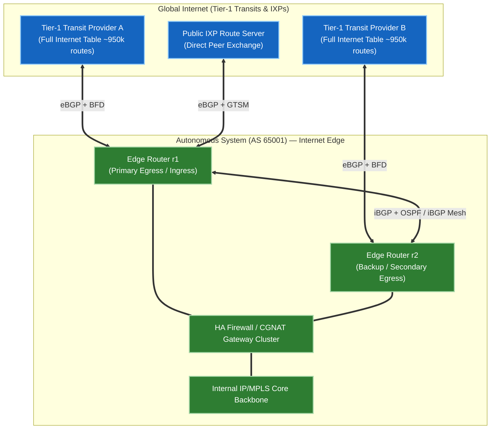
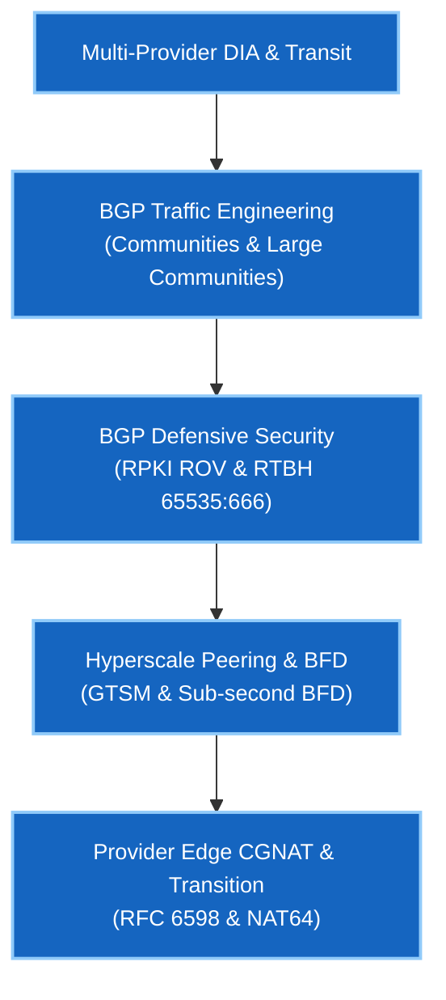

# Phase 2 — BGP-DIA & Internet Edge

> 🟢 **Phase 2 Live** — Validated on Arista cEOS 4.32.0F.

Phase 2 moves from internal routing topologies to the **Internet Edge**. This course covers how Internet Service Providers (ISPs), Cloud Service Providers, and Hyperscalers (Google, AWS, Meta) connect to the global Internet safely and at scale.

You will build multi-provider Direct Internet Access (DIA), configure ingress/egress BGP traffic engineering with Communities (Standard & Large RFC 8092), enforce RPKI Route Origin Validation, set up IXP peering with BFD/GTSM, and manage Carrier-Grade NAT (CGNAT).

---

## 🏛️ Internet Edge Architecture & Design Deep Dive

The Internet Edge represents the perimeter boundary where an Enterprise or Cloud Service Provider Autonomous System (AS) interconnects with Tier-1 Transits, Regional ISPs, and Internet Exchange Points (IXPs).

### Core Architectural Pillars

1. **Multi-Homing Redundancy & Transit Hierarchy**:
   - Single-homing creates a single point of failure (SPOF) for Internet connectivity. Multi-homing across geographically disparate ISPs (Tier-1 transits) ensures 99.999% availability against link cuts or provider outages.
   - **Full Feeds vs Default Route**: Edge routers can accept default routes (`0.0.0.0/0`) from providers to save FIB memory, or full BGP tables (~950,000 IPv4 prefixes) for granular egress traffic steering.

2. **Traffic Engineering (Symmetric & Asymmetric)**:
   - **Outbound (Egress)**: Direct control using BGP `LOCAL_PREF` (overrides `AS_PATH` length).
   - **Inbound (Ingress)**: Indirect control using `AS-Path Prepending`, `MED` (Multi-Exit Discriminator), and ISP-specific `BGP Communities` (RFC 1997 / RFC 8092).

3. **Perimeter Defensive Security**:
   - **RPKI Route Origin Validation (ROV)** drops hijacked prefix announcements at the WAN edge.
   - **Remotely Triggered Blackhole (RTBH)** drops volumetric DDoS attacks using `65535:666` signaling.
   - **Bogon & RFC 1918/6598 Filtering** prevents illegal private and unallocated IP space leakages.

4. **Peering & Sub-second Resilience**:
   - Direct IXP peering bypasses expensive Transit bandwidth costs and reduces latency.
   - **BFD (Bidirectional Forwarding Detection)** reduces link detection from 180 seconds down to <300 ms.
   - **GTSM (RFC 3682)** enforces IP TTL checks to block off-path BGP TCP spoofing.

---

## Course Matrix & Labs

| Lab | Description | Core Protocols & Concepts | Status |
|---|---|---|---|
| **[01](lab-01-dia-multihoming.md)** | Multi-Provider DIA & Traffic Engineering | Egress `LOCAL_PREF`, Ingress AS-Path Prepending, BGP Communities (`65000:70`), Large Communities (RFC 8092) | 🟢 **Validated** |
| **[02](lab-02-rpki-security.md)** | BGP Security: RPKI ROV & Bogon Filtering | RPKI Validation (`Valid`/`Invalid`), Transit Leak Protection, RTBH (`65535:666`) | 🟢 **Validated** |
| **[03](lab-03-ixp-peering.md)** | IXP Peering, GTSM & Sub-Second BFD | IXP Route Server Peering, BFD (`min_rx 300ms`), GTSM (`ttl-security`) | 🟢 **Validated** |
| **[04](lab-04-cgnat-services.md)** | CGNAT & Provider Edge Services | Carrier-Grade NAT (RFC 6598 `100.64.0.0/10`), DetNAT / PBA Port Allocation, NAT64/DNS64 | 🟢 **Validated** |

---

## Google Network Infrastructure Target Competencies

---

## Prerequisites

- **[Phase 1 · BGP Fundamentals](../01-bgp/index.md)** — eBGP/iBGP mechanics, next-hop-self, and route reflection.
- **[Foundations · Linux](../linux-foundations/index.md)** — Linux networking, `iproute2`, `tcpdump` flag math, and SSH configuration.

---

## Next Steps & Interview Practice

- **[Self-Test Interview Questions](interview-questions.md)** — Google NIE interview question bank covering DIA traffic engineering, RPKI, BGP communities, GTSM, BFD, and CGNAT.

