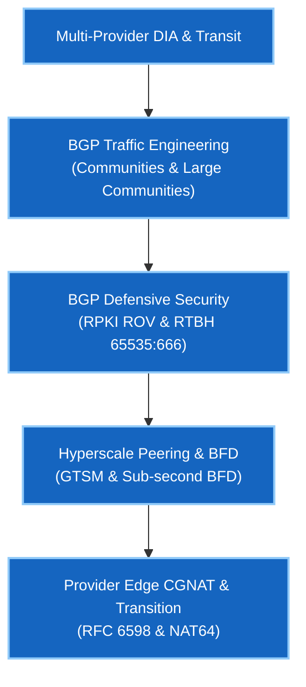

# Phase 2 — BGP-DIA & Internet Edge

> 🟢 **Phase 2 Live** — Validated on Arista cEOS 4.32.0F.

Phase 2 moves from internal routing topologies to the **Internet Edge**. This course covers how Internet Service Providers (ISPs), Cloud Service Providers, and Hyperscalers (Google, AWS, Meta) connect to the global Internet safely and at scale.

You will build multi-provider Direct Internet Access (DIA), configure ingress/egress BGP traffic engineering with Communities (Standard & Large RFC 8092), enforce RPKI Route Origin Validation, set up IXP peering with BFD/GTSM, and manage Carrier-Grade NAT (CGNAT).

---

## Course Matrix & Labs

| Lab | Description | Core Protocols & Concepts | Status |
|---|---|---|---|
| **[01](lab-01-dia-multihoming.md)** | Multi-Provider DIA & Traffic Engineering | Egress `LOCAL_PREF`, Ingress AS-Path Prepending, BGP Communities (`65000:70`), Large Communities (RFC 8092) | 🟢 **Validated** |
| **[02](lab-02-rpki-security.md)** | BGP Security: RPKI ROV & Bogon Filtering | RPKI Validation (`Valid`/`Invalid`), Transit Leak Protection, RTBH (`65535:666`) | 🟢 **Validated** |
| **[03](lab-03-ixp-peering.md)** | IXP Peering, GTSM & Sub-Second BFD | IXP Route Server Peering, BFD (`min_rx 300ms`), GTSM (`ttl-security`) | 🟢 **Validated** |
| **[04](lab-04-cgnat-services.md)** | CGNAT & Provider Edge Services | Carrier-Grade NAT (RFC 6598 `100.64.0.0/10`), DetNAT / PBA Port Allocation, NAT64/DNS64 | 🟢 **Validated** |

---

## Google Network Infrastructure Target Competencies

---

## Prerequisites

- **[Phase 1 · BGP Fundamentals](../01-bgp/index.md)** — eBGP/iBGP mechanics, next-hop-self, and route reflection.
- **[Foundations · Linux](../linux-foundations/index.md)** — Linux networking, `iproute2`, `tcpdump` flag math, and SSH configuration.

---

## Next Steps & Interview Practice

- **[Self-Test Interview Questions](interview-questions.md)** — Google NIE interview question bank covering DIA traffic engineering, RPKI, BGP communities, GTSM, BFD, and CGNAT.
