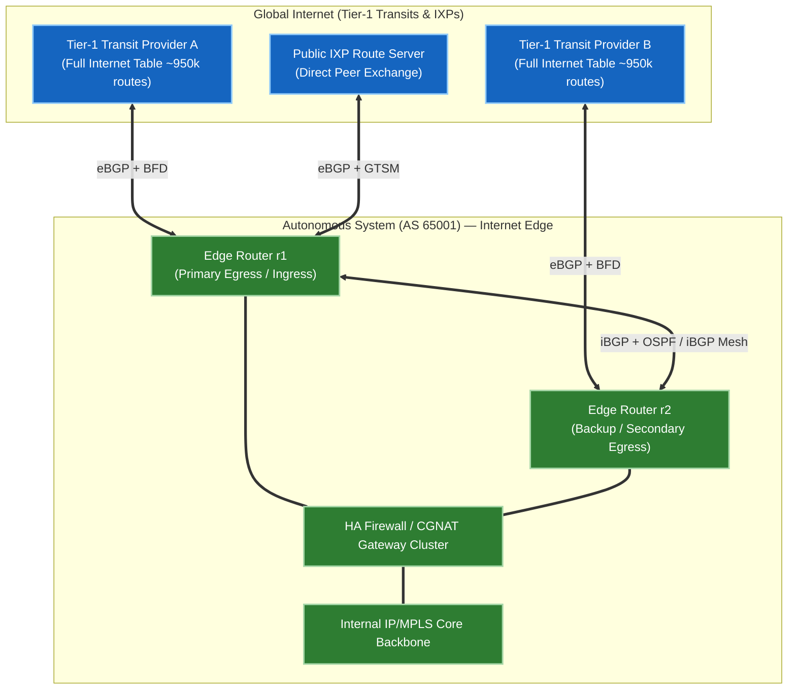
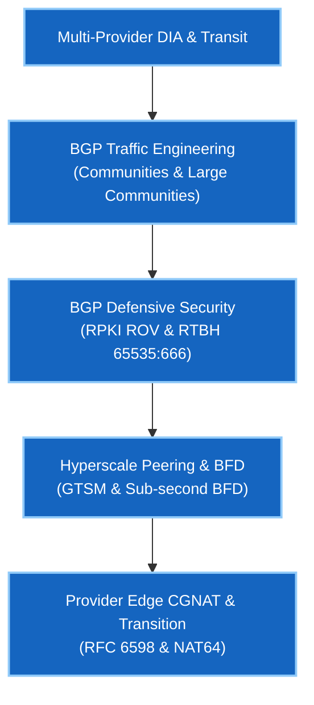

# Phase 2 — BGP-DIA & Internet Edge

> 🟢 **Phase 2 စတင်လေ့လာနိုင်ပါပြီ** — Arista cEOS 4.32.0F ပေါ်တွင် အောင်မြင်စွာ စမ်းသပ်အတည်ပြုပြီး ဖြစ်သည်။

Phase 2 သည် အတွင်းပိုင်း routing topologies များမှသည် **အင်တာနက် အစွန်းပိုင်း (Internet Edge)** သို့ ကူးပြောင်းလေ့လာခြင်း ဖြစ်ပါသည်။ ဤသင်တန်းတွင် ISPs၊ Cloud Service Providers များနှင့် Hyperscalers (Google, AWS, Meta) တို့သည် ကမ္ဘာလုံးဆိုင်ရာ အင်တာနက်နှင့် လုံခြုံစွာ၊ အတိုင်းအတာကြီးမားစွာ မည်သို့ ချိတ်ဆက်ကြသည်ကို လွှမ်းခြုံထားပါသည်။

Providers အများအပြားပါဝင်သော Direct Internet Access (DIA) ကို တည်ဆောက်ခြင်း၊ Communities (Standard & Large RFC 8092) ဖြင့် ingress/egress BGP traffic engineering ရေးဆွဲခြင်း၊ RPKI Route Origin Validation ဖြင့် hijacking ကို တားဆီးခြင်း၊ BFD/GTSM ပါဝင်သော IXP peering တည်ဆောက်ခြင်း၊ နှင့် Carrier-Grade NAT (CGNAT) စီမံခန့်ခွဲခြင်းတို့ကို လက်တွေ့ လေ့ကျင့်ရမည် ဖြစ်ပါသည်။

---

## 🏛️ Internet Edge ဗိသုကာနှင့် ဒီဇိုင်းပိုင်း အသေးစိတ် လေ့လာချက်

Internet Edge ဆိုသည်မှာ Enterprise သို့မဟုတ် Cloud Service Provider Autonomous System (AS) သည် Tier-1 Transits၊ Regional ISPs၊ နှင့် Internet Exchange Points (IXPs) များနှင့် ချိတ်ဆက်ထားသော နယ်နိမိတ်မျဉ်း ဖြစ်ပါသည်။

### အဓိက ဗိသုကာ မဏ္ဍိုင်ကြီးများ

၁။ **Multi-Homing Redundancy & Transit Hierarchy**:
   - Provider တစ်ခုတည်း ချိတ်ဆက်ခြင်း (Single-homing) သည် Single Point of Failure (SPOF) ဖြစ်စေပါသည်။ မတူညီသော Tier-1 transits များနှင့် multi-homing ချိတ်ဆက်ခြင်းသည် link ပြတ်တောက်မှု သို့မဟုတ် ISP ပြိုလဲမှုများမှ 99.999% availability ကို အာမခံပေးပါသည်။
   - **Full Feeds နှင့် Default Route**: Edge routers များသည် FIB memory ချွေတာရန် default routes (`0.0.0.0/0`) ကိုသာ လက်ခံနိုင်သလို၊ egress traffic ကို အတိအကျ ထိန်းကျောင်းရန် full BGP tables (~950,000 IPv4 prefixes) ကိုလည်း လက်ခံနိုင်ပါသည်။

၂။ **Traffic Engineering (Symmetric & Asymmetric)**:
   - **အထွက်လမ်းကြောင်း (Egress)**: BGP `LOCAL_PREF` ဖြင့် တိုက်ရိုက် ထိန်းချုပ်သည် (`AS_PATH` ထက် ဦးစားပေးမှု မြင့်သည်)။
   - **အဝင်လမ်းကြောင်း (Ingress)**: `AS-Path Prepending`၊ `MED`၊ နှင့် ISP အလိုက် `BGP Communities` (RFC 1997 / RFC 8092) တို့ဖြင့် သွယ်ဝိုက် ထိန်းချုပ်သည်။

၃။ **အစွန်းပိုင်း ကာကွယ်ရေး လုံခြုံရေး (Perimeter Defensive Security)**:
   - **RPKI Route Origin Validation (ROV)** သည် WAN edge တွင် တရားမဝင် route hijacking ကြေညာချက်များကို ပယ်ချပေးသည်။
   - **Remotely Triggered Blackhole (RTBH)** သည် `65535:666` signaling ဖြင့် volumetric DDoS တိုက်ခိုက်မှုများကို ဖယ်ရှားပေးသည်။
   - **Bogon & RFC 1918/6598 Filtering** သည် တရားမဝင် private နှင့် unallocated IP space များ အင်တာနက်ပေါ်သို့ leak မဖြစ်အောင် တားဆီးသည်။

၄။ **Peering နှင့် Sub-second Resilience**:
   - Direct IXP peering သည် ဈေးကြီးသော Transit bandwidth ကုန်ကျစရိတ်ကို လျှော့ချပေးပြီး latency ကို လျှော့ချပေးသည်။
   - **BFD (Bidirectional Forwarding Detection)** သည် link ပြတ်တောက်မှုကို စက္ကန့် ၁၈၀ စောင့်စရာမလိုဘဲ ၃၀၀ မီလီစက္ကန့် (<300ms) အတွင်း ချက်ချင်း သိရှိစေသည်။
   - **GTSM (RFC 3682)** သည် BGP TCP spoofing တိုက်ခိုက်မှုများကို ကာကွယ်ရန် IP TTL စစ်ဆေးမှုများကို ပြုလုပ်သည်။

---

## သင်ရိုးဇယားနှင့် လက်တွေ့ Labs

| Lab | ရှင်းလင်းချက် | အဓိက Protocols & သဘောတရားများ | လက်ရှိအခြေအနေ |
|---|---|---|---|
| **[01](lab-01-dia-multihoming.md)** | Multi-Provider DIA & Traffic Engineering | Egress `LOCAL_PREF`၊ Ingress AS-Path Prepending၊ BGP Communities (`65000:70`)၊ Large Communities (RFC 8092) | 🟢 **Validated** |
| **[02](lab-02-rpki-security.md)** | BGP Security: RPKI ROV & Bogon Filtering | RPKI Validation (`Valid`/`Invalid`)၊ Transit Leak Protection၊ RTBH (`65535:666`) | 🟢 **Validated** |
| **[03](lab-03-ixp-peering.md)** | IXP Peering, GTSM & Sub-Second BFD | IXP Route Server Peering၊ BFD (`min_rx 300ms`)၊ GTSM (`ttl-security`) | 🟢 **Validated** |
| **[04](lab-04-cgnat-services.md)** | CGNAT & Provider Edge Services | Carrier-Grade NAT (RFC 6598 `100.64.0.0/10`)၊ DetNAT / PBA Port Allocation၊ NAT64/DNS64 | 🟢 **Validated** |

---

## Google Network Infrastructure ဦးတည် ကျွမ်းကျင်မှုများ

---

## ကြိုတင် လိုအပ်ချက်များ

- **[Phase 1 · BGP Fundamentals](../01-bgp/index.md)** — eBGP/iBGP အလုပ်လုပ်ပုံ၊ next-hop-self၊ နှင့် route reflection။
- **[Foundations · Linux](../linux-foundations/index.md)** — Linux networking၊ `iproute2`၊ `tcpdump` flag math၊ နှင့် SSH configuration။

---

## နောက်ဆက်တွဲနှင့် အင်တာဗျူး လေ့ကျင့်ခန်းများ

- **[Self-Test အင်တာဗျူး မေးခွန်းများ](interview-questions.md)** — DIA traffic engineering၊ RPKI၊ BGP communities၊ GTSM၊ BFD၊ နှင့် CGNAT တို့ကို လွှမ်းခြုံထားသော Google NIE အင်တာဗျူး မေးခွန်းဘဏ်။
