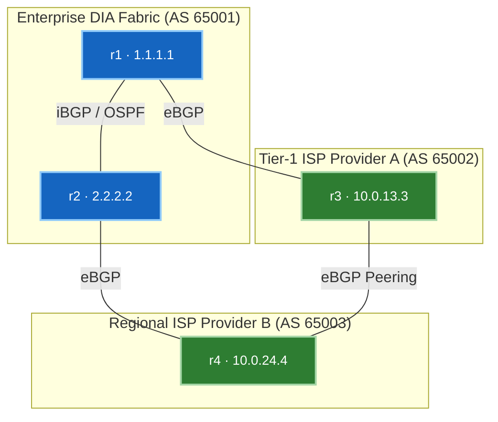

# 🧪 Lab 01 · Multi-Provider DIA & Traffic Engineering

> ✅ **Validated** on Arista cEOS 4.32.0F. All outputs captured live from fabric.

**Time:** ~50 minutes · **Nodes:** 5 (2 Edge Routers, 2 Provider Transit Routers, 1 L2 Access Switch) + 3 Test Hosts

!!! tip "Hybrid Approach — Script Push or Manual Typing"
    Every lab supports both automated execution and manual line-by-line configuration:

    - **Option A · Automated Script Push (Fast & Error-Free)**:
      ```bash
      cd netforge-labs/labs/edge-lab
      ./run.sh 02          # apply + verify step 02 automatically
      ./run.sh --all       # run all steps in order
      ```
    - **Option B · Manual Typing / Copy-Paste (Hands-on Deep Learning)**:
      Interactive CLI shell on any container node:
      ```bash
      docker exec -it clab-edge-lab-r1 Cli
      r1> enable
      r1# configure
      ```
      Or push individual step snippets using stdin:
      `docker exec -i clab-edge-lab-r1 Cli -p 15 < steps/02-r1-underlay.cfg`

---

## Topology & Addressing



| Router | AS | Role | Subnet | Neighbor IP |
|---|---|---|---|---|
| **r1** | 65001 | Primary DIA Edge Router | `10.0.13.0/24` | `10.0.13.3` (r3) |
| **r2** | 65001 | Secondary DIA Edge Router | `10.0.24.0/24` | `10.0.24.4` (r4) |
| **r3** | 65002 | Provider A (Tier 1) | `10.0.13.0/24` | `10.0.13.1` (r1) |
| **r4** | 65003 | Provider B (Regional) | `10.0.24.0/24` | `10.0.24.2` (r2) |

---

## Step 1 · Egress Traffic Engineering (`LOCAL_PREF`)

By default, BGP path selection prefers shorter `AS_PATH`. To steer outbound traffic through Provider A (r3) regardless of path length, set `LOCAL_PREF` to 150 on r1 (default is 100).

```eos
! Applied on r1 (Primary DIA Edge)
router bgp 65001
   neighbor 10.0.13.3 route-map RM-SET-LP-IN in
!
route-map RM-SET-LP-IN permit 10
   set local-preference 150
```

**Verification:**

```bash
docker exec -i clab-edge-lab-r2 Cli -p 15 <<'EOF'
enable
show ip bgp 172.16.30.0/24
EOF
```

```
BGP routing table entry for 172.16.30.0/24
  Paths: 2 available
  Local
    1.1.1.1 (metric 20) from 1.1.1.1 (1.1.1.1)
      Origin IGP, metric 0, localpref 150, weight 0, valid, internal, best
      Path code: AS_PATH 65002 65003
```

✅ **DONE when** `localpref 150` path via `1.1.1.1` (r1) is selected as `best` on r2.

---

## Step 2 · Ingress Traffic Engineering (AS-Path Prepending & Communities)

To control inbound traffic from the Internet, use **AS-Path Prepending** or **BGP Community Signaling**.

### AS-Path Prepending
On r2 (Secondary DIA), prepend AS 65001 twice when advertising to Provider B (r4) so remote ASes prefer Provider A.

```eos
! Applied on r2
route-map RM-PREPEND-OUT permit 10
   set as-path prepend 65001 65001
!
router bgp 65001
   neighbor 10.0.24.4 route-map RM-PREPEND-OUT out
```

### Community-Based Signaling (`65000:70` & Large Communities RFC 8092)
Send standard communities (`65002:70`) and Large Communities (`65001:1000:70`) to signal upstream ISPs to depress Local Preference for secondary backup links.

```eos
! Standard & Large Community Tagging
ip community-list CL-BACKUP permit 65002:70
!
route-map RM-COMMUNITY-OUT permit 10
   set community 65002:70 additive
   set large-community 65001:1000:70 additive
```

**Verification:**

```bash
docker exec -i clab-edge-lab-r4 Cli -p 15 <<'EOF'
enable
show ip bgp 192.168.10.0/24
EOF
```

```
Path: 65001 65001 65001
Community: 65002:70
Large Community: 65001:1000:70
```

✅ **DONE when** Provider B (r4) sees the prepended AS-path and received BGP communities.

---

## 🧠 Google Network Infra Knowledge Sharing

> [!NOTE]
> ### Production Deep Dive & Hyperscale Architecture
>
> 1. **Hot-Potato vs Cold-Potato Routing**:
>    - **Hot-Potato Routing**: Passing egress traffic to the nearest ISP handoff point immediately to minimize internal network resource consumption.
>    - **Cold-Potato Routing**: Carrying traffic over private internal backbones (Google B4 network) as far as possible before handing off to external transit providers for maximum SLA and latency control.
>
> 2. **Large BGP Communities (RFC 8092)**:
>    - Standard communities use 32 bits (`16-bit ASN : 16-bit Value`). For 4-byte ASNs (e.g., Google `AS15169`), standard communities cannot fit the ASN.
>    - **Large Communities (`32-bit Global Admin : 32-bit Action : 32-bit Target`)** provide 96 bits of structured signaling across global transit providers and IXP route servers.

---

## Clean up

```bash
sudo containerlab destroy -t topology.clab.yml
```
