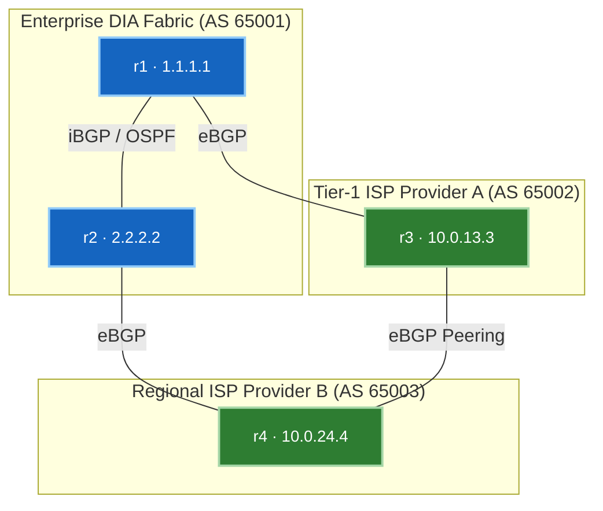

# 🧪 Lab 01 · Multi-Provider DIA နှင့် Traffic Engineering

> ✅ **Validated** on Arista cEOS 4.32.0F. Output အားလုံးကို live fabric မှ တိုက်ရိုက်ဖမ်းယူထားပါသည်။

**ကြာမြင့်ချိန်:** ~၅၀ မိနစ် · **Nodes အရေအတွက်:** ၅ ခု (Edge Routers ၂ ခု၊ Provider Transit Routers ၂ ခု၊ L2 Access Switch ၁ ခု) + Test Hosts ၃ ခု

!!! tip "အမြန်စတင်ရန် လမ်းညွှန် (တည်နေရာ: `labs/edge-lab/`)"
    **အဆင့် ၁ · Lab Fabric ကို စတင်လည်ပတ်ပါ (မ run ရသေးပါက)**
    ```bash
    cd labs/edge-lab
    sudo containerlab deploy -t topology.clab.yml --max-workers 1
    ```

    **အဆင့် ၂ · အပြန်အလှန် လမ်းညွှန်မှုပါရှိသော Interactive Walkthrough ကို စတင်ပါ**
    ```bash
    ./run.sh --guided
    ```

    ??? note "အခြား ရွေးချယ်နိုင်သော နည်းလမ်းများ (Automated Script သို့မဟုတ် Manual CLI)"
        - **အလိုအလျောက် Script ဖြင့် အမြန်ထည့်သွင်းခြင်း**:
          ```bash
          ./run.sh 01          # step 01 ကို apply နှင့် verify အလိုအလျောက် ပြုလုပ်ရန်
          ./run.sh --all       # အဆင့်အားလုံးကို အစဉ်လိုက် run ရန်
          ```
        - **Manual Line-by-Line CLI ဖြင့် လုပ်ဆောင်ခြင်း**:
          Container node ပေါ်တွင် တိုက်ရိုက် interactive CLI shell ဖွင့်ရန်:
          ```bash
          docker exec -it clab-edge-lab-r1 Cli
          ```

---

## Topology နှင့် Addressing အခင်းအကျင်း



| Router | AS | အခန်းကဏ္ဍ (Role) | Subnet | Neighbor IP |
|---|---|---|---|---|
| **r1** | 65001 | Primary DIA Edge Router | `10.0.13.0/24` | `10.0.13.3` (r3) |
| **r2** | 65001 | Secondary DIA Edge Router | `10.0.24.0/24` | `10.0.24.4` (r4) |
| **r3** | 65002 | Provider A (Tier 1) | `10.0.13.0/24` | `10.0.13.1` (r1) |
| **r4** | 65003 | Provider B (Regional) | `10.0.24.0/24` | `10.0.24.2` (r2) |

---

## အဆင့် ၁ · အပြင်ထွက်ခွာသော Egress Traffic Engineering (`LOCAL_PREF`)

Default အားဖြင့် BGP path selection သည် ပိုမိုတိုတောင်းသော `AS_PATH` ကို ရွေးချယ်သည်။ လမ်းကြောင်းအလျား မည်မျှပင်ရှည်စေကာမူ Outbound traffic များကို Provider A (r3) မှတစ်ဆင့်သာ အမြဲထွက်ခွာစေရန်အတွက် r1 ပေါ်တွင် `LOCAL_PREF` ကို 150 သတ်မှတ်ပါမည် (Default တန်ဖိုးမှာ 100 ဖြစ်သည်)။

```eos
! Applied on r1 (Primary DIA Edge)
router bgp 65001
   neighbor 10.0.13.3 route-map RM-SET-LP-IN in
!
route-map RM-SET-LP-IN permit 10
   set local-preference 150
```

**စစ်ဆေးအတည်ပြုခြင်း:**

```bash
docker exec -i clab-edge-lab-r2 Cli -p 15 <<'EOF'
enable
show ip bgp 172.16.30.0/24
EOF
```

```
BGP routing table entry for 172.16.30.0/24
  Paths: 2 available
  Local
    1.1.1.1 (metric 20) from 1.1.1.1 (1.1.1.1)
      Origin IGP, metric 0, localpref 150, weight 0, valid, internal, best
      Path code: AS_PATH 65002 65003
```

✅ `1.1.1.1` (r1) မှတစ်ဆင့် လာသော `localpref 150` လမ်းကြောင်းသည် r2 ပေါ်တွင် `best` အဖြစ် ရွေးချယ်ခံရပါက **ပြီးမြောက်ပါပြီ**။

---

## အဆင့် ၂ · အတွင်းသို့ ဝင်ရောက်လာသော Ingress Traffic Engineering (AS-Path Prepending နှင့် Communities)

Internet မှတစ်ဆင့် အတွင်းသို့ ဝင်ရောက်လာသော Inbound traffic များကို ထိန်းချုပ်ရန် **AS-Path Prepending** သို့မဟုတ် **BGP Community Signaling** ကို အသုံးပြုနိုင်သည်။

### AS-Path Prepending
r2 (Secondary DIA) ပေါ်တွင် Provider B (r4) ဆီသို့ ကြေညာသည့်အခါ အဝေးရှိ AS များအနေဖြင့် Provider A ကိုသာ ဦးစားပေး ရွေးချယ်သွားစေရန် AS 65001 ကို နှစ်ကြိမ် ထပ်ဆင့် prepend ပြုလုပ်ပါမည်။

```eos
! Applied on r2
route-map RM-PREPEND-OUT permit 10
   set as-path prepend 65001 65001
!
router bgp 65001
   neighbor 10.0.24.4 route-map RM-PREPEND-OUT out
```

### Community-Based Signaling (`65000:70` နှင့် Large Communities RFC 8092)
Secondary backup links များအတွက် Upstream ISPs များအား Local Preference လျှော့ချပေးရန် အချက်ပြသည့် Standard communities (`65002:70`) နှင့် Large Communities (`65001:1000:70`) များကို ပေးပို့ပါမည်။

```eos
! Standard & Large Community Tagging
ip community-list CL-BACKUP permit 65002:70
!
route-map RM-COMMUNITY-OUT permit 10
   set community 65002:70 additive
   set large-community 65001:1000:70 additive
```

**စစ်ဆေးအတည်ပြုခြင်း:**

```bash
docker exec -i clab-edge-lab-r4 Cli -p 15 <<'EOF'
enable
show ip bgp 192.168.10.0/24
EOF
```

```
Path: 65001 65001 65001
Community: 65002:70
Large Community: 65001:1000:70
```

✅ Provider B (r4) သည် Prepended AS-path နှင့် ပေးပို့ထားသော BGP communities များကို လက်ခံရရှိထားသည်ကို တွေ့ရပါက **ပြီးမြောက်ပါပြီ**။

---

## 🧠 Google Network Infra ဗဟုသုတ မျှဝေခြင်းနှင့် Protocol သဘောတရားများ

> [!NOTE]
> ### ၁။ BGP Path Selection Decision Algorithm (အဆင့်ဆင့် အစဉ်လိုက်)
> Destination prefix တစ်ခုအတွက် လမ်းကြောင်းများစွာ ရှိနေပါက Arista EOS / Cisco NX-OS သည် BGP Decision Process ကို တိကျသော အစဉ်လိုက်အတိုင်း စစ်ဆေးသည်။ ကိုက်ညီမှုစတင်တွေ့ရှိသော ပထမဆုံး အဆင့်က အနိုင်ရရှိသည် -
>
> | အဆင့် | စံနှုန်း (Criteria) | Default တန်ဖိုး | အတိုင်းအတာ (Scope) | ရှင်းလင်းချက် |
> |:---:|---|:---:|:---:|---|
> | **၁** | **Weight** (Cisco/Arista Proprietary) | `0` (Local: `32768`) | Local Router | အမြင့်ဆုံး weight က အနိုင်ရသည်။ Peers များထံ မပို့မီ စစ်ဆေးသည်။ |
> | **၂** | **`LOCAL_PREF`** | `100` | iBGP Domain | **အမြင့်ဆုံး `LOCAL_PREF` က အနိုင်ရသည်။** Outbound Egress Traffic Engineering အတွက် အသုံးပြုသည်။ |
> | **၃** | **Self-Originated** | - | Local Router | လက်ခံရရှိသော route ထက် `network` သို့မဟုတ် `redistribute` မှတစ်ဆင့် local တွင် စတင်ထုတ်လွှင့်သော route ကို ပိုမိုဦးစားပေးသည်။ |
> | **၄** | **`AS_PATH` Length** | - | Global BGP | **အတိုဆုံး `AS_PATH` အလျားက အနိုင်ရသည်။** (`bgp bestpath as-path ignore` သတ်မှတ်ထားပါက ကျော်သွားသည်)။ |
> | **၅** | **Origin Code** | `IGP` | Global BGP | `IGP` (`i`) > `EGP` (`e`) > `Incomplete` (`?`) အတိုင်း ဦးစားပေးသည်။ |
> | **၆** | **`MED` (Multi-Exit Discriminator)**| `0` | Neighbor AS | **အနိမ့်ဆုံး `MED` က အနိုင်ရသည်။** တူညီသော neighbor AS မှ လာသည့် paths များအချင်းချင်းကြားတွင်သာ နှိုင်းယှဉ်သည်။ |
> | **၇** | **Peer Type** | - | Session | **eBGP** paths များကို **iBGP** paths များထက် ပိုမိုဦးစားပေးသည်။ |
> | **၈** | **Next-Hop ဆီသို့ IGP Metric** | - | Underlay IGP | BGP `NEXT_HOP` ဆီသို့ IGP cost (OSPF/IS-IS) အနည်းဆုံး လမ်းကြောင်းကို ရွေးချယ်သည်။ |
> | **၉** | **Multipath / ECMP** | - | FIB | အဆင့် ၈ အထိ တူညီနေပြီး `maximum-paths` သတ်မှတ်ထားပါက ပြိုင်တူ ECMP routes များကို install လုပ်ပေးသည်။ |
> | **၁၀** | **BGP Router ID** | - | Session | ကိန်းဂဏန်းတန်ဖိုး အနိမ့်ဆုံး BGP Router ID ရှိသော peer လမ်းကြောင်းကို ရွေးချယ်သည်။ |

> [!IMPORTANT]
> ### ၂။ Standard နှင့် Large BGP Communities Wire Format နှိုင်းယှဉ်ချက် (RFC 1997 နှင့် RFC 8092)
>
> - **Standard Communities (RFC 1997)**:
>   - အရွယ်အစား: **32 bits (4 bytes)** ဖြစ်ပြီး `16-bit ASN : 16-bit Action Value` ပုံစံဖြင့် ရေးသားသည်။
>   - ကန့်သတ်ချက်: ခေတ်သစ် Autonomous Systems များသည် 32-bit 4-byte ASNs (ဥပမာ Google `AS15169`, Cloudflare `AS13335`) များကို အသုံးပြုကြသောကြောင့် 4-byte ASN တစ်ခုသည် Standard community ၏ 16-bit ASN field ထဲတွင် နေရာမဆန့်တော့ပါ!
>   - ဥပမာ: `65002:70` (AS 65002၊ Action 70)။
>
> - **Large BGP Communities (RFC 8092)**:
>   - အရွယ်အစား: **96 bits (12 bytes)** ဖြစ်ပြီး သီးခြား 32-bit fields ၃ ခုဖြင့် ဖွဲ့စည်းထားသည်:
>     $$\text{Large Community} = [\text{32-bit Global Administrator}] : [\text{32-bit Action}] : [\text{32-bit Parameter / Target}]$$
>   - ဥပမာ: `65001:1000:70` (`Global Admin: AS 65001`၊ `Action: Depress LocalPref`၊ `Target: Transit AS 70`)။
>   - အားသာချက်: 4-byte ASN ပိုင်ရှင်များ (Google AS15169 ကဲ့သို့) အနေဖြင့် global intent၊ action codes များနှင့် target peer AS numbers များကို အချက်အလက်မပြတ်တောက်ဘဲ တိကျသန့်ရှင်းစွာ ထည့်သွင်းအသုံးပြုနိုင်စေသည်။

> [!TIP]
> ### ၃။ Asymmetric Routing နှင့် Stateful Security Engineering
>
> Multi-homed DIA ပတ်ဝန်းကျင်များတွင် အပြင်သို့ထွက်သော Outbound packets များသည် Path A (Provider A မှတစ်ဆင့်) သွားပြီး၊ ပြန်လည်ဝင်ရောက်လာသော Inbound packets များသည် Path B (Provider B မှတစ်ဆင့်) ပြန်လာတတ်သည် (Asymmetric Routing ဖြစ်သည်)။
>
> ```
> [Enterprise LAN] ──> Egress (r1 / Provider A) ──> [Target Web Server]
> [Enterprise LAN] <── Ingress (r2 / Provider B) <── [Target Web Server]  (Asymmetric!)
> ```
>
> - **Stateful Firewall ချို့ယွင်းမှု**: အကယ်၍ Edge routers များ၏ နောက်ကွယ်တွင် session synchronization မရှိသော Stateful firewalls များကို တပ်ဆင်ထားပါက Provider B မှ ဝင်ရောက်လာသော inbound packets များကို drop ပစ်ပါလိမ့်မည်၊ အကြောင်းမှာ Firewall B တွင် Firewall A က ကိုင်တွယ်ခဲ့သော TCP SYN handshake မှတ်တမ်း မရှိသောကြောင့် ဖြစ်သည်။
> - **ဖြေရှင်းနည်း မဟာဗျူဟာများ**:
>   ၁။ **Asymmetric Routing Groups (ARG) / Stateful Session Sync**: Firewalls များကို သီးသန့် sync link များပါရှိသော Active-Active HA clusters များအဖြစ် ချိတ်ဆက်ထားရှိခြင်း။
>   ၂။ **Strict Symmetrical Ingress Steering**: BGP Large Communities နှင့် AS-Path Prepending များကို အသုံးပြု၍ အဝေးရှိ ASes များအား Egress traffic ကို ကိုင်တွယ်သော တူညီသည့် edge router မှတစ်ဆင့်သာ Ingress traffic ပြန်လည်ပေးပို့ရန် အတင်းအကျပ် ဖိအားပေးခြင်း။

---

## စမ်းသပ်ခန်း အပြီးသတ် သိမ်းဆည်းခြင်း (Clean up)

```bash
sudo containerlab destroy -t topology.clab.yml
```
