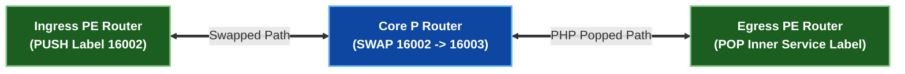
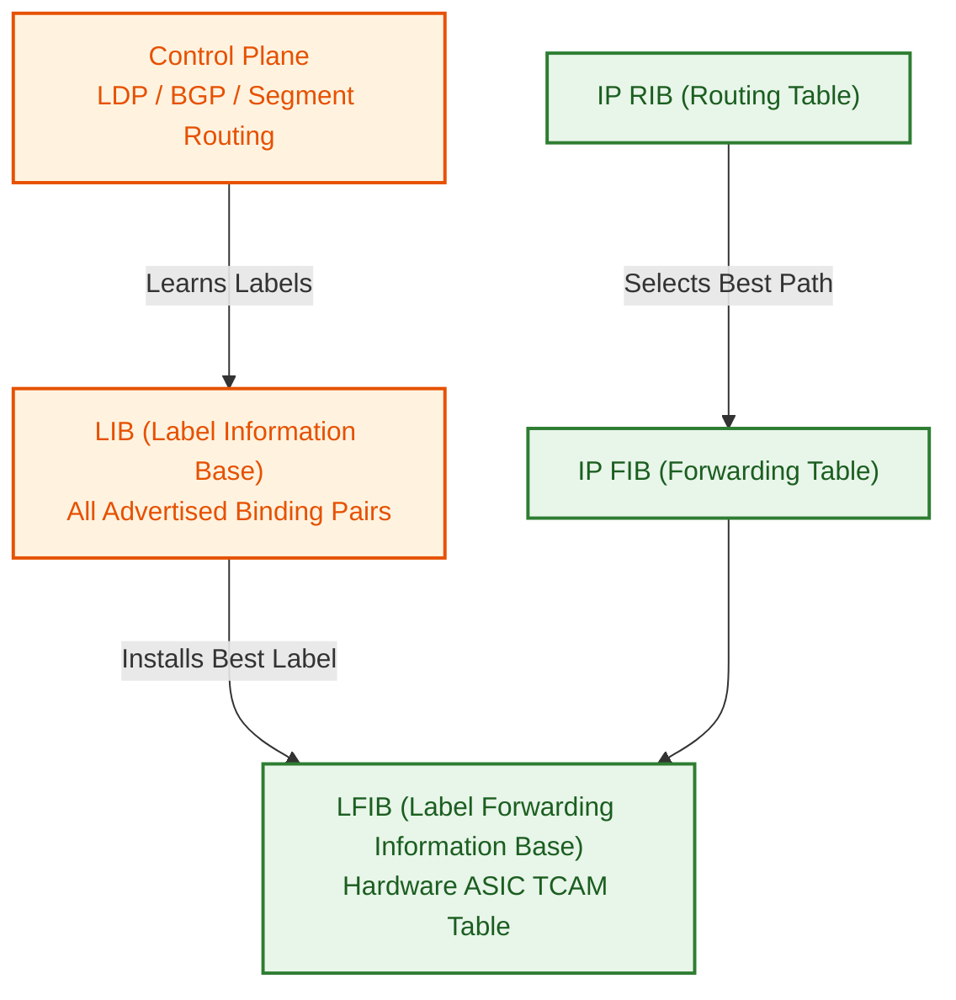

# 1 · MPLS Architecture & Header Mechanics

Multiprotocol Label Switching (MPLS) replaces slow, computationally expensive 32-bit IPv4 / 128-bit IPv6 **longest-prefix match (LPM)** routing lookups at every intermediate router with fast $O(1)$ hardware **label swapping**.

---

## The 32-Bit MPLS Shim Header Format

An MPLS label header (often called a **shim header**) is inserted between the Layer 2 Data-Link header (e.g. Ethernet EtherType `0x8847` for unicast, `0x8848` for multicast) and the Layer 3 IP payload.

```
 0                   1                   2                   3
 0 1 2 3 4 5 6 7 8 9 0 1 2 3 4 5 6 7 8 9 0 1 2 3 4 5 6 7 8 9 0 1
+-+-+-+-+-+-+-+-+-+-+-+-+-+-+-+-+-+-+-+-+-+-+-+-+-+-+-+-+-+-+-+-+
|                Label Value (20 bits)          | TC  |S|  TTL  |
+-+-+-+-+-+-+-+-+-+-+-+-+-+-+-+-+-+-+-+-+-+-+-+-+-+-+-+-+-+-+-+-+
                                                (3b) (1b) (8b)
```

### Field Breakdown

| Field | Bit Length | Description |
|---|---|---|
| **Label Value** | 20 bits | Range: `0 – 1,048,575`. Identifies the Forwarding Equivalence Class (FEC). |
| **Traffic Class (TC / Exp)** | 3 bits | QoS / CoS priority markings (formerly Experimental bits). Maps 1:1 to IP DSCP / Precedence. |
| **Bottom of Stack (S bit)** | 1 bit | `S = 1` indicates the **bottom** (innermost) label in a stack. `S = 0` indicates more labels follow. |
| **Time to Live (TTL)** | 8 bits | Decremented at every MPLS hop to prevent routing loops. Copied from IP TTL at ingress. |

---

## Reserved Label Values (0 – 15)

RFC 3032 reserves the first 16 label values for special control plane functions:

- **Label 0 (`Explicit Null` for IPv4)**: Instructs the egress router to preserve TC/QoS bits while popping the label.
- **Label 2 (`Explicit Null` for IPv6)**: Preserves IPv6 Traffic Class / QoS bits on egress.
- **Label 3 (`Implicit Null`)**: Instructs the upstream (penultimate) router to pop the label (**Penultimate Hop Popping — PHP**), delivering an unlabelled IP packet to the egress router.

---

## MPLS Label Operations: Push, Swap, Pop



1. **PUSH (Imposition)**: Performed by the **Ingress PE**. Inserts one or more MPLS shim headers onto an unlabelled IP packet entering the MPLS domain.
2. **SWAP**: Performed by intermediate **P Core Routers**. Replaces the incoming top MPLS label with a new outgoing label learned from LDP/SR.
3. **POP (Disposition)**: Performed by the **Penultimate Hop (PHP)** or **Egress PE**. Removes the top MPLS label header.

---

## Control Plane vs Data Plane Tables (LIB vs LFIB)



- **LIB (Label Information Base)**: Control-plane database storing **all** label bindings received from all LDP peers.
- **LFIB (Label Forwarding Information Base)**: Hardware ASIC data-plane table containing **only the best** incoming label $\rightarrow$ action (Push/Swap/Pop) $\rightarrow$ outgoing label $\rightarrow$ next-hop interface mappings.
