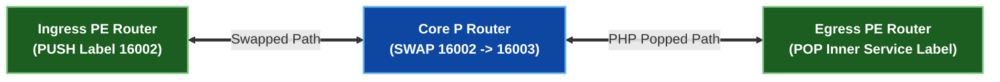
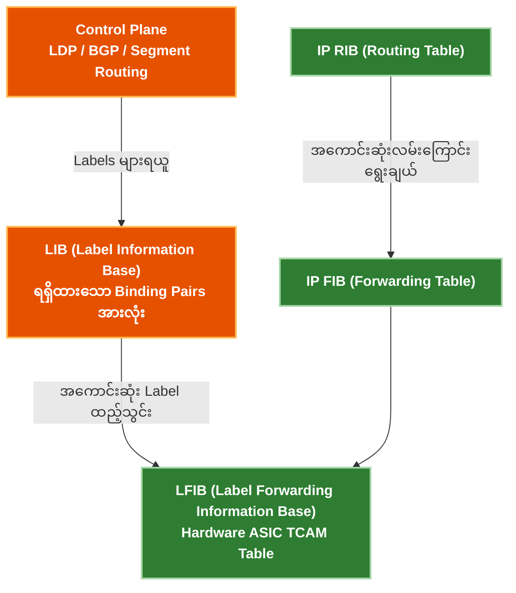

# ၁ · MPLS ဗိသုကာနှင့် Header အလုပ်လုပ်ပုံ {: #1-mpls-architecture-header-mechanics }

Multiprotocol Label Switching (MPLS) သည် ကြားခံ router တိုင်းတွင် အချိန်ကုန်ပြီး တွက်ချက်မှုများပြားသော 32-bit IPv4 / 128-bit IPv6 **longest-prefix match (LPM)** လမ်းကြောင်းရှာဖွေမှုများကို မြန်ဆန်သော $O(1)$ hardware **label swapping** ဖြင့် အစားထိုးပေးပါသည်။

---

## 32-Bit MPLS Shim Header ဖွဲ့စည်းပုံ {: #the-32-bit-mpls-shim-header-format }

MPLS label header (အများအားဖြင့် **shim header** ဟုခေါ်သည်) ကို Layer 2 Data-Link header (ဥပမာ Ethernet EtherType `0x8847` unicast အတွက်၊ `0x8848` multicast အတွက်) နှင့် Layer 3 IP payload ကြားတွင် ထည့်သွင်းထားပါသည်။

```
 0                   1                   2                   3
 0 1 2 3 4 5 6 7 8 9 0 1 2 3 4 5 6 7 8 9 0 1 2 3 4 5 6 7 8 9 0 1
+-+-+-+-+-+-+-+-+-+-+-+-+-+-+-+-+-+-+-+-+-+-+-+-+-+-+-+-+-+-+-+-+
|                Label Value (20 bits)          | TC  |S|  TTL  |
+-+-+-+-+-+-+-+-+-+-+-+-+-+-+-+-+-+-+-+-+-+-+-+-+-+-+-+-+-+-+-+-+
                                                (3b) (1b) (8b)
```

### Field အသေးစိတ်ရှင်းလင်းချက် {: #field-breakdown }

| Field | Bit အရှည် | ရှင်းလင်းချက် |
|---|---|---|
| **Label Value** | 20 bits | တန်ဖိုးအပိုင်းအခြား: `0 – 1,048,575`။ Forwarding Equivalence Class (FEC) ကို သတ်မှတ်ဖော်ပြသည်။ |
| **Traffic Class (TC / Exp)** | 3 bits | QoS / CoS ဦးစားပေးအဆင့် သတ်မှတ်ချက်များ (ယခင်က Experimental bits ဟုခေါ်သည်)။ IP DSCP / Precedence နှင့် 1:1 တိုက်ရိုက်ချိတ်ဆက်သည်။ |
| **Bottom of Stack (S bit)** | 1 bit | `S = 1` သည် label stack ၏ **အောက်ဆုံး (innermost)** label ဖြစ်ကြောင်း ဖော်ပြသည်။ `S = 0` သည် နောက်ထပ် label များ ပါရှိသေးကြောင်း ပြသသည်။ |
| **Time to Live (TTL)** | 8 bits | Routing loop များကို ကာကွယ်ရန် MPLS hop တိုင်းတွင် လျှော့ချပေးသည်။ Ingress တွင် IP TTL မှ ကူးယူသည်။ |

---

## သီးသန့်သတ်မှတ်ထားသော Label တန်ဖိုးများ (0 – 15) {: #reserved-label-values-0-15 }

RFC 3032 အရ ပထမ label တန်ဖိုး ၁၆ ခုကို အထူး control plane လုပ်ငန်းစဉ်များအတွက် သီးသန့်ဖယ်ထားပါသည်:

- **Label 0 (`Explicit Null` for IPv4)**: Label ကို ဖြုတ်ပယ် (pop) သော်လည်း Egress router အား TC/QoS bit များကို ထိန်းသိမ်းထားရှိရန် ညွှန်ကြားသည်။
- **Label 2 (`Explicit Null` for IPv6)**: Egress ပေါ်တွင် IPv6 Traffic Class / QoS bit များကို မပျောက်ပျက်စေဘဲ ထိန်းသိမ်းပေးသည်။
- **Label 3 (`Implicit Null`)**: အထက်ရှိ router (penultimate router) အား label ကို အရင်ဖြုတ်ထုတ်ရန် (**Penultimate Hop Popping — PHP**) ညွှန်ကြားပြီး egress router ထံသို့ unlabelled IP packet တိုက်ရိုက်ပေးပို့စေသည်။

---

## MPLS Label လုပ်ဆောင်ချက်များ: Push, Swap, Pop {: #mpls-label-operations-push-swap-pop }



1. **PUSH (Imposition)**: **Ingress PE** မှ လုပ်ဆောင်သည်။ MPLS domain ထဲသို့ ဝင်ရောက်လာသော unlabelled IP packet ပေါ်သို့ MPLS shim header တစ်ခု သို့မဟုတ် တစ်ခုထက်ပို၍ ထည့်သွင်း (insert) ပေးသည်။
2. **SWAP**: ကြားခံ **P Core Routers** များမှ လုပ်ဆောင်သည်။ ဝင်ရောက်လာသော အပေါ်ဆုံး MPLS label ကို LDP/SR မှ သိရှိထားသော outgoing label အသစ်ဖြင့် အစားထိုးလဲလှယ်ပေးသည်။
3. **POP (Disposition)**: **Penultimate Hop (PHP)** သို့မဟုတ် **Egress PE** မှ လုပ်ဆောင်သည်။ အပေါ်ဆုံး MPLS label header ကို ဖြုတ်ပယ်ပေးသည်။

---

## Control Plane နှင့် Data Plane ဇယားများ (LIB vs LFIB) {: #control-plane-vs-data-plane-tables-lib-vs-lfib }



- **LIB (Label Information Base)**: ချိတ်ဆက်ထားသော LDP peer အားလုံးထံမှ ရရှိသည့် label binding **အားလုံး** ကို သိမ်းဆည်းထားသော control-plane ဒေတာဘေ့စ်ဖြစ်ပါသည်။
- **LFIB (Label Forwarding Information Base)**: Hardware ASIC data-plane ဇယားဖြစ်ပြီး **အကောင်းဆုံးရွေးချယ်ထားသော** incoming label → action (Push/Swap/Pop) → outgoing label → next-hop interface လမ်းကြောင်းများကိုသာ ထည့်သွင်းပေးပို့ပါသည်။
