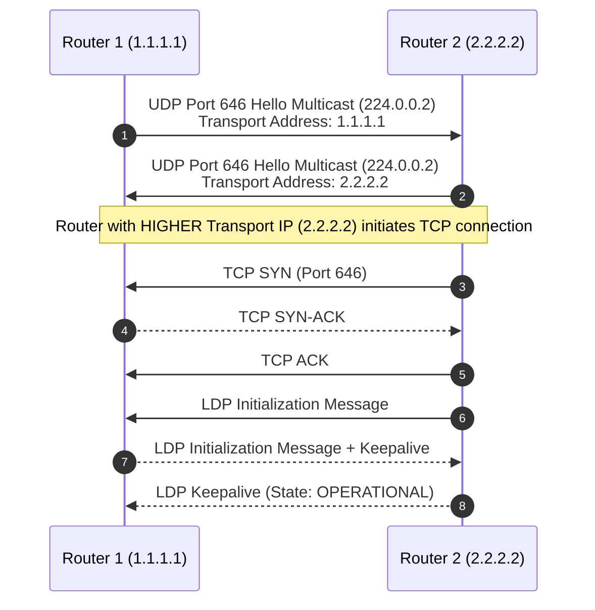

# 2 · LDP & Label Distribution Protocol Mechanics

**Label Distribution Protocol (LDP, RFC 5036)** is the standard control plane protocol used to build Label-Switched Paths (LSPs) across an MPLS network by binding local labels to IP prefixes learned from the underlay IGP (OSPF or IS-IS).

---

## LDP Session Establishment (UDP Discovery + TCP Session)

LDP uses a two-phase initialization process combining UDP discovery and TCP reliable session state:

1. **Discovery Phase (UDP Port 646)**: Routers send periodic LDP Link Hellos to multicast address `224.0.0.2` on all LDP-enabled interfaces.
2. **Session Phase (TCP Port 646)**: The router with the **higher numerical LDP Transport IP** initiates a 3-way TCP handshake to port 646.
3. **PDU Exchange**: Routers exchange LDP Initialization and Keepalive PDUs until reaching state `OPERATIONAL`.

---

## Label Distribution Modes: DU vs DoD, Independent vs Ordered

| Operating Mode | Options | Description | Standard Usage |
|---|---|---|---|
| **Label Distribution** | **Downstream Unsolicited (DU)** | Routers automatically advertise label bindings to all LDP peers without waiting for a request. | **Default on Cisco & Arista** |
| | **Downstream on Demand (DoD)** | Routers only advertise a label binding when explicitly requested by an upstream peer. | ATM / legacy circuits |
| **Label Control** | **Ordered Control** | A router only advertises a label for a prefix if it is the egress router OR has received a label from its downstream next-hop. | **Default & Standard** |
| | **Independent Control** | Routers create and advertise label bindings for any route in their RIB immediately, regardless of downstream state. | Legacy behavior |
| **Label Retention** | **Liberal Retention** | Keeps all received label bindings in the LIB even if they are not from the current IGP next-hop. | **Default (Fast Reroute)** |
| | **Conservative Retention** | Discards received label bindings if they are not from the current IGP next-hop. | Memory constrained |

---

## LDP-IGP Synchronization

When a link recovers, OSPF/IS-IS converges faster than LDP session establishment. If traffic is forwarded over the link before LDP has distributed labels, packets are dropped.

- **LDP-IGP Sync Solution**: OSPF/IS-IS advertises **maximum metric (65535)** on the recovering link until the LDP session reaches `OPERATIONAL` state, keeping transit traffic on backup paths until labels are fully programmed!
