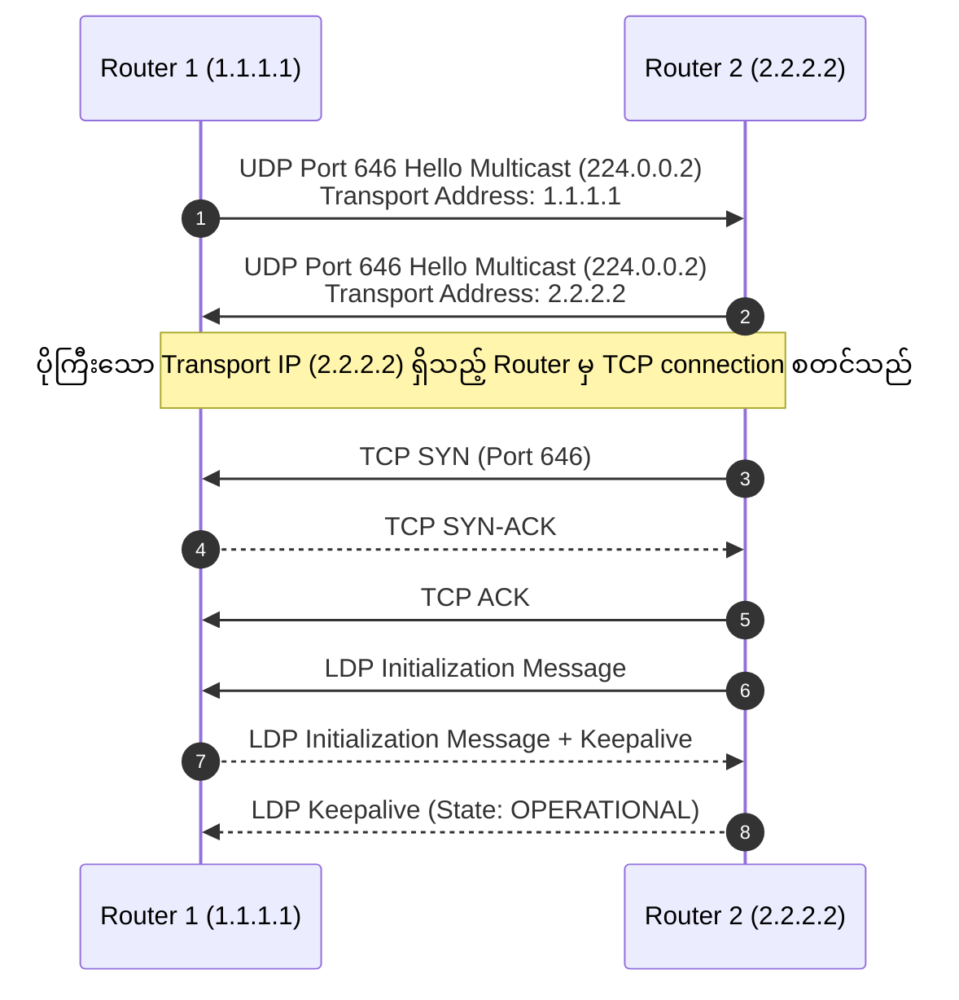

# ၂ · LDP နှင့် Label ပေးပို့ဖြန့်ဝေခြင်း နည်းစနစ်များ {: #2-ldp-label-distribution-protocol-mechanics }

**Label Distribution Protocol (LDP, RFC 5036)** သည် underlay IGP (OSPF သို့မဟုတ် IS-IS) မှ သိရှိထားသော IP prefix များကို local label များနှင့် ချိတ်ဆက် (bind) ပေးပြီး MPLS ကွန်ရက်တစ်လျှောက် Label-Switched Paths (LSPs) များကို တည်ဆောက်ပေးသည့် စံနှုန်းသတ်မှတ်ထားသော control plane protocol ဖြစ်ပါသည်။

---

## LDP Session တည်ဆောက်ခြင်း (UDP Discovery + TCP Session) {: #ldp-session-establishment }

LDP သည် UDP discovery နှင့် TCP စိတ်ချရသော session အခြေအနေတို့ကို ပေါင်းစပ်ထားသည့် အဆင့်နှစ်ဆင့်ပါဝင်သော စတင်လည်ပတ်မှု လုပ်ငန်းစဉ်ကို အသုံးပြုပါသည်:

1. **Discovery Phase (UDP Port 646)**: Router များသည် LDP ဖွင့်ထားသော interface အားလုံးပေါ်တွင် multicast လိပ်စာ `224.0.0.2` သို့ အချိန်မှန် LDP Link Hellos ပေးပို့ကြသည်။
2. **Session Phase (TCP Port 646)**: ကိန်းဂဏန်းအရ **ပိုကြီးသော LDP Transport IP** ရှိသည့် router က port 646 သို့ 3-way TCP handshake စတင်ချိတ်ဆက်သည်။
3. **PDU Exchange**: Router များသည် `OPERATIONAL` အခြေအနေသို့ ရောက်ရှိသည်အထိ LDP Initialization နှင့် Keepalive PDUs များကို အပြန်အလှန် လဲလှယ်ကြသည်။

---

## Label ပေးပို့ဖြန့်ဝေမှု ပုံစံများ: DU vs DoD, Independent vs Ordered {: #label-distribution-modes }

| လုပ်ဆောင်မှုပုံစံ | ရွေးချယ်စရာများ | ရှင်းလင်းချက် | စံနှုန်းအရ အသုံးပြုမှု |
|---|---|---|---|
| **Label Distribution** | **Downstream Unsolicited (DU)** | Router များသည် တောင်းဆိုမှုကို စောင့်ဆိုင်းခြင်းမရှိဘဲ LDP peer အားလုံးထံသို့ label binding များကို အလိုအလျောက် ကြေညာပေးပို့သည်။ | **Cisco နှင့် Arista တွင် Default** |
| | **Downstream on Demand (DoD)** | အထက် router (upstream peer) မှ တိကျစွာ တောင်းဆိုမှသာ router သည် label binding ကို ကြေညာပေးပို့သည်။ | ATM / ရှေးဟောင်း circuits များ |
| **Label Control** | **Ordered Control** | Router တစ်ခုသည် မိမိကိုယ်တိုင် egress router ဖြစ်မှသာ သို့မဟုတ် downstream next-hop ထံမှ label ရရှိပြီးမှသာ prefix အတွက် label ကို စတင်ကြေညာသည်။ | **Default နှင့် Standard စံနှုန်း** |
| | **Independent Control** | Downstream အခြေအနေကို ထည့်မတွက်ဘဲ မိမိ RIB ထဲရှိ မည်သည့် route အတွက်မဆို label binding များကို ချက်ချင်းဖန်တီး၍ ကြေညာသည်။ | ရှေးဟောင်းပုံစံ |
| **Label Retention** | **Liberal Retention** | လက်ရှိ IGP next-hop မဟုတ်သော်လည်း ရရှိသမျှ label binding အားလုံးကို LIB ထဲတွင် သိမ်းဆည်းထားသည်။ | **Default (Fast Reroute အတွက် အဆင်ပြေစေသည်)** |
| | **Conservative Retention** | လက်ရှိ IGP next-hop ထံမှ မဟုတ်သော ရရှိသည့် label binding များကို ပယ်ဖျက်သည်။ | Memory အကန့်အသတ်ရှိသော နေရာများတွင်သုံးသည် |

---

## LDP-IGP Synchronization {: #ldp-igp-synchronization }

Link တစ်ခု ပြန်ကောင်းလာသောအခါ OSPF/IS-IS သည် LDP session အပြည့်အဝ တည်ဆောက်ခြင်းထက် ပိုမိုမြန်ဆန်စွာ converge ဖြစ်သွားတတ်သည်။ အကယ်၍ LDP မှ label များ မဖြန့်ဝေရသေးမီ အဆိုပါ link ပေါ်မှ traffic များကို ပေးပို့မိပါက packet များ drop ဖြစ်သွားမည် ဖြစ်သည်။

- **LDP-IGP Sync ဖြေရှင်းချက်**: LDP session သည် `OPERATIONAL` အခြေအနေသို့ မရောက်မချင်း OSPF/IS-IS သည် အဆိုပါ link ပေါ်တွင် **အမြင့်ဆုံး metric (65535)** ကို ကြေညာထားပေးပါသည်။ ထို့ကြောင့် label များကို ASIC ထဲသို့ အပြည့်အဝ ထည့်သွင်းပြီးမှသာ transit traffic များကို ဖြတ်သန်းခွင့်ပြုပြီး packet loss မဖြစ်အောင် ကာကွယ်ပေးပါသည်!
