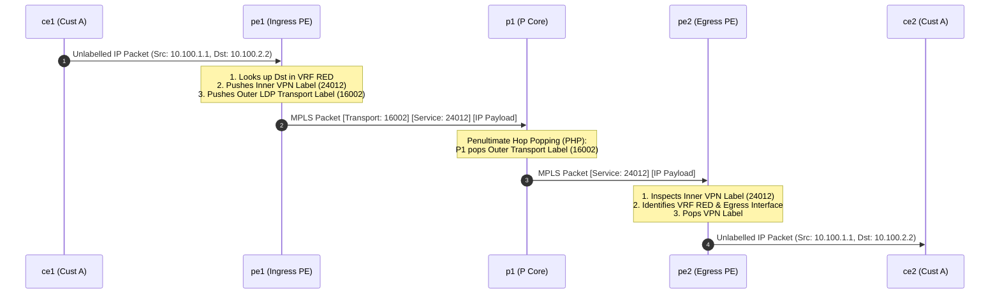

# 3 · L3VPN Control & Data Plane Architecture (RFC 4364)

**RFC 4364 BGP/MPLS IP Virtual Private Networks (L3VPN)** allows Service Providers to build isolated, multi-tenant Layer 3 customer networks over a shared MPLS core.

---

## The 64-Bit Route Distinguisher (RD) & 96-Bit VPNv4 Prefix

Multiple enterprise customers often use overlapping private IPv4 address space (e.g., `10.0.0.0/24`). If two customers advertise `10.0.0.0/24` into BGP, standard BGP would treat them as the same route.

```
[ 64-bit Route Distinguisher (RD) ] + [ 32-bit IPv4 Prefix ] = [ 96-bit VPNv4 Prefix ]
          (e.g., 65000:100)        +    (10.0.0.0/24)      = (65000:100:10.0.0.0/24)
```

- **Route Distinguisher (RD)**: A 64-bit prepended value (`32-bit AS/IP : 32-bit Number`). Creates a **unique 96-bit VPNv4 prefix**, allowing overlapping IP addresses to exist side-by-side in MP-BGP without collisions!

---

## Route Targets (RT): BGP Extended Communities

While RD makes prefixes unique, **Route Targets (RT)** dictate **VRF import and export routing policies**:

```mermaid
graph LR
    PE1_VRF1["pe1 (VRF RED)<br/>Export RT: 65000:100"] ===>|Advertises MP-BGP VPNv4| MPBGP["MP-BGP Core Domain<br/>(VPNv4 Address Family)"]
    MPBGP ===>|Evaluates Import RT| PE2_VRF1["pe2 (VRF RED)<br/>Import RT: 65000:100"]
    MPBGP -.->|Rejects (Mismatch)| PE2_VRF2["pe2 (VRF BLUE)<br/>Import RT: 65000:200"]

    classDef red fill:#e65100,stroke:#ffb74d,color:#ffffff,stroke-width:2px;
    classDef blue fill:#0d47a1,stroke:#64b5f6,color:#ffffff,stroke-width:2px;
    class PE1_VRF1,PE2_VRF1 red; class PE2_VRF2 blue;
```

- **Export RT**: Attached as a BGP Extended Community (`target:65000:100`) when a route is converted from a local VRF into a VPNv4 route.
- **Import RT**: Evaluated by distant PE routers. If the received route's RT matches the distant VRF's import RT list, the route is converted back to IPv4 and installed into that VRF's routing table.

---

## End-to-End L3VPN Packet Walk (Two-Label Header Stack)



1. **CE1 $\rightarrow$ PE1**: CE1 sends a standard IP packet to `pe1`.
2. **PE1 Lookup**: `pe1` looks up `10.100.2.2` in `VRF RED`, finds the BGP VPNv4 next-hop (`3.3.3.3`), inner VPN service label (`24012`), and outer LDP transport label (`16002`).
3. **PE1 $\rightarrow$ P1**: Transmits packet with two-label stack: `[Outer LDP 16002] [Inner VPN 24012] [IP Payload]`.
4. **P1 PHP (Penultimate Hop Popping)**: `p1` swaps/pops the outer transport label using PHP (Implicit Null Label 3) and delivers `[Inner VPN 24012] [IP Payload]` to `pe2`.
5. **PE2 $\rightarrow$ CE2**: `pe2` looks up inner VPN label `24012` in its LFIB, identifies `VRF RED`, pops the label, and forwards the native IP packet to `ce2`.
