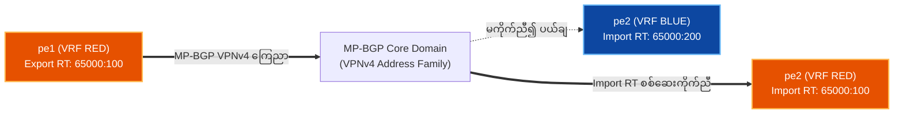
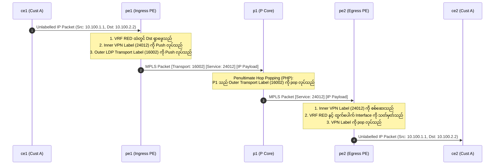

# ၃ · L3VPN Control နှင့် Data Plane ဗိသုကာ (RFC 4364) {: #3-l3vpn-control-data-plane-architecture }

**RFC 4364 BGP/MPLS IP Virtual Private Networks (L3VPN)** သည် ဝန်ဆောင်မှုပေးသူများ (Service Providers) အား မျှဝေသုံးစွဲထားသော MPLS core ကွန်ရက်တစ်ခုတည်းပေါ်တွင် သီးခြားခွဲထုတ်ထားသည့် multi-tenant Layer 3 သုံးစွဲသူကွန်ရက်များကို တည်ဆောက်နိုင်စေပါသည်။

---

## 64-Bit Route Distinguisher (RD) နှင့် 96-Bit VPNv4 Prefix {: #the-64-bit-route-distinguisher-rd-96-bit-vpnv4-prefix }

လုပ်ငန်းသုံး customer အများအပြားသည် ထပ်တူကျနေသော သီးသန့် private IPv4 လိပ်စာများကို အသုံးပြုလေ့ရှိကြသည် (ဥပမာ `10.0.0.0/24`)။ အကယ်၍ customer နှစ်ဦးက `10.0.0.0/24` ကို BGP ထဲသို့ ကြေညာပါက သမားရိုးကျ BGP သည် ၎င်းတို့ကို route တစ်ခုတည်းအဖြစ် မှတ်ယူပြီး ရောထွေးသွားမည်ဖြစ်သည်။

```
[ 64-bit Route Distinguisher (RD) ] + [ 32-bit IPv4 Prefix ] = [ 96-bit VPNv4 Prefix ]
          (ဥပမာ 65000:100)          +    (10.0.0.0/24)      = (65000:100:10.0.0.0/24)
```

- **Route Distinguisher (RD)**: ရှေ့တွင် ထပ်ပေါင်းထည့်ထားသော 64-bit တန်ဖိုး (`32-bit AS/IP : 32-bit Number`) ဖြစ်သည်။ ၎င်းသည် **တစ်မူထူးခြားသော 96-bit VPNv4 prefix** ကို ဖန်တီးပေးသောကြောင့် ထပ်တူကျနေသော IP လိပ်စာများသည် တိုက်မိခြင်း (collisions) မရှိဘဲ MP-BGP ထဲတွင် အတူတကွ တည်ရှိနိုင်စေပါသည်။

---

## Route Targets (RT): BGP Extended Communities {: #route-targets-rt-bgp-extended-communities }

RD သည် prefix များကို သီးခြားထူးခြားစေရန် ပြုလုပ်ပေးသော်လည်း **Route Targets (RT)** သည် **VRF import နှင့် export routing မူဝါဒများကို** ချမှတ်ထိန်းချုပ်ပေးပါသည်:



- **Export RT**: Route တစ်ခုအား local VRF မှ VPNv4 route အဖြစ် ပြောင်းလဲလိုက်သောအခါ BGP Extended Community (`target:65000:100`) အဖြစ် ပူးတွဲထည့်သွင်းပေးသည်။
- **Import RT**: အဝေးရှိ PE router များမှ စစ်ဆေးအကဲဖြတ်သည်။ ရရှိလာသော route ၏ RT သည် အဝေးရှိ VRF ၏ import RT စာရင်းနှင့် ကိုက်ညီပါက ထို route အား IPv4 သို့ ပြန်လည်ပြောင်းလဲပြီး သက်ဆိုင်ရာ VRF routing table ထဲသို့ ထည့်သွင်းပေးသည်။

---

## အစအဆုံး L3VPN Packet ပေးပို့ဖြတ်သန်းပုံ (Two-Label Header Stack) {: #end-to-end-l3vpn-packet-walk }



1. **CE1 → PE1**: CE1 သည် ရိုးရိုး unlabelled IP packet အား `pe1` သို့ ပေးပို့သည်။
2. **PE1 Lookup**: `pe1` သည် `VRF RED` ထဲတွင် `10.100.2.2` ကို ရှာဖွေပြီး BGP VPNv4 next-hop (`3.3.3.3`)၊ အတွင်းပိုင်း VPN service label (`24012`) နှင့် အပြင်ဘက် LDP transport label (`16002`) တို့ကို ဖော်ထုတ်သည်။
3. **PE1 → P1**: Label နှစ်ထပ် stack: `[Outer LDP 16002] [Inner VPN 24012] [IP Payload]` ဖြင့် ပေးပို့သည်။
4. **P1 PHP (Penultimate Hop Popping)**: `p1` သည် PHP (Implicit Null Label 3) ကို အသုံးပြု၍ အပြင်ဘက် transport label ကို ဖြုတ်ပယ် (pop) ပေးပြီး `[Inner VPN 24012] [IP Payload]` အား `pe2` သို့ ပေးပို့သည်။
5. **PE2 → CE2**: `pe2` သည် LFIB ထဲတွင် အတွင်းပိုင်း VPN label `24012` ကို စစ်ဆေး၍ `VRF RED` ကို ခွဲခြားသိရှိကာ label ကို pop လုပ်ပြီး native IP packet အား `ce2` သို့ လွှဲပြောင်းပေးပို့သည်။
