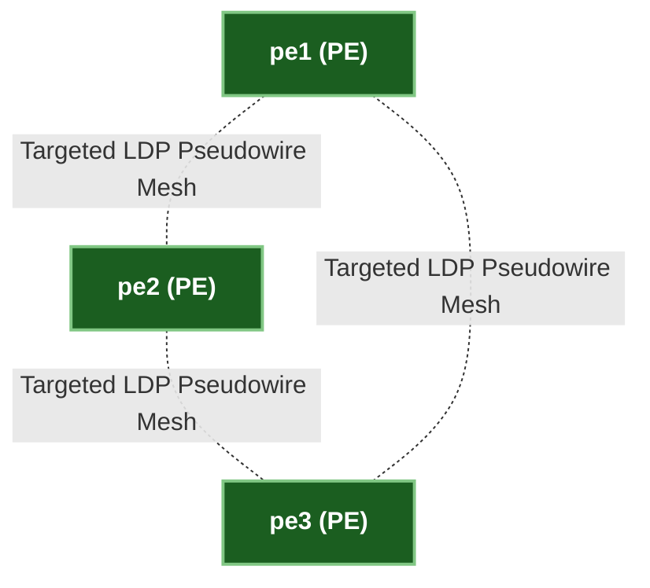

# ၅ · L2VPN နှင့် Pseudowire ဗိသုကာ (VPWS & VPLS) {: #5-l2vpn-pseudowire-architecture }

Layer 2 Virtual Private Networks (L2VPN) သည် သုံးစွဲသူ၏ Layer 2 Ethernet frame များကို မူလအတိုင်း မပျက်မစီးဘဲ IP/MPLS core provider network တစ်လျှောက် ဖြတ်သန်းသယ်ဆောင်ပေးပါသည်။

---

## ၁။ Virtual Private Wire Service (VPWS / Pseudowire RFC 4664) {: #1-virtual-private-wire-service }

**VPWS (Ethernet over MPLS — EoMPLS)** သည် customer site နှစ်ခုကြားတွင် point-to-point emulated wire (Pseudowire) တစ်ခုကို ဖန်တီးပေးပါသည်။

```mermaid
graph LR
    CE1["ce1 (Customer L2 Switch)<br/>Port Et1"] ===>|Untagged / 802.1Q Frame| PE1["pe1 (PE Router)"]
    PE1 -.-|Targeted LDP (tLDP) Pseudowire VC ID 100| PE2["pe2 (PE Router)"]
    PE2 ===>|Untagged / 802.1Q Frame| CE2["ce2 (Customer L2 Switch)<br/>Port Et1"]

    classDef ce fill:#e65100,stroke:#ffb74d,color:#ffffff,stroke-width:2px,font-weight:bold;
    classDef pe fill:#1b5e20,stroke:#81c784,color:#ffffff,stroke-width:2px,font-weight:bold;
    class CE1,CE2 ce; class PE1,PE2 pe;
```

### 4-Byte Pseudowire Control Word (CW) {: #the-4-byte-pseudowire-control-word }

IP/MPLS underlay ကွန်ရက်ရှိ ECMP လမ်းကြောင်းများတစ်လျှောက် packet များ အစီအစဉ်မလွဲချော်စေရန်အတွက် (packet ordering) 4-byte **Control Word (CW)** ကို အတွင်းပိုင်း PW label နှင့် customer Layer 2 Ethernet frame ကြားတွင် ထည့်သွင်းပေးထားပါသည်:

```
 0                   1                   2                   3
 0 1 2 3 4 5 6 7 8 9 0 1 2 3 4 5 6 7 8 9 0 1 2 3 4 5 6 7 8 9 0 1
+-+-+-+-+-+-+-+-+-+-+-+-+-+-+-+-+-+-+-+-+-+-+-+-+-+-+-+-+-+-+-+-+
| Reserved (0000) | Flags | Length (6b) | Sequence Number (16b) |
+-+-+-+-+-+-+-+-+-+-+-+-+-+-+-+-+-+-+-+-+-+-+-+-+-+-+-+-+-+-+-+-+
```

---

## ၂။ Virtual Private LAN Service (VPLS RFC 4762) {: #2-virtual-private-lan-service }

**VPLS** သည် L2VPN ကို point-to-multipoint အထိ တိုးချဲ့ပေးပြီး MPLS core တစ်လျှောက် virtual distributed Ethernet switch တစ်ခုသဖွယ် လုပ်ဆောင်ပေးပါသည်။



### VPLS Split-Horizon Loop ကာကွယ်မှု စည်းမျဉ်း {: #vpls-split-horizon-loop-prevention-rule }

VPLS သည် provider core ပေါ်တွင် Spanning Tree Protocol (STP) မလည်ပတ်စေဘဲ ပါဝင်သော PE router အားလုံးကြား pseudowires အပြည့် full mesh တည်ဆောက်ထားသောကြောင့်:

> 🛑 **VPLS Split Horizon Rule**: အခြား PE router တစ်ခုထံမှ Ingress Pseudowire မှတစ်ဆင့် လက်ခံရရှိသော frame တစ်ခုကို တတိယ PE router ဆီသို့ မည်သည့် Pseudowire မှတစ်ဆင့်မှ **ပြန်လည် forward မလုပ်ရ (NEVER re-forward)**! ၎င်းကို သက်ဆိုင်ရာ local customer ချိတ်ဆက်ထားသော access interface သို့သာ forward လုပ်ခွင့်ရှိသည်။

---

## ၃။ BGP EVPN (Phase 4) သို့ ကူးပြောင်းခြင်း {: #3-transition-to-bgp-evpn }

ရိုးရာ L2VPN များသည် Targeted LDP နှင့် data-plane flood-and-learn MAC discovery အပေါ်တွင် မှီခိုနေရသော်လည်း **BGP EVPN (RFC 7432 / RFC 8214)** သည် tLDP နေရာတွင် BGP control-plane MAC learning (AFI 25 / SAFI 70) ဖြင့် အစားထိုးပြီး active-active multihoming နှင့် အကောင်းဆုံး routing စွမ်းဆောင်ရည်များကို ထောက်ပံ့ပေးပါသည်။
