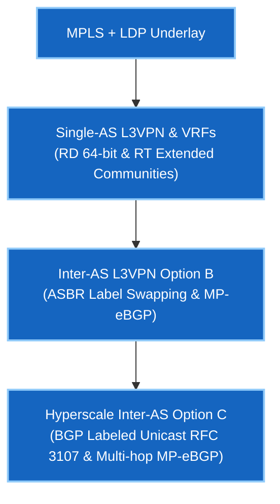

# Phase 3 — MPLS & L3VPN

> 🟢 **Phase 3 Live** — Validated on Arista cEOS 4.32.0F.

MPLS is how service providers move traffic without every router in the middle needing to know where anything is. Instead of looking up a destination at every hop, routers swap a small fixed label — and the whole path is decided once, at the edge.

**L3VPN (RFC 4364)** builds on that: many customers, each with their own private routing table (VRF), all sharing one provider backbone with complete isolation.

---

## Course Matrix & Labs

| Lab | Description | Core Protocols & Concepts | Status |
|---|---|---|---|
| **[01](lab-01-mpls-ldp.md)** | MPLS + LDP Underlay | OSPF, LDP Label Distribution, LFIB forwarding state | 🟢 **Validated** |
| **[02](lab-02-l3vpn-option-a.md)** | Single-AS L3VPN & VRF Isolation | VRFs, Route Distinguishers (RD), Route Targets (RT), MP-iBGP VPNv4 | 🟢 **Validated** |
| **[03](lab-03-l3vpn-option-b.md)** | Inter-AS L3VPN Option B | Inter-AS MP-eBGP VPNv4, ASBR Label Rewriting, Next-Hop Self | 🟢 **Validated** |
| **[04](lab-04-l3vpn-option-c.md)** | Inter-AS L3VPN Option C | BGP Labeled Unicast (BGP-LU RFC 3107/8277), Multi-hop MP-eBGP | 🟢 **Validated** |

---

## Google Network Infrastructure Target Competencies

---

## Prerequisites

- **[Phase 1 · BGP Fundamentals](../01-bgp/index.md)** — MP-BGP, route reflection, and address family activation.
- **[Foundations · Linux](../linux-foundations/index.md)** — Linux networking and SSH lab environment.

---

## Next Steps & Interview Practice

- **[Self-Test Interview Questions](interview-questions.md)** — Service Provider & WAN Engineering interview question bank covering MPLS, LDP, PHP, RD/RT, and Inter-AS Options A, B, and C.

