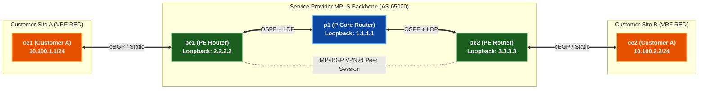
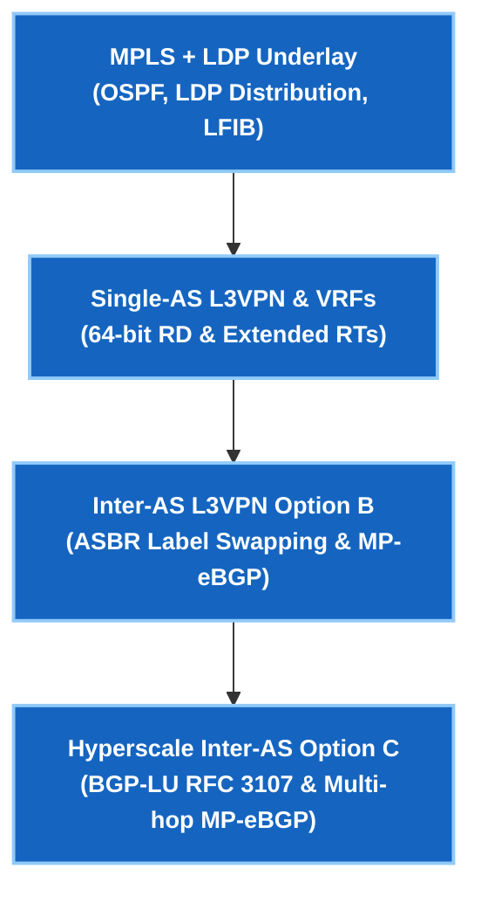

# Phase 3 — MPLS & L3VPN

> 🟢 **Phase 3 စတင်လေ့လာနိုင်ပါပြီ** — Arista cEOS 4.32.0F ပေါ်တွင် အောင်မြင်စွာ စမ်းသပ်အတည်ပြုပြီး ဖြစ်သည်။

MPLS သည် အလယ်ရှိ router တိုင်းက destination IP ကို ကြည့်ရှုစစ်ဆေးစရာမလိုဘဲ Service Providers များက traffic များကို လျင်မြန်စွာ ပို့ဆောင်ပေးသည့် နည်းပညာဖြစ်ပါသည်။ Hop တိုင်းတွင် IP လိပ်စာကို အချိန်ကုန်ခံ ရှာဖွေမည့်အစား routers များသည် သေးငယ်သော fixed label တစ်ခုကိုသာ လဲလှယ်ပေးပါသည် — လမ်းကြောင်းတစ်ခုလုံးကို အစွန်းပိုင်း (edge) တွင် တစ်ကြိမ်တည်း ဆုံးဖြတ်ပြီး ဖြစ်သည်။

**L3VPN (RFC 4364)** သည် ၎င်းအပေါ်တွင် တည်ဆောက်ထားခြင်း ဖြစ်သည်: Customer ပေါင်းများစွာသည် မိမိတို့၏ သီးခြား private routing table (VRF) အသီးသီးဖြင့် Provider backbone တစ်ခုတည်းကို မျှဝေသုံးစွဲကြသော်လည်း လုံးဝ သီးသန့်ခွဲထုတ် (complete isolation) ထားရှိနိုင်ပါသည်။

---

## သင်ရိုးဇယားနှင့် လက်တွေ့ Labs

| Lab | ရှင်းလင်းချက် | အဓိက Protocols & သဘောတရားများ | လက်ရှိအခြေအနေ |
|---|---|---|---|
| **[01](lab-01-mpls-ldp.md)** | MPLS + LDP Underlay | OSPF၊ LDP Label Distribution၊ LFIB forwarding state | 🟢 **Validated** |
| **[02](lab-02-l3vpn-option-a.md)** | Single-AS L3VPN & VRF Isolation | VRFs၊ Route Distinguishers (RD)၊ Route Targets (RT)၊ MP-iBGP VPNv4 | 🟢 **Validated** |
| **[03](lab-03-l3vpn-option-b.md)** | Inter-AS L3VPN Option B | Inter-AS MP-eBGP VPNv4၊ ASBR Label Rewriting၊ Next-Hop Self | 🟢 **Validated** |
| **[04](lab-04-l3vpn-option-c.md)** | Inter-AS L3VPN Option C | BGP Labeled Unicast (BGP-LU RFC 3107/8277)၊ Multi-hop MP-eBGP | 🟢 **Validated** |
| **[05](lab-05-l2vpn-vpws-vpls.md)** | MPLS L2VPN (VPWS & VPLS) | Point-to-Point Pseudowire (EoMPLS RFC 4664)၊ Targeted LDP၊ VPLS Split-Horizon | 🟢 **Validated** |

---

## 🏛️ Phase 3 ဗိသုကာနှင့် ကွန်ရက် Topology ခြုံငုံသုံးသပ်ချက်

---

## Google Network Infrastructure ဦးတည် ကျွမ်းကျင်မှုများ

---

## ကြိုတင် လိုအပ်ချက်များ

- **[Phase 1 · BGP Fundamentals](../01-bgp/index.md)** — MP-BGP၊ route reflection၊ နှင့် address family activation။
- **[Foundations · Linux](../linux-foundations/index.md)** — Linux networking နှင့် SSH lab ပတ်ဝန်းကျင်။

---

## နောက်ဆက်တွဲနှင့် အင်တာဗျူး လေ့ကျင့်ခန်းများ

- **[Self-Test အင်တာဗျူး မေးခွန်းများ](interview-questions.md)** — MPLS၊ LDP၊ PHP၊ RD/RT၊ နှင့် Inter-AS Options A၊ B နှင့် C တို့ကို လွှမ်းခြုံထားသော Service Provider & WAN Engineering မေးခွန်းဘဏ်။
