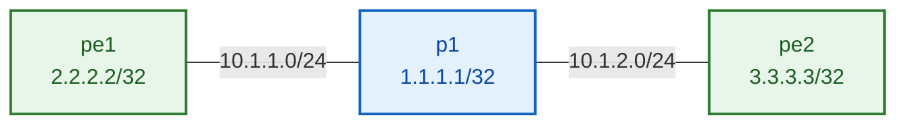

# Lab 01 — MPLS + LDP underlay

> ✅ **Validated** on Arista cEOS 4.32.0F (Apple Silicon, OrbStack). Every output on
> this page was captured from a real run.

Before you can carry customer VPNs across a provider network, the provider network
itself has to know how to move labels. That's this lab: three routers, an OSPF
underlay, and LDP handing out labels on top.

**What you'll end up with:** two edge routers (`pe1`, `pe2`) that can reach each
other through a core router (`p1`), with a label-switched path built between them.



| Node | Role | Loopback0 | Links |
|---|---|---|---|
| `p1` | core (P) | 1.1.1.1/32 | Et1 → pe1 (10.1.1.1/24) · Et2 → pe2 (10.1.2.1/24) |
| `pe1` | edge (PE) | 2.2.2.2/32 | Et1 → p1 (10.1.1.2/24) |
| `pe2` | edge (PE) | 3.3.3.3/32 | Et1 → p1 (10.1.2.2/24) |

!!! danger "Two cEOS traps — read before you deploy"
    **1. Link endpoints must be lowercase `ethN`.** cEOS counts `eth*` interfaces to
    know when containerlab has finished wiring. Name one `Ethernet1` and it hangs on
    `Connected 0 interfaces out of N` forever — EOS never boots, and
    `docker exec … Cli` then fails with *"executable file not found"*. That error
    means **EOS hasn't started**, not that your image is broken.

    **2. Piping config in requires `docker exec -i`.** Without `-i`, stdin is never
    attached, your heredoc is silently discarded, and the command **exits 0 having
    applied nothing** — indistinguishable from success. Every block below uses `-i`.

---

## 1. Deploy

```bash
mkdir -p ~/mpls-lab && cd ~/mpls-lab && cat > topology.clab.yml <<'EOF'
name: ceos-mpls-scratch
topology:
  nodes:
    p1:
      kind: arista_ceos
      image: ceos:4.32.0F
    pe1:
      kind: arista_ceos
      image: ceos:4.32.0F
    pe2:
      kind: arista_ceos
      image: ceos:4.32.0F
  links:
    - endpoints: ["p1:eth1", "pe1:eth1"]
    - endpoints: ["p1:eth2", "pe2:eth1"]
EOF
```

Deploy one node at a time — booting three emulated nodes simultaneously is what
triggers the boot race:

```bash
cd ~/mpls-lab && sudo containerlab deploy -t topology.clab.yml --max-workers 1
```

---

## 2. Health check — before configuring anything

```bash
for n in p1 pe1 pe2; do echo "===== $n ====="; docker exec clab-ceos-mpls-scratch-$n Cli -p 15 -c "show interfaces status"; done
```

**✅ DONE when:** every `Et*` port shows type **`EbraTestPhyPort`**.

A node showing type **`Unknown`** lost the boot race. Destroy, redeploy, re-check.
Don't skip this — a degraded node accepts configuration and then silently never
forms an adjacency, sending you hunting a protocol bug that isn't there.

---

## 3. Configure

Three things stack here, and the order matters conceptually even though EOS accepts
them together:

1. **`ip routing`** — EOS is an L2 switch by default. Nothing routed works without it.
2. **OSPF** — gives every router a path to every loopback. LDP needs this first.
3. **LDP** — hands out labels for the prefixes OSPF already knows about.

### p1 (core)

```bash
docker exec -i clab-ceos-mpls-scratch-p1 Cli -p 15 <<'EOF'
enable
configure
ip routing
service routing protocols model multi-agent
mpls ip
interface Loopback0
 ip address 1.1.1.1 255.255.255.255
 ip ospf area 0.0.0.0
interface Ethernet1
 no switchport
 no shutdown
 ip address 10.1.1.1 255.255.255.0
 ip ospf area 0.0.0.0
 ip ospf network point-to-point
interface Ethernet2
 no switchport
 no shutdown
 ip address 10.1.2.1 255.255.255.0
 ip ospf area 0.0.0.0
 ip ospf network point-to-point
router ospf 1
 router-id 1.1.1.1
 no shutdown
mpls ldp
 router-id interface Loopback0
 transport-address interface Loopback0
 no shutdown
end
write memory
EOF
```

### pe1

```bash
docker exec -i clab-ceos-mpls-scratch-pe1 Cli -p 15 <<'EOF'
enable
configure
ip routing
service routing protocols model multi-agent
mpls ip
interface Loopback0
 ip address 2.2.2.2 255.255.255.255
 ip ospf area 0.0.0.0
interface Ethernet1
 no switchport
 no shutdown
 ip address 10.1.1.2 255.255.255.0
 ip ospf area 0.0.0.0
 ip ospf network point-to-point
router ospf 1
 router-id 2.2.2.2
 no shutdown
mpls ldp
 router-id interface Loopback0
 transport-address interface Loopback0
 no shutdown
end
write memory
EOF
```

### pe2

```bash
docker exec -i clab-ceos-mpls-scratch-pe2 Cli -p 15 <<'EOF'
enable
configure
ip routing
service routing protocols model multi-agent
mpls ip
interface Loopback0
 ip address 3.3.3.3 255.255.255.255
 ip ospf area 0.0.0.0
interface Ethernet1
 no switchport
 no shutdown
 ip address 10.1.2.2 255.255.255.0
 ip ospf area 0.0.0.0
 ip ospf network point-to-point
router ospf 1
 router-id 3.3.3.3
 no shutdown
mpls ldp
 router-id interface Loopback0
 transport-address interface Loopback0
 no shutdown
end
write memory
EOF
```

!!! warning "Don't forget `ip ospf area` on Loopback0"
    It's easy to give the loopback an address and stop there. But if the loopback
    isn't *in* OSPF, no other router learns it — so there's no route to label, LDP
    has nothing to bind, and `show mpls route` comes back empty. That single missing
    line produces symptoms that look exactly like MPLS being broken.

`Copy completed successfully` means the config was written. A silent return means
it did **not** apply.

---

## 4. Verify — each step gates the next

### Step 1 · OSPF adjacency

```bash
docker exec clab-ceos-mpls-scratch-p1 Cli -p 15 -c "show ip ospf neighbor"
```

```
Neighbor ID     Instance VRF      Pri State      Dead Time   Address     Interface
3.3.3.3         1        default  0   FULL       00:00:34    10.1.2.2    Ethernet2
2.2.2.2         1        default  0   FULL       00:00:33    10.1.1.2    Ethernet1
```

**✅ DONE when:** both neighbours show **`FULL`**.

!!! tip "Run `show` commands one at a time"
    Chaining several `-c` flags returns only the **last** command's output on cEOS,
    which can make a healthy protocol look completely dead.

### Step 2 · Loopbacks reachable

```bash
docker exec clab-ceos-mpls-scratch-pe1 Cli -p 15 -c "show ip route"
```

```
 O        1.1.1.1/32 [110/20]
           via 10.1.1.1, Ethernet1
 C        2.2.2.2/32
           directly connected, Loopback0
 O        3.3.3.3/32 [110/30]
           via 10.1.1.1, Ethernet1
```

**✅ DONE when:** pe1 has an `O` route to **`3.3.3.3/32`**. If it's missing, a
loopback isn't in OSPF — go back and check.

### Step 3 · LDP session

```bash
docker exec clab-ceos-mpls-scratch-p1 Cli -p 15 -c "show mpls ldp neighbor"
```

```
Peer LDP ID: 2.2.2.2:0; Local LDP ID: 1.1.1.1:0
   TCP Connection: 2.2.2.2:42337 - 1.1.1.1:646
   State: oper; Msgs sent/rcvd: 23/24; downstream unsolicited
```

**✅ DONE when:** **`State: oper`** to both peers. LDP runs over TCP/646 — it peers
across the routed path, so this can't work until Step 1 does.

### Step 4 · Labels distributed

```bash
docker exec clab-ceos-mpls-scratch-pe1 Cli -p 15 -c "show mpls ldp bindings"
```

```
1.1.1.1/32
   Local binding:  Label: 100000
   Remote binding: Peer ID: 1.1.1.1:0, Label: imp-null
2.2.2.2/32
   Local binding:  Label: imp-null
   Remote binding: Peer ID: 1.1.1.1:0, Label: 100000
3.3.3.3/32
   Local binding:  Label: 100001
   Remote binding: Peer ID: 1.1.1.1:0, Label: 100001
```

Read this carefully — it's the heart of the lab:

- **`3.3.3.3/32` → remote binding `100001`** means p1 told pe1 *"to reach pe2's
  loopback, send me label 100001."*
- **`imp-null`** ("implicit null") is the router saying *"I'm the last hop — pop the
  label before sending it to me."* That's **penultimate-hop popping**: the
  second-to-last router strips the label so the final router doesn't waste a lookup.

### Step 5 · Forwarding state programmed

```bash
docker exec clab-ceos-mpls-scratch-p1 Cli -p 15 -c "show mpls route"
```

```
MPLS forwarding table (Label [metric] Vias) - 2 routes
 100000  A[1]
                via M, 10.1.1.2, pop
                    EgressACL: apply
                    directly connected, Ethernet1
                    aa:c1:ab:9e:37:05, vlan 1006
 100001  A[1]
                via M, 10.1.2.2, pop
                    EgressACL: apply
                    directly connected, Ethernet2
                    aa:c1:ab:2e:55:ee, vlan 1007
```

**✅ DONE when:** p1 shows label entries with a **resolved next-hop MAC address**.

That MAC matters. It's the difference between *"the control plane agreed on a
number"* and *"the forwarding path is actually programmed and ready to move
packets."*

---

## 5. What this does — and doesn't — prove

Ping pe2's loopback from pe1:

```bash
docker exec clab-ceos-mpls-scratch-pe1 Cli -p 15 -c "ping 3.3.3.3 source 2.2.2.2"
```

```
5 packets transmitted, 5 received, 0% packet loss, time 4ms
```

Now trace it:

```bash
docker exec clab-ceos-mpls-scratch-pe1 Cli -p 15 -c "traceroute 3.3.3.3 source 2.2.2.2"
```

```
 1  10.1.1.1 (10.1.1.1)  0.198 ms
 2  3.3.3.3 (3.3.3.3)  1.858 ms
```

**Plain IP hops. No labels.** The ping worked — but it never touched the LSP you
just built.

!!! note "This is the most important idea in the lab"
    LDP **builds** a label-switched path. It doesn't **use** it. Ordinary IP traffic
    follows the ordinary IP route table, because it has a perfectly good route
    already.

    Labels get used when something *needs* them — a VPN whose routes don't exist in
    the global table, or a pseudowire carrying traffic that isn't IP at all. That's
    what Lab 02 adds.

    So a green ping here is **not** proof that MPLS forwarding works. Watch for that
    trap: it looks like success right up until traffic actually has to be labelled.

---

## 6. Break & observe

Take pe2's loopback out of OSPF:

```bash
docker exec -i clab-ceos-mpls-scratch-pe2 Cli -p 15 <<'EOF'
enable
configure
interface Loopback0
 no ip ospf area 0.0.0.0
end
EOF
```

Then look at pe1:

```bash
docker exec clab-ceos-mpls-scratch-pe1 Cli -p 15 -c "show mpls route"
```

The label binding for `3.3.3.3/32` disappears, and the ping fails 100%.

**Why:** LDP can only bind a label to a prefix that's in the routing table. No
route, no label. This is worth doing deliberately, because the symptoms — empty
MPLS table, total packet loss — look exactly like a broken MPLS data plane, and
you'll misdiagnose it once if you've never seen it on purpose.

Put it back:

```bash
docker exec -i clab-ceos-mpls-scratch-pe2 Cli -p 15 <<'EOF'
enable
configure
interface Loopback0
 ip ospf area 0.0.0.0
end
write memory
EOF
```

---

## 7. Teardown

```bash
sudo containerlab destroy -t ~/mpls-lab/topology.clab.yml --cleanup
```

---

## Troubleshooting

| Symptom | Cause | Fix |
|---|---|---|
| `Connected 0 interfaces out of N`, forever | endpoints named `Ethernet1` instead of `eth1` | fix topology, destroy + redeploy |
| `docker exec … Cli` → *executable file not found* | EOS never booted — not an image problem | fix the wiring, redeploy |
| Heredoc returns instantly, nothing applied | missing `-i` on `docker exec` | add `-i` |
| Port type `Unknown` | boot race under emulation | destroy + redeploy with `--max-workers 1`. **Never `docker restart`** — it destroys the veths, and `reload` isn't supported in a container |
| *LDP is operationally down: TransportAddr interface not configured* | bare `router-id 1.1.1.1` gives LDP no interface to source from | `router-id interface Loopback0` + `transport-address interface Loopback0` |
| *Change will take effect on the next agent start* | LdpAgent not running yet | `agent LdpAgent terminate` to respawn it |
| OSPF never reaches `FULL` | port still L2 | `no switchport` on the routed ports |
| `show ip ospf neighbor` looks empty but adjacencies exist | multiple `-c` flags return only the last output | run one `show` per command |
| `show mpls route` empty, ping 100% loss | a loopback isn't in OSPF — **not** an MPLS fault | `ip ospf area 0.0.0.0` under `interface Loopback0` |

---

## Interview questions

??? question "LDP is up and labels are allocated, but traceroute shows no labels. Is something broken?"
    No. LDP builds the LSP; it doesn't force traffic onto it. Ordinary IP traffic
    follows the IP route table because it already has a valid route. Labels get used
    when the traffic has no other option — VPN routes that don't exist in the global
    table, or non-IP payloads on a pseudowire.

??? question "What does `imp-null` mean in an LDP binding, and why does it exist?"
    Implicit null tells the upstream router to **pop the label before forwarding** —
    penultimate-hop popping. Without it the final router receives a labelled packet,
    strips the label, and then has to do a second lookup to route it. PHP moves that
    work one hop earlier so the last router does a single IP lookup instead of two
    operations.

??? question "Why must OSPF converge before LDP will work?"
    LDP peers over TCP/646 to a neighbour's transport address, so it needs IP
    reachability first. Beyond that, LDP binds labels **to prefixes in the routing
    table** — if OSPF hasn't advertised a prefix, there's nothing to attach a label
    to.

??? question "A loopback has an IP but no `ip ospf area`. What breaks, and how would you spot it?"
    Nobody learns the prefix, so there's no route and no label binding. You'd see
    100% packet loss *and* an empty MPLS table — which mimics a broken MPLS data
    plane. The tell is that **plain IP fails too**: with a healthy underlay, a
    loopback ping succeeds whether or not labels exist. So total loss points at the
    underlay, not at MPLS.

??? question "In `show mpls route`, why does a resolved next-hop MAC address matter?"
    It's the line between control plane and data plane. Label bindings prove the
    routers agreed on numbers. A resolved adjacency — MAC, VLAN, egress interface —
    proves the forwarding entry is actually programmed and able to move packets.

---

**Next:** Lab 02 adds a VRF and VPNv4 so traffic *must* be labelled — the
conclusive test that MPLS forwarding works end to end.
