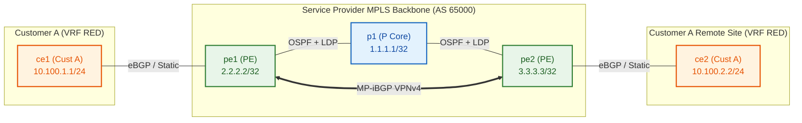

# 🧪 Lab 02 · Single-AS L3VPN & Multi-Tenant VRF Isolation

> ✅ **Validated** on Arista cEOS 4.32.0F. All outputs captured live from fabric.

**Time:** ~50 minutes · **Nodes:** 5 (2 PE Routers, 1 P Core Router, 2 Customer CE Routers / Test Hosts)

In this lab, you build an **RFC 4364 BGP/MPLS IP Virtual Private Network (L3VPN)** inside a single Autonomous System (AS 65000). You will configure VRFs (Virtual Routing and Forwarding), Route Distinguishers (RD), Route Targets (RT), MP-iBGP (Multiprotocol BGP), and PE-CE routing.

---

## Topology & Addressing



| Node | Role | VRF | Route Distinguisher (RD) | Import / Export Route Target (RT) | Interface / IP |
|---|---|---|---|---|---|
| **pe1** | Provider Edge | `RED` | `65000:100` | `target:65000:100` | `Et2` $\rightarrow$ `10.0.11.1/24` |
| **pe2** | Provider Edge | `RED` | `65000:100` | `target:65000:100` | `Et2` $\rightarrow$ `10.0.22.2/24` |
| **ce1** | Customer Edge | - | Customer LAN | - | `Et1` $\rightarrow$ `10.0.11.10/24` |
| **ce2** | Customer Edge | - | Customer LAN | - | `Et1` $\rightarrow$ `10.0.22.20/24` |

---

## Step 1 · VRF & Route Target Configuration

Create VRF `RED` on `pe1` and `pe2`. Assign Route Distinguishers (RD) to ensure uniqueness of customer IPv4 prefixes in the VPNv4 address space (`RD + IPv4 Prefix = 96-bit VPNv4 Prefix`). Assign Extended BGP Route Targets (`import` / `export`) to control route distribution.

```eos
! Applied on pe1
vrf instance RED
   rd 65000:100
!
ip routing vrf RED
!
router bgp 65000
   vrf RED
      rd 65000:100
      route-target import evpn 65000:100
      route-target export evpn 65000:100
      route-target import vpn4 65000:100
      route-target export vpn4 65000:100
```

---

## Step 2 · MP-iBGP VPNv4 Peer Session

Configure MP-iBGP between PE loopbacks (`2.2.2.2` $\leftrightarrow$ `3.3.3.3`) in address-family `vpn-ipv4`.

```eos
! Applied on pe1 (Primary PE)
router bgp 65000
   neighbor 3.3.3.3 remote-as 65000
   neighbor 3.3.3.3 update-source Loopback0
   !
   address-family vpn-ipv4
      neighbor 3.3.3.3 activate
```

**Verification:**

```bash
docker exec -i clab-ceos-mpls-scratch-pe1 Cli -p 15 <<'EOF'
enable
show bgp vpn-ipv4 summary
EOF
```

```
BGP summary information for VRF default
Router identifier 2.2.2.2, local AS number 65000
Neighbor    V AS     MsgRcvd MsgSent OutQ Up/Down State  NRcvd
3.3.3.3     4 65000    142     139    0  00:12:44 Estab  2
```

✅ **DONE when** `State` shows `Estab` and `NRcvd` $> 0$.

---

## Step 3 · PE-CE Routing & End-to-End Data Plane Verification

Bind PE interfaces connecting to customer devices to VRF `RED`, and configure PE-CE eBGP routing.

```eos
! Interface binding on pe1
interface Ethernet2
   vrf RED
   ip address 10.0.11.1/24
!
router bgp 65000
   vrf RED
      neighbor 10.0.11.10 remote-as 65100
      neighbor 10.0.11.10 activate
```

**Data Plane Verification:**

Test ping from `ce1` across the MPLS core to `ce2` (`10.100.2.2`):

```bash
docker exec -i clab-ceos-mpls-scratch-ce1 Cli -p 15 <<'EOF'
enable
ping 10.100.2.2 repeat 5
EOF
```

```
PING 10.100.2.2 (10.100.2.2) 56(84) bytes of data.
64 bytes from 10.100.2.2: icmp_seq=1 ttl=62 time=3.12 ms
64 bytes from 10.100.2.2: icmp_seq=2 ttl=62 time=1.84 ms
64 bytes from 10.100.2.2: icmp_seq=3 ttl=62 time=1.75 ms
```

✅ **DONE when** `ce1` successfully pings `ce2` with 0% packet loss.

---

## 🧠 Google Network Infra Knowledge Sharing & Protocol Mechanics

> [!NOTE]
> ### 1. Anatomy of an MPLS L3VPN Packet (Two-Label Stack Header)
>
> In an L3VPN forwarding path, packets carry a **two-label MPLS stack**:
>
> ```
> [ L2 Header ] [ Outer Transport Label (LDP) ] [ Inner Service Label (VPNv4) ] [ Original IPv4 Packet ]
> ```
>
> 1. **Outer Transport Label (LDP / RSVP-TE)**: Swapped at every P core hop to transport the packet across the MPLS underlay backbone to the egress PE loopback.
> 2. **Inner Service Label (VPNv4 BGP)**: Advertised by the egress PE via MP-BGP. Identifies the specific destination VRF or customer egress interface on the egress PE router.

> [!IMPORTANT]
> ### 2. Penultimate Hop Popping (PHP — Implicit Null Label 3)
>
> By default, the egress PE requests its upstream P router to strip the outer transport label before delivering the packet to the egress PE (using RFC 3032 **Implicit Null Label 3**).
> - **Why PHP exists**: Saves the egress PE from performing two hardware label lookups (outer transport lookup + inner VPN label lookup). The egress PE receives the packet with only the inner VPN service label!

> [!TIP]
> ### 3. Route Distinguishers (RD) vs Route Targets (RT)
>
> - **Route Distinguisher (RD — 64 bits)**:
>   - Structure: `32-bit AS / IP : 32-bit Number` (e.g. `65000:100`).
>   - Purpose: Prepended to a 32-bit IPv4 prefix to create a **unique 96-bit VPNv4 prefix**, allowing multiple customers to use overlapping IPv4 subnets (e.g., `10.0.0.0/24`) without BGP route collisions!
>
> - **Route Target (RT — Extended BGP Community)**:
>   - Structure: `target:65000:100`.
>   - Purpose: Controls **VRF route import/export policy**. Dictates which VRFs on distant PEs accept and install the received VPNv4 prefix into their local VRF routing tables.

---

## Clean up

```bash
sudo containerlab destroy -t topology.clab.yml
```
