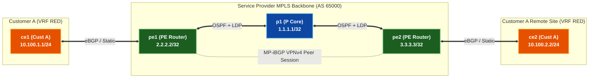

# 🧪 Lab 02 · Single-AS L3VPN နှင့် Multi-Tenant VRF သီးခြားခွဲထုတ်ခြင်း {: #lab-02-single-as-l3vpn-multi-tenant-vrf-isolation }

> ✅ **စမ်းသပ်အတည်ပြုပြီး** - Arista cEOS 4.32.0F ပေါ်တွင် OrbStack fabric မှ output များကို တိုက်ရိုက်ရယူထားပါသည်။

**ကြာချိန်:** ~၅၀ မိနစ် · **Nodes အရေအတွက်:** ၅ ခု (PE Router ၂ လုံး၊ P Core Router ၁ လုံး၊ Customer CE Router ၂ လုံး)

!!! tip "အမြန်စတင်ရန် လမ်းညွှန် — Step-by-Step Execution Guide (တည်နေရာ: `labs/mpls-l3vpn-lab/`)"
    **အဆင့် ၁ · Lab Fabric ကို စတင်လည်ပတ်ပါ (မ run ရသေးပါက)**
    ```bash
    cd labs/mpls-l3vpn-lab
    sudo containerlab deploy -t topology.clab.yml --max-workers 1
    ```

    **အဆင့် ၂ · အပြန်အလှန် Interactive လမ်းညွှန်ကို စတင်ပါ**
    ```bash
    ./run.sh --guided
    ```

    ??? note "အခြား Run နိုင်သော နည်းလမ်းများ (Automated Script သို့မဟုတ် Manual CLI)"
        - **Fast Automated Script Push**:
          ```bash
          ./run.sh 01          # step 01 ကို အလိုအလျောက် config ထည့်သွင်း၍ စစ်ဆေးမည်
          ./run.sh --all       # အဆင့်အားလုံးကို အစီအစဉ်အတိုင်း run မည်
          ```
        - **Manual Line-by-Line CLI Execution**:
          Container node တစ်ခုချင်းစီသို့ CLI shell ဝင်ရောက်ရန်:
          ```bash
          docker exec -it clab-mpls-l3vpn-lab-pe1 Cli
          ```

---

## Topology နှင့် Addressing {: #topology-addressing }



| Node | အခန်းကဏ္ဍ | VRF | Route Distinguisher (RD) | Import / Export Route Target (RT) | Interface / IP |
|---|---|---|---|---|---|
| **pe1** | Provider Edge | `RED` | `65000:100` | `target:65000:100` | `Et2` → `10.0.11.1/24` |
| **pe2** | Provider Edge | `RED` | `65000:100` | `target:65000:100` | `Et2` → `10.0.22.2/24` |
| **ce1** | Customer Edge | - | Customer LAN | - | `Et1` → `10.0.11.10/24` |
| **ce2** | Customer Edge | - | Customer LAN | - | `Et1` → `10.0.22.20/24` |

---

## အဆင့် ၁ · VRF နှင့် Route Target ပြင်ဆင်သတ်မှတ်ခြင်း {: #step-1-vrf-route-target-configuration }

`pe1` နှင့် `pe2` ပေါ်တွင် VRF `RED` ကို ဖန်တီးပါ။ Customer IPv4 prefix များသည် VPNv4 address space ထဲတွင် ထပ်တူမကျဘဲ သီးခြားဖြစ်စေရန် Route Distinguishers (RD) ကို သတ်မှတ်ပါ (`RD + IPv4 Prefix = 96-bit VPNv4 Prefix`)။ Route ဖြန့်ဝေမှုကို ထိန်းချုပ်ရန် Extended BGP Route Targets (`import` / `export`) ကို သတ်မှတ်ပါ။

=== "pe1"

    ```eos
    --8<-- "labs/mpls-l3vpn-lab/steps/02-pe1-vrf.cfg"
    ```

=== "pe2"

    ```eos
    --8<-- "labs/mpls-l3vpn-lab/steps/02-pe2-vrf.cfg"
    ```

---

## အဆင့် ၂ · MP-iBGP VPNv4 Peer Session ချိတ်ဆက်ခြင်း {: #step-2-mp-ibgp-vpnv4-peer-session-setup }

PE loopback များ (`2.2.2.2` ↔ `3.3.3.3`) ကြားတွင် `vpn-ipv4` address-family ဖြင့် MP-iBGP ကို ချိန်ညှိပြင်ဆင်ပါ။

=== "pe1"

    ```eos
    --8<-- "labs/mpls-l3vpn-lab/steps/03-pe1-vpn4.cfg"
    ```

=== "pe2"

    ```eos
    --8<-- "labs/mpls-l3vpn-lab/steps/03-pe2-vpn4.cfg"
    ```

**စစ်ဆေးခြင်း:**

```bash
docker exec -i clab-mpls-l3vpn-lab-pe1 Cli -p 15 <<'EOF'
enable
show bgp vpn-ipv4 summary
EOF
```

```
BGP summary information for VRF default
Router identifier 2.2.2.2, local AS number 65000
Neighbor    V AS     MsgRcvd MsgSent OutQ Up/Down State  NRcvd
3.3.3.3     4 65000    142     139    0  00:12:44 Estab  2
```

✅ **အောင်မြင်မှု သတ်မှတ်ချက်:** `State` တွင် `Estab` ဟု ပြသပြီး `NRcvd` $> 0$ ဖြစ်ရပါမည်။

---

## အဆင့် ၃ · PE-CE Routing နှင့် အစအဆုံး Data Plane စစ်ဆေးခြင်း {: #step-3-pe-ce-routing-end-to-end-data-plane-verification }

Customer စက်များနှင့် ချိတ်ဆက်ထားသော PE interface များကို VRF `RED` ထဲသို့ ထည့်သွင်းပြီး PE-CE eBGP routing ကို ချိန်ညှိပါ။

=== "ce1"

    ```eos
    --8<-- "labs/mpls-l3vpn-lab/steps/04-ce1-bgp.cfg"
    ```

=== "ce2"

    ```eos
    --8<-- "labs/mpls-l3vpn-lab/steps/04-ce2-bgp.cfg"
    ```

=== "pe1 (VRF RED)"

    ```eos
    --8<-- "labs/mpls-l3vpn-lab/steps/04-pe1-ce-bgp.cfg"
    ```

=== "pe2 (VRF RED)"

    ```eos
    --8<-- "labs/mpls-l3vpn-lab/steps/04-pe2-ce-bgp.cfg"
    ```

**Data Plane စစ်ဆေးခြင်း:**

`ce1` မှ MPLS core ကို ဖြတ်၍ `ce2` (`10.100.2.2`) သို့ ping စမ်းသပ်ပါ:

```bash
docker exec -i clab-mpls-l3vpn-lab-ce1 Cli -p 15 <<'EOF'
enable
ping 10.100.2.2 repeat 5
EOF
```

```
PING 10.100.2.2 (10.100.2.2) 56(84) bytes of data.
64 bytes from 10.100.2.2: icmp_seq=1 ttl=62 time=3.12 ms
64 bytes from 10.100.2.2: icmp_seq=2 ttl=62 time=1.84 ms
64 bytes from 10.100.2.2: icmp_seq=3 ttl=62 time=1.75 ms
```

✅ **အောင်မြင်မှု သတ်မှတ်ချက်:** `ce1` သည် `ce2` သို့ packet loss 0% ဖြင့် အောင်မြင်စွာ ping နိုင်ရပါမည်။

---

## 🧠 Google Network Infra ဗဟုသုတမျှဝေမှုနှင့် Protocol သဘောတရားများ {: #google-network-infra-knowledge-sharing }

> [!NOTE]
> ### ၁။ MPLS L3VPN Packet ဖွဲ့စည်းပုံ (Two-Label Stack Header)
>
> L3VPN forwarding လမ်းကြောင်းတွင် packet များသည် **two-label MPLS stack** ကို သယ်ဆောင်သွားပါသည်:
>
> ```
> [ L2 Header ] [ Outer Transport Label (LDP) ] [ Inner Service Label (VPNv4) ] [ Original IPv4 Packet ]
> ```
>
> 1. **Outer Transport Label (LDP / RSVP-TE)**: Egress PE loopback ဆီသို့ MPLS underlay backbone တစ်လျှောက် packet အား သယ်ယူပို့ဆောင်ရန် P core hop တိုင်းတွင် swap လုပ်ပေးသည်။
> 2. **Inner Service Label (VPNv4 BGP)**: Egress PE မှ MP-BGP မှတစ်ဆင့် ကြေညာပေးသည်။ Egress PE router ပေါ်ရှိ သက်ဆိုင်ရာ destination VRF သို့မဟုတ် customer egress interface ကို ဖော်ထုတ်သတ်မှတ်ပေးသည်။

> [!IMPORTANT]
> ### ၂။ Penultimate Hop Popping (PHP — Implicit Null Label 3)
>
> Egress PE သည် default အားဖြင့် မိမိထံသို့ packet မရောက်မီ အထက်ရှိ P router အား အပြင်ဘက် transport label ကို ကြိုတင်ဖြုတ်ပယ်ပေးရန် တောင်းဆိုသည် (RFC 3032 **Implicit Null Label 3** အသုံးပြု၍)။
> - **PHP ရှိရခြင်း အကြောင်းရင်း**: Egress PE အား hardware label lookup နှစ်ကြိမ် (outer transport lookup + inner VPN label lookup) လုပ်ရခြင်းမှ သက်သာစေပါသည်။ ထို့ကြောင့် Egress PE သည် အတွင်းပိုင်း VPN service label တစ်ခုတည်းပါသော packet ကိုသာ လက်ခံရရှိတော့သည်!

> [!TIP]
> ### ၃။ Route Distinguishers (RD) နှင့် Route Targets (RT) နှိုင်းယှဉ်ချက်
>
> - **Route Distinguisher (RD — 64 bits)**:
>   - ဖွဲ့စည်းပုံ: `32-bit AS / IP : 32-bit Number` (ဥပမာ `65000:100`)။
>   - ရည်ရွယ်ချက်: 32-bit IPv4 prefix ၏ ရှေ့တွင် ထပ်ပေါင်း၍ **တစ်မူထူးခြားသော 96-bit VPNv4 prefix** ကို ဖန်တီးပေးသည်။ ထို့ကြောင့် customer အများအပြားသည် ထပ်တူကျနေသော IPv4 subnet များ (ဥပမာ `10.0.0.0/24`) ကို သုံးစွဲစေကာမူ BGP route collisions မဖြစ်စေဘဲ ယှဉ်တွဲတည်ရှိနိုင်စေပါသည်!
>
> - **Route Target (RT — Extended BGP Community)**:
>   - ဖွဲ့စည်းပုံ: `target:65000:100`။
>   - ရည်ရွယ်ချက်: **VRF route import/export မူဝါဒ** ကို ထိန်းချုပ်သည်။ အဝေးရှိ PE များပေါ်မှ မည်သည့် VRF များက လက်ခံရရှိသော VPNv4 prefix ကို မိမိတို့၏ local VRF routing table ထဲသို့ ထည့်သွင်းရမည်ကို ဆုံးဖြတ်ပေးသည်။

---

## ရှင်းလင်းသိမ်းဆည်းခြင်း (Clean up) {: #clean-up }

```bash
sudo containerlab destroy -t topology.clab.yml
```
