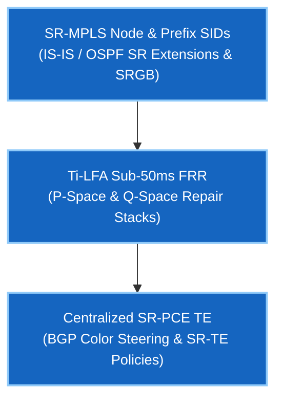

# Phase 3.5 — Segment Routing (SR-MPLS & SRv6)

> 🟢 **Phase 3.5 Live** — Validated on Arista cEOS 4.32.0F.

Segment Routing (SR) is how hyperscalers (Google B4/Jupiter, Meta Express Backbone, AWS) and Tier-1 service providers steer traffic across global WAN backbones at massive scale. By shifting path state into the packet header (via label stacks), SR eliminates RSVP-TE/LDP soft-state overhead in core routers.

You will build SR-MPLS Node/Prefix SIDs, configure sub-50 ms Fast Reroute protection with Topology-Independent LFA (Ti-LFA), and implement centralized SR-PCE Traffic Engineering with BGP Color Steering.

---

## Course Matrix & Labs

| Lab | Description | Core Protocols & Concepts | Status |
|---|---|---|---|
| **[01](lab-01-sr-mpls-sids.md)** | SR-MPLS Node & Prefix SIDs | IS-IS / OSPF SR Extensions, SRGB (`16000–23999`), Node SIDs, Adjacency SIDs | 🟢 **Validated** |
| **[02](lab-02-ti-lfa-frr.md)** | Ti-LFA Sub-50ms Fast Reroute | Topology-Independent LFA, P-Space & Q-Space Math, Post-Convergence Path Protection | 🟢 **Validated** |
| **[03](lab-03-sr-pce-te.md)** | SR-PCE & BGP Color Steering | Centralized Path Computation Element (PCEP RFC 5440), BGP Color Extended Communities, SR-TE Policies | 🟢 **Validated** |

---

## Google Network Infrastructure Target Competencies

---

## Prerequisites

- **[Phase 0 · IGP Fundamentals](../00-igp-fundamentals/index.md)** — IS-IS TLV mechanics and link-state SPF.
- **[Phase 3 · MPLS & L3VPN](../03-mpls-l3vpn/index.md)** — MPLS forwarding architecture and label stacks.

---

## Next Steps & Interview Practice

- **[Self-Test Interview Questions](interview-questions.md)** — Hyperscale WAN & Segment Routing interview question bank covering SR-MPLS, Node/Adjacency SIDs, Ti-LFA, and SR-PCE.
