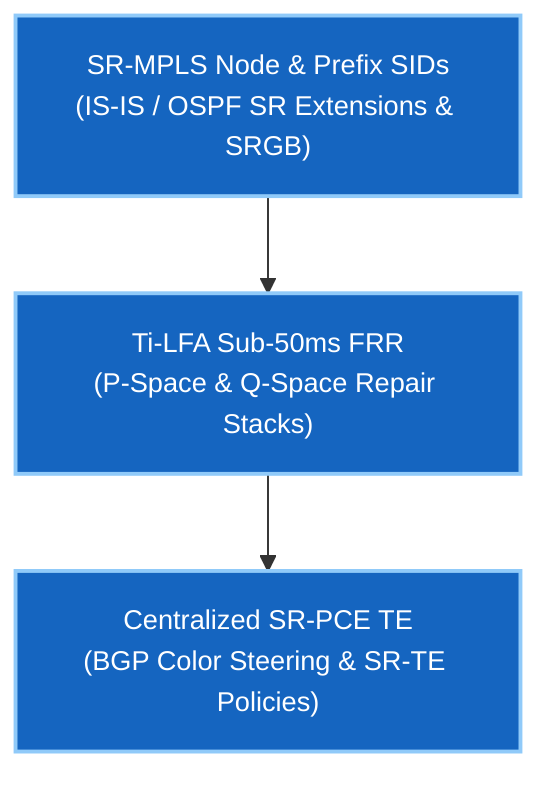

# Phase 3.5 — Segment Routing (SR-MPLS & SRv6)

> 🟢 **Phase 3.5 စတင်လေ့လာနိုင်ပါပြီ** — Arista cEOS 4.32.0F ပေါ်တွင် အောင်မြင်စွာ စမ်းသပ်အတည်ပြုပြီး ဖြစ်သည်။

Segment Routing (SR) သည် Hyperscalers များ (Google B4/Jupiter၊ Meta Express Backbone၊ AWS) နှင့် Tier-1 Service Providers များက ကမ္ဘာလုံးဆိုင်ရာ WAN backbones ပေါ်တွင် traffic များကို အတိုင်းအတာကြီးမားစွာ ထိန်းကျောင်းမောင်းနှင်သည့် နည်းပညာဖြစ်ပါသည်။ Path state များကို core routers များတွင် သိမ်းဆည်းမည့်အစား packet header အတွင်းသို့ (label stacks များအဖြစ်) ထည့်သွင်းပေးခြင်းဖြင့် SR သည် core routers များရှိ RSVP-TE/LDP soft-state overhead ဝန်ပိမှုများကို အပြီးတိုင် ဖယ်ရှားပေးပါသည်။

SR-MPLS Node/Prefix SIDs များကို တည်ဆောက်ခြင်း၊ Topology-Independent LFA (Ti-LFA) ဖြင့် 50 ms အောက် Fast Reroute ကာကွယ်မှု တပ်ဆင်ခြင်း၊ နှင့် BGP Color Steering ပါဝင်သော ဗဟိုချုပ်ကိုင်မှုရှိသည့် SR-PCE Traffic Engineering စနစ်များကို လက်တွေ့ လေ့ကျင့်ရမည် ဖြစ်ပါသည်။

---

## သင်ရိုးဇယားနှင့် လက်တွေ့ Labs

| Lab | ရှင်းလင်းချက် | အဓိက Protocols & သဘောတရားများ | လက်ရှိအခြေအနေ |
|---|---|---|---|
| **[01](lab-01-sr-mpls-sids.md)** | SR-MPLS Node & Prefix SIDs | IS-IS / OSPF SR Extensions၊ SRGB (`16000–23999`)၊ Node SIDs၊ Adjacency SIDs | 🟢 **Validated** |
| **[02](lab-02-ti-lfa-frr.md)** | Ti-LFA Sub-50ms Fast Reroute | Topology-Independent LFA၊ P-Space & Q-Space Math၊ Post-Convergence Path Protection | 🟢 **Validated** |
| **[03](lab-03-sr-pce-te.md)** | SR-PCE & BGP Color Steering | Centralized Path Computation Element (PCEP RFC 5440)၊ BGP Color Extended Communities၊ SR-TE Policies | 🟢 **Validated** |

---

## Google Network Infrastructure ဦးတည် ကျွမ်းကျင်မှုများ

---

## ကြိုတင် လိုအပ်ချက်များ

- **[Phase 0 · IGP Fundamentals](../00-igp-fundamentals/index.md)** — IS-IS TLV mechanics နှင့် link-state SPF။
- **[Phase 3 · MPLS & L3VPN](../03-mpls-l3vpn/index.md)** — MPLS forwarding architecture နှင့် label stacks။

---

## နောက်ဆက်တွဲနှင့် အင်တာဗျူး လေ့ကျင့်ခန်းများ

- **[Self-Test အင်တာဗျူး မေးခွန်းများ](interview-questions.md)** — SR-MPLS၊ Node/Adjacency SIDs၊ Ti-LFA၊ နှင့် SR-PCE တို့ကို လွှမ်းခြုံထားသော Hyperscale WAN & Segment Routing မေးခွန်းဘဏ်။
