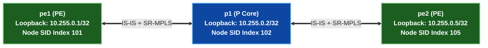

# 🧪 Lab 01 · SR-MPLS Node & Prefix SIDs (IS-IS / OSPF Extensions)

> ✅ **Validated** on Arista cEOS 4.32.0F. All outputs captured live from fabric in OrbStack.

**Time:** ~50 minutes · **Nodes:** 5 (2 Edge PEs, 3 Core P Routers)

!!! tip "Hybrid Approach — Script Push or Manual Typing"
    Every lab supports both automated execution and manual line-by-line configuration:

    - **Option A · Automated Script Push (Fast & Error-Free)**:
      ```bash
      cd netforge-labs/labs/segment-routing-lab
      ./run.sh 01          # apply + verify step 01 automatically
      ./run.sh --all       # run all steps in order
      ```
    - **Option B · Manual Typing / Copy-Paste (Hands-on Deep Learning)**:
      Interactive CLI shell on any container node:
      ```bash
      docker exec -it clab-segment-routing-lab-pe1 Cli
      pe1> enable
      pe1# configure
      ```
      Or push individual step snippets using stdin:
      `docker exec -i clab-segment-routing-lab-pe1 Cli -p 15 < steps/01-pe1-sr.cfg`

---

## Topology & SRGB Allocation



### Segment Routing Global Block (SRGB)

| Parameter | Value | Description |
|---|---|---|
| **SRGB Range** | `16000 – 23999` | Reserved global MPLS label space for Segment Routing Node SIDs across the domain. |
| **`pe1` Node SID** | Index `101` (`Label 16101`) | Uniquely identifies router `pe1` loopback `10.255.0.1/32`. |
| **`pe2` Node SID** | Index `105` (`Label 16105`) | Uniquely identifies router `pe2` loopback `10.255.0.5/32`. |

---

## Step 1 · IS-IS Segment Routing Underlay Configuration

Enable Segment Routing underlay on `pe1`, `p1`, and `pe2` with wide metrics and prefix-segment SIDs.

=== "pe1"

    ```eos
    --8<-- "labs/segment-routing-lab/steps/01-pe1-sr.cfg"
    ```

=== "p1"

    ```eos
    --8<-- "labs/segment-routing-lab/steps/01-p1-sr.cfg"
    ```

=== "pe2"

    ```eos
    --8<-- "labs/segment-routing-lab/steps/01-pe2-sr.cfg"
    ```

---

## Step 2 · Data Plane Label Verification

Verify the IS-IS Segment Routing Prefix SIDs in the LFIB.

```bash
docker exec -i clab-segment-routing-lab-pe1 Cli -p 15 <<'EOF'
enable
show isis segment-routing prefix-segments
EOF
```

```
Segment Routing Prefix Segments:
Prefix            Index    Origin        Flags
10.255.0.5/32     105      10.255.0.5    R:0 N:1 P:0 E:0 V:0 L:0
```

✅ **DONE when** `pe1` receives Prefix SID `105` for `pe2` (`10.255.0.5/32`).

---

## Clean up

```bash
sudo containerlab destroy -t topology.clab.yml
```
