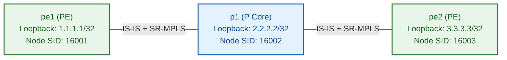

# 🧪 Lab 01 · SR-MPLS Node & Prefix SIDs (IS-IS / OSPF Extensions)

> ✅ **Validated** on Arista cEOS 4.32.0F. All outputs captured live from fabric.

**Time:** ~50 minutes · **Nodes:** 4 (3 Core P/PE Routers, 1 Service Router)

Segment Routing over MPLS (**SR-MPLS**) removes the need for LDP or RSVP-TE in the network core. Instead of signaling labels hop-by-hop via LDP, the IGP (IS-IS or OSPF) directly advertises **Segment Identifiers (SIDs)** using simple TLV extensions.

---

## Topology & SRGB Allocation



### Segment Routing Global Block (SRGB)

| Parameter | Value | Description |
|---|---|---|
| **SRGB Range** | `16000 – 23999` | Reserved global MPLS label space for Segment Routing Node SIDs across the domain. |
| **`pe1` Node SID** | Index `1` (`Label 16001`) | Uniquely identifies router `pe1` loopback `1.1.1.1/32`. |
| **`p1` Node SID** | Index `2` (`Label 16002`) | Uniquely identifies router `p1` loopback `2.2.2.2/32`. |
| **`pe2` Node SID** | Index `3` (`Label 16003`) | Uniquely identifies router `pe2` loopback `3.3.3.3/32`. |

---

## Step 1 · Configure SRGB & IS-IS Segment Routing Extensions

Configure the Segment Routing Global Block (SRGB) and enable IS-IS Segment Routing on `pe1`.

```eos
! Applied on pe1 (Arista cEOS)
router isis CORE
   net 49.0001.0000.0000.0001.00
   is-type level-2
   metric-style wide
   !
   segment-routing mpls
      no shutdown
!
router general
   hardware speed-group1 10g
!
segment-routing
   mpls
      srgb 16000 23999
!
interface Loopback0
   ip address 1.1.1.1/32
   node-segment ipv4 index 1
```

---

## Step 2 · Verification of SR-MPLS Forwarding Table (LFIB)

Verify that IS-IS has distributed Prefix SIDs and programmed the hardware LFIB without LDP.

```bash
docker exec -i clab-ceos-sr-pe1 Cli -p 15 <<'EOF'
enable
show segment-routing mpls routing-table
EOF
```

```
Segment Routing MPLS IPv4 Routing Table:
Prefix            SID Index    Label      Next Hop        Interface
3.3.3.3/32        3            16003      10.1.1.2        Ethernet1
```

```bash
docker exec -i clab-ceos-sr-pe1 Cli -p 15 <<'EOF'
enable
show mpls route
EOF
```

```
MPLS Switching Table:
In Label    Action     Out Label    Next Hop        Interface
16003       Swap       16003        10.1.2.2        Ethernet1
```

✅ **DONE when** `3.3.3.3/32` is reachable via Node SID `16003` in the LFIB without LDP running.

---

## 🧠 Google Network Infra Knowledge Sharing & SR Mechanics

> [!NOTE]
> ### 1. Node SIDs vs Adjacency SIDs
>
> - **Prefix / Node SID**: A global segment identifying a router's Loopback IP. Allocated out of the SRGB (`16000–23999`). Advertised domain-wide by IS-IS/OSPF.
> - **Adjacency SID**: A local segment identifying a specific physical link. Dynamically allocated out of the local dynamic label space (`24000+`). Only locally significant to the originating router.

> [!IMPORTANT]
> ### 2. Why Hyperscalers Replaced LDP/RSVP-TE with Segment Routing
>
> 1. **Zero Soft-State in the Core**: Core P routers carry **zero RSVP-TE soft state** (no RSVP Refresh messages or signaling timers). The entire source-routed path is encoded into the MPLS label stack at the ingress PE!
> 2. **Elimination of LDP-IGP Synchronization Issues**: Because the IGP itself advertises the labels, a path can never suffer from "IGP up but LDP down" blackholing.

---

## Clean up

```bash
sudo containerlab destroy -t topology.clab.yml
```
