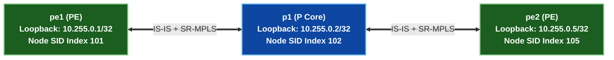

# 🧪 Lab 01 · SR-MPLS Node နှင့် Prefix SIDs (IS-IS / OSPF တိုးချဲ့မှုများ) {: #lab-01-sr-mpls-node-prefix-sids }

> ✅ **စမ်းသပ်အတည်ပြုပြီး** - Arista cEOS 4.32.0F ပေါ်တွင် OrbStack fabric မှ output များကို တိုက်ရိုက်ရယူထားပါသည်။

**ကြာချိန်:** ~၅၀ မိနစ် · **Nodes အရေအတွက်:** ၅ ခု (Edge PE ၂ လုံး၊ Core P Router ၃ လုံး)

!!! tip "အမြန်စတင်ရန် လမ်းညွှန် — Step-by-Step Execution Guide (တည်နေရာ: `labs/segment-routing-lab/`)"
    **အဆင့် ၁ · Lab Fabric ကို စတင်လည်ပတ်ပါ (မ run ရသေးပါက)**
    ```bash
    cd labs/segment-routing-lab
    sudo containerlab deploy -t topology.clab.yml --max-workers 1
    ```

    **အဆင့် ၂ · အပြန်အလှန် Interactive လမ်းညွှန်ကို စတင်ပါ**
    ```bash
    ./run.sh --guided
    ```

    ??? note "အခြား Run နိုင်သော နည်းလမ်းများ (Automated Script သို့မဟုတ် Manual CLI)"
        - **Fast Automated Script Push**:
          ```bash
          ./run.sh 01          # step 01 ကို အလိုအလျောက် config ထည့်သွင်း၍ စစ်ဆေးမည်
          ./run.sh --all       # အဆင့်အားလုံးကို အစီအစဉ်အတိုင်း run မည်
          ```
        - **Manual Line-by-Line CLI Execution**:
          Container node တစ်ခုချင်းစီသို့ CLI shell ဝင်ရောက်ရန်:
          ```bash
          docker exec -it clab-segment-routing-lab-pe1 Cli
          ```

## Topology နှင့် SRGB ခွဲဝေမှု {: #topology-srgb-allocation }



### Segment Routing Global Block (SRGB) {: #segment-routing-global-block-srgb }

| သတ်မှတ်ချက် | တန်ဖိုး | ရှင်းလင်းချက် |
|---|---|---|
| **SRGB Range** | `16000 – 23999` | Domain တစ်ခုလုံးရှိ Segment Routing Node SIDs များအတွက် သီးသန့်ဖယ်ထားသော global MPLS label အပိုင်းအခြား။ |
| **`pe1` Node SID** | Index `101` (`Label 16101`) | Router `pe1` loopback `10.255.0.1/32` ကို သီးခြားခွဲခြားဖော်ပြသည်။ |
| **`pe2` Node SID** | Index `105` (`Label 16105`) | Router `pe2` loopback `10.255.0.5/32` ကို သီးခြားခွဲခြားဖော်ပြသည်။ |

---

## အဆင့် ၁ · IS-IS Segment Routing Underlay ပြင်ဆင်သတ်မှတ်ခြင်း {: #step-1-is-is-segment-routing-underlay-configuration }

`pe1`၊ `p1`၊ နှင့် `pe2` ပေါ်တွင် wide metrics နှင့် prefix-segment SIDs များဖြင့် Segment Routing underlay ကို ဖွင့်ပါ။

=== "pe1"

    ```eos
    --8<-- "labs/segment-routing-lab/steps/01-pe1-sr.cfg"
    ```

=== "p1"

    ```eos
    --8<-- "labs/segment-routing-lab/steps/01-p1-sr.cfg"
    ```

=== "pe2"

    ```eos
    --8<-- "labs/segment-routing-lab/steps/01-pe2-sr.cfg"
    ```

---

## အဆင့် ၂ · Data Plane Label စစ်ဆေးခြင်း {: #step-2-data-plane-label-verification }

LFIB ထဲရှိ IS-IS Segment Routing Prefix SIDs များကို စစ်ဆေးပါ။

```bash
docker exec -i clab-segment-routing-lab-pe1 Cli -p 15 <<'EOF'
enable
show isis segment-routing prefix-segments
EOF
```

```
Segment Routing Prefix Segments:
Prefix            Index    Origin        Flags
10.255.0.5/32     105      10.255.0.5    R:0 N:1 P:0 E:0 V:0 L:0
```

✅ **အောင်မြင်မှု သတ်မှတ်ချက်:** `pe1` သည် `pe2` (`10.255.0.5/32`) အတွက် Prefix SID `105` ကို လက်ခံရရှိထားရပါမည်။

---

## ရှင်းလင်းသိမ်းဆည်းခြင်း (Clean up) {: #clean-up }

```bash
sudo containerlab destroy -t topology.clab.yml
```
