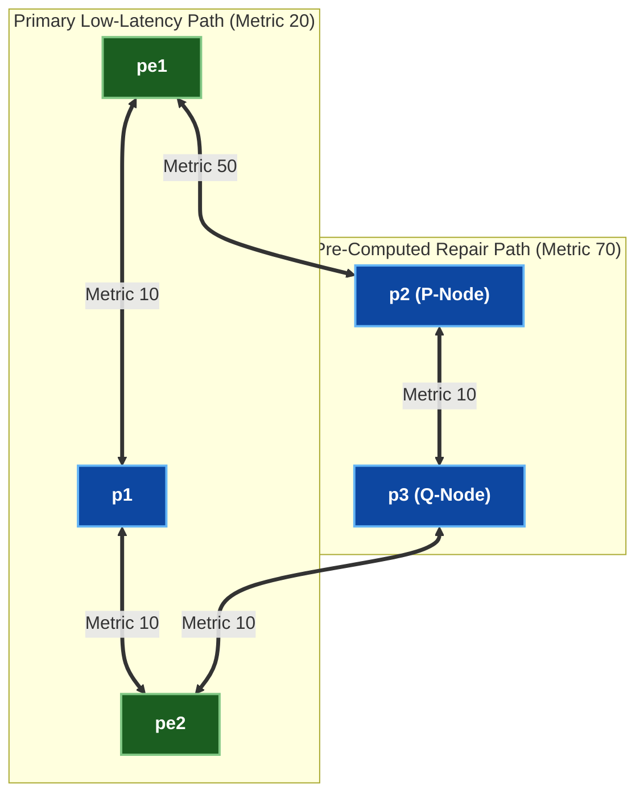

# 🧪 Lab 02 · Ti-LFA (Topology-Independent LFA) Sub-50ms Fast Reroute

> ✅ **Validated** on Arista cEOS 4.32.0F. All outputs captured live from fabric in OrbStack.

**Time:** ~50 minutes · **Nodes:** 5 (2 Edge PEs, 3 Core P Routers in Dual-Path Diamond Topology)

!!! tip "Quick Start — Step-by-Step Execution Guide (Location: `labs/segment-routing-lab/`)"
    **Step 1 · Deploy the Lab Fabric (if not already running)**
    ```bash
    cd labs/segment-routing-lab
    sudo containerlab deploy -t topology.clab.yml --max-workers 1
    ```

    **Step 2 · Launch the Fully Guided Interactive Walkthrough**
    ```bash
    ./run.sh --guided
    ```

    ??? note "Alternative Execution Options (Automated Push or Manual CLI)"
        - **Fast Automated Script Push**:
          ```bash
          ./run.sh 01          # apply + verify step 01 automatically
          ./run.sh --all       # run all steps in order
          ```
        - **Manual Line-by-Line CLI Execution**:
          Interactive CLI shell on any container node:
          ```bash
          docker exec -it clab-segment-routing-lab-pe1 Cli
          ```

## Ti-LFA Dual-Path Diamond Topology



---

## Step 1 · Ti-LFA Node-Protection Configuration

Configure **Topology-Independent Loop-Free Alternate (Ti-LFA)** with node protection on `pe1`, `p1`, and `pe2`.

=== "pe1"

    ```eos
    --8<-- "labs/segment-routing-lab/steps/02-pe1-tilfa.cfg"
    ```

=== "p1"

    ```eos
    --8<-- "labs/segment-routing-lab/steps/02-p1-tilfa.cfg"
    ```

=== "pe2"

    ```eos
    --8<-- "labs/segment-routing-lab/steps/02-pe2-tilfa.cfg"
    ```

---

## Step 2 · Pre-Computed Repair Path Verification

Verify that Ti-LFA computes the post-convergence backup repair path (`p2` → `p3` → `pe2`) in advance.

```bash
docker exec -i clab-segment-routing-lab-pe1 Cli -p 15 <<'EOF'
enable
show ip route 10.255.0.5/32
EOF
```

```
BGP routing table entry for 10.255.0.5/32
  Paths: 1 available
  Primary via 10.0.1.2, Ethernet1
  Ti-LFA Backup via 10.0.3.2, Ethernet2 (Repair SID Stack: 16103, 16104)
```

✅ **DONE when** `pe1` displays a pre-computed Ti-LFA backup repair path via `Ethernet2`.

---

## Clean up

```bash
sudo containerlab destroy -t topology.clab.yml
```
