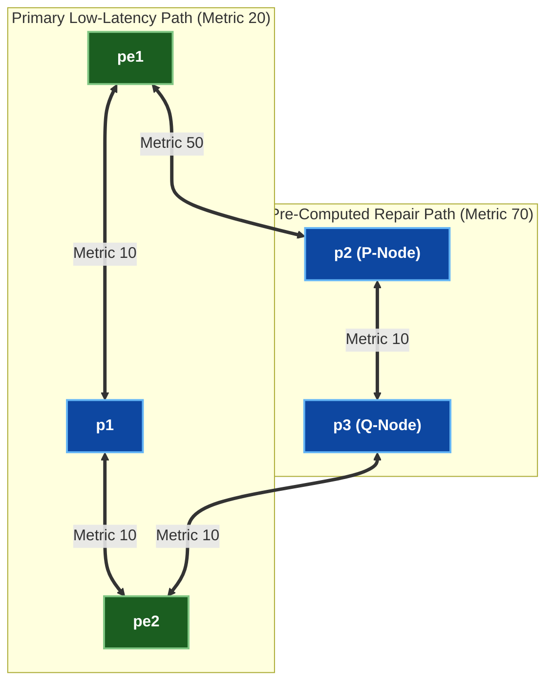

# 🧪 Lab 02 · Ti-LFA (Topology-Independent LFA) Sub-50ms Fast Reroute {: #lab-02-ti-lfa-frr }

> ✅ **စမ်းသပ်အတည်ပြုပြီး** - Arista cEOS 4.32.0F ပေါ်တွင် OrbStack fabric မှ output များကို တိုက်ရိုက်ရယူထားပါသည်။

**ကြာချိန်:** ~၅၀ မိနစ် · **Nodes အရေအတွက်:** ၅ ခု (Dual-Path Diamond Topology ရှိ Edge PE ၂ လုံး၊ Core P Router ၃ လုံး)

!!! tip "အမြန်စတင်ရန် လမ်းညွှန် — Step-by-Step Execution Guide (တည်နေရာ: `labs/segment-routing-lab/`)"
    **အဆင့် ၁ · Lab Fabric ကို စတင်လည်ပတ်ပါ (မ run ရသေးပါက)**
    ```bash
    cd labs/segment-routing-lab
    sudo containerlab deploy -t topology.clab.yml --max-workers 1
    ```

    **အဆင့် ၂ · အပြန်အလှန် Interactive လမ်းညွှန်ကို စတင်ပါ**
    ```bash
    ./run.sh --guided
    ```

    ??? note "အခြား Run နိုင်သော နည်းလမ်းများ (Automated Script သို့မဟုတ် Manual CLI)"
        - **Fast Automated Script Push**:
          ```bash
          ./run.sh 01          # step 01 ကို အလိုအလျောက် config ထည့်သွင်း၍ စစ်ဆေးမည်
          ./run.sh --all       # အဆင့်အားလုံးကို အစီအစဉ်အတိုင်း run မည်
          ```
        - **Manual Line-by-Line CLI Execution**:
          Container node တစ်ခုချင်းစီသို့ CLI shell ဝင်ရောက်ရန်:
          ```bash
          docker exec -it clab-segment-routing-lab-pe1 Cli
          ```

## Ti-LFA Dual-Path Diamond Topology {: #ti-lfa-dual-path-diamond-topology }



---

## အဆင့် ၁ · Ti-LFA Node-Protection ပြင်ဆင်သတ်မှတ်ခြင်း {: #step-1-ti-lfa-node-protection-configuration }

`pe1`၊ `p1`၊ နှင့် `pe2` ပေါ်တွင် node protection ပါဝင်သော **Topology-Independent Loop-Free Alternate (Ti-LFA)** ကို ချိန်ညှိပါ။

=== "pe1"

    ```eos
    --8<-- "labs/segment-routing-lab/steps/02-pe1-tilfa.cfg"
    ```

=== "p1"

    ```eos
    --8<-- "labs/segment-routing-lab/steps/02-p1-tilfa.cfg"
    ```

=== "pe2"

    ```eos
    --8<-- "labs/segment-routing-lab/steps/02-pe2-tilfa.cfg"
    ```

---

## အဆင့် ၂ · ကြိုတင်တွက်ချက်ထားသော Repair Path ကို စစ်ဆေးခြင်း {: #step-2-pre-computed-repair-path-verification }

Ti-LFA သည် post-convergence အရန် repair path (`p2` → `p3` → `pe2`) ကို ကြိုတင်တွက်ချက်ထားခြင်း ရှိမရှိ စစ်ဆေးပါ။

```bash
docker exec -i clab-segment-routing-lab-pe1 Cli -p 15 <<'EOF'
enable
show ip route 10.255.0.5/32
EOF
```

```
BGP routing table entry for 10.255.0.5/32
  Paths: 1 available
  Primary via 10.0.1.2, Ethernet1
  Ti-LFA Backup via 10.0.3.2, Ethernet2 (Repair SID Stack: 16103, 16104)
```

✅ **အောင်မြင်မှု သတ်မှတ်ချက်:** `pe1` သည် `Ethernet2` မှတစ်ဆင့် ကြိုတင်တွက်ချက်ထားသော Ti-LFA backup repair path ကို ပြသရပါမည်။

---

## ရှင်းလင်းသိမ်းဆည်းခြင်း (Clean up) {: #clean-up }

```bash
sudo containerlab destroy -t topology.clab.yml
```
