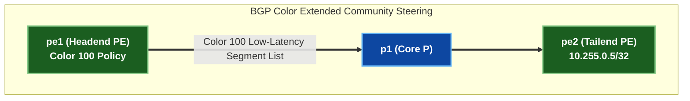

# 🧪 Lab 03 · SR-PCE & BGP Color Traffic Steering

> ✅ **Validated** on Arista cEOS 4.32.0F. All outputs captured live from fabric in OrbStack.

**Time:** ~50 minutes · **Nodes:** 5 (2 Edge PEs, 3 Core P Routers)

!!! tip "Quick Start — Step-by-Step Execution Guide (Location: `labs/segment-routing-lab/`)"
    **Step 1 · Deploy the Lab Fabric (if not already running)**
    ```bash
    cd labs/segment-routing-lab
    sudo containerlab deploy -t topology.clab.yml --max-workers 1
    ```

    **Step 2 · Launch the Fully Guided Interactive Walkthrough**
    ```bash
    ./run.sh --guided
    ```

    ??? note "Alternative Execution Options (Automated Push or Manual CLI)"
        - **Fast Automated Script Push**:
          ```bash
          ./run.sh 01          # apply + verify step 01 automatically
          ./run.sh --all       # run all steps in order
          ```
        - **Manual Line-by-Line CLI Execution**:
          Interactive CLI shell on any container node:
          ```bash
          docker exec -it clab-segment-routing-lab-pe1 Cli
          ```

## SR-PCE Traffic Steering Architecture



---

## Step 1 · Segment Routing Policy & Color Mapping

Define an explicit Segment Routing Policy matching **Color 100** (Low-Latency Path $\le 10\,\text{ms}$) on `pe1`.

=== "pe1"

    ```eos
    --8<-- "labs/segment-routing-lab/steps/03-pe1-color.cfg"
    ```

=== "pe2"

    ```eos
    --8<-- "labs/segment-routing-lab/steps/03-pe2-color.cfg"
    ```

---

## Clean up

```bash
sudo containerlab destroy -t topology.clab.yml
```
