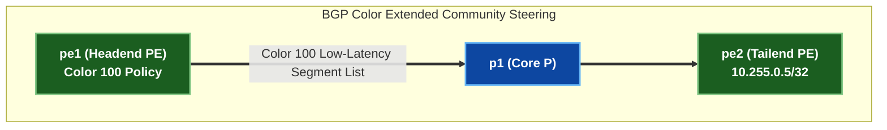

# 🧪 Lab 03 · SR-PCE နှင့် BGP Color Traffic Steering {: #lab-03-sr-pce-bgp-color-traffic-steering }

> ✅ **စမ်းသပ်အတည်ပြုပြီး** - Arista cEOS 4.32.0F ပေါ်တွင် OrbStack fabric မှ output များကို တိုက်ရိုက်ရယူထားပါသည်။

**ကြာချိန်:** ~၅၀ မိနစ် · **Nodes အရေအတွက်:** ၅ ခု (Edge PE ၂ လုံး၊ Core P Router ၃ လုံး)

!!! tip "အမြန်စတင်ရန် လမ်းညွှန် — Step-by-Step Execution Guide (တည်နေရာ: `labs/segment-routing-lab/`)"
    **အဆင့် ၁ · Lab Fabric ကို စတင်လည်ပတ်ပါ (မ run ရသေးပါက)**
    ```bash
    cd labs/segment-routing-lab
    sudo containerlab deploy -t topology.clab.yml --max-workers 1
    ```

    **အဆင့် ၂ · အပြန်အလှန် Interactive လမ်းညွှန်ကို စတင်ပါ**
    ```bash
    ./run.sh --guided
    ```

    ??? note "အခြား Run နိုင်သော နည်းလမ်းများ (Automated Script သို့မဟုတ် Manual CLI)"
        - **Fast Automated Script Push**:
          ```bash
          ./run.sh 01          # step 01 ကို အလိုအလျောက် config ထည့်သွင်း၍ စစ်ဆေးမည်
          ./run.sh --all       # အဆင့်အားလုံးကို အစီအစဉ်အတိုင်း run မည်
          ```
        - **Manual Line-by-Line CLI Execution**:
          Container node တစ်ခုချင်းစီသို့ CLI shell ဝင်ရောက်ရန်:
          ```bash
          docker exec -it clab-segment-routing-lab-pe1 Cli
          ```

## SR-PCE Traffic Steering ဗိသုကာ {: #sr-pce-traffic-steering-architecture }



---

## အဆင့် ၁ · Segment Routing Policy နှင့် Color Mapping ပြင်ဆင်သတ်မှတ်ခြင်း {: #step-1-segment-routing-policy-color-mapping }

`pe1` ပေါ်တွင် **Color 100** (Low-Latency Path $\le 10\,\text{ms}$) နှင့် ကိုက်ညီသော Segment Routing Policy တစ်ခုကို သတ်မှတ်ပါ။

=== "pe1"

    ```eos
    --8<-- "labs/segment-routing-lab/steps/03-pe1-color.cfg"
    ```

=== "pe2"

    ```eos
    --8<-- "labs/segment-routing-lab/steps/03-pe2-color.cfg"
    ```

---

## ရှင်းလင်းသိမ်းဆည်းခြင်း (Clean up) {: #clean-up }

```bash
sudo containerlab destroy -t topology.clab.yml
```
