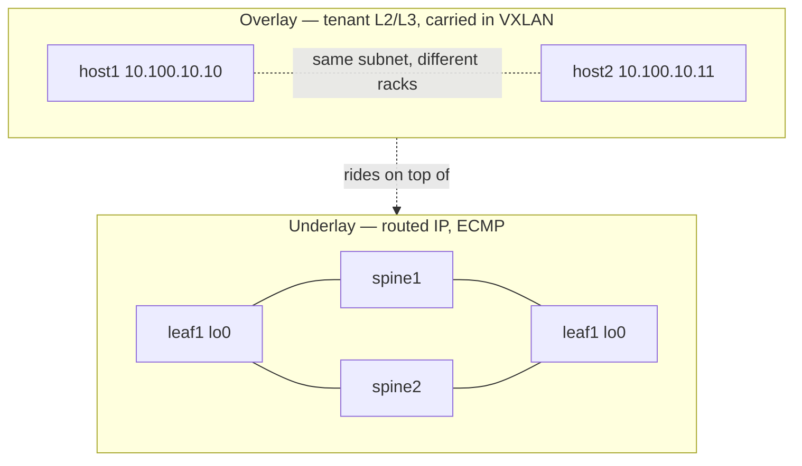

# ၂ — Underlay နှင့် Overlay နှိုင်းယှဉ်ချက် {: #2-underlay-vs-overlay }

ဤသည်မှာ ခေါင်းစဉ်တစ်ခုလုံးတွင် အရေးအကြီးဆုံးသော သဘောတရား ဖြစ်ပါသည်။ ၎င်းကို သဘောပေါက်ပါက ကျန်အရာအားလုံးသည် အလွယ်တကူ နားလည်သွားပါမည်။

## နှစ်ထပ်ဆင့် ကွန်ရက်စနစ် (Two networks, stacked) {: #two-networks-stacked }

VXLAN-EVPN fabric တစ်ခုသည် တူညီသော physical စက်ကိရိယာများပေါ်တွင် **ကွန်ရက်နှစ်ခု တစ်ပြိုင်နက် လည်ပတ်နေခြင်း** ဖြစ်ပါသည်:

| | Underlay | Overlay |
|---|----------|---------|
| **၎င်းသည် အဘယ်နည်း** | ရုပ်ပိုင်းဆိုင်ရာ Routed IP ကွန်ရက် | Tenant များ အမှန်တကယ် အသုံးပြုသော Virtual L2/L3 ကွန်ရက် |
| **၎င်း၏ တစ်ခုတည်းသော တာဝန်** | VTEP loopback တစ်ခုမှ အခြားတစ်ခုသို့ packet များကို ရောက်ရှိစေရန် | ထို tunnel များမှတစ်ဆင့် tenant MACs/IPs များကို သယ်ဆောင်ရန် |
| **မည်သူတို့ ပါဝင်သနည်း** | Spines + leaves (loopbacks, /31 links များ) | Hosts, VLANs, VNIs များ |
| **အသုံးပြုသော Protocol** | OSPF / IS-IS / eBGP | BGP-EVPN + VXLAN encapsulation |
| **အသုံးပြုသော လိပ်စာများ** | 10.0.0.x loopbacks, 10.10.x.x links | 10.100.x.x tenant subnets |

## ဥပမာ နှိုင်းယှဉ်ချက် (The analogy) {: #the-analogy }

- **Underlay = လမ်းမကြီးများ ကွန်ရက် (road network)။** မည်သည့်နေရာနှစ်ခုကြားမဆို လမ်းကြောင်းများစွာ (ECMP) ဖြင့် ကောင်းမွန်စွာ ဆက်သွယ်ထားသော ရိုးရိုးလမ်းမများ ဖြစ်သည်။ မည်သည့် ကုန်ပစ္စည်းကို သယ်ယူပို့ဆောင်နေသည်ကို သိရှိရန် မလိုသလို ဂရုစိုက်ရန်လည်း မလိုပါ။
- **Overlay = စာတိုက်စနစ် (mail system)။** စာအိတ်များ (tenant frame များ) ကို **VTEP-မှ-VTEP သို့** လိပ်စာတပ်ထားသော ပစ္စည်းပို့သေတ္တာ (VXLAN) အတွင်း ထည့်သွင်းကာ လမ်းမကြီးများပေါ် တင်ပို့ပြီး ရောက်ရှိရာ နေရာတွင် သေတ္တာကို ဖွင့်ဖောက်ထုတ်ယူသည်။

စာတိုက်စနစ်သည် လမ်းမသစ်များ ဖောက်လုပ်ရန် မလိုပါ — ရှိပြီးသား လမ်းမများပေါ်တွင်သာ *စီးနင်းလိုက်ပါ (rides on)* သွားခြင်း ဖြစ်သည်။ ထို့ကြောင့် underlay သည် **တစ်ခုတည်းသော တာဝန်ကို ကောင်းမွန်စွာ လုပ်ဆောင်ရန်သာ လိုအပ်ပါသည်: VTEP loopback တစ်ခုစီသည် အခြား loopback တိုင်းဆီသို့ လမ်းကြောင်းညီမျှစွာ (multiple equal paths) ရောက်ရှိနိုင်စေရန်** ဖြစ်ပါသည်။

## VTEP — အလွှာနှစ်ခု ဆုံတွေ့ရာနေရာ {: #vtep-where-the-two-layers-meet }

**VTEP** (VXLAN Tunnel EndPoint) သည် နယ်နိမိတ်မျဉ်းပေါ်တွင် တည်ရှိသော ကိရိယာဖြစ်ပါသည်:

- ၎င်း၏ **overlay** ဘက်ခြမ်းတွင် tenant VLAN များနှင့် host port များ ရှိသည်။
- ၎င်း၏ **underlay** ဘက်ခြမ်းတွင် loopback IP ရှိသည်။
- ၎င်း၏ တာဝန်: Tenant frame အား VXLAN ထဲသို့ **ထည့်သွင်းပေးခြင်း (encapsulate)** နှင့် အဝေးဘက်ခြမ်းတွင် **ပြန်လည်ဖောက်ထုတ်ပေးခြင်း (decapsulate)** ဖြစ်သည်။

Spine-leaf fabric တစ်ခုတွင် **leaf များသည် VTEP များ ဖြစ်ကြသည်။** **Spine များသည် သန့်စင်သော underlay ဖြစ်သည်** — ၎င်းတို့သည် loopback များအကြား IP packet များကို လမ်းကြောင်းပေးရုံသာ ဖြစ်ပြီး VXLAN သေတ္တာအတွင်းပိုင်းကို မည်သည့်အခါမျှ လှန်လှောမကြည့်ပါ။ (Lab ထဲတွင် တွေ့မြင်ခဲ့ရသည့်အတိုင်း: Spine များသည် OSPF သာ run ပြီး Leaf များက EVPN ကို လုပ်ဆောင်ပါသည်)။

## ၎င်းတို့ကို အဘယ်ကြောင့် သီးခြားခွဲထုတ်ထားသနည်း {: #why-separate-them }

အကြောင်းမှာ အလွှာတစ်ခုစီသည် တစ်ခုနှင့်တစ်ခု မထိခိုက်ဘဲ သီးခြားလွတ်လပ်စွာ ပြောင်းလဲနိုင်သောကြောင့် ဖြစ်ပါသည်:

- Overlay ကို မထိခိုက်စေဘဲ Underlay protocol ကို ပြောင်းလဲနိုင်သည် (OSPF → IS-IS → eBGP)။ **ဒါဟာ Lab 01–04 တို့တွင် သင်လုပ်ဆောင်ခဲ့သည့် အတိုင်းအတာ ဖြစ်ပါသည်။**
- ရုပ်ပိုင်းဆိုင်ရာ physical network ကို ပြန်လည်မပြင်ဆင်ဘဲ Overlay ထဲတွင် tenant များနှင့် VNI များကို လွတ်လပ်စွာ ထပ်မံထည့်သွင်းနိုင်သည်။

## မိမိကိုယ်ကို ပြန်လည်စစ်ဆေးပါ {: #check-yourself }

1. Underlay ၏ တစ်ခုတည်းသော တာဝန်မှာ အဘယ်နည်း။
2. Spine-leaf fabric တစ်ခုတွင် VTEP များသည် မည်သည့်နေရာတွင် ရှိပြီး Spine များက မည်သည့်အရာကို လုပ်ဆောင်သနည်း။
3. Underlay နှင့် Overlay ကို သီးခြားခွဲထုတ်ထားခြင်းက အလွှာတစ်ခုကို ပြင်ဆင်သည့်အခါ အခြားတစ်ခုကို မထိခိုက်စေဘဲ အဘယ်ကြောင့် ပြုလုပ်နိုင်သနည်း။

→ နောက်ထပ်: [VXLAN Data Plane](03-vxlan-dataplane.my.md)
