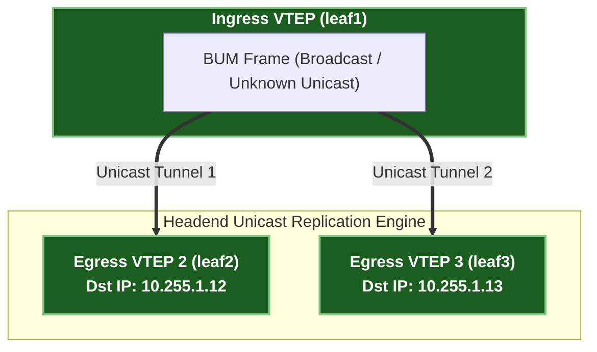

# 3 · VXLAN Data Plane & Header Framing Deep Dive

Virtual Extensible LAN (VXLAN, RFC 7348) is an **MAC-in-UDP encapsulation protocol** that bridges Layer 2 Ethernet frames across an arbitrary Layer 3 IP underlay network.

---

## 1. 50-Byte VXLAN Packet Header Stack Breakdown

When a local leaf switch (VTEP) receives a frame from a host, it encapsulates the entire Ethernet frame inside a VXLAN UDP packet:

```
+-------------------------------------------------------------------------+
| Outer Ethernet Header (14 bytes)                                        |
|   Dst MAC: Next-Hop IP Gateway / Router MAC                             |
|   Src MAC: Ingress VTEP Interface MAC                                   |
|   EtherType: 0x0800 (IPv4)                                              |
+-------------------------------------------------------------------------+
| Outer IPv4 Header (20 bytes)                                            |
|   Src IP: Ingress VTEP Loopback IP (e.g., 10.255.1.11)                   |
|   Dst IP: Egress VTEP Loopback IP (e.g., 10.255.1.12)                    |
|   Protocol: 17 (UDP)                                                    |
+-------------------------------------------------------------------------+
| Outer UDP Header (8 bytes)                                              |
|   Src Port: Hash of Inner Frame L2/L3/L4 (for Underlay ECMP Load-Balancing) |
|   Dst Port: 4789 (IANA Standard VXLAN UDP Port)                         |
+-------------------------------------------------------------------------+
| VXLAN Header (8 bytes)                                                  |
|   Flags: 0x08 (I bit = 1, indicating valid 24-bit VNI)                 |
|   VXLAN Network Identifier (VNI): 24-bit VNI (Range: 1 – 16,777,215)    |
+-------------------------------------------------------------------------+
| Original Inner Ethernet Frame (14+ bytes)                               |
|   Dst MAC: Destination Host MAC                                         |
|   Src MAC: Source Host MAC                                              |
|   EtherType / Payload: Original IPv4/IPv6 Packet                        |
+-------------------------------------------------------------------------+
```

### Key Protocol Mechanics

1. **Outer UDP Source Port ECMP Hashing**:
   - The ingress VTEP computes a hash of the *inner frame* (Src MAC, Dst MAC, Src IP, Dst IP, Ports) and sets the **Outer UDP Source Port** to a dynamic value between `49152 – 65535`.
   - **Why this is genius**: Underlay routers perform standard 5-tuple ECMP hashing on the outer IP/UDP header, achieving perfectly balanced traffic distribution across Spine switches without looking inside the VXLAN tunnel!

2. **24-Bit VXLAN Network Identifier (VNI)**:
   - Expands the legacy 12-bit 802.1Q VLAN limit ($4,096$ VLANs) to a **24-bit VNI space** ($16,777,215$ VNIs), eliminating VLAN scale exhaustion in multi-tenant cloud datacenters.

---

## 2. Ingress Replication (Headend Replication) vs Multicast



- **Ingress (Headend) Replication**: The ingress VTEP inspects the EVPN Route Type 3 (IMET) flood list for that VNI, creates individual unicast copies of the BUM frame, and sends a unicast VXLAN packet to each remote VTEP.
- **Underlay IP Multicast**: Alternatively, BUM traffic is mapped to an underlay PIM multicast group (`239.1.1.1`). VTEPs join the multicast group via IGMP.
