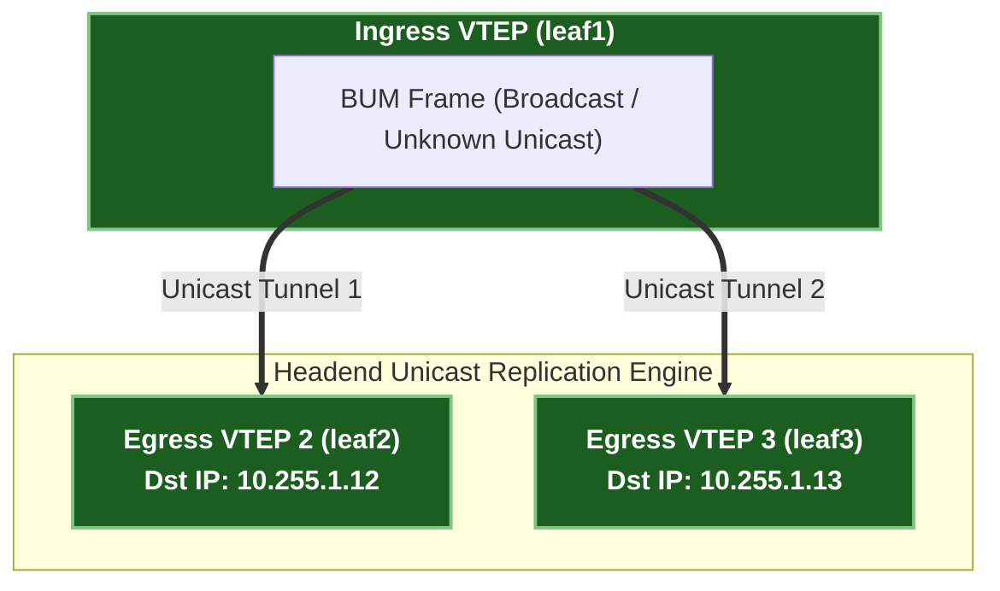

# ၃ · VXLAN Data Plane နှင့် Header Framing အတွင်းကျကျ လေ့လာခြင်း {: #3-vxlan-data-plane-header-framing }

Virtual Extensible LAN (VXLAN, RFC 7348) သည် မည်သည့် Layer 3 IP underlay ကွန်ရက်ပေါ်တွင်မဆို Layer 2 Ethernet frame များကို ပေါင်းကူးပေးပို့နိုင်သော **MAC-in-UDP encapsulation protocol** တစ်ခု ဖြစ်ပါသည်။

---

## ၁။ 50-Byte VXLAN Packet Header Stack ခွဲခြမ်းစိတ်ဖြာချက် {: #1-50-byte-vxlan-packet-header-stack-breakdown }

Local leaf switch (VTEP) တစ်ခုသည် host တစ်ခုထံမှ frame တစ်ခုကို လက်ခံရရှိသောအခါ Ethernet frame တစ်ခုလုံးအား VXLAN UDP packet အတွင်းသို့ အောက်ပါအတိုင်း encapsulate လုပ်ပေးပါသည်:

```
+-------------------------------------------------------------------------+
| Outer Ethernet Header (14 bytes)                                        |
|   Dst MAC: Next-Hop IP Gateway / Router MAC                             |
|   Src MAC: Ingress VTEP Interface MAC                                   |
|   EtherType: 0x0800 (IPv4)                                              |
+-------------------------------------------------------------------------+
| Outer IPv4 Header (20 bytes)                                            |
|   Src IP: Ingress VTEP Loopback IP (ဥပမာ 10.255.1.11)                   |
|   Dst IP: Egress VTEP Loopback IP (ဥပမာ 10.255.1.12)                    |
|   Protocol: 17 (UDP)                                                    |
+-------------------------------------------------------------------------+
| Outer UDP Header (8 bytes)                                              |
|   Src Port: Inner Frame L2/L3/L4 ၏ Hash (Underlay ECMP Load-Balancing အတွက်)|
|   Dst Port: 4789 (IANA စံနှုန်း VXLAN UDP Port)                          |
+-------------------------------------------------------------------------+
| VXLAN Header (8 bytes)                                                  |
|   Flags: 0x08 (I bit = 1, မှန်ကန်သော 24-bit VNI ပါဝင်ကြောင်း ဖော်ပြသည်)  |
|   VXLAN Network Identifier (VNI): 24-bit VNI (အပိုင်းအခြား: 1 – 16,777,215)|
+-------------------------------------------------------------------------+
| Original Inner Ethernet Frame (14+ bytes)                               |
|   Dst MAC: Destination Host MAC                                         |
|   Src MAC: Source Host MAC                                              |
|   EtherType / Payload: Original IPv4/IPv6 Packet                        |
+-------------------------------------------------------------------------+
```

### အဓိက Protocol လုပ်ဆောင်ချက်များ {: #key-protocol-mechanics }

1. **Outer UDP Source Port ECMP Hashing**:
   - Ingress VTEP သည် *အတွင်းပိုင်း frame* ၏ အချက်အလက်များ (Src MAC, Dst MAC, Src IP, Dst IP, Ports) ကို hash တွက်ချက်ပြီး **Outer UDP Source Port** ကို `49152 – 65535` ကြားရှိ dynamic တန်ဖိုးတစ်ခုအဖြစ် သတ်မှတ်ပေးသည်။
   - **ဤဒီဇိုင်း၏ ထူးချွန်ချက်**: Underlay router များသည် အပြင်ဘက် IP/UDP header ပေါ်တွင် ပုံမှန် standard 5-tuple ECMP hashing ကို လုပ်ဆောင်ရုံဖြင့် VXLAN tunnel အတွင်းပိုင်းကို ဝင်ရောက်ကြည့်ရှုစရာမလိုဘဲ Spine switch များတစ်လျှောက် traffic များကို အညီအမျှ ခွဲဝေပို့ဆောင်ပေးနိုင်ပါသည်!

2. **24-Bit VXLAN Network Identifier (VNI)**:
   - ရှေးဟောင်း 12-bit 802.1Q VLAN ကန့်သတ်ချက် (၄,၀၉၆ VLANs) ကို **24-bit VNI space** (၁၆,၇၇၇,၂၁၅ VNIs) အထိ ချဲ့ထွင်ပေးသောကြောင့် multi-tenant cloud data center များတွင် VLAN မလုံလောက်သည့် ပြဿနာကို အပြီးတိုင် ဖြေရှင်းပေးပါသည်။

---

## ၂။ Ingress Replication (Headend Replication) နှင့် Multicast နှိုင်းယှဉ်ချက် {: #2-ingress-replication-vs-multicast }



- **Ingress (Headend) Replication**: Ingress VTEP သည် အဆိုပါ VNI အတွက် EVPN Route Type 3 (IMET) flood list ကို စစ်ဆေးပြီး BUM frame ၏ သီးခြား unicast မိတ္တူများကို ဖန်တီးကာ အဝေးရှိ remote VTEP တစ်ခုစီထံသို့ unicast VXLAN packet အနေဖြင့် ပေးပို့သည်။
- **Underlay IP Multicast**: အခြားတစ်နည်းအားဖြင့် BUM traffic ကို underlay PIM multicast group (`239.1.1.1`) သို့ ချိတ်ဆက်သတ်မှတ်ပေးပြီး VTEP များသည် IGMP မှတစ်ဆင့် ထို multicast group သို့ ချိတ်ဆက်ဝင်ရောက်ကြသည်။
