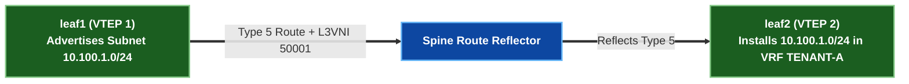

# 5 · EVPN Route Types 1, 2, 3, 4, & 5 Deep Dive

BGP EVPN (RFC 7432 / RFC 8214 / RFC 9135) uses **MP-BGP Address Family AFI 25 (L2VPN) / SAFI 70 (EVPN)**. The EVPN NLRI encodes five standardized **Route Types**.

---

## EVPN Route Types Summary Matrix

| Type | Name | Primary Purpose | Key NLRI Fields | Key Extended Communities |
|---|---|---|---|---|
| **Route Type 1** | Ethernet Auto-Discovery (A-D) | Fast Failover (Mass Withdraw), Aliasing, ESI Split Horizon | ESI (10B), Ethernet Tag ID, MPLS/VNI Label | ESI Label, Redundancy Mode |
| **Route Type 2** | **MAC / IP Advertisement** | Host reachability (MAC + IP), ARP Proxy | ESI, MAC Address (6B), IP Address (4B/16B), VNI | Router MAC, Default Gateway |
| **Route Type 3** | **Inclusive Multicast (IMET)** | VTEP Discovery & BUM Flood List | Ethernet Tag ID, Origin VTEP IP | Layer 2 VNI |
| **Route Type 4** | Ethernet Segment Route | PE Discovery & Designated Forwarder (DF) Election | ESI (10B), Origin VTEP IP | ES Import Route Target |
| **Route Type 5** | **IP Prefix Route** | Inter-Subnet VRF Routing (L3VNI), Summary / Default Routes | IP Prefix / Length, Gateway IP | Router MAC, Layer 3 VNI |

---

## 1. Route Type 2 · MAC/IP Advertisement (Host Reachability)

Route Type 2 is the core workhorse of BGP EVPN. When a local leaf switch discovers a host MAC or IP via ARP / DHCP / Data-Plane frame arrival, it advertises a Type 2 route into MP-BGP:

```
Route Type 2 NLRI Structure:
+------------------------------------------+
| Route Distinguisher (8 bytes)            |
| Ethernet Segment Identifier (10 bytes)   |
| Ethernet Tag ID (4 bytes)                |
| MAC Address Length (1 byte)              |
| MAC Address (6 bytes)                    |
| IP Address Length (1 byte - 0, 32, 128)  |
| IP Address (0, 4, or 16 bytes)           |
| MPLS/VNI Label 1 (3 bytes - L2VNI)       |
| MPLS/VNI Label 2 (3 bytes - L3VNI)       |
+------------------------------------------+
```

### Key Functions
- **Control-Plane MAC Learning**: Replaces data-plane flood-and-learn over WAN/Backbone.
- **ARP Suppression**: Allows remote leafs to answer host ARP requests locally out of their BGP EVPN host table without flooding ARP Broadcasts across the fabric!
- **MAC Mobility**: Tracks host movement between VTEPs using a **Sequence Number** Extended Community.

---

## 2. Route Type 3 · Inclusive Multicast Ethernet Tag (IMET)

When a VTEP brings up a Layer 2 VNI, it immediately advertises a Type 3 route:

```
Route Type 3 NLRI Structure:
+------------------------------------------+
| Route Distinguisher (8 bytes)            |
| Ethernet Tag ID (4 bytes)                |
| Originating Router IP Length (1 byte)    |
| Originating Router IP (4 bytes)          |
+------------------------------------------+
```

- **Purpose**: Discovers remote VTEPs participating in the same VNI and builds the **Headend Unicast Replication List** for BUM traffic.

---

## 3. Route Type 5 · IP Prefix Route (Inter-Subnet Routing)

Type 5 routes advertise IP subnets (`10.100.0.0/16`) or default routes (`0.0.0.0/0`) attached to an **L3VNI VRF**, independent of MAC addresses.



---

## 4. Route Types 1 & 4 · ESI All-Active Multihoming

- **Route Type 4 (Ethernet Segment)**: VTEPs connected to the same multi-homed server exchange Type 4 routes to discover each other and elect a **Designated Forwarder (DF)** for BUM traffic.
- **Route Type 1 (Ethernet Auto-Discovery)**: Advertises ESI Split Horizon labels and enables **Fast Failover (Mass Withdraw)**. If a link to a multi-homed server fails, the leaf sends a single Type 1 withdraw, instantly diverting traffic to the redundant leaf in $< 50\,\text{ms}$!
