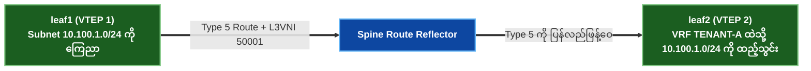

# ၅ · EVPN Route အမျိုးအစားများ ၁၊ ၂၊ ၃၊ ၄၊ နှင့် ၅ အသေးစိတ်လေ့လာခြင်း {: #5-evpn-route-types-deep-dive }

BGP EVPN (RFC 7432 / RFC 8214 / RFC 9135) သည် **MP-BGP Address Family AFI 25 (L2VPN) / SAFI 70 (EVPN)** ကို အသုံးပြုပါသည်။ EVPN NLRI သည် စံနှုန်းသတ်မှတ်ထားသော **Route အမျိုးအစား ၅ မျိုး** ကို ထည့်သွင်းသတ်မှတ်ပေးပါသည်။

---

## EVPN Route အမျိုးအစားများ အကျဉ်းချုပ် ဇယား {: #evpn-route-types-summary-matrix }

| Type | အမည် | အဓိက ရည်ရွယ်ချက် | အဓိက NLRI Fields | အဓိက Extended Communities |
|---|---|---|---|---|
| **Route Type 1** | Ethernet Auto-Discovery (A-D) | Fast Failover (Mass Withdraw), Aliasing, ESI Split Horizon | ESI (10B), Ethernet Tag ID, MPLS/VNI Label | ESI Label, Redundancy Mode |
| **Route Type 2** | **MAC / IP Advertisement** | Host ရောက်ရှိနိုင်မှု (MAC + IP), ARP Proxy | ESI, MAC Address (6B), IP Address (4B/16B), VNI | Router MAC, Default Gateway |
| **Route Type 3** | **Inclusive Multicast (IMET)** | VTEP Discovery & BUM Flood List တည်ဆောက်ခြင်း | Ethernet Tag ID, Origin VTEP IP | Layer 2 VNI |
| **Route Type 4** | Ethernet Segment Route | PE Discovery & Designated Forwarder (DF) Election | ESI (10B), Origin VTEP IP | ES Import Route Target |
| **Route Type 5** | **IP Prefix Route** | Inter-Subnet VRF Routing (L3VNI), Summary / Default Routes | IP Prefix / Length, Gateway IP | Router MAC, Layer 3 VNI |

---

## ၁။ Route Type 2 · MAC/IP ကြေညာခြင်း (Host Reachability) {: #1-route-type-2-mac-ip-advertisement }

Route Type 2 သည် BGP EVPN ၏ အဓိက မောင်းနှင်အား အစိတ်အပိုင်း ဖြစ်ပါသည်။ Local leaf switch တစ်ခုသည် ARP / DHCP / Data-Plane frame ဝင်ရောက်လာမှုတို့မှတစ်ဆင့် host MAC သို့မဟုတ် IP ကို သိရှိလာသောအခါ MP-BGP ထဲသို့ Type 2 route အဖြစ် စတင်ကြေညာပေးပါသည်:

```
Route Type 2 NLRI Structure:
+------------------------------------------+
| Route Distinguisher (8 bytes)            |
| Ethernet Segment Identifier (10 bytes)   |
| Ethernet Tag ID (4 bytes)                |
| MAC Address Length (1 byte)              |
| MAC Address (6 bytes)                    |
| IP Address Length (1 byte - 0, 32, 128)  |
| IP Address (0, 4, or 16 bytes)           |
| MPLS/VNI Label 1 (3 bytes - L2VNI)       |
| MPLS/VNI Label 2 (3 bytes - L3VNI)       |
+------------------------------------------+
```

### အဓိက လုပ်ဆောင်ချက်များ {: #key-functions }
- **Control-Plane MAC Learning**: WAN/Backbone ကွန်ရက်ပေါ်တွင် data-plane flood-and-learn လုပ်ဆောင်ရမှုကို အစားထိုးသည်။
- **ARP Suppression**: အဝေးရှိ leaf များသည် fabric ကို ဖြတ်၍ ARP Broadcasts များကို flood မလုပ်စေဘဲ မိမိတို့၏ BGP EVPN host table မှ host ARP တောင်းဆိုမှုများကို local အတိုင်း တိုက်ရိုက်ဖြေကြားခွင့် ပြုသည်!
- **MAC Mobility**: **Sequence Number** Extended Community ကို အသုံးပြု၍ VTEP များအကြား host များ ရွှေ့ပြောင်းသွားမှုကို ခြေရာခံသည်။

---

## ၂။ Route Type 3 · Inclusive Multicast Ethernet Tag (IMET) {: #2-route-type-3-inclusive-multicast-ethernet-tag }

VTEP တစ်ခုသည် Layer 2 VNI တစ်ခုကို စတင်ဖွင့်လှစ်လိုက်သောအခါ Type 3 route ကို ချက်ချင်း ကြေညာပေးပါသည်:

```
Route Type 3 NLRI Structure:
+------------------------------------------+
| Route Distinguisher (8 bytes)            |
| Ethernet Tag ID (4 bytes)                |
| Originating Router IP Length (1 byte)    |
| Originating Router IP (4 bytes)          |
+------------------------------------------+
```

- **ရည်ရွယ်ချက်**: တူညီသော VNI တွင် ပါဝင်နေသော အဝေးရှိ VTEP များကို ရှာဖွေတွေ့ရှိစေပြီး BUM traffic အတွက် **Headend Unicast Replication List** ကို တည်ဆောက်ပေးသည်။

---

## ၃။ Route Type 5 · IP Prefix Route (Inter-Subnet Routing) {: #3-route-type-5-ip-prefix-route }

Type 5 route များသည် MAC address များနှင့် မသက်ဆိုင်ဘဲ **L3VNI VRF** တစ်ခုနှင့် ချိတ်ဆက်ထားသော IP subnets (`10.100.0.0/16`) သို့မဟုတ် default routes (`0.0.0.0/0`) များကို ကြေညာပေးပါသည်။



---

## ၄။ Route Types 1 & 4 · ESI All-Active Multihoming {: #4-route-types-1-4-esi-all-active-multihoming }

- **Route Type 4 (Ethernet Segment)**: Server တစ်ခုတည်းသို့ multi-home ချိတ်ဆက်ထားသော VTEP များသည် အချင်းချင်း သိရှိစေရန်နှင့် BUM traffic အတွက် **Designated Forwarder (DF)** ရွေးကောက်ပွဲ ပြုလုပ်ရန် Type 4 route များကို ဖလှယ်ကြသည်။
- **Route Type 1 (Ethernet Auto-Discovery)**: ESI Split Horizon label များကို ကြေညာပြီး **Fast Failover (Mass Withdraw)** ကို ဖြစ်ပေါ်စေသည်။ အကယ်၍ multi-homed server ဆီသို့ ချိတ်ဆက်ထားသော link တစ်ခု ချို့ယွင်းသွားပါက leaf သည် single Type 1 withdraw တစ်ခုတည်းကို ပေးပို့လိုက်ရုံဖြင့် $< 50\,\text{ms}$ အတွင်း redundant leaf ဆီသို့ traffic ကို ချက်ချင်း လမ်းကြောင်းပြောင်းပေးနိုင်ပါသည်!
