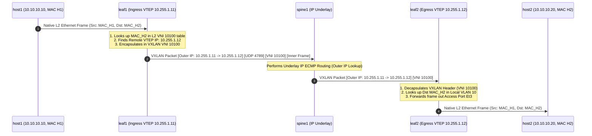
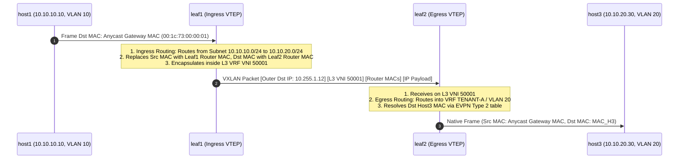

# 6 · EVPN VXLAN Packet Walk & Forwarding Mechanics

Understanding how packets are encapsulated, routed, and decapsulated as they move across a VXLAN-EVPN fabric is **one of the most critical topics in Datacenter System Design interviews**.

---

## 1. Intra-Subnet L2 Bridging Packet Walk (Same VNI 10100)

---

## 2. Inter-Subnet Symmetric IRB Packet Walk (VNI 10100 $\rightarrow$ L3VNI 50001 $\rightarrow$ VNI 10200)

In **Symmetric Integrated Routing and Bridging (IRB)**, routing occurs at **both the ingress leaf and egress leaf**:

### Why Symmetric IRB Scales Best
- **Equal Work Distribution**: Routing is split symmetrically between ingress and egress leafs.
- **Minimal VNI State**: Egress leafs only need to carry the VNIs and VLANs for local hosts attached to them, drastically reducing hardware TCAM memory usage!
