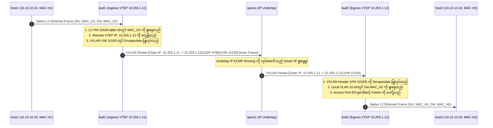
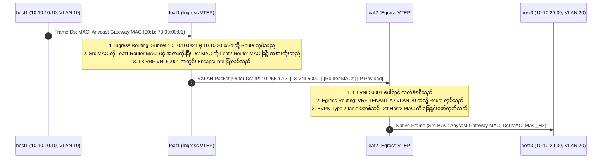

# ၆ · EVPN VXLAN Packet စီးဆင်းမှုနှင့် Forwarding နည်းစနစ်များ {: #6-evpn-vxlan-packet-walk-forwarding-mechanics }

Packet များသည် VXLAN-EVPN fabric တစ်ခုတစ်လျှောက် ဖြတ်သန်းသွားရာတွင် မည်သို့ encapsulate လုပ်သည်၊ မည်သို့ route လုပ်သည်၊ မည်သို့ decapsulate လုပ်သည်ကို နားလည်ခြင်းသည် **Datacenter System Design အင်တာဗျူးများတွင် အရေးအကြီးဆုံးသော ခေါင်းစဉ်တစ်ခု ဖြစ်ပါသည်**။

---

## ၁။ Intra-Subnet L2 Bridging Packet စီးဆင်းပုံ (တူညီသော VNI 10100) {: #1-intra-subnet-l2-bridging-packet-walk }

---

## ၂။ Inter-Subnet Symmetric IRB Packet စီးဆင်းပုံ (VNI 10100 → L3VNI 50001 → VNI 10200) {: #2-inter-subnet-symmetric-irb-packet-walk }

**Symmetric Integrated Routing and Bridging (IRB)** တွင် routing သည် **ingress leaf ရော egress leaf ပါ နှစ်ဖက်စလုံးတွင် ဖြစ်ပွားပါသည်**:

### Symmetric IRB သည် အဘယ်ကြောင့် အကောင်းဆုံး စကေးချဲ့နိုင်သနည်း {: #why-symmetric-irb-scales-best }
- **အလုပ်တာဝန်ကို ညီမျှစွာ ခွဲဝေခြင်း**: Routing လုပ်ငန်းစဉ်ကို ingress နှင့် egress leaf များအကြား အချိုးညီညီ ခွဲဝေလုပ်ဆောင်စေသည်။
- **VNI State လိုအပ်ချက် နည်းပါးခြင်း**: Egress leaf များသည် မိမိတို့နှင့် တိုက်ရိုက်ချိတ်ဆက်ထားသော local host များအတွက် VNI များနှင့် VLAN များကိုသာ သိမ်းဆည်းထားရန် လိုအပ်သောကြောင့် hardware TCAM memory အသုံးပြုမှုကို အလွန်အမင်း သက်သာစေပါသည်။
