# 🧪 Lab 01 · Pure L2VNI (Bridging & BUM Head-End Replication)

> ✅ **Validated** on Arista cEOS 4.32.0F. All outputs captured live from fabric in OrbStack.

**Time:** ~45 minutes · **Nodes:** 6 (2 Spines, 2 Leafs, 2 Customer Hosts)

!!! tip "Hybrid Approach — Script Push or Manual Typing"
    Every lab supports both automated execution and manual line-by-line configuration:

    - **Option A · Automated Script Push (Fast & Error-Free)**:
      ```bash
      cd netforge-labs/labs/evpn-datacenter-lab
      ./run.sh 01          # apply + verify step 01 automatically
      ./run.sh --all       # run all steps in order
      ```
    - **Option B · Manual Typing / Copy-Paste (Hands-on Deep Learning)**:
      Interactive CLI shell on any container node:
      ```bash
      docker exec -it clab-evpn-datacenter-lab-leaf1 Cli
      leaf1> enable
      leaf1# configure
      ```

---

## 🚀 Getting Started & Repository Setup

Before starting this lab, clone the repository (or run `git pull` if already cloned) and navigate to the lab directory:

```bash
# 1. Clone repository (or pull latest changes)
git clone https://github.com/etherhtun/netforge-labs.git
cd netforge-labs

# 2. Enter the EVPN datacenter lab directory
cd labs/evpn-datacenter-lab
```

---

## 🧠 Technology Deep Dive: Pure L2VNI Bridging

### 1. Why Legacy Spanning Tree (STP) & MLAG Failed
In legacy data centers, stretching Layer 2 VLANs across switches required **Spanning Tree Protocol (STP)** or **Multi-Chassis Link Aggregation (MLAG / vPC)**:
- **STP Vulnerability**: Blocks half of all redundant paths to prevent loops, halving available bandwidth. A single misconfigured link can trigger topology change notifications (TCNs) and flood CPU queues fabric-wide.
- **MLAG / vPC Vendor Lock-in**: Requires proprietary peer-links between leaf pairs, limiting multihoming to exactly two switches and preventing true scale-out horizontal fabrics.

**VXLAN (Virtual Extensible LAN)** solves this by **encapsulating Layer 2 Ethernet frames inside standard UDP/IP packets** (`UDP 4789`). This allows Layer 2 traffic to traverse a 5-stage Clos IP underlay fabric with **Equal-Cost Multi-Pathing (ECMP)** across all spines!

---

### 2. VXLAN 50-Byte Encapsulation Header Breakdown

When `host1` sends an Ethernet frame to `host2` across the fabric, `leaf1` (VTEP 1) wraps the frame inside a VXLAN header:

```
+-------------------+-------------------+-------------------+-------------------+-------------------+
| Outer MAC Header  | Outer IP Header   | UDP Header        | VXLAN Header      | Inner Ethernet    |
| (Leaf1 -> Spine)  | (10.255.1.11 ->   | (Dst Port 4789,   | (24-bit VNI:      | Frame             |
|                   |  10.255.1.12)     |  Src Port Hash)   |  10100)           | (Host1 -> Host2)  |
+-------------------+-------------------+-------------------+-------------------+-------------------+
|<--- 14 Bytes ---->|<--- 20 Bytes ---->|<---- 8 Bytes ---->|<---- 8 Bytes ---->|<--- Original ---->|
```

> 💡 **Production Rule (MTU 9214)**: Because VXLAN adds **50 bytes** of overhead (Outer Ethernet 14B + Outer IP 20B + UDP 8B + VXLAN 8B), all Spine and Leaf interfaces MUST be configured with jumbo frames (**MTU 9214**) to prevent packet fragmentation.

---

### 3. Pure L2VNI vs. L3VNI
- **Pure L2VNI (This Lab)**: Extends a single Layer 2 broadcast domain (VLAN 10) across VTEPs using **VNI `10100`**. The Leaf performs **pure Layer 2 bridging** (no routing). Hosts MUST be in the same IP subnet (`10.10.10.0/24`).
- **L3VNI (Lab 02)**: Used for inter-subnet routing across leaves using a dedicated VRF transport VNI (`50001`).

---

### 4. BUM Traffic & Head-End Replication (HER) via EVPN Route Type 3
When a host sends **BUM (Broadcast, Unknown Unicast, Multicast)** traffic (such as an ARP Request `Who has 10.10.10.12?`):
1. In legacy VXLAN, BUM traffic required IP Multicast in the underlay.
2. In **EVPN-VXLAN**, VTEPs exchange **EVPN Route Type 3 (Inclusive Multicast Ethernet Tag / IMET)** routes over BGP to discover remote VTEPs automatically.
3. The ingress Leaf performs **Head-End Replication (HER)**: it creates individual unicast copies of the BUM packet and sends them directly to all remote VTEPs listed in its Route Type 3 database.

```mermaid
graph TD
    subgraph ControlPlane["BGP EVPN Control Plane (AFI 25 / SAFI 70)"]
        RT3["Route Type 3 (IMET)<br/>Leaf1 & Leaf2 exchange VTEP IPs (10.255.1.11 <-> 10.255.1.12)"]
    end

    subgraph DataPlane["Pure L2VNI Unicast / BUM Data Plane"]
        H1["host1 (10.10.10.10)<br/>MAC: 00:50:56:00:00:11"] ===>|1. Untagged Frame| LF1["leaf1 (VTEP 1)<br/>VNI 10100"]
        LF1 ===>|2. Encapsulate Outer UDP 4789| SP1["spine1 (IP Core)"]
        SP1 ===>|3. ECMP Unicast Transport| LF2["leaf2 (VTEP 2)<br/>VNI 10100"]
        LF2 ===>|4. Decapsulate & Forward| H2["host2 (10.10.10.20)<br/>MAC: 00:50:56:00:00:22"]
    end

    classDef spine fill:#0d47a1,stroke:#64b5f6,color:#ffffff,stroke-width:2px,font-weight:bold;
    classDef leaf fill:#1b5e20,stroke:#81c784,color:#ffffff,stroke-width:2px,font-weight:bold;
    classDef host fill:#e65100,stroke:#ffb74d,color:#ffffff,stroke-width:2px,font-weight:bold;

    class SP1 spine; class LF1,LF2 leaf; class H1,H2 host;
```



---

## Step 1 · IP Underlay & Loopback Reachability

Configure OSPF Area 0 on `spine1`, `spine2`, `leaf1`, and `leaf2` to establish underlay `/32` reachability between VTEP loopbacks.

=== "spine1"

    ```eos
    --8<-- "labs/evpn-datacenter-lab/steps/01-spine1-underlay.cfg"
    ```

=== "spine2"

    ```eos
    --8<-- "labs/evpn-datacenter-lab/steps/01-spine2-underlay.cfg"
    ```

=== "leaf1"

    ```eos
    --8<-- "labs/evpn-datacenter-lab/steps/01-leaf1-underlay.cfg"
    ```

=== "leaf2"

    ```eos
    --8<-- "labs/evpn-datacenter-lab/steps/01-leaf2-underlay.cfg"
    ```

---

## Step 2 · MP-iBGP EVPN Overlay (Route Reflectors)

Configure MP-iBGP EVPN (AFI 25 / SAFI 70) between Spines and Leafs. Spines act as EVPN Route Reflectors.

=== "spine1"

    ```eos
    --8<-- "labs/evpn-datacenter-lab/steps/02-spine1-evpn.cfg"
    ```

=== "leaf1"

    ```eos
    --8<-- "labs/evpn-datacenter-lab/steps/02-leaf1-evpn.cfg"
    ```

---

## Step 3 · Pure L2VNI & Access Port Configuration

Map VLAN 10 to **L2 VNI `10100`** on `leaf1` and `leaf2`, and configure host access ports.

=== "leaf1 (L2 VNI 10100)"

    ```eos
    --8<-- "labs/evpn-datacenter-lab/steps/03-leaf1-l2vni.cfg"
    ```

=== "leaf2 (L2 VNI 10100)"

    ```eos
    --8<-- "labs/evpn-datacenter-lab/steps/03-leaf2-l2vni.cfg"
    ```

---

## Step 4 · Production Verification & Data Plane Test

### 1. Verify EVPN Route Type 3 (BUM IMET Routes)
Verify that `leaf1` has discovered `leaf2` (`10.255.1.12`) via EVPN Route Type 3:

```bash
docker exec -i clab-evpn-datacenter-lab-leaf1 Cli -p 15 <<'EOF'
enable
show bgp evpn route-type imet
EOF
```

```
BGP routing table information for VRF default
Router identifier 10.255.0.11, local AS number 65000
Route type: 3 (Inclusive Multicast Ethernet Tag)
   Prefix                          Next Hop        Option
*  [3][0][32][10.255.1.12]         10.255.1.12     i
```

### 2. Verify EVPN Route Type 2 (MAC Advertisement)
Check learned host MAC addresses in the EVPN table:

```bash
docker exec -i clab-evpn-datacenter-lab-leaf1 Cli -p 15 <<'EOF'
enable
show vxlan address-table
EOF
```

```
          Vxlan Mac Address Table
----------------------------------------------------------------------
VLAN  Mac Address       Type     Prsnt  Transforms  Ports
----+---------------+----------+-------+-----------+------------------
  10  0050.5600.0022  EVPN       No                 Vx1 (10.255.1.12)
```

### 3. Test End-to-End L2 Ping Across VXLAN Tunnel
Ping `host2` (`10.10.10.20`) from `host1` (`10.10.10.10`):

```bash
docker exec -i clab-evpn-datacenter-lab-host1 Cli -p 15 <<'EOF'
enable
ping 10.10.10.20 repeat 5
EOF
```

```
PING 10.10.10.20 (10.10.10.20) 56(84) bytes of data.
64 bytes from 10.10.10.20: icmp_seq=1 ttl=64 time=2.15 ms
64 bytes from 10.10.10.20: icmp_seq=2 ttl=64 time=1.42 ms

--- 10.10.10.20 ping statistics ---
5 packets transmitted, 5 received, 0% packet loss, time 4ms
```

✅ **DONE when** `host1` pings `host2` with **0% packet loss** across L2 VNI `10100`.

---

## Clean up

```bash
sudo containerlab destroy -t topology.clab.yml
```
