# 🧪 Lab 01 · Pure L2VNI (Bridging & BUM Head-End Replication) {: #lab-01-pure-l2vni }

> ✅ **စမ်းသပ်အတည်ပြုပြီး** - Arista cEOS 4.32.0F ပေါ်တွင် OrbStack fabric မှ output များကို တိုက်ရိုက်ရယူထားပါသည်။

**ကြာချိန်:** ~၄၅ မိနစ် · **Nodes အရေအတွက်:** ၆ ခု (Spine ၂ လုံး၊ Leaf ၂ လုံး၊ Customer Host ၂ လုံး)

!!! tip "အမြန်စတင်ရန် လမ်းညွှန် — Step-by-Step Execution Guide (တည်နေရာ: `labs/evpn-datacenter-lab/`)"
    **အဆင့် ၁ · Lab Fabric ကို စတင်လည်ပတ်ပါ (မ run ရသေးပါက)**
    ```bash
    cd labs/evpn-datacenter-lab
    sudo containerlab deploy -t topology.clab.yml --max-workers 1
    ```

    **အဆင့် ၂ · အပြန်အလှန် Interactive လမ်းညွှန်ကို စတင်ပါ**
    ```bash
    ./run.sh --guided
    ```

    ??? note "အခြား Run နိုင်သော နည်းလမ်းများ (Automated Script သို့မဟုတ် Manual CLI)"
        - **Fast Automated Script Push**:
          ```bash
          ./run.sh 01          # step 01 ကို အလိုအလျောက် config ထည့်သွင်း၍ စစ်ဆေးမည်
          ./run.sh --all       # အဆင့်အားလုံးကို အစီအစဉ်အတိုင်း run မည်
          ```
        - **Manual Line-by-Line CLI Execution**:
          Container node တစ်ခုချင်းစီသို့ CLI shell ဝင်ရောက်ရန်:
          ```bash
          docker exec -it clab-evpn-datacenter-lab-leaf1 Cli
          ```

## 🧠 နည်းပညာ အတွင်းကျကျ လေ့လာမှု: Pure L2VNI Bridging {: #technology-deep-dive-pure-l2vni-bridging }

### ၁။ ရိုးရာ Spanning Tree (STP) နှင့် MLAG တို့ အဘယ်ကြောင့် မအောင်မြင်ခဲ့သနည်း {: #1-why-legacy-spanning-tree-and-mlag-failed }
ရိုးရာ data center များတွင် Layer 2 VLAN များကို switch များတစ်လျှောက် ဆွဲဆန့်ရန် **Spanning Tree Protocol (STP)** သို့မဟုတ် **Multi-Chassis Link Aggregation (MLAG / vPC)** ကို လိုအပ်ခဲ့သည်:
- **STP ၏ အားနည်းချက်**: Loop မဖြစ်စေရန် အရန်လမ်းကြောင်း ထက်ဝက်ခန့်ကို ပိတ်ထားရသဖြင့် အသုံးပြုနိုင်သော bandwidth ထက်ဝက် ဆုံးရှုံးရသည်။ မတော်တဆ config အမှားတစ်ခုတည်းကပင် Topology Change Notifications (TCNs) များကို ဖြစ်ပေါ်စေပြီး fabric တစ်ခုလုံးရှိ CPU queue များကို ပြည့်လျှံစေနိုင်သည်။
- **MLAG / vPC ၏ Vendor Lock-in အကန့်အသတ်**: Leaf အစုံများကြား သီးသန့် peer-link များ လိုအပ်ပြီး multihoming ကို switch ၂ လုံးတည်းဖြင့်သာ ကန့်သတ်ထားသဖြင့် အလျားလိုက် scale-out ချဲ့ထွင်ရန် မဖြစ်နိုင်ပါ။

**VXLAN (Virtual Extensible LAN)** သည် **Layer 2 Ethernet frame များကို စံနှုန်းမီ UDP/IP packet များအတွင်း ထည့်သွင်း (encapsulate) ပေးခြင်းဖြင့်** (`UDP 4789`) ဤပြဿနာကို ဖြေရှင်းပေးသည်။ ၎င်းသည် Layer 2 traffic အား Spine အားလုံးတစ်လျှောက် **Equal-Cost Multi-Pathing (ECMP)** ဖြင့် 5-stage Clos IP underlay fabric ပေါ်တွင် ဖြတ်သန်းသွားလာနိုင်စေပါသည်!

---

### ၂။ VXLAN 50-Byte Encapsulation Header ဖွဲ့စည်းပုံ {: #2-vxlan-50-byte-encapsulation-header-breakdown }

`host1` မှ fabric ကို ဖြတ်၍ `host2` ဆီသို့ Ethernet frame တစ်ခု ပို့လိုက်သောအခါ `leaf1` (VTEP 1) သည် အဆိုပါ frame အား VXLAN header ဖြင့် ထုပ်ပိုးပေးပါသည်:

```
+-------------------+-------------------+-------------------+-------------------+-------------------+
| Outer MAC Header  | Outer IP Header   | UDP Header        | VXLAN Header      | Inner Ethernet    |
| (Leaf1 -> Spine)  | (10.255.1.11 ->   | (Dst Port 4789,   | (24-bit VNI:      | Frame             |
|                   |  10.255.1.12)     |  Src Port Hash)   |  10100)           | (Host1 -> Host2)  |
+-------------------+-------------------+-------------------+-------------------+-------------------+
|<--- 14 Bytes ---->|<--- 20 Bytes ---->|<---- 8 Bytes ---->|<---- 8 Bytes ---->|<--- Original ---->|
```

> 💡 **ထုတ်လုပ်မှု ပတ်ဝန်းကျင် စည်းမျဉ်း (MTU 9214)**: VXLAN သည် **50 bytes** overhead (Outer Ethernet 14B + Outer IP 20B + UDP 8B + VXLAN 8B) ထပ်တိုးစေသောကြောင့် packet များ fragmentation မဖြစ်စေရန် Spine နှင့် Leaf interface အားလုံးတွင် jumbo frames (**MTU 9214**) ကို မဖြစ်မနေ သတ်မှတ်ထားရမည်။

---

### ၃။ Pure L2VNI နှင့် L3VNI နှိုင်းယှဉ်ချက် {: #3-pure-l2vni-vs-l3vni }
- **Pure L2VNI (ဤ Lab)**: **VNI `10100`** ကို အသုံးပြု၍ VTEP များတစ်လျှောက် Layer 2 broadcast domain တစ်ခုတည်း (VLAN 10) ကို တိုးချဲ့ပေးသည်။ Leaf သည် **pure Layer 2 bridging** ကိုသာ လုပ်ဆောင်သည် (routing မပါပါ)။ Host များသည် IP subnet တစ်ခုတည်း (`10.10.10.0/24`) တွင် မဖြစ်မနေ ရှိရမည်။
- **L3VNI (Lab 02)**: သီးသန့် VRF transport VNI (`50001`) ကို အသုံးပြု၍ Leaf များတစ်လျှောက် inter-subnet routing ပြုလုပ်ရန် သုံးသည်။

---

### ၄။ BUM Traffic နှင့် Head-End Replication (HER) (EVPN Route Type 3 အသုံးပြု၍) {: #4-bum-traffic-and-head-end-replication }
Host တစ်ခုက **BUM (Broadcast, Unknown Unicast, Multicast)** traffic ပေးပို့သည့်အခါ (ဥပမာ ARP Request `Who has 10.10.10.12?`):
1. ရှေးဟောင်း VXLAN တွင် BUM traffic အတွက် underlay ၌ IP Multicast လိုအပ်ခဲ့သည်။
2. **EVPN-VXLAN** တွင် VTEP များသည် အဝေးရှိ VTEP များကို အလိုအလျောက် ရှာဖွေတွေ့ရှိရန် BGP ပေါ်တွင် **EVPN Route Type 3 (Inclusive Multicast Ethernet Tag / IMET)** route များကို ဖလှယ်ကြသည်။
3. Ingress Leaf သည် **Head-End Replication (HER)** ကို လုပ်ဆောင်သည်: BUM packet ၏ သီးခြား unicast မိတ္တူများကို ဖန်တီးပြီး Route Type 3 database ထဲရှိ remote VTEP အားလုံးထံသို့ တိုက်ရိုက် ပေးပို့သည်။

```mermaid
graph TD
    subgraph ControlPlane["BGP EVPN Control Plane (AFI 25 / SAFI 70)"]
        RT3["Route Type 3 (IMET)<br/>Leaf1 & Leaf2 တို့ VTEP IPs (10.255.1.11 <-> 10.255.1.12) ဖလှယ်ကြသည်"]
    end

    subgraph DataPlane["Pure L2VNI Unicast / BUM Data Plane"]
        H1["host1 (10.10.10.10)<br/>MAC: 00:50:56:00:00:11"] ===>|1. Untagged Frame| LF1["leaf1 (VTEP 1)<br/>VNI 10100"]
        LF1 ===>|2. Encapsulate Outer UDP 4789| SP1["spine1 (IP Core)"]
        SP1 ===>|3. ECMP Unicast Transport| LF2["leaf2 (VTEP 2)<br/>VNI 10100"]
        LF2 ===>|4. Decapsulate & Forward| H2["host2 (10.10.10.20)<br/>MAC: 00:50:56:00:00:22"]
    end

    classDef spine fill:#0d47a1,stroke:#64b5f6,color:#ffffff,stroke-width:2px,font-weight:bold;
    classDef leaf fill:#1b5e20,stroke:#81c784,color:#ffffff,stroke-width:2px,font-weight:bold;
    classDef host fill:#e65100,stroke:#ffb74d,color:#ffffff,stroke-width:2px,font-weight:bold;

    class SP1 spine; class LF1,LF2 leaf; class H1,H2 host;
```



---

## အဆင့် ၁ · IP Underlay နှင့် Loopback ဆက်သွယ်မှု တည်ဆောက်ခြင်း {: #step-1-ip-underlay-loopback-reachability }

VTEP loopback များအကြား underlay `/32` reachability ရရှိစေရန် `spine1`၊ `spine2`၊ `leaf1`၊ နှင့် `leaf2` ပေါ်တွင် OSPF Area 0 ကို ချိန်ညှိပါ။

=== "spine1"

    ```eos
    --8<-- "labs/evpn-datacenter-lab/steps/01-spine1-underlay.cfg"
    ```

=== "spine2"

    ```eos
    --8<-- "labs/evpn-datacenter-lab/steps/01-spine2-underlay.cfg"
    ```

=== "leaf1"

    ```eos
    --8<-- "labs/evpn-datacenter-lab/steps/01-leaf1-underlay.cfg"
    ```

=== "leaf2"

    ```eos
    --8<-- "labs/evpn-datacenter-lab/steps/01-leaf2-underlay.cfg"
    ```

---

## အဆင့် ၂ · MP-iBGP EVPN Overlay (Route Reflectors) {: #step-2-mp-ibgp-evpn-overlay }

Spines နှင့် Leafs များကြားတွင် MP-iBGP EVPN (AFI 25 / SAFI 70) ကို ချိန်ညှိပါ။ Spines များသည် EVPN Route Reflectors အဖြစ် လုပ်ဆောင်သည်။

=== "spine1"

    ```eos
    --8<-- "labs/evpn-datacenter-lab/steps/02-spine1-evpn.cfg"
    ```

=== "leaf1"

    ```eos
    --8<-- "labs/evpn-datacenter-lab/steps/02-leaf1-evpn.cfg"
    ```

---

## အဆင့် ၃ · Pure L2VNI နှင့် Access Port ပြင်ဆင်သတ်မှတ်ခြင်း {: #step-3-pure-l2vni-access-port-configuration }

`leaf1` နှင့် `leaf2` ပေါ်တွင် VLAN 10 ကို **L2 VNI `10100`** သို့ ချိတ်ဆက်သတ်မှတ်ပြီး host access port များကို ပြင်ဆင်ပါ။

=== "leaf1 (L2 VNI 10100)"

    ```eos
    --8<-- "labs/evpn-datacenter-lab/steps/03-leaf1-l2vni.cfg"
    ```

=== "leaf2 (L2 VNI 10100)"

    ```eos
    --8<-- "labs/evpn-datacenter-lab/steps/03-leaf2-l2vni.cfg"
    ```

---

## အဆင့် ၄ · စနစ်စစ်ဆေးခြင်းနှင့် Data Plane စမ်းသပ်မှု {: #step-4-production-verification-data-plane-test }

### ၁။ EVPN Route Type 3 (BUM IMET Routes) စစ်ဆေးခြင်း {: #1-verify-evpn-route-type-3 }
`leaf1` သည် `leaf2` (`10.255.1.12`) ကို EVPN Route Type 3 မှတစ်ဆင့် ရှာဖွေတွေ့ရှိထားခြင်း ရှိမရှိ စစ်ဆေးပါ:

```bash
docker exec -i clab-evpn-datacenter-lab-leaf1 Cli -p 15 <<'EOF'
enable
show bgp evpn route-type imet
EOF
```

```
BGP routing table information for VRF default
Router identifier 10.255.0.11, local AS number 65000
Route type: 3 (Inclusive Multicast Ethernet Tag)
   Prefix                          Next Hop        Option
*  [3][0][32][10.255.1.12]         10.255.1.12     i
```

### ၂။ EVPN Route Type 2 (MAC Advertisement) စစ်ဆေးခြင်း {: #2-verify-evpn-route-type-2 }
EVPN table ထဲရှိ သိရှိထားသော host MAC address များကို စစ်ဆေးပါ:

```bash
docker exec -i clab-evpn-datacenter-lab-leaf1 Cli -p 15 <<'EOF'
enable
show vxlan address-table
EOF
```

```
          Vxlan Mac Address Table
----------------------------------------------------------------------
VLAN  Mac Address       Type     Prsnt  Transforms  Ports
----+---------------+----------+-------+-----------+------------------
  10  0050.5600.0022  EVPN       No                 Vx1 (10.255.1.12)
```

### ၃။ VXLAN Tunnel ကို ဖြတ်၍ အစအဆုံး L2 Ping စမ်းသပ်ခြင်း {: #3-test-end-to-end-l2-ping }
`host1` (`10.10.10.10`) မှ `host2` (`10.10.10.20`) ဆီသို့ ping စမ်းသပ်ပါ:

```bash
docker exec -i clab-evpn-datacenter-lab-host1 Cli -p 15 <<'EOF'
enable
ping 10.10.10.20 repeat 5
EOF
```

```
PING 10.10.10.20 (10.10.10.20) 56(84) bytes of data.
64 bytes from 10.10.10.20: icmp_seq=1 ttl=64 time=2.15 ms
64 bytes from 10.10.10.20: icmp_seq=2 ttl=64 time=1.42 ms

--- 10.10.10.20 ping statistics ---
5 packets transmitted, 5 received, 0% packet loss, time 4ms
```

✅ **အောင်မြင်မှု သတ်မှတ်ချက်:** `host1` သည် `host2` သို့ L2 VNI `10100` ကို ဖြတ်၍ **packet loss 0%** ဖြင့် အောင်မြင်စွာ ping နိုင်ရပါမည်။

---

## ရှင်းလင်းသိမ်းဆည်းခြင်း (Clean up) {: #clean-up }

```bash
sudo containerlab destroy -t topology.clab.yml
```
