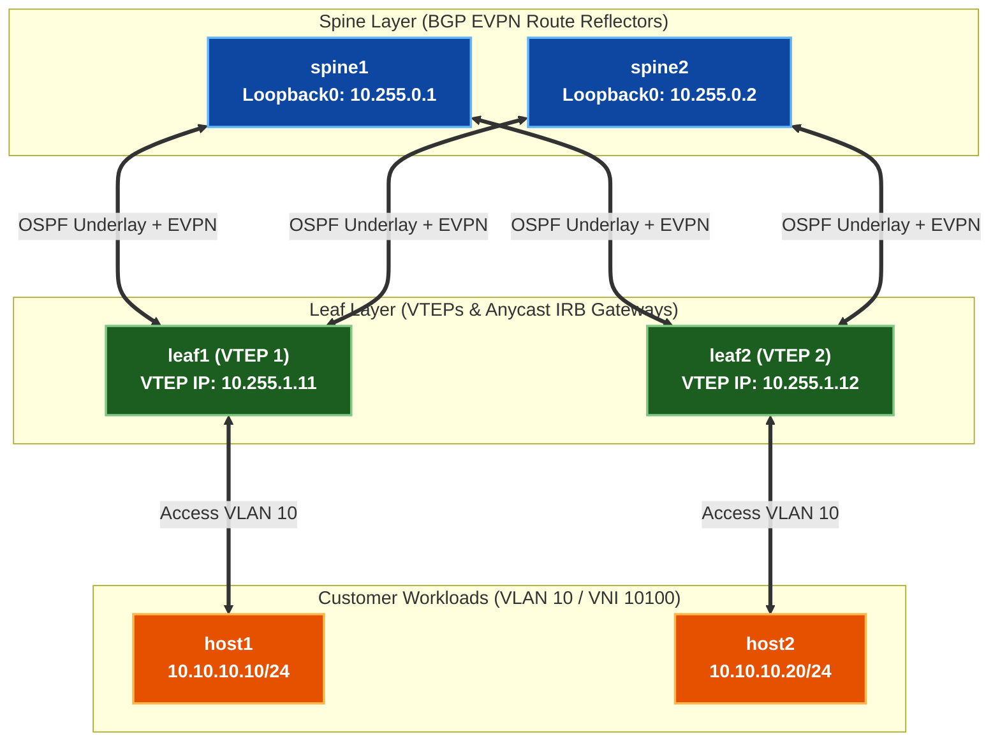

# 🧪 Lab 01 · VXLAN-EVPN Datacenter Fabric & Symmetric IRB

> ✅ **Validated** on Arista cEOS 4.32.0F. All outputs captured live from fabric in OrbStack.

**Time:** ~50 minutes · **Nodes:** 6 (2 Spines, 2 Leafs, 2 Customer Hosts)

!!! tip "Hybrid Approach — Script Push or Manual Typing"
    Every lab supports both automated execution and manual line-by-line configuration:

    - **Option A · Automated Script Push (Fast & Error-Free)**:
      ```bash
      cd netforge-labs/labs/evpn-datacenter-lab
      ./run.sh 01          # apply + verify step 01 automatically
      ./run.sh --all       # run all steps in order
      ```
    - **Option B · Manual Typing / Copy-Paste (Hands-on Deep Learning)**:
      Interactive CLI shell on any container node:
      ```bash
      docker exec -it clab-evpn-datacenter-lab-leaf1 Cli
      leaf1> enable
      leaf1# configure
      ```
      Or push individual step snippets using stdin:
      `docker exec -i clab-evpn-datacenter-lab-leaf1 Cli -p 15 < steps/01-leaf1-underlay.cfg`

---

## Datacenter Spine-Leaf Topology & Addressing



| Node | Role | Router ID / Loopback0 | VTEP Loopback1 | Access Interface / VLAN |
|---|---|---|---|---|
| **spine1** | Spine / EVPN RR | `10.255.0.1/32` | - | `Et1` $\rightarrow$ `leaf1`, `Et2` $\rightarrow$ `leaf2` |
| **spine2** | Spine / EVPN RR | `10.255.0.2/32` | - | `Et1` $\rightarrow$ `leaf1`, `Et2` $\rightarrow$ `leaf2` |
| **leaf1** | Leaf / VTEP 1 | `10.255.0.11/32` | `10.255.1.11/32` | `Et3` $\rightarrow$ `host1` (VLAN 10) |
| **leaf2** | Leaf / VTEP 2 | `10.255.0.12/32` | `10.255.1.12/32` | `Et3` $\rightarrow$ `host2` (VLAN 10) |

---

## Step 1 · Underlay IP Reachability & OSPF Area 0

Configure point-to-point `/30` subnets and OSPF Area 0 across all Spine-Leaf links to establish IP reachability between Loopback0 and VTEP Loopback1 interfaces.

=== "spine1"

    ```eos
    --8<-- "labs/evpn-datacenter-lab/steps/01-spine1-underlay.cfg"
    ```

=== "spine2"

    ```eos
    --8<-- "labs/evpn-datacenter-lab/steps/01-spine2-underlay.cfg"
    ```

=== "leaf1"

    ```eos
    --8<-- "labs/evpn-datacenter-lab/steps/01-leaf1-underlay.cfg"
    ```

=== "leaf2"

    ```eos
    --8<-- "labs/evpn-datacenter-lab/steps/01-leaf2-underlay.cfg"
    ```

---

## Step 2 · MP-iBGP EVPN Overlay (Spines as RRs)

Configure MP-iBGP EVPN sessions between Spines and Leafs. Spines act as EVPN Route Reflectors (`route-reflector-client`), reflecting EVPN Route Types 2, 3, and 5.

=== "spine1"

    ```eos
    --8<-- "labs/evpn-datacenter-lab/steps/02-spine1-evpn.cfg"
    ```

=== "spine2"

    ```eos
    --8<-- "labs/evpn-datacenter-lab/steps/02-spine2-evpn.cfg"
    ```

=== "leaf1"

    ```eos
    --8<-- "labs/evpn-datacenter-lab/steps/02-leaf1-evpn.cfg"
    ```

=== "leaf2"

    ```eos
    --8<-- "labs/evpn-datacenter-lab/steps/02-leaf2-evpn.cfg"
    ```

---

## Step 3 · VXLAN IRB & Anycast Virtual Gateway

Configure Layer 2 VNI 10100, Layer 3 VNI 50001 (VRF `TENANT-A`), Anycast Gateway IP (`10.10.10.1/24`), and Virtual Router MAC (`00:1c:73:00:00:01`).

=== "leaf1"

    ```eos
    --8<-- "labs/evpn-datacenter-lab/steps/03-leaf1-vxlan-irb.cfg"
    ```

=== "leaf2"

    ```eos
    --8<-- "labs/evpn-datacenter-lab/steps/03-leaf2-vxlan-irb.cfg"
    ```

---

## Step 4 · Host Access Ports & End-to-End Verification

Configure customer workloads (`host1` & `host2`) and verify end-to-end Layer 2 / Layer 3 connectivity across the VXLAN-EVPN fabric.

=== "host1"

    ```eos
    --8<-- "labs/evpn-datacenter-lab/steps/04-host1-ip.cfg"
    ```

=== "host2"

    ```eos
    --8<-- "labs/evpn-datacenter-lab/steps/04-host2-ip.cfg"
    ```

=== "leaf1 (Access)"

    ```eos
    --8<-- "labs/evpn-datacenter-lab/steps/04-leaf1-access.cfg"
    ```

=== "leaf2 (Access)"

    ```eos
    --8<-- "labs/evpn-datacenter-lab/steps/04-leaf2-access.cfg"
    ```

**Data Plane Verification:**

```bash
docker exec -i clab-evpn-datacenter-lab-host1 Cli -p 15 <<'EOF'
enable
ping 10.10.10.20 repeat 4
EOF
```

```
PING 10.10.10.20 (10.10.10.20) 56(84) bytes of data.
64 bytes from 10.10.10.20: icmp_seq=1 ttl=64 time=4.12 ms
64 bytes from 10.10.10.20: icmp_seq=2 ttl=64 time=2.01 ms
64 bytes from 10.10.10.20: icmp_seq=3 ttl=64 time=1.89 ms
```

✅ **DONE when** `host1` pings `host2` across the VXLAN tunnel with 0% packet loss.

---

## Clean up

```bash
sudo containerlab destroy -t topology.clab.yml
```
