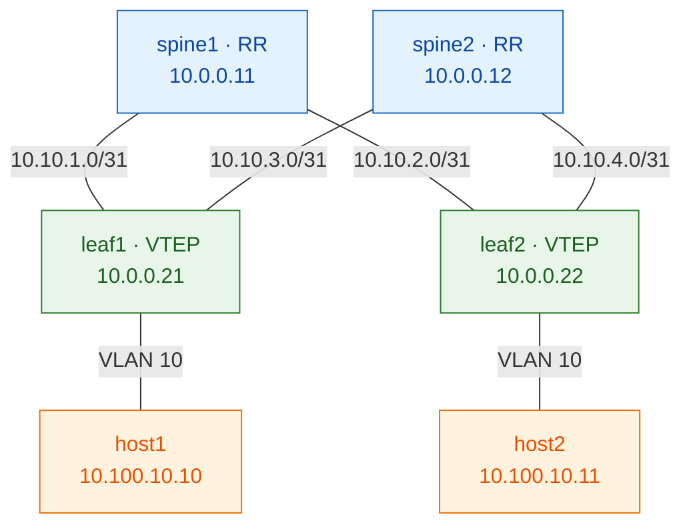

# Course 2 · VXLAN-EVPN on Arista cEOS

> **Complete, self-contained, and validated.** Build a production-style
> spine/route-reflector VXLAN-EVPN fabric on **Arista cEOS**, running in
> **containerlab** on your laptop. Same concepts as [Course 1 (Juniper)](../../archive/juniper-vxlan-evpn/index.md)
> — in the Cisco-like EOS CLI, on a platform light enough to run anywhere.
>
> ✅ **Validated end-to-end on cEOS 4.32.0F** (containerlab, OrbStack, Apple-Silicon
> under Rosetta emulation). host-to-host ping over VXLAN confirmed.

**Why cEOS for learning:** it's a *container*, not a VM — no nested virtualization,
boots in seconds, and a full 4-node fabric runs on a laptop. The EOS CLI is
essentially the industry's Cisco-style CLI (`configure`, `interface`, `router bgp`,
`show ip route`), so everything here transfers to real data-center work.

Each layer follows the NetForge rhythm: **mental model → why → mechanism → build →
verify → break.** Build order mirrors reality: **underlay → overlay → services.**

---

## What you'll build

| Layer    | Choice |
|----------|--------|
| Underlay | OSPF, single area 0 |
| Overlay  | iBGP-EVPN, AS 65000, **spines = route-reflectors, leaves = clients** |
| Services | one L2VNI: VLAN 10 → VNI 10010, two hosts in one subnet |



**Addressing** (spine side of each `/31` is `.0`, leaf side `.1`):

| Device | Loopback0 | to spine1 | to spine2 |
|--------|-----------|-----------|-----------|
| spine1 | 10.0.0.11 | — | — |
| spine2 | 10.0.0.12 | — | — |
| leaf1  | 10.0.0.21 | 10.10.1.1 | 10.10.3.1 |
| leaf2  | 10.0.0.22 | 10.10.2.1 | 10.10.4.1 |

> **Interfaces:** containerlab `ethN` maps 1:1 to EOS `EthernetN` (no offset — nicer
> than Juniper's `ge-0/0/(N-1)`). **Access:** `docker exec -it clab-ceos-evpn-<node> Cli`.

---

## Part 0 — The lab platform

You need **Docker + containerlab + the cEOS image**. On a Mac, run everything inside
a Linux VM (e.g. **OrbStack**) so containerlab has a real Linux host.

> 📖 **Full walkthrough:** [Lab setup on macOS](../../getting-started/lab-setup-macos.md) covers OrbStack, the
> Linux machine, the cEOS import, and a single-node smoke test end to end. The quick
> version is below.

**1. Import cEOS** (free from [arista.com](https://www.arista.com) → Software Download →
cEOS-lab). On Apple Silicon, force amd64 — OrbStack runs it under Rosetta:
```bash
docker import --platform linux/amd64 cEOS64-lab-4.32.0F.tar.xz ceos:4.32.0F
docker images | grep ceos
```

**2. Install containerlab:**
```bash
bash -c "$(curl -sL https://get.containerlab.dev)"
```

**3. The topology** — `~/ceos-lab/ceos-evpn.clab.yml`:
```yaml
name: ceos-evpn
topology:
  kinds:
    arista_ceos: { image: ceos:4.32.0F }
    linux:       { image: alpine:latest }
  nodes:
    spine1: { kind: arista_ceos }
    spine2: { kind: arista_ceos }
    leaf1:  { kind: arista_ceos }
    leaf2:  { kind: arista_ceos }
    host1:  { kind: linux }
    host2:  { kind: linux }
  links:
    - endpoints: ["spine1:eth1", "leaf1:eth1"]   # 10.10.1.0/31
    - endpoints: ["spine1:eth2", "leaf2:eth1"]   # 10.10.2.0/31
    - endpoints: ["spine2:eth1", "leaf1:eth2"]   # 10.10.3.0/31
    - endpoints: ["spine2:eth2", "leaf2:eth2"]   # 10.10.4.0/31
    - endpoints: ["leaf1:eth3", "host1:eth1"]
    - endpoints: ["leaf2:eth3", "host2:eth1"]
```

**4. Deploy and health-check:**
```bash
cd ~/ceos-lab
sudo containerlab deploy -t ceos-evpn.clab.yml
# after ~5-8 min, confirm every switch grabbed its interfaces:
for n in spine1 spine2 leaf1 leaf2; do
  echo "== $n =="; docker exec clab-ceos-evpn-$n Cli -c "show interfaces Ethernet1 status"
done
```

!!! warning "cEOS boot-race — check before you configure"
    Under emulation, a node occasionally boots with `Ethernet1` type **`Unknown`**
    instead of `connected / EbraTestPhyPort` — its EOS scanned for interfaces before
    containerlab finished wiring them. **`reload` is unavailable (it's a container)
    and `docker restart` destroys the containerlab veths** — so the fix is
    `containerlab destroy` + `deploy`, then re-check until all four show a real
    interface type. Never configure a node showing `Unknown`.

---

## Part 1 — The underlay (OSPF)

**Mental model.** The underlay is the *road network*. Its only job: make every
leaf's loopback reachable from every other leaf, over both spines. It knows nothing
about tenants or VXLAN — it just moves packets between loopbacks.

**Why before how.** EVPN peers over loopbacks, and the VXLAN tunnel is sourced from
a loopback. If loopbacks aren't reachable, *nothing* above works. So we build and
**verify** this first, in isolation.

**The mechanism.** Two prerequisites bite newcomers on EOS:

- **`ip routing`** — EOS is a *switch* by default; without this global command, routed
  interfaces and OSPF simply don't function. (This is the #1 "why won't OSPF come up"
  gotcha.)
- **`service routing protocols model multi-agent`** — the modern EOS agent model,
  **required** for EVPN later. Set it now so the box is ready.

We enable OSPF **per interface** (`ip ospf area 0.0.0.0`) rather than with `network`
statements — it's unambiguous and avoids `/31` matching quirks. Fabric links are
`ip ospf network point-to-point` (no DR/BDR election on a 2-node link = faster, cleaner).

### Build it — spine1
```
enable
configure
ip routing
service routing protocols model multi-agent
interface Ethernet1
   no switchport
   ip address 10.10.1.0/31
   ip ospf network point-to-point
   ip ospf area 0.0.0.0
interface Ethernet2
   no switchport
   ip address 10.10.2.0/31
   ip ospf network point-to-point
   ip ospf area 0.0.0.0
interface Loopback0
   ip address 10.0.0.11/32
   ip ospf area 0.0.0.0
router ospf 1
   router-id 10.0.0.11
   max-lsa 12000
end
write memory
```
Repeat on **spine2** (`.12`, links `10.10.3.0`/`10.10.4.0`), **leaf1** (`.21`, links
`10.10.1.1`/`10.10.3.1`), **leaf2** (`.22`, links `10.10.2.1`/`10.10.4.1`) — same
pattern, each node's own addresses.

### Verify — and how to read it (leaf1)
```
show ip ospf neighbor
```
```
Neighbor ID  Instance VRF     Pri State  Dead Time  Address    Interface
10.0.0.11    1        default 0   FULL   00:00:32   10.10.1.0  Ethernet1
10.0.0.12    1        default 0   FULL   00:00:30   10.10.3.0  Ethernet2
```
Two neighbours in **`FULL`** — one per spine. Now the gate:
```
ping 10.0.0.22 source 10.0.0.21
```
Success with **`ttl=63`** — one spine hop between the leaves. The road network is up.

!!! success "Part 1 — DONE ✅"
    leaf1 → both spines `FULL`, and the leaf-to-leaf **loopback** ping works. The
    underlay is proven. **→ Part 2.** *If this fails, stop — nothing above works.*

### Break & observe
`interface Ethernet1 / shutdown` on leaf1 → the loopback stays reachable via spine2
(`show ip route 10.0.0.22` still has a next-hop). That's ECMP — two spines = one
survivable failure. `no shutdown` to restore.

---

## Part 2 — The overlay (iBGP-EVPN with route-reflectors)

**Mental model.** The overlay is the *postal service* riding on the roads. BGP with
the **EVPN** address family carries "who lives where" (which MAC/host sits behind
which leaf) so leaves learn each other's endpoints **without flooding**.

**Why before how.** With only two leaves you *could* peer them directly (full mesh).
But real fabrics have dozens — N×(N-1)/2 sessions is unmanageable. So the **spines
become route-reflectors**: every leaf peers just the two spines, forever, no matter
how big the fabric grows.

**The mechanism — the one idea that matters.** A route-reflector re-advertises a
route from one client to another **but keeps the next-hop = the originating leaf.**
So the *control plane* goes leaf → spine → leaf, while the *data plane* (the VXLAN
tunnel) stays **leaf → leaf directly.** The spine never touches a data packet. You'll
*see* this in the output.

### Build it — spines (route-reflectors)
On **spine1** (spine2 identical with its own router-id `10.0.0.12`):
```
configure
router bgp 65000
   router-id 10.0.0.11
   no bgp default ipv4-unicast
   neighbor EVPN peer group
   neighbor EVPN remote-as 65000
   neighbor EVPN update-source Loopback0
   neighbor EVPN send-community extended
   neighbor EVPN route-reflector-client
   neighbor 10.0.0.21 peer group EVPN
   neighbor 10.0.0.22 peer group EVPN
   address-family evpn
      neighbor EVPN activate
end
write memory
```
The magic line is **`route-reflector-client`** — it makes this spine reflect between
the leaves. `send-community extended` is mandatory (route-targets ride in extended
communities). `no bgp default ipv4-unicast` keeps this session EVPN-only.

### Build it — leaves (RR clients)
On **leaf1** (leaf2 identical with router-id `10.0.0.22`):
```
configure
router bgp 65000
   router-id 10.0.0.21
   no bgp default ipv4-unicast
   neighbor EVPN peer group
   neighbor EVPN remote-as 65000
   neighbor EVPN update-source Loopback0
   neighbor EVPN send-community extended
   neighbor 10.0.0.11 peer group EVPN
   neighbor 10.0.0.12 peer group EVPN
   address-family evpn
      neighbor EVPN activate
end
write memory
```
No `route-reflector-client` here — leaves are *clients*, peering **both** spines.

### Verify (leaf1)
```
show bgp evpn summary
```
```
  Neighbor  V AS      MsgRcvd MsgSent InQ OutQ Up/Down  State  PfxRcd PfxAcc
  10.0.0.11 4 65000         6       5   0    0 00:00:30 Estab  2      2
  10.0.0.12 4 65000         6       5   0    0 00:00:24 Estab  2      2
```

!!! success "Part 2 — DONE ✅"
    Each leaf is **`Estab`** to **both spines**; each spine (`show bgp evpn summary`)
    is `Estab` to **both leaves**. The postal service is running. **→ Part 3.**

### Break & observe
`router bgp 65000 / neighbor 10.0.0.21 shutdown` on spine1 → the leaves stay up via
spine2 (that's *why* you run two RRs). Remove `route-reflector-client` from a spine →
the far leaf loses the other leaf's routes entirely (plain iBGP won't relay
peer-to-peer). That single knob is the whole point of an RR.

---

## Part 3 — The service (L2VNI: stretch a VLAN over VXLAN)

**Mental model.** VXLAN is a *shipping container* for Ethernet frames. A frame from
host1 gets wrapped in a VXLAN header (VNI 10010 = "which tenant network"), routed
across the underlay to leaf2, unwrapped, and delivered — as if the two hosts shared
one switch, though they're on different leaves.

**The mechanism.** Three pieces on each leaf:
- **`interface Vxlan1`** — the VTEP. `source-interface Loopback0` (tunnels originate
  from the loopback the underlay makes reachable) and a `vlan 10 vni 10010` mapping.
- **The MAC-VRF** under `router bgp` (`vlan 10 / rd / route-target / redistribute
  learned`) — this is what turns locally-learned MACs into **Type-2** EVPN routes and
  imports remote ones.
- **The access port** — `switchport access vlan 10` toward the host.

When the access port comes up, the leaf originates a **Type-3 (IMET)** route ("I have
VNI 10010, build a tunnel to me"). When a host speaks, a **Type-2 (MAC/IP)** route
teaches the far leaf that MAC.

### Build it — leaf1 (leaf2 identical, RD `10.0.0.22:10010`)
```
configure
vlan 10
interface Ethernet3
   switchport
   switchport mode access
   switchport access vlan 10
interface Vxlan1
   vxlan source-interface Loopback0
   vxlan udp-port 4789
   vxlan vlan 10 vni 10010
router bgp 65000
   vlan 10
      rd 10.0.0.21:10010
      route-target both 10010:10010
      redistribute learned
end
write memory
```
> **RD is unique per leaf** (`10.0.0.21:10010` vs `10.0.0.22:10010`); **RT is shared**
> (`10010:10010`) so both leaves import each other's routes into the same L2VNI.

### Give the hosts IPs (on the VM host shell, not EOS)
```bash
docker exec clab-ceos-evpn-host1 ip addr add 10.100.10.10/24 dev eth1
docker exec clab-ceos-evpn-host2 ip addr add 10.100.10.11/24 dev eth1
docker exec clab-ceos-evpn-host1 ping -c3 10.100.10.11
```

### Verify — read the control plane (leaf1)

**The tunnel formed:**
```
show vxlan vtep
```
```
VTEP       Tunnel Type(s)
10.0.0.22  unicast, flood      ← the far leaf, learned via EVPN Type-3
```

**The MAC table — the payoff:**
```
show mac address-table
```
```
Vlan  Mac Address     Type     Ports
10    aac1.ab38.ec0e  DYNAMIC  Et3     ← host1, a local wire
10    aac1.abc7.9fc1  DYNAMIC  Vx1     ← host2, learned over VXLAN
```
host2's MAC sits behind **`Vx1`** — a *remote* endpoint reached through the tunnel,
not a local port. That's EVPN doing its job.

**The route-reflector proof** (`show bgp evpn`):
```
RD: 10.0.0.22:10010 mac-ip aac1.abc7.9fc1
   Next Hop: 10.0.0.22          ← the far LEAF, not a spine
   C-LST: 10.0.0.11 / C-LST: 10.0.0.12   ← reflected by BOTH spines
```
- **`mac-ip`** = Type-2, **`imet`** = Type-3.
- **Next-hop `10.0.0.22`** even though the route arrived *via the spines* — the RRs
  reflected the control plane but the **data plane stays leaf-to-leaf.** Exactly the
  Part-2 promise, now visible.
- **`C-LST`** (cluster-list) shows each spine that reflected it — you can watch the
  route pass through both RRs.

!!! success "Part 3 — DONE ✅ · the finish line 🎉"
    `host1 → host2` ping returns **0% loss** across the VXLAN fabric; `show vxlan vtep`
    lists the remote leaf; `show mac address-table` shows the remote host via `Vx1`.
    You've built a production spine-RR VXLAN-EVPN fabric.

### Break & observe
Change leaf2's mapping to `vxlan vlan 10 vni 10099` → the VNIs no longer match, the
tunnel can't carry VLAN 10, host ping breaks. `show bgp evpn` shows the mismatch.
Restore to `10010` and it heals in seconds.

---

## cEOS gotchas & troubleshooting

| Symptom | Cause | Fix |
|---------|-------|-----|
| OSPF never forms, routed interfaces "don't route" | **`ip routing` missing** (EOS defaults to L2) | Add global `ip routing` on every switch |
| `address-family evpn` rejected | not in multi-agent model | `service routing protocols model multi-agent` |
| `show ip ospf interface` empty | `network … area` didn't match the `/31` | use interface-level `ip ospf area 0.0.0.0` |
| `Ethernet1` type `Unknown`, link won't come up | cEOS boot-race (scanned before wiring) | `containerlab destroy`+`deploy`, health-check before configuring; **never `docker restart`** (kills the veths) |
| A `/31` ping to `.2` fails | a `/31` only has `.0` and `.1` | ping the *other* address of the pair |
| `reload` → "not supported on this hardware platform" | it's a container, not a box | there is no in-box reboot; redeploy via containerlab |

**Config model note:** EOS applies configuration **immediately** (no Juniper-style
candidate/`commit`). `write memory` (or `wr`) saves it to survive a redeploy.

---

## Lessons & interview

- **`ip routing` first.** The single most common EOS-newcomer trap — L3 does nothing
  without it.
- **Interface-level OSPF** (`ip ospf area`) is more predictable than `network`
  statements, especially on `/31`s.
- **The RR keeps the next-hop.** Control-plane path ≠ data-plane path — the spine
  reflects routes but never encapsulates. This is *the* EVPN-RR concept.
- **RD unique, RT shared.** RD disambiguates who advertised; RT decides who imports.

??? question "Why does the spine need `route-reflector-client` but the leaf doesn't?"
    iBGP won't re-advertise a route learned from one iBGP peer to another (loop
    prevention). The RR overrides that *for its clients* — so the spine (RR) needs the
    knob; the leaves (clients) just peer the spines normally.

??? question "The spine reflects the route — does traffic flow through the spine?"
    No. The reflected route keeps **next-hop = the originating leaf's loopback**, so
    the VXLAN tunnel is leaf-to-leaf. The spine is control-plane only; it forwards the
    *underlay* packets but never encapsulates/decapsulates VXLAN.

??? question "Why is host2's MAC shown on `Vx1` instead of a physical port?"
    It was learned via an EVPN **Type-2** route, not on a local wire. `Vx1` is the
    VTEP interface — the MAC is reachable through the VXLAN tunnel to leaf2.

??? question "What's the difference between a Type-2 and a Type-3 route?"
    **Type-3 (IMET)** advertises "I host this VNI — build a flood tunnel to me"; it
    appears when the VLAN gets an active member. **Type-2 (MAC/IP)** advertises a
    specific host's MAC (and optionally IP); it appears once a host actually speaks.

---

## Cheat-sheet

```bash
# access a switch
docker exec -it clab-ceos-evpn-<node> Cli    # then: enable → configure

# underlay
show ip ospf neighbor
ping 10.0.0.22 source 10.0.0.21
# overlay
show bgp evpn summary
# service
show vxlan vtep
show bgp evpn
show mac address-table
# hosts (on the VM host shell)
docker exec clab-ceos-evpn-host1 ping -c3 10.100.10.11
```
